# Church Connect CRM — System Design Document

**A multi-tenant SaaS platform for church membership, visitor follow-up, and member engagement across Africa.**

| | |
|---|---|
| **Document** | System Design & Architecture (v1.0) |
| **Date** | 7 June 2026 |
| **Status** | Design — pre-build |
| **Stack** | Next.js 14 · Prisma 5 · PostgreSQL · WhatsApp Cloud API · SMS · Resend · Anthropic · Paystack · Railway |

---

## Executive Summary

Church Connect CRM is a mobile-first, cloud-based platform that automates the full lifecycle of church engagement: capturing first-time visitors, running an automated multi-channel follow-up journey (WhatsApp + SMS + email), converting visitors to members, organising members into cell groups, tracking attendance, scoring engagement, and surfacing it all in role-aware dashboards and reports.

It is built as a **single Next.js 14 application** backed by **PostgreSQL via Prisma**, deliberately mirroring a proven production stack so messaging, cron, billing, and auth patterns are reused rather than rebuilt. The system is **multi-tenant from the schema up** — every record is scoped to a `Church` (tenant) and `Branch` — so it serves one local congregation and scales to thousands of churches on shared infrastructure.

**Four roles** govern access: `SUPER_ADMIN` (platform), `PASTOR` (church-wide), `CHURCH_ADMIN` (registration & comms), and `CELL_LEADER` (assigned members only).

**Monetization** is a SaaS subscription + messaging-credit hybrid billed through Paystack, with tiered plans (Free → Pro) sized to the African church market and justified against per-message unit economics.

---

## Deliverables / Table of Contents

1. System Architecture
2. Database Schema *(Prisma)*
3. ER Diagram
4. API Endpoints
5. User Flow Diagrams
6. UI/UX Wireframes
7. Development Roadmap
8. MVP Features
9. Scalability Plan
10. Full Source Code Structure
11. Deployment Guide
12. Cost Estimate
13. Monetization Strategy (SaaS Model)

> Sections 2 & 3 are presented together (schema + ERD), as are 5 & 6 (flows + wireframes) and 7 & 8 (roadmap + MVP).

---
# 1. System Architecture

Church Connect CRM is a single, vertically-integrated **Next.js 14 (App Router)** application backed by **PostgreSQL via Prisma 5**, deployed on **Railway**. Every domain capability — member management, attendance, follow-ups, multi-channel messaging, automation, AI suggestions, and SaaS billing — lives behind one deployable surface. This section defines the component topology, the request lifecycle, how authentication and multi-tenancy are enforced at every layer, and the internal subsystems (messaging, automation/cron, AI, caching, media, observability, audit).

---

## 1.1 High-Level Component Diagram

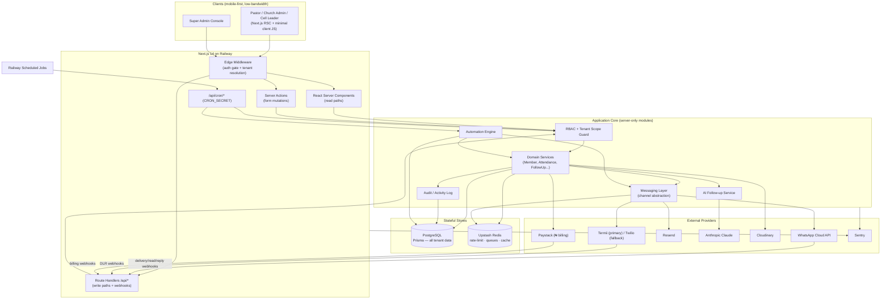

---

## 1.2 Why a Single Next.js App (Not a Separate Backend)

The stack is **locked** to one Next.js 14 app rather than a split SPA + standalone API service. The rationale:

| Concern | Single Next.js app | Separate frontend + backend |
| --- | --- | --- |
| **Operational cost** | One Railway service, one deploy, one log stream — critical for a lean Nigerian-first SaaS. | 2+ services, cross-service auth, CORS, duplicated deploy pipeline. |
| **Type safety** | Shared TypeScript types from Prisma flow end-to-end; Server Actions remove the hand-written client/server contract. | Requires a generated API client / tRPC bridge to stay in sync. |
| **Tenant enforcement** | One middleware + one Prisma layer means a *single* place to guarantee `churchId` scoping. | Tenant rules must be re-implemented and re-audited in two codebases. |
| **Latency / data cost** | RSC streams server-rendered HTML; less client JS over expensive mobile data. | SPA ships large JS bundles + extra round-trips. |
| **Portability** | Mirrors the existing SPEEDFI codebase patterns, so engineers move freely between products. | Divergent architecture, higher onboarding cost. |

App Router maps cleanly onto our read/write split:

- **React Server Components (RSC)** handle read paths — dashboards, member lists, follow-up queues — querying Prisma directly on the server with tenant scope already applied. No client-side data fetching for the common case.
- **Server Actions** handle form mutations (register a `FirstTimer`, log `Attendance`, file a `FollowUp`).
- **Route Handlers (`/api/*`)** handle anything that must be a real HTTP endpoint: provider **webhooks** (WhatsApp, Termii/Twilio, Paystack), **cron** entrypoints, file-signing, and any third-party integration callback.

---

## 1.3 Request Lifecycle

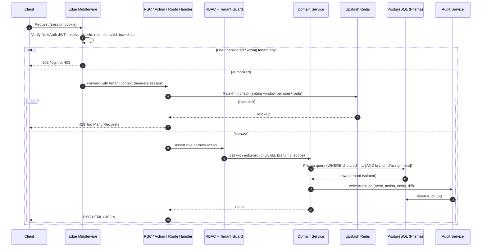

Key invariant: **no domain service is ever called without a resolved tenant context.** Services accept a typed `Ctx { userId, role, churchId, branchId, assignedMemberIds? }` and every Prisma call derives its `where` clause from `Ctx`. There is no code path that queries a domain table without `churchId`.

---

## 1.4 Authentication & RBAC (NextAuth Credentials)

Authentication uses **NextAuth with the Credentials provider + Prisma adapter**, issuing a JWT session. The JWT carries the minimal identity needed to scope every downstream call.

### 1.4.1 Session token claims

```jsonc
{
  "sub": "user_…",
  "role": "PASTOR",          // UserRole enum
  "churchId": "church_…",    // tenant root — always present except SUPER_ADMIN
  "branchId": "branch_…",    // default/home branch; null = church-wide
  "name": "…",
  "email": "…"
}
```

### 1.4.2 Role matrix

| Capability | SUPER_ADMIN | PASTOR | CHURCH_ADMIN | CELL_LEADER |
| --- | --- | --- | --- | --- |
| Cross-church access | ✅ | — | — | — |
| Church-wide read | — | ✅ | ✅ (own church) | — |
| Register Member / FirstTimer | — | ✅ | ✅ | — |
| Attendance entry | — | ✅ | ✅ | ✅ (own cell) |
| Broadcast comms | — | ✅ | ✅ | — |
| Assign members to cell leaders | — | ✅ | ✅ | — |
| FollowUp / PrayerRequest / visit & call reports | — | ✅ | ✅ | ✅ (assigned only) |
| Manage Plan / Subscription / SaaS config | ✅ | — | — | — |

`CELL_LEADER` is the tightest scope: limited not just to a `churchId`/`branchId` but to the **set of `Member`s assigned to them** via `Assignment`. The guard resolves `assignedMemberIds` for cell leaders and intersects every query with it.

### 1.4.3 Auth + tenant flow

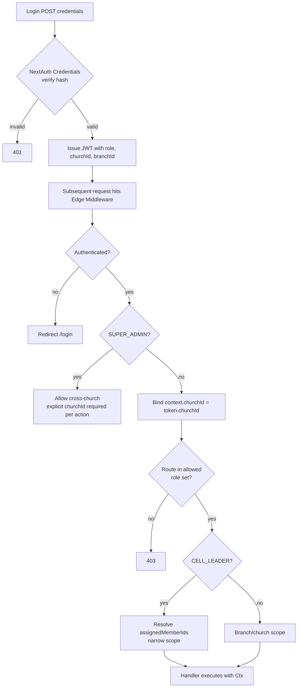

Middleware runs on the **Edge** for the auth gate and tenant resolution; fine-grained, data-dependent checks (e.g. "is this member actually assigned to this leader?") run in the Node runtime inside the guard, because they require a DB lookup.

---

## 1.5 Multi-Tenancy & Multi-Branch Enforcement (Defense in Depth)

Tenancy is enforced at **four independent layers** so that a bug in any one layer does not leak data across churches.

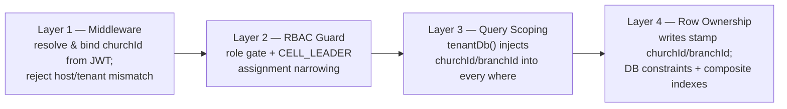

**Layer 1 — Middleware.** `churchId` comes only from the verified JWT, never from a client-supplied body/param. A request that targets a resource in another church is rejected before reaching a handler.

**Layer 2 — RBAC guard.** Confirms the role may perform the action, and for `CELL_LEADER` narrows scope to `assignedMemberIds`.

**Layer 3 — Query scoping (the workhorse).** All reads go through a **tenant-bound Prisma client** so the `churchId` filter cannot be forgotten:

```ts
// src/lib/db/tenant.ts
export function tenantDb(ctx: Ctx) {
  return prisma.$extends({
    query: {
      $allModels: {
        async $allOperations({ model, operation, args, query }) {
          if (TENANT_SCOPED_MODELS.has(model)) {
            if (operation.startsWith("find") || operation === "count" ||
                operation.startsWith("update") || operation.startsWith("delete")) {
              args.where = { ...args.where, churchId: ctx.churchId };
              if (ctx.branchScoped) args.where.branchId = ctx.branchId;
            }
            if (operation === "create") {
              args.data = { ...args.data, churchId: ctx.churchId };
            }
          }
          return query(args);
        },
      },
    },
  });
}
```

This guarantees every `Member`, `FirstTimer`, `Attendance`, `FollowUp`, `PrayerRequest`, `CommunicationLog`, etc. query is filtered by `churchId` automatically. Branch scoping is applied where the entity is branch-owned and the actor is not church-wide.

**Layer 4 — Row ownership & DB constraints.** Every domain table physically stores `churchId` (and `branchId` where applicable). Composite indexes (`@@index([churchId, branchId, status])`, `@@unique([churchId, …natural key])`) make tenant-scoped queries fast and prevent cross-tenant uniqueness collisions. Foreign keys are validated to belong to the same `churchId` on write (e.g. a `FollowUp.memberId` must reference a `Member` in the same church).

**Church → Branch hierarchy.** `Church` is the tenant root; a `Church` has many `Branch`es. A `PASTOR`/`CHURCH_ADMIN` may operate church-wide (all branches) or be pinned to a branch; a `CELL_LEADER` is always branch- and assignment-scoped. Reports and dashboards aggregate per branch and roll up to church level.

---

## 1.6 Messaging Layer (WhatsApp + SMS + Email)

A single **channel-abstraction** module fronts all outbound communication. Callers (broadcasts, automation steps, manual follow-ups) request a send by `Channel`; the layer selects the provider, renders the `MessageTemplate`, enforces rate limits, persists a `CommunicationLog`, and reconciles delivery via webhooks.

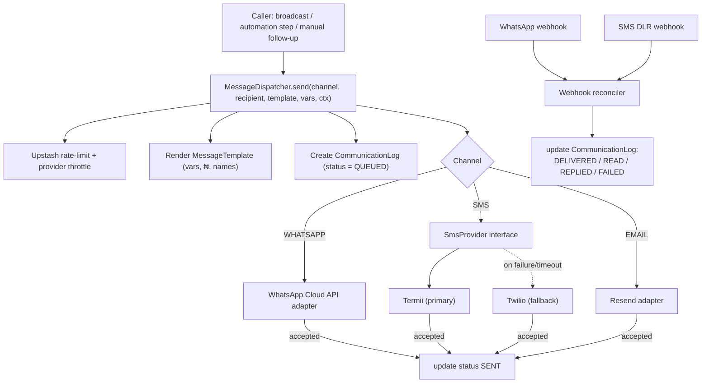

- **`MessageStatus` lifecycle:** `QUEUED → SENT → DELIVERED → READ → REPLIED`, with `FAILED` reachable from any pre-delivery state. Every transition updates the `CommunicationLog` row (one row per send, tenant-stamped).
- **Provider abstraction:** SMS is fronted by an `SmsProvider` interface with **Termii as primary and Twilio as fallback** — on send failure or timeout the dispatcher retries via the alternate provider and records which provider was used.
- **WhatsApp Cloud API:** template (HSM) messages for proactive sends within policy; free-form replies only inside the 24-hour customer-service window opened by an inbound message. Inbound replies flip `CommunicationLog` to `REPLIED` and can trigger automation.
- **Resend:** transactional + bulk email; bounces/complaints feed back into the reconciler.
- **Webhooks** (`/api/webhooks/whatsapp`, `/api/webhooks/sms`) are signature-verified Route Handlers; they are the only ingress that reconciles delivery state.
- **Data-cost awareness:** message bodies are kept lean; WhatsApp is preferred for rich content, SMS reserved for short critical notices, matching low-bandwidth Nigerian context.

---

## 1.7 Automation / Cron Engine

The automation engine drives the **first-timer journey** and recurring jobs (birthdays, anniversaries). It is a **data-driven workflow runner**: workflows and steps are rows, not code.

### 1.7.1 Data model

- **`AutomationWorkflow`** — a named, tenant-scoped journey (e.g. "First-Timer 30-Day Journey"), with a trigger (`FIRST_TIMER_REGISTERED`, `BIRTHDAY`, `ANNIVERSARY`, manual).
- **`AutomationStep`** — ordered steps belonging to a workflow: `{ order, offsetDays, channel, templateId, createsFollowUp?, followUpType? }`.
- **`AutomationEnrollment`** — one row per person enrolled, tracking `currentStep`, `nextRunAt`, `status`, and the person reference (nullable `memberId` or `firstTimerId`, exactly one set).

### 1.7.2 Default first-timer cadence

| Offset | Step | Channel(s) | Template |
| --- | --- | --- | --- |
| Day 0 | Welcome | WhatsApp + SMS | Welcome |
| Day 2 | Follow-up | WhatsApp | Day-2 check |
| Day 7 | Check-in | WhatsApp | Week-1 check-in |
| Day 14 | Next-service invite | WhatsApp + SMS | Invite |
| Day 30 | Membership invite | WhatsApp | Membership |

### 1.7.3 Daily cron execution

```mermaid
sequenceDiagram
    autonumber
    participant RC as Railway Scheduled Job
    participant EP as /api/cron/automation-advance
    participant E as Automation Engine
    participant DB as PostgreSQL
    participant M as Messaging Layer

    RC->>EP: POST (Authorization: CRON_SECRET)
    EP->>EP: verify CRON_SECRET (else 401)
    EP->>E: run due enrollments
    E->>DB: SELECT enrollments WHERE nextRunAt <= now AND status = ACTIVE
    loop each due enrollment (tenant-scoped, batched)
        E->>DB: load current AutomationStep
        E->>E: evaluate step condition
        alt condition passes
            E->>M: send(step.channel, person, step.template)
            M-->>E: CommunicationLog id
        end
        E->>DB: advance currentStep; set next nextRunAt
        alt no more steps
            E->>DB: enrollment.status = COMPLETED
        end
        E->>DB: write AuditLog (automation advance)
    end
    EP-->>RC: 200 {processed, sent, completed}
```

- **Triggers:** registering a `FirstTimer` creates an `AutomationEnrollment`; the **first-timer → member conversion** rule (marked present at a 2nd `Service` of type `SUNDAY`/`MIDWEEK`) promotes `MemberStatus` and may complete or switch the enrollment.
- **Idempotency:** each step send is keyed by `(enrollmentId, currentStep)` so a re-run never double-sends. `nextRunAt` advances only after a successful dispatch (or a recorded skip).
- **Separate cron entrypoints:** `/api/cron/automation-advance` (enrollment advance), `/api/cron/birthdays`, `/api/cron/anniversaries`, `/api/cron/engagement-recalc` (recompute `EngagementScore`). All guarded by `CRON_SECRET`. The full cron route catalog is enumerated in §4.19 and the file map in §10.2.
- **Resilience:** processing is batched and chunked; a failed send marks `CommunicationLog` `FAILED` and leaves the enrollment retryable rather than blocking the batch.

### 1.7.4 Low-Code Automation Builder

Non-developers (a `PASTOR` or `CHURCH_ADMIN`) compose workflows visually; the builder writes `AutomationWorkflow` + ordered `AutomationStep` rows. No deploy is required to change a journey.

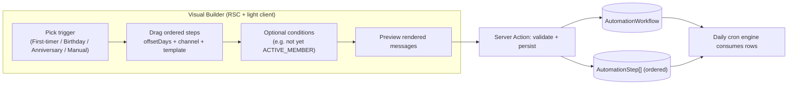

- The builder only exposes **safe, validated primitives**: choose from existing `MessageTemplate`s, pick `Channel`, set `offsetDays`, add whitelisted conditions on `MemberStatus`/attendance. It never lets a user inject code.
- Templates support variable interpolation (member first name, branch, next service date, ₦ amounts) with strict allow-listing.
- Edits version the workflow; **in-flight `AutomationEnrollment`s continue on the version they started**, so changing a journey never corrupts people mid-cadence.

---

## 1.8 AI Follow-up Suggestion Service (Claude)

The AI service produces **draft follow-up suggestions** for cell leaders and admins — never auto-sent. It is read-augmented and tenant-isolated.

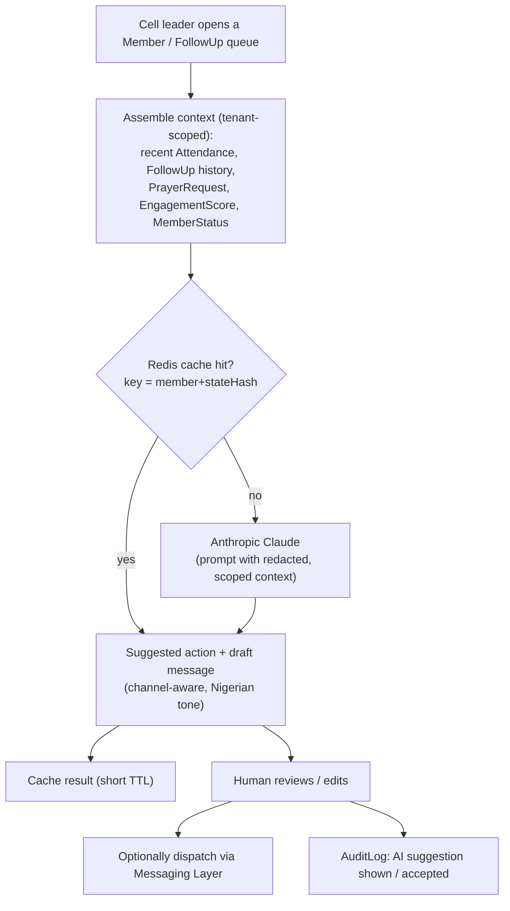

- **Inputs are strictly tenant-scoped** and PII-minimised before leaving the system — only the data needed to suggest a next step (no cross-church data ever enters a prompt).
- **Outputs:** a recommended `FollowUpType` (CALL / WHATSAPP / HOME_VISIT / PRAYER), priority, and a draft message body the human can edit.
- **Human-in-the-loop:** suggestions are advisory; sending always routes through the messaging layer with normal rate-limits and logging.
- **Cost/latency control:** identical member-state requests are cached in Upstash (short TTL); engagement recompute is batched in cron rather than per-request.

---

## 1.9 Caching & Rate-Limiting (Upstash Redis)

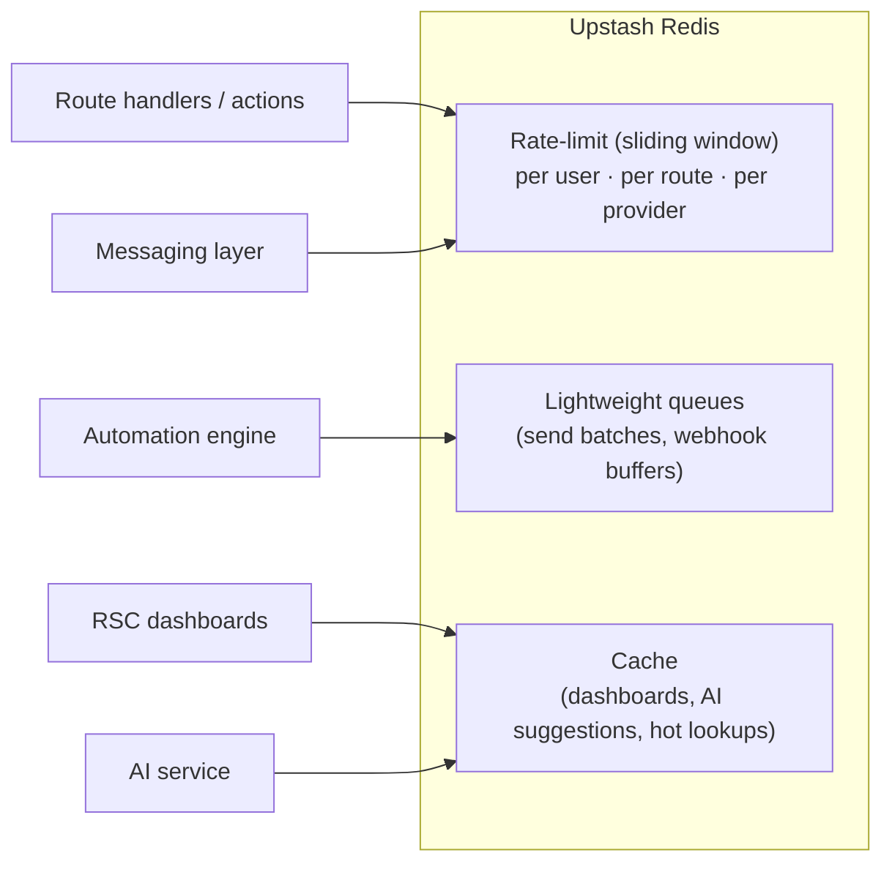

- **Rate-limiting:** sliding-window limiters protect auth, write endpoints, broadcast sends, and webhook ingress; provider-specific throttles respect WhatsApp/Termii/Twilio quotas. Over-limit returns `429`.
- **Queues:** outbound message batches and webhook bursts are buffered so a spike (e.g. a Sunday broadcast to thousands) is drained at provider-safe rates.
- **Caching:** expensive aggregates (branch dashboards, `EngagementScore` rollups) and AI suggestions are cached with short, tenant-namespaced keys (`{churchId}:…`) so cache entries are never shared across tenants.

---

## 1.10 File & Media (Cloudinary)

Member/first-timer photos and any uploaded media go to **Cloudinary**, never the app server's disk.

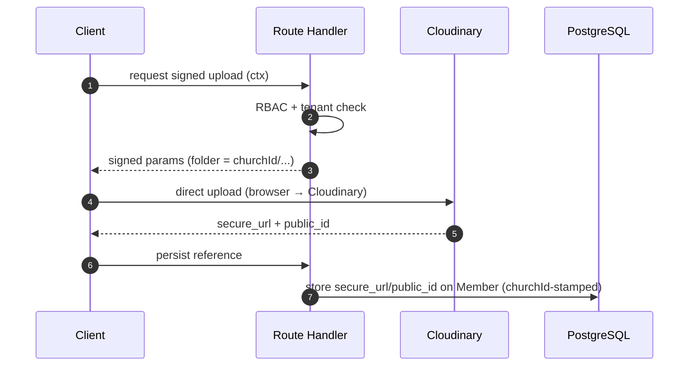

- Uploads are **signed server-side**; assets are foldered per `churchId` for isolation and easy lifecycle management.
- Direct browser→Cloudinary upload keeps large payloads off the Next.js server and serves transformed, bandwidth-optimised images (small thumbnails for mobile) back to clients.

---

## 1.11 Observability (Sentry)

- **Error + performance monitoring** is wired into both the Edge/middleware and Node runtimes and around all external calls (providers, Claude, Paystack).
- Every captured event is tagged with `churchId`, `branchId`, `role`, and `route` so issues can be triaged per tenant without exposing PII.
- Webhook handlers, cron jobs, and the messaging layer report failures with provider + correlation IDs, enabling end-to-end tracing of a single message from dispatch to delivery webhook.

---

## 1.12 Activity Log / Audit Trail

Every state-changing action writes an **`AuditLog`** row. This is the system of record for "who did what, to whom, when" — essential for multi-user churches and SaaS accountability.

### 1.12.1 `AuditLog` shape

| Field | Meaning |
| --- | --- |
| `id` | PK |
| `churchId` | tenant root (nullable only for platform-level `SUPER_ADMIN` actions) |
| `userId` | who performed the action (null for system/cron) |
| `action` | `AuditAction` enum: `CREATE`, `UPDATE`, `DELETE`, `LOGIN`, `LOGOUT`, `EXPORT`, `ASSIGN`, `BROADCAST`, `PROMOTE` |
| `entity` | e.g. `Member`, `FirstTimer`, `FollowUp`, `CommunicationLog` |
| `entityId` | affected row |
| `description` | human-readable summary (e.g. "Promoted FIRST_TIMER → NEW_MEMBER") |
| `metadata` | JSON diff / before-after snapshot, including user-agent (PII-minimised) |
| `ipAddress` | request origin |
| `createdAt` | timestamp |

> The `branchId` and `actorRole` fields are intentionally **not** stored on `AuditLog`; branch and acting-role context are captured in `metadata` when relevant. The canonical column set is defined by the `AuditLog` model in the Prisma schema (§2).

### 1.12.2 How it is captured

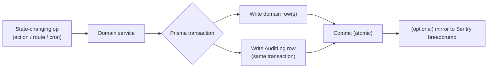

- Audit writes happen **inside the same Prisma transaction** as the mutation, so a successful change always has a corresponding audit record and a rollback discards both.
- System actors (cron/automation) are recorded with `userId = null` and a `"system"` marker in `metadata` so automated changes (e.g. a `PROMOTE` action via conversion, an automation advance recorded as `UPDATE`) are still attributable.
- Audit logs are **read-only** to all roles below `SUPER_ADMIN`; a `PASTOR`/`CHURCH_ADMIN` can view their own church's trail, scoped by `churchId` like every other table.

---

## 1.13 Architecture Summary

| Layer | Technology | Tenant enforcement |
| --- | --- | --- |
| Edge gate | Next.js Middleware + NextAuth JWT | resolve & bind `churchId`/`branchId` |
| Authorization | RBAC guard | role matrix + `CELL_LEADER` assignment narrowing |
| Read paths | React Server Components | `tenantDb()` scoped Prisma |
| Write paths | Server Actions + `/api/*` | scoped Prisma + audit-in-transaction |
| Messaging | WhatsApp Cloud API · Termii/Twilio · Resend | `CommunicationLog` stamped `churchId` |
| Automation | Workflow engine + Railway cron (`CRON_SECRET`) | enrollments + steps tenant-scoped |
| AI | Anthropic Claude | PII-minimised, per-tenant context only |
| Cache / limits / queues | Upstash Redis | tenant-namespaced keys |
| Media | Cloudinary | per-`churchId` folders, signed uploads |
| Observability | Sentry | events tagged with tenant context |
| Audit | `AuditLog` | written atomically with every mutation |

The result is a single, portable Next.js application where **multi-tenancy and multi-branch isolation are enforced redundantly at the middleware, authorization, query, and row layers**, while messaging, automation, and AI are cleanly factored subsystems that all share the same tenant-scoped core.
# 2. Database Schema (Prisma) + 3. ER Diagram

## 2.1 Overview

The data model is a **single PostgreSQL database, single Prisma schema**, multi-tenant by row. The tenant root is **`Church`**: every domain table carries `churchId`, and most operational tables additionally carry `branchId` to scope data to a specific congregation/campus. All application queries MUST filter by `churchId` (and where relevant `branchId`) — there is no shared-schema escape hatch except for the `SUPER_ADMIN` platform role and the billing tables.

Conventions used throughout:

- **IDs**: `cuid()` string primary keys (URL-safe, collision-resistant, portable — mirrors SPEEDFI).
- **Timestamps**: every table has `createdAt @default(now())` and `updatedAt @updatedAt`.
- **Soft delete**: high-value people/records (`Member`, `FirstTimer`, `User`, `CellGroup`) use a nullable `deletedAt`; hard deletes are reserved for logs and join records.
- **Phone numbers**: stored E.164 (`+234...`).
- **Money**: stored in **kobo** (`Int`) to avoid float drift; ₦ amounts are `amount / 100`.
- **Tenant compound indexes**: every frequently-queried table is indexed on `[churchId, ...]` (and `[churchId, branchId, ...]`) so the tenant filter is always index-backed.

---

## 2.2 `schema.prisma`

```prisma
// ─────────────────────────────────────────────────────────────
// Church Connect CRM — Prisma schema
// PostgreSQL · Prisma 5 · multi-tenant (tenant root = Church)
// ─────────────────────────────────────────────────────────────

generator client {
  provider        = "prisma-client-js"
  previewFeatures = ["fullTextSearch"]
}

datasource db {
  provider = "postgresql"
  url      = env("DATABASE_URL")
}

// ═══════════════════════════════════════════════════════════════
// ENUMS
// ═══════════════════════════════════════════════════════════════

enum UserRole {
  SUPER_ADMIN
  PASTOR
  CHURCH_ADMIN
  CELL_LEADER
}

enum MemberStatus {
  FIRST_TIMER
  NEW_CONVERT
  NEW_MEMBER
  ACTIVE_MEMBER
  INACTIVE_MEMBER
}

enum Gender {
  MALE
  FEMALE
}

enum MaritalStatus {
  SINGLE
  MARRIED
  DIVORCED
  WIDOWED
}

enum FollowUpType {
  CALL
  WHATSAPP
  HOME_VISIT
  PRAYER
}

enum FollowUpStatus {
  PENDING
  IN_PROGRESS
  COMPLETED
  CANCELLED
}

enum FollowUpOutcome {
  CONTACTED
  NOT_CONTACTED
  INTERESTED
  NEEDS_PRAYER
  NEEDS_VISIT
}

enum PrayerStatus {
  OPEN
  PRAYING
  ANSWERED
  CLOSED
}

enum Channel {
  WHATSAPP
  SMS
  EMAIL
}

enum MessageStatus {
  QUEUED
  SENT
  DELIVERED
  READ
  REPLIED
  FAILED
}

enum MessageDirection {
  OUTBOUND
  INBOUND
}

enum ServiceType {
  SUNDAY
  MIDWEEK
  SPECIAL
  CELL_MEETING
}

enum AttendanceMethod {
  MANUAL
  QR
  SELF_CHECKIN
  BULK
}

enum EnrollmentStatus {
  ACTIVE
  COMPLETED
  CANCELLED
  PAUSED
}

enum WorkflowTrigger {
  FIRST_TIMER_REGISTERED
  NEW_CONVERT
  MEMBER_INACTIVE
  BIRTHDAY
  ANNIVERSARY
  MANUAL
}

enum SubscriptionStatus {
  TRIALING
  ACTIVE
  PAST_DUE
  CANCELLED
  EXPIRED
}

enum BillingInterval {
  MONTHLY
  YEARLY
}

enum AuditAction {
  CREATE
  UPDATE
  DELETE
  LOGIN
  LOGOUT
  EXPORT
  ASSIGN
  BROADCAST
  PROMOTE
}

// ═══════════════════════════════════════════════════════════════
// TENANT ROOT + ORG STRUCTURE
// ═══════════════════════════════════════════════════════════════

model Church {
  id          String   @id @default(cuid())
  name        String
  slug        String   @unique // tenant subdomain / URL key
  email       String?
  phone       String?  // E.164
  address     String?
  city        String?
  state       String?
  country     String   @default("Nigeria")
  timezone    String   @default("Africa/Lagos")
  logoUrl     String?
  currency    String   @default("NGN")
  // tenant-level messaging credentials (encrypted at app layer)
  waPhoneId   String?  // WhatsApp Cloud API phone number id
  senderId    String?  // SMS sender id (Termii)
  settings    Json     @default("{}")
  isActive    Boolean  @default(true)

  createdAt   DateTime @default(now())
  updatedAt   DateTime @updatedAt
  deletedAt   DateTime?

  branches            Branch[]
  users               User[]
  members             Member[]
  firstTimers         FirstTimer[]
  cellGroups          CellGroup[]
  services            Service[]
  attendances         Attendance[]
  followUps           FollowUp[]
  prayerRequests      PrayerRequest[]
  assignments         Assignment[]
  communicationLogs   CommunicationLog[]
  messageTemplates    MessageTemplate[]
  workflows           AutomationWorkflow[]
  enrollments         AutomationEnrollment[]
  engagementScores    EngagementScore[]
  subscription        Subscription?
  auditLogs           AuditLog[]

  @@index([slug])
  @@index([isActive])
}

model Branch {
  id        String   @id @default(cuid())
  churchId  String
  name      String
  address   String?
  city      String?
  state     String?
  phone     String?
  isMain    Boolean  @default(false)
  isActive  Boolean  @default(true)

  createdAt DateTime @default(now())
  updatedAt DateTime @updatedAt
  deletedAt DateTime?

  church            Church   @relation(fields: [churchId], references: [id], onDelete: Cascade)
  users             User[]
  members           Member[]
  firstTimers       FirstTimer[]
  cellGroups        CellGroup[]
  services          Service[]
  attendances       Attendance[]
  followUps         FollowUp[]
  prayerRequests    PrayerRequest[]
  communicationLogs CommunicationLog[]

  @@unique([churchId, name])
  @@index([churchId])
  @@index([churchId, isActive])
}

// ═══════════════════════════════════════════════════════════════
// AUTH / STAFF (NextAuth credentials + Prisma adapter)
// ═══════════════════════════════════════════════════════════════

model User {
  id             String    @id @default(cuid())
  churchId       String?   // null only for SUPER_ADMIN (platform owner)
  branchId       String?   // optional scoping for CHURCH_ADMIN / CELL_LEADER
  name           String
  email          String
  phone          String?
  passwordHash   String
  role           UserRole  @default(CHURCH_ADMIN)
  avatarUrl      String?
  emailVerified  DateTime?
  isActive       Boolean   @default(true)
  lastLoginAt    DateTime?

  createdAt      DateTime  @default(now())
  updatedAt      DateTime  @updatedAt
  deletedAt      DateTime?

  church           Church?   @relation(fields: [churchId], references: [id], onDelete: Cascade)
  branch           Branch?   @relation(fields: [branchId], references: [id], onDelete: SetNull)

  // NextAuth
  accounts         Account[]
  sessions         Session[]

  // relations as actor
  ledCellGroups    CellGroup[]            @relation("CellLeader")
  assignmentsMade  Assignment[]           @relation("AssignedBy")
  assignmentsOwned Assignment[]           @relation("AssignedTo")
  followUps        FollowUp[]             @relation("FollowUpAssignee")
  prayerRequests   PrayerRequest[]        @relation("PrayerAssignee")
  communications   CommunicationLog[]     @relation("CommSender")
  auditLogs        AuditLog[]

  @@unique([email])
  @@index([churchId])
  @@index([churchId, role])
  @@index([churchId, branchId])
}

// NextAuth adapter tables
model Account {
  id                String  @id @default(cuid())
  userId            String
  type              String
  provider          String
  providerAccountId String
  refresh_token     String? @db.Text
  access_token      String? @db.Text
  expires_at        Int?
  token_type        String?
  scope             String?
  id_token          String? @db.Text
  session_state     String?

  user User @relation(fields: [userId], references: [id], onDelete: Cascade)

  @@unique([provider, providerAccountId])
  @@index([userId])
}

model Session {
  id           String   @id @default(cuid())
  sessionToken String   @unique
  userId       String
  expires      DateTime

  user User @relation(fields: [userId], references: [id], onDelete: Cascade)

  @@index([userId])
}

model VerificationToken {
  identifier String
  token      String   @unique
  expires    DateTime

  @@unique([identifier, token])
}

// ═══════════════════════════════════════════════════════════════
// PEOPLE
// ═══════════════════════════════════════════════════════════════

model Member {
  id             String        @id @default(cuid())
  churchId       String
  branchId       String?
  cellGroupId    String?
  firstName      String
  lastName       String
  phone          String        // E.164
  email          String?
  gender         Gender?
  dateOfBirth    DateTime?
  maritalStatus  MaritalStatus?
  weddingDate    DateTime?     // for anniversary automation
  address        String?
  city           String?
  occupation     String?
  photoUrl       String?
  status         MemberStatus  @default(NEW_MEMBER)
  joinedAt       DateTime      @default(now())
  membershipDate DateTime?     // formal membership confirmation
  notes          String?       @db.Text
  // provenance: if this Member was converted from a FirstTimer
  convertedFromFirstTimerId String? @unique
  isActive       Boolean       @default(true)

  createdAt      DateTime      @default(now())
  updatedAt      DateTime      @updatedAt
  deletedAt      DateTime?

  church            Church             @relation(fields: [churchId], references: [id], onDelete: Cascade)
  branch            Branch?            @relation(fields: [branchId], references: [id], onDelete: SetNull)
  cellGroup         CellGroup?         @relation(fields: [cellGroupId], references: [id], onDelete: SetNull)
  convertedFrom     FirstTimer?        @relation("FirstTimerToMember", fields: [convertedFromFirstTimerId], references: [id])

  attendances       Attendance[]
  followUps         FollowUp[]
  prayerRequests    PrayerRequest[]
  assignments       Assignment[]
  communicationLogs CommunicationLog[]
  enrollments       AutomationEnrollment[]
  engagementScore   EngagementScore?

  @@unique([churchId, phone])
  @@index([churchId])
  @@index([churchId, branchId])
  @@index([churchId, status])
  @@index([churchId, cellGroupId])
  @@index([churchId, dateOfBirth])
}

model FirstTimer {
  id              String       @id @default(cuid())
  churchId        String
  branchId        String?
  firstName       String
  lastName        String
  phone           String       // E.164
  email           String?
  gender          Gender?
  dateOfBirth     DateTime?
  address         String?
  howHeard        String?      // referral / channel
  invitedByName   String?
  prayerRequest   String?      @db.Text
  wantsVisit      Boolean      @default(false)
  firstServiceId  String?      // the service they were first registered at
  visitCount      Int          @default(1)
  status          MemberStatus @default(FIRST_TIMER)
  isConverted     Boolean      @default(false)
  convertedAt     DateTime?

  createdAt       DateTime     @default(now())
  updatedAt       DateTime     @updatedAt
  deletedAt       DateTime?

  church            Church             @relation(fields: [churchId], references: [id], onDelete: Cascade)
  branch            Branch?            @relation(fields: [branchId], references: [id], onDelete: SetNull)
  firstService      Service?           @relation("FirstTimerFirstService", fields: [firstServiceId], references: [id], onDelete: SetNull)

  attendances       Attendance[]
  followUps         FollowUp[]
  prayerRequests    PrayerRequest[]
  assignments       Assignment[]
  communicationLogs CommunicationLog[]
  enrollments       AutomationEnrollment[]
  convertedMember   Member?            @relation("FirstTimerToMember")

  @@unique([churchId, phone])
  @@index([churchId])
  @@index([churchId, branchId])
  @@index([churchId, status])
  @@index([churchId, isConverted])
}

model CellGroup {
  id            String   @id @default(cuid())
  churchId      String
  branchId      String?
  leaderId      String?  // User with CELL_LEADER role
  name          String
  description   String?
  meetingDay    String?  // e.g. "Tuesday"
  meetingTime   String?
  location      String?
  isActive      Boolean  @default(true)

  createdAt     DateTime @default(now())
  updatedAt     DateTime @updatedAt
  deletedAt     DateTime?

  church        Church   @relation(fields: [churchId], references: [id], onDelete: Cascade)
  branch        Branch?  @relation(fields: [branchId], references: [id], onDelete: SetNull)
  leader        User?    @relation("CellLeader", fields: [leaderId], references: [id], onDelete: SetNull)
  members       Member[]

  @@unique([churchId, name])
  @@index([churchId])
  @@index([churchId, branchId])
  @@index([churchId, leaderId])
}

// ═══════════════════════════════════════════════════════════════
// ASSIGNMENTS (cell leader ↔ person ownership for follow-up)
// ═══════════════════════════════════════════════════════════════

model Assignment {
  id            String     @id @default(cuid())
  churchId      String
  assignedToId  String     // User (CELL_LEADER usually)
  assignedById  String     // User who made the assignment
  memberId      String?
  firstTimerId  String?
  reason        String?
  isActive      Boolean    @default(true)

  createdAt     DateTime   @default(now())
  updatedAt     DateTime   @updatedAt

  church        Church      @relation(fields: [churchId], references: [id], onDelete: Cascade)
  assignedTo    User        @relation("AssignedTo", fields: [assignedToId], references: [id], onDelete: Cascade)
  assignedBy    User        @relation("AssignedBy", fields: [assignedById], references: [id], onDelete: Cascade)
  member        Member?     @relation(fields: [memberId], references: [id], onDelete: Cascade)
  firstTimer    FirstTimer? @relation(fields: [firstTimerId], references: [id], onDelete: Cascade)

  @@index([churchId])
  @@index([churchId, assignedToId])
  @@index([memberId])
  @@index([firstTimerId])
}

// ═══════════════════════════════════════════════════════════════
// SERVICES + ATTENDANCE
// ═══════════════════════════════════════════════════════════════

model Service {
  id             String      @id @default(cuid())
  churchId       String
  branchId       String?
  name           String      // "Sunday First Service"
  type           ServiceType @default(SUNDAY)
  date           DateTime
  startTime      String?
  theme          String?
  preacher       String?
  totalAttendees Int         @default(0) // denormalized cache
  totalFirstTimers Int       @default(0)
  totalOffering  Int         @default(0) // kobo, optional
  notes          String?     @db.Text

  createdAt      DateTime    @default(now())
  updatedAt      DateTime    @updatedAt

  church           Church       @relation(fields: [churchId], references: [id], onDelete: Cascade)
  branch           Branch?      @relation(fields: [branchId], references: [id], onDelete: SetNull)
  attendances      Attendance[]
  firstTimersHere  FirstTimer[] @relation("FirstTimerFirstService")

  @@index([churchId])
  @@index([churchId, branchId])
  @@index([churchId, date])
  @@index([churchId, type])
}

model Attendance {
  id            String           @id @default(cuid())
  churchId      String
  branchId      String?
  serviceId     String
  memberId      String?
  firstTimerId  String?
  present       Boolean          @default(true)
  method        AttendanceMethod @default(MANUAL)
  checkedInAt   DateTime         @default(now())

  createdAt     DateTime         @default(now())

  church        Church      @relation(fields: [churchId], references: [id], onDelete: Cascade)
  branch        Branch?     @relation(fields: [branchId], references: [id], onDelete: SetNull)
  service       Service     @relation(fields: [serviceId], references: [id], onDelete: Cascade)
  member        Member?     @relation(fields: [memberId], references: [id], onDelete: Cascade)
  firstTimer    FirstTimer? @relation(fields: [firstTimerId], references: [id], onDelete: Cascade)

  // a person can only be marked once per service
  @@unique([serviceId, memberId])
  @@unique([serviceId, firstTimerId])
  @@index([churchId])
  @@index([churchId, serviceId])
  @@index([memberId])
  @@index([firstTimerId])
}

// ═══════════════════════════════════════════════════════════════
// FOLLOW-UP + PRAYER
// ═══════════════════════════════════════════════════════════════

model FollowUp {
  id            String           @id @default(cuid())
  churchId      String
  branchId      String?
  assignedToId  String           // User performing the follow-up
  memberId      String?
  firstTimerId  String?
  type          FollowUpType
  status        FollowUpStatus   @default(PENDING)
  outcome       FollowUpOutcome?
  dueDate       DateTime?
  completedAt   DateTime?
  notes         String?          @db.Text
  // optional link to the automation step that generated this task
  enrollmentId  String?

  createdAt     DateTime         @default(now())
  updatedAt     DateTime         @updatedAt

  church        Church      @relation(fields: [churchId], references: [id], onDelete: Cascade)
  branch        Branch?     @relation(fields: [branchId], references: [id], onDelete: SetNull)
  assignedTo    User        @relation("FollowUpAssignee", fields: [assignedToId], references: [id], onDelete: Cascade)
  member        Member?     @relation(fields: [memberId], references: [id], onDelete: Cascade)
  firstTimer    FirstTimer? @relation(fields: [firstTimerId], references: [id], onDelete: Cascade)
  enrollment    AutomationEnrollment? @relation(fields: [enrollmentId], references: [id], onDelete: SetNull)

  @@index([churchId])
  @@index([churchId, assignedToId, status])
  @@index([churchId, dueDate])
  @@index([memberId])
  @@index([firstTimerId])
}

model PrayerRequest {
  id            String       @id @default(cuid())
  churchId      String
  branchId      String?
  assignedToId  String?      // User shepherding the request
  memberId      String?
  firstTimerId  String?
  requesterName String?      // free-text if not a tracked person
  request       String       @db.Text
  status        PrayerStatus @default(OPEN)
  isConfidential Boolean     @default(false)
  answeredAt    DateTime?
  answerNote    String?      @db.Text

  createdAt     DateTime     @default(now())
  updatedAt     DateTime     @updatedAt

  church        Church      @relation(fields: [churchId], references: [id], onDelete: Cascade)
  branch        Branch?     @relation(fields: [branchId], references: [id], onDelete: SetNull)
  assignedTo    User?       @relation("PrayerAssignee", fields: [assignedToId], references: [id], onDelete: SetNull)
  member        Member?     @relation(fields: [memberId], references: [id], onDelete: Cascade)
  firstTimer    FirstTimer? @relation(fields: [firstTimerId], references: [id], onDelete: Cascade)

  @@index([churchId])
  @@index([churchId, status])
  @@index([memberId])
  @@index([firstTimerId])
}

// ═══════════════════════════════════════════════════════════════
// COMMUNICATIONS + TEMPLATES
// ═══════════════════════════════════════════════════════════════

model MessageTemplate {
  id          String      @id @default(cuid())
  churchId    String
  name        String
  channel     Channel
  subject     String?     // email only
  body        String      @db.Text // supports {{firstName}} etc.
  category    String?     // welcome / followup / birthday / invite
  isActive    Boolean     @default(true)
  // WhatsApp approved template name, if channel == WHATSAPP
  waTemplateName String?

  createdAt   DateTime    @default(now())
  updatedAt   DateTime    @updatedAt

  church      Church               @relation(fields: [churchId], references: [id], onDelete: Cascade)
  steps       AutomationStep[]
  communications CommunicationLog[]

  @@unique([churchId, name])
  @@index([churchId])
  @@index([churchId, channel])
}

model CommunicationLog {
  id            String           @id @default(cuid())
  churchId      String
  branchId      String?
  senderId      String?          // User who triggered (null = system/automation)
  memberId      String?
  firstTimerId  String?
  templateId    String?
  enrollmentId  String?          // if produced by an automation step
  channel       Channel
  direction     MessageDirection @default(OUTBOUND)
  toAddress     String           // phone (E.164) or email
  subject       String?
  body          String           @db.Text
  status        MessageStatus    @default(QUEUED)
  providerMessageId String?      // Termii / Twilio / WhatsApp / Resend id
  errorMessage  String?
  costKobo      Int?             // metered SMS/WhatsApp cost
  sentAt        DateTime?
  deliveredAt   DateTime?
  readAt        DateTime?
  repliedAt     DateTime?

  createdAt     DateTime         @default(now())
  updatedAt     DateTime         @updatedAt

  church        Church           @relation(fields: [churchId], references: [id], onDelete: Cascade)
  branch        Branch?          @relation(fields: [branchId], references: [id], onDelete: SetNull)
  sender        User?            @relation("CommSender", fields: [senderId], references: [id], onDelete: SetNull)
  member        Member?          @relation(fields: [memberId], references: [id], onDelete: SetNull)
  firstTimer    FirstTimer?      @relation(fields: [firstTimerId], references: [id], onDelete: SetNull)
  template      MessageTemplate? @relation(fields: [templateId], references: [id], onDelete: SetNull)
  enrollment    AutomationEnrollment? @relation(fields: [enrollmentId], references: [id], onDelete: SetNull)

  @@index([churchId])
  @@index([churchId, channel, status])
  @@index([churchId, createdAt])
  @@index([providerMessageId])
  @@index([memberId])
  @@index([firstTimerId])
}

// ═══════════════════════════════════════════════════════════════
// AUTOMATION ENGINE (first-timer journey, birthdays, anniversaries)
// ═══════════════════════════════════════════════════════════════

model AutomationWorkflow {
  id          String          @id @default(cuid())
  churchId    String
  name        String
  description String?
  trigger     WorkflowTrigger @default(FIRST_TIMER_REGISTERED)
  isActive    Boolean         @default(true)

  createdAt   DateTime        @default(now())
  updatedAt   DateTime        @updatedAt

  church      Church                 @relation(fields: [churchId], references: [id], onDelete: Cascade)
  steps       AutomationStep[]
  enrollments AutomationEnrollment[]

  @@unique([churchId, name])
  @@index([churchId])
  @@index([churchId, trigger, isActive])
}

model AutomationStep {
  id            String   @id @default(cuid())
  workflowId    String
  order         Int      // execution order within workflow
  offsetDays    Int      // days after enrollment/trigger (Day0, Day2, Day7, Day14, Day30)
  channel       Channel
  templateId    String?
  // if the step creates a human task instead of a message
  createsFollowUp Boolean @default(false)
  followUpType  FollowUpType?

  createdAt     DateTime @default(now())
  updatedAt     DateTime @updatedAt

  workflow      AutomationWorkflow @relation(fields: [workflowId], references: [id], onDelete: Cascade)
  template      MessageTemplate?   @relation(fields: [templateId], references: [id], onDelete: SetNull)

  @@unique([workflowId, order])
  @@index([workflowId])
}

model AutomationEnrollment {
  id            String           @id @default(cuid())
  churchId      String
  workflowId    String
  memberId      String?
  firstTimerId  String?
  currentStep   Int              @default(0) // index of next step to run
  status        EnrollmentStatus @default(ACTIVE)
  enrolledAt    DateTime         @default(now())
  nextRunAt     DateTime?        // cron picks up enrollments where nextRunAt <= now
  completedAt   DateTime?

  createdAt     DateTime         @default(now())
  updatedAt     DateTime         @updatedAt

  church        Church             @relation(fields: [churchId], references: [id], onDelete: Cascade)
  workflow      AutomationWorkflow @relation(fields: [workflowId], references: [id], onDelete: Cascade)
  member        Member?            @relation(fields: [memberId], references: [id], onDelete: Cascade)
  firstTimer    FirstTimer?        @relation(fields: [firstTimerId], references: [id], onDelete: Cascade)

  communications CommunicationLog[]
  followUps      FollowUp[]

  @@index([churchId])
  @@index([status, nextRunAt]) // cron hot path
  @@index([churchId, workflowId])
  @@index([memberId])
  @@index([firstTimerId])
}

// ═══════════════════════════════════════════════════════════════
// ENGAGEMENT
// ═══════════════════════════════════════════════════════════════

model EngagementScore {
  id              String   @id @default(cuid())
  churchId        String
  memberId        String   @unique
  score           Int      @default(0) // 0-100 composite
  attendanceRate  Float    @default(0) // last-N-services ratio
  lastAttendedAt  DateTime?
  followUpCount   Int      @default(0)
  trend           String?  // "up" | "down" | "flat"
  computedAt      DateTime @default(now())

  createdAt       DateTime @default(now())
  updatedAt       DateTime @updatedAt

  church          Church   @relation(fields: [churchId], references: [id], onDelete: Cascade)
  member          Member   @relation(fields: [memberId], references: [id], onDelete: Cascade)

  @@index([churchId])
  @@index([churchId, score])
}

// ═══════════════════════════════════════════════════════════════
// SAAS BILLING
// ═══════════════════════════════════════════════════════════════

model Plan {
  id               String          @id @default(cuid())
  name             String          @unique // Starter / Growth / Enterprise
  slug             String          @unique
  description      String?
  priceKobo        Int             // ₦ in kobo
  interval         BillingInterval @default(MONTHLY)
  paystackPlanCode String?         // Paystack plan code
  maxBranches      Int             @default(1)
  maxMembers       Int             @default(500)
  maxStaff         Int             @default(5)
  monthlyMessageQuota Int          @default(1000)
  features         Json            @default("[]")
  isActive         Boolean         @default(true)

  createdAt        DateTime        @default(now())
  updatedAt        DateTime        @updatedAt

  subscriptions    Subscription[]

  @@index([isActive])
}

model Subscription {
  id                   String             @id @default(cuid())
  churchId             String             @unique // one active subscription per church
  planId               String
  status               SubscriptionStatus @default(TRIALING)
  paystackCustomerCode String?
  paystackSubCode      String?
  trialEndsAt          DateTime?
  currentPeriodStart   DateTime           @default(now())
  currentPeriodEnd     DateTime?
  cancelAtPeriodEnd    Boolean            @default(false)
  cancelledAt          DateTime?
  // usage counters reset each period
  messagesUsed         Int                @default(0)
  // purchased message credit packs — persist across period rollover (see §13.2)
  topUpBalance         Int                @default(0)

  createdAt            DateTime           @default(now())
  updatedAt            DateTime           @updatedAt

  church               Church             @relation(fields: [churchId], references: [id], onDelete: Cascade)
  plan                 Plan               @relation(fields: [planId], references: [id])
  invoices             Invoice[]

  @@index([planId])
  @@index([status])
}

model Invoice {
  id               String   @id @default(cuid())
  subscriptionId   String
  amountKobo       Int
  status           String   // paid / pending / failed
  paystackRef      String?  @unique
  periodStart      DateTime?
  periodEnd        DateTime?
  paidAt           DateTime?

  createdAt        DateTime @default(now())
  updatedAt        DateTime @updatedAt

  subscription     Subscription @relation(fields: [subscriptionId], references: [id], onDelete: Cascade)

  @@index([subscriptionId])
}

// ═══════════════════════════════════════════════════════════════
// AUDIT
// ═══════════════════════════════════════════════════════════════

model AuditLog {
  id          String      @id @default(cuid())
  churchId    String?     // null for platform-level SUPER_ADMIN actions
  userId      String?
  action      AuditAction
  entity      String      // "Member", "FollowUp", ...
  entityId    String?
  description String?
  metadata    Json?       // before/after diff, IP, user-agent
  ipAddress   String?

  createdAt   DateTime    @default(now())

  church      Church?     @relation(fields: [churchId], references: [id], onDelete: Cascade)
  user        User?       @relation(fields: [userId], references: [id], onDelete: SetNull)

  @@index([churchId])
  @@index([churchId, entity, entityId])
  @@index([churchId, createdAt])
  @@index([userId])
}
```

---

## 2.3 Key Index Strategy

| Concern | Index | Why |
|---|---|---|
| Tenant isolation | `[churchId]` on every domain table | Every query is tenant-scoped; ensures the mandatory filter is index-backed. |
| Branch scoping | `[churchId, branchId]` | Multi-campus churches filter member/attendance/comms by branch. |
| Member lookups | `[churchId, status]`, `[churchId, cellGroupId]` | Dashboards segment by status; cell leaders pull their group. |
| Duplicate prevention | `@@unique([churchId, phone])` on `Member` & `FirstTimer` | Phone is the natural key in the Nigerian context; blocks double-registration per tenant. |
| Attendance idempotency | `@@unique([serviceId, memberId])` / `[serviceId, firstTimerId]` | One check-in per person per service. |
| Cron hot path | `[status, nextRunAt]` on `AutomationEnrollment` | The daily cron scans `status = ACTIVE AND nextRunAt <= now()` — this is the single most performance-critical query. |
| Birthday/anniversary jobs | `[churchId, dateOfBirth]` on `Member` | Daily jobs match month/day for birthday automation; `weddingDate` is filtered in-query. |
| Follow-up worklist | `[churchId, assignedToId, status]`, `[churchId, dueDate]` | Cell-leader "my pending follow-ups" and overdue scans. |
| Message delivery webhooks | `[providerMessageId]` on `CommunicationLog` | Status callbacks (DELIVERED/READ/REPLIED) look up by provider id. |
| Billing | `Subscription.churchId @unique`, `[status]` | One subscription per church; dunning cron scans `PAST_DUE`. |
| Audit | `[churchId, entity, entityId]`, `[churchId, createdAt]` | Per-record history and chronological audit trail. |

## 2.4 Cascade Behavior

- **`Church` is the root**: deleting a `Church` cascades to every tenant-owned table (`onDelete: Cascade`). This is the clean tenant-offboarding path; in practice tenants are **soft-deleted** via `deletedAt` / `isActive = false` and physical deletion is an admin-only operation.
- **`Branch` deletion** sets `branchId = null` (`SetNull`) on people/services rather than deleting them — closing a campus must never destroy member history. Branch-scoped join records inherit deletion through `Church` only.
- **People → dependent records**: deleting a `Member` or `FirstTimer` cascades their `Attendance`, `FollowUp`, `Assignment`, and `AutomationEnrollment` rows (these have no meaning without the person), but `CommunicationLog` and `PrayerRequest` use `SetNull` for the person FK so the **delivery/prayer ledger is preserved** for compliance and analytics.
- **`User` deletion**: actor references (`assignedBy`, `sender`, prayer/follow-up assignees) use `SetNull` so historical records survive staff turnover; the user's own `Assignment` *ownership* rows cascade since an unassigned follow-up queue is meaningless.
- **Automation**: deleting a `Workflow` cascades its `AutomationStep`s and `AutomationEnrollment`s; deleting an `Enrollment` sets `enrollmentId = null` on generated `CommunicationLog`/`FollowUp` (keep the artifacts, drop the link).
- **Billing**: deleting a `Subscription` cascades its `Invoice`s; `Plan` deletion is blocked while subscriptions reference it (default restrict — no `onDelete` override on `Subscription.plan`).
- **FirstTimer → Member conversion** is non-destructive: the `FirstTimer` row is retained (`isConverted = true`, `convertedAt` set) and linked to the new `Member` via `Member.convertedFromFirstTimerId` (1:1), preserving the full pre-membership history.

---

## 3. ER Diagram

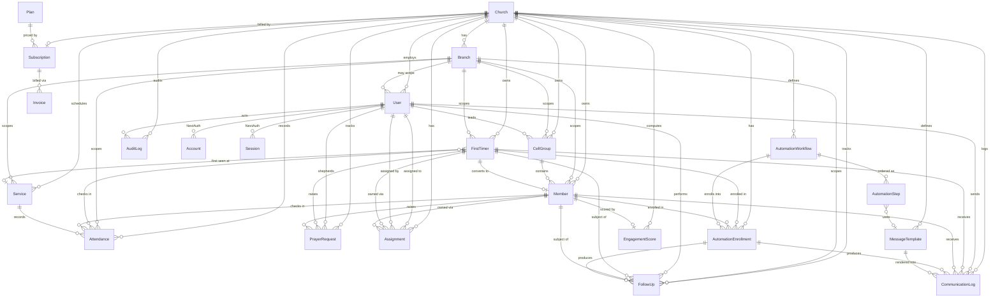

### Relationship notes

- **Polymorphic person reference**: `Attendance`, `FollowUp`, `PrayerRequest`, `Assignment`, `CommunicationLog`, and `AutomationEnrollment` each carry **both** a nullable `memberId` and a nullable `firstTimerId` (application invariant: exactly one is set). This keeps the first-timer journey trackable before conversion without a separate person-supertype table, and conversion simply re-points new records to `memberId`.
- **First-timer first-service link** (`FirstTimer.firstServiceId → Service`) records where a guest was first seen, enabling the "second-service present → auto-promote" rule defined in the automation cadence.
- **Engagement** is 1:1 with `Member` (`EngagementScore.memberId @unique`), recomputed by a daily job from attendance and follow-up history.
- **Billing** is 1:1 `Church ↔ Subscription`, many `Subscription ↔ Invoice`, and `Plan` is a global (non-tenant) catalog shared across all churches.
- `Account`, `Session`, and `VerificationToken` are the standard NextAuth Prisma-adapter tables and are intentionally tenant-agnostic (tenancy is resolved through `User.churchId`).
# 4. API Endpoints

This section defines the complete REST API surface of Church Connect CRM, implemented as **Next.js 14 App Router route handlers** under `/app/api/**/route.ts`. Endpoints are grouped by module. Every endpoint returns JSON and follows a uniform envelope, error model, and tenant/auth guard described first, then enumerated module by module.

---

## 4.1 Conventions

### 4.1.1 Standard auth & tenant guard (applies to all `/api/*` except `auth`, `cron`, `webhooks`)

Every domain endpoint is wrapped by a single shared guard, `withTenant(handler, { roles })`, which runs before the handler body:

1. **Authenticate** — resolve the NextAuth session (credentials + Prisma adapter). No session → `401 UNAUTHENTICATED`.
2. **Resolve tenant** — read `churchId` (and active `branchId`, if scoped) from the session. The `churchId` is **never** trusted from the request body or query for write scoping; it is always taken from the session. A `SUPER_ADMIN` may pass an explicit `?churchId=` to operate cross-church.
3. **Authorize role** — if the caller's `UserRole` is not in the endpoint's allowed set → `403 FORBIDDEN`.
4. **Row-level scope** — every Prisma query injects `where: { churchId }` (and `branchId` where applicable). `CELL_LEADER` is further narrowed to rows reachable through their `Assignment`s (only their assigned `Member`/`FirstTimer`).
5. **Audit** — mutating requests append an `AuditLog` row (`userId`, `churchId`, `action`, `entity`, `entityId`, `metadata`).
6. **Rate limit** — Upstash Redis sliding-window limiter keyed by `userId`+route (stricter limits on comms/broadcast routes).

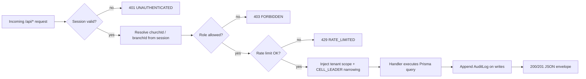

### 4.1.2 Response envelope

```jsonc
// Success
{ "ok": true, "data": { /* resource or list */ }, "meta": { "page": 1, "pageSize": 20, "total": 134 } }
// Error
{ "ok": false, "error": { "code": "VALIDATION", "message": "phone must be E.164", "fields": { "phone": "invalid" } } }
```

### 4.1.3 Cross-cutting rules

- **Validation**: every body/query parsed with Zod; failure → `422 VALIDATION`.
- **Pagination**: list endpoints accept `?page`, `?pageSize` (max 100), `?q` (search), `?sort`. Cursor pagination on high-volume `Attendance`/`CommunicationLog`.
- **Phones**: stored and returned in **E.164** (`+234...`). Money in **kobo** integers, rendered as Naira (₦).
- **Idempotency**: comms-send and billing-webhook routes honour an `Idempotency-Key` header.
- **Status codes**: `200` read/update, `201` create, `204` delete, `401/403/404/409/422/429/500`.

---

## 4.2 Auth — `/api/auth`

NextAuth core lives at `/api/auth/[...nextauth]`; the routes below are app-level helpers around it. These bypass the tenant guard (no session yet) but are rate-limited.

| Method | Path | Roles | Purpose | Shape |
|---|---|---|---|---|
| `GET/POST` | `/api/auth/[...nextauth]` | public | NextAuth handler (credentials sign-in, session, csrf, signout) | NextAuth standard |
| `POST` | `/api/auth/register-church` | public | Self-serve church + first `PASTOR` user signup (creates `Church`, default `Branch`, trial `Subscription`) | req `{ churchName, country, pastorName, email, phone, password }` → `{ churchId, userId }` |
| `POST` | `/api/auth/invite` | SUPER_ADMIN, PASTOR, CHURCH_ADMIN | Invite a staff user (emails a token) | req `{ email, role, branchId? }` → `{ inviteId }` |
| `POST` | `/api/auth/accept-invite` | public (token) | Accept invite, set password, create `User` | req `{ token, name, password }` → `{ userId }` |
| `POST` | `/api/auth/forgot-password` | public | Send reset email (Resend) | req `{ email }` → `204` |
| `POST` | `/api/auth/reset-password` | public (token) | Set new password | req `{ token, password }` → `204` |
| `GET` | `/api/auth/me` | any authed | Current user + church + role + active branch | → `{ user, church, branch, role }` |

---

## 4.3 Churches — `/api/churches`

Tenant root. Non-super-admins operate only on their own church (`:id` must equal session `churchId`).

| Method | Path | Roles | Purpose | Shape |
|---|---|---|---|---|
| `GET` | `/api/churches` | SUPER_ADMIN | List all churches (platform admin) | `?q&page` → `Church[]` |
| `POST` | `/api/churches` | SUPER_ADMIN | Create a church manually | req `{ name, country, timezone, plan }` → `Church` |
| `GET` | `/api/churches/:id` | SUPER_ADMIN, PASTOR, CHURCH_ADMIN | Church profile + counts (branches, members, firstTimers) | → `Church & { stats }` |
| `PATCH` | `/api/churches/:id` | SUPER_ADMIN, PASTOR | Update church profile/branding/settings | req `Partial<Church>` → `Church` |
| `DELETE` | `/api/churches/:id` | SUPER_ADMIN | Soft-delete / suspend a church | `204` |
| `GET` | `/api/churches/:id/settings` | PASTOR, CHURCH_ADMIN | Comms sender IDs, default channels, locale | → `{ settings }` |
| `PATCH` | `/api/churches/:id/settings` | PASTOR | Update messaging defaults & quiet hours | req `{ smsSenderId, whatsappPhoneId, quietHours }` → `{ settings }` |

---

## 4.4 Branches — `/api/branches`

| Method | Path | Roles | Purpose | Shape |
|---|---|---|---|---|
| `GET` | `/api/branches` | PASTOR, CHURCH_ADMIN, CELL_LEADER | List branches in church | → `Branch[]` |
| `POST` | `/api/branches` | PASTOR | Create branch | req `{ name, address, city, state, timezone }` → `Branch` |
| `GET` | `/api/branches/:id` | PASTOR, CHURCH_ADMIN | Branch detail + member/leader counts | → `Branch & { stats }` |
| `PATCH` | `/api/branches/:id` | PASTOR, CHURCH_ADMIN | Update branch | req `Partial<Branch>` → `Branch` |
| `DELETE` | `/api/branches/:id` | PASTOR | Remove branch (blocked if it has members) | `204` / `409` |

---

## 4.5 Members — `/api/members`

`CELL_LEADER` sees only members reachable via their `Assignment`s.

| Method | Path | Roles | Purpose | Shape |
|---|---|---|---|---|
| `GET` | `/api/members` | all (scoped) | List/search members | `?q&status&branchId&cellGroupId&page` → `Member[]` |
| `POST` | `/api/members` | PASTOR, CHURCH_ADMIN | Register a member directly | req `{ fullName, phone, email?, gender?, dob?, address?, status?, branchId }` → `Member` |
| `GET` | `/api/members/:id` | all (scoped) | Member 360: profile, attendance, follow-ups, prayer, engagement | → `Member & { timeline }` |
| `PATCH` | `/api/members/:id` | PASTOR, CHURCH_ADMIN, CELL_LEADER (assigned) | Update member / change `MemberStatus` | req `Partial<Member>` → `Member` |
| `DELETE` | `/api/members/:id` | PASTOR, CHURCH_ADMIN | Soft-delete member | `204` |
| `GET` | `/api/members/:id/engagement` | PASTOR, CHURCH_ADMIN, CELL_LEADER (assigned) | Latest `EngagementScore` + trend | → `{ score, band, history[] }` |
| `POST` | `/api/members/import` | PASTOR, CHURCH_ADMIN | Bulk CSV import (validates E.164, dedupes by phone) | multipart `file` → `{ created, skipped, errors[] }` |
| `GET` | `/api/members/export` | PASTOR, CHURCH_ADMIN | CSV export of filtered set | `?status&branchId` → `text/csv` |

`MemberStatus` transitions accepted: `FIRST_TIMER → NEW_CONVERT → NEW_MEMBER → ACTIVE_MEMBER → INACTIVE_MEMBER` (and reactivation back to `ACTIVE_MEMBER`).

---

## 4.6 First-Timers — `/api/first-timers`

| Method | Path | Roles | Purpose | Shape |
|---|---|---|---|---|
| `GET` | `/api/first-timers` | all (scoped) | List first-timers (default: not yet converted) | `?q&serviceId&converted&page` → `FirstTimer[]` |
| `POST` | `/api/first-timers` | PASTOR, CHURCH_ADMIN | Capture a first-timer (auto-enrolls Day0 automation) | req `{ fullName, phone, email?, gender?, howHeard?, serviceId, branchId, prayerRequest? }` → `FirstTimer` |
| `GET` | `/api/first-timers/:id` | all (scoped) | First-timer detail + journey position | → `FirstTimer & { enrollment, followUps }` |
| `PATCH` | `/api/first-timers/:id` | PASTOR, CHURCH_ADMIN, CELL_LEADER (assigned) | Update details | req `Partial<FirstTimer>` → `FirstTimer` |
| `POST` | `/api/first-timers/:id/convert` | PASTOR, CHURCH_ADMIN | Manually convert to `Member` (preserves history) | req `{ status? }` → `{ memberId }` |
| `POST` | `/api/first-timers/:id/assign` | PASTOR, CHURCH_ADMIN | Assign to a `CELL_LEADER` for follow-up | req `{ userId }` → `Assignment` |

> **Auto-promotion**: marking a first-timer present at a *second* `Service` (via the attendance endpoint) auto-promotes status and creates/converts a `Member` record — see §4.7.

---

## 4.7 Attendance — `/api/attendance`

| Method | Path | Roles | Purpose | Shape |
|---|---|---|---|---|
| `GET` | `/api/attendance` | PASTOR, CHURCH_ADMIN, CELL_LEADER (scoped) | List attendance rows | `?serviceId&branchId&memberId&from&to` (cursor) → `Attendance[]` |
| `POST` | `/api/attendance/checkin` | PASTOR, CHURCH_ADMIN, CELL_LEADER | Check in one member/first-timer (triggers conversion logic) | req `{ serviceId, memberId? , firstTimerId? }` → `Attendance & { promoted?: boolean, memberId? }` |
| `POST` | `/api/attendance/bulk` | PASTOR, CHURCH_ADMIN | Batch check-in (roll-call) | req `{ serviceId, presentMemberIds[], presentFirstTimerIds[] }` → `{ recorded, promoted[] }` |
| `DELETE` | `/api/attendance/:id` | PASTOR, CHURCH_ADMIN | Undo a check-in | `204` |
| `GET` | `/api/attendance/summary` | PASTOR, CHURCH_ADMIN | Counts by `ServiceType`/branch/date | `?from&to&branchId` → `{ totals, byService[] }` |

---

## 4.8 Services / Events — `/api/services`

`Service` = service/event definition (`ServiceType = SUNDAY | MIDWEEK | SPECIAL | CELL_MEETING`).

| Method | Path | Roles | Purpose | Shape |
|---|---|---|---|---|
| `GET` | `/api/services` | all (scoped) | List services/events | `?type&branchId&from&to` → `Service[]` |
| `POST` | `/api/services` | PASTOR, CHURCH_ADMIN | Create a service/event | req `{ name, type, startsAt, branchId, recurring? }` → `Service` |
| `GET` | `/api/services/:id` | all (scoped) | Service detail + attendance count | → `Service & { attendanceCount }` |
| `PATCH` | `/api/services/:id` | PASTOR, CHURCH_ADMIN | Update service | req `Partial<Service>` → `Service` |
| `DELETE` | `/api/services/:id` | PASTOR, CHURCH_ADMIN | Delete service (blocked if attendance exists) | `204` / `409` |

---

## 4.9 Cell Groups — `/api/cell-groups`

| Method | Path | Roles | Purpose | Shape |
|---|---|---|---|---|
| `GET` | `/api/cell-groups` | all (scoped) | List cell groups (CELL_LEADER sees own) | `?branchId&q` → `CellGroup[]` |
| `POST` | `/api/cell-groups` | PASTOR, CHURCH_ADMIN | Create cell group | req `{ name, branchId, leaderUserId?, meetingDay? }` → `CellGroup` |
| `GET` | `/api/cell-groups/:id` | PASTOR, CHURCH_ADMIN, CELL_LEADER (own) | Cell detail + member roster | → `CellGroup & { members[] }` |
| `PATCH` | `/api/cell-groups/:id` | PASTOR, CHURCH_ADMIN | Update / reassign leader | req `Partial<CellGroup>` → `CellGroup` |
| `DELETE` | `/api/cell-groups/:id` | PASTOR, CHURCH_ADMIN | Delete cell group | `204` |
| `POST` | `/api/cell-groups/:id/members` | PASTOR, CHURCH_ADMIN, CELL_LEADER (own) | Add member(s) to cell | req `{ memberIds[] }` → `{ added }` |
| `DELETE` | `/api/cell-groups/:id/members/:memberId` | PASTOR, CHURCH_ADMIN, CELL_LEADER (own) | Remove member from cell | `204` |

---

## 4.10 Assignments — `/api/assignments`

`Assignment` links a `CELL_LEADER` (`User`) to a `Member`/`FirstTimer` for follow-up.

| Method | Path | Roles | Purpose | Shape |
|---|---|---|---|---|
| `GET` | `/api/assignments` | PASTOR, CHURCH_ADMIN, CELL_LEADER (own) | List assignments | `?userId&status&page` → `Assignment[]` |
| `POST` | `/api/assignments` | PASTOR, CHURCH_ADMIN | Assign person(s) to a leader | req `{ userId, memberIds?[], firstTimerIds?[] }` → `Assignment[]` |
| `PATCH` | `/api/assignments/:id` | PASTOR, CHURCH_ADMIN | Reassign / close | req `{ userId?, status? }` → `Assignment` |
| `DELETE` | `/api/assignments/:id` | PASTOR, CHURCH_ADMIN | Remove assignment | `204` |
| `GET` | `/api/assignments/mine` | CELL_LEADER | My assigned people + due follow-ups | → `{ assignments[], dueCount }` |

---

## 4.11 Follow-Ups — `/api/follow-ups`

`FollowUpType = CALL | WHATSAPP | HOME_VISIT | PRAYER`; `FollowUpOutcome = CONTACTED | NOT_CONTACTED | INTERESTED | NEEDS_PRAYER | NEEDS_VISIT`.

| Method | Path | Roles | Purpose | Shape |
|---|---|---|---|---|
| `GET` | `/api/follow-ups` | all (scoped) | List follow-ups (CELL_LEADER: own assignments) | `?memberId&firstTimerId&type&outcome&from&to` → `FollowUp[]` |
| `POST` | `/api/follow-ups` | PASTOR, CHURCH_ADMIN, CELL_LEADER (assigned) | Log a follow-up (call/visit/whatsapp/prayer report) | req `{ memberId?, firstTimerId?, type, outcome, notes?, nextActionAt? }` → `FollowUp` |
| `GET` | `/api/follow-ups/:id` | all (scoped) | Follow-up detail | → `FollowUp` |
| `PATCH` | `/api/follow-ups/:id` | PASTOR, CHURCH_ADMIN, CELL_LEADER (author) | Edit outcome/notes | req `Partial<FollowUp>` → `FollowUp` |
| `DELETE` | `/api/follow-ups/:id` | PASTOR, CHURCH_ADMIN | Delete | `204` |
| `GET` | `/api/follow-ups/due` | PASTOR, CHURCH_ADMIN, CELL_LEADER | Overdue / due-today queue | `?assignee` → `FollowUp[]` |
| `POST` | `/api/follow-ups/suggest` | PASTOR, CHURCH_ADMIN, CELL_LEADER | AI (Claude) suggested next-step message/script for a person | req `{ memberId? , firstTimerId?, type }` → `{ suggestion, draftMessage }` |

---

## 4.12 Prayer Requests — `/api/prayer-requests`

| Method | Path | Roles | Purpose | Shape |
|---|---|---|---|---|
| `GET` | `/api/prayer-requests` | all (scoped) | List prayer requests | `?status&memberId&firstTimerId&page` → `PrayerRequest[]` |
| `POST` | `/api/prayer-requests` | PASTOR, CHURCH_ADMIN, CELL_LEADER (assigned) | Log a prayer request | req `{ memberId?, firstTimerId?, text, isConfidential? }` → `PrayerRequest` |
| `GET` | `/api/prayer-requests/:id` | all (scoped) | Detail | → `PrayerRequest` |
| `PATCH` | `/api/prayer-requests/:id` | PASTOR, CHURCH_ADMIN, CELL_LEADER (author) | Update / mark answered | req `{ status?, answerNote? }` → `PrayerRequest` |
| `DELETE` | `/api/prayer-requests/:id` | PASTOR, CHURCH_ADMIN | Delete | `204` |

---

## 4.13 Communications & Broadcasts — `/api/communications`

Sends are queued via Upstash, dispatched through WhatsApp Cloud API / SMS (Termii→Twilio) / Resend, and tracked in `CommunicationLog` (`Channel`, `MessageStatus`). Stricter rate-limits apply; quiet-hours and per-channel consent enforced.

| Method | Path | Roles | Purpose | Shape |
|---|---|---|---|---|
| `GET` | `/api/communications` | PASTOR, CHURCH_ADMIN | List communication log | `?channel&status&memberId&from&to` (cursor) → `CommunicationLog[]` |
| `GET` | `/api/communications/:id` | PASTOR, CHURCH_ADMIN | Single message + delivery status timeline | → `CommunicationLog` |
| `POST` | `/api/communications/send` | PASTOR, CHURCH_ADMIN, CELL_LEADER (assigned) | Send a one-off message to one person | req `{ memberId?, firstTimerId?, channel, templateId?, body?, variables? }` → `{ logId, status }` |
| `POST` | `/api/communications/broadcast` | PASTOR, CHURCH_ADMIN | Queue a broadcast to a filtered audience | req `{ channel, templateId?, body?, audience: { status?, branchId?, cellGroupId?, tags? }, scheduleAt? }` → `{ broadcastId, recipientCount }` |
| `GET` | `/api/communications/broadcast/:id` | PASTOR, CHURCH_ADMIN | Broadcast progress (sent/delivered/failed) | → `{ broadcast, stats }` |
| `POST` | `/api/communications/broadcast/:id/cancel` | PASTOR, CHURCH_ADMIN | Cancel a scheduled broadcast | `→ { cancelled }` |
| `POST` | `/api/communications/preview` | PASTOR, CHURCH_ADMIN | Render template with sample variables (no send) | req `{ templateId, variables }` → `{ rendered }` |

---

## 4.14 Message Templates — `/api/templates`

| Method | Path | Roles | Purpose | Shape |
|---|---|---|---|---|
| `GET` | `/api/templates` | PASTOR, CHURCH_ADMIN, CELL_LEADER | List templates | `?channel&q` → `MessageTemplate[]` |
| `POST` | `/api/templates` | PASTOR, CHURCH_ADMIN | Create template (with `{{variables}}`) | req `{ name, channel, body, variables[], waTemplateName? }` → `MessageTemplate` |
| `GET` | `/api/templates/:id` | PASTOR, CHURCH_ADMIN, CELL_LEADER | Template detail | → `MessageTemplate` |
| `PATCH` | `/api/templates/:id` | PASTOR, CHURCH_ADMIN | Update template | req `Partial<MessageTemplate>` → `MessageTemplate` |
| `DELETE` | `/api/templates/:id` | PASTOR, CHURCH_ADMIN | Delete template | `204` |

---

## 4.15 Automation — `/api/automation`

`AutomationWorkflow` → ordered `AutomationStep[]` (offset days, `Channel`, template); `AutomationEnrollment` tracks each person's position; advanced daily by cron (§4.19). Default first-timer journey: Day0 welcome (WhatsApp+SMS), Day2 follow-up, Day7 check-in, Day14 next-service invite, Day30 membership invite.

| Method | Path | Roles | Purpose | Shape |
|---|---|---|---|---|
| `GET` | `/api/automation/workflows` | PASTOR, CHURCH_ADMIN | List workflows | `?active` → `AutomationWorkflow[]` |
| `POST` | `/api/automation/workflows` | PASTOR, CHURCH_ADMIN | Create workflow | req `{ name, trigger, isActive, steps: AutomationStep[] }` → `AutomationWorkflow` |
| `GET` | `/api/automation/workflows/:id` | PASTOR, CHURCH_ADMIN | Workflow + steps + enrollment stats | → `AutomationWorkflow & { steps[], stats }` |
| `PATCH` | `/api/automation/workflows/:id` | PASTOR, CHURCH_ADMIN | Update workflow / toggle active | req `Partial<AutomationWorkflow>` → `AutomationWorkflow` |
| `DELETE` | `/api/automation/workflows/:id` | PASTOR, CHURCH_ADMIN | Delete workflow | `204` |
| `PUT` | `/api/automation/workflows/:id/steps` | PASTOR, CHURCH_ADMIN | Replace/reorder steps | req `{ steps: { offsetDays, channel, templateId, order }[] }` → `AutomationStep[]` |
| `GET` | `/api/automation/enrollments` | PASTOR, CHURCH_ADMIN | List enrollments | `?workflowId&status&memberId&firstTimerId` → `AutomationEnrollment[]` |
| `POST` | `/api/automation/enrollments` | PASTOR, CHURCH_ADMIN | Manually enroll a person | req `{ workflowId, memberId?, firstTimerId? }` → `AutomationEnrollment` |
| `POST` | `/api/automation/enrollments/:id/cancel` | PASTOR, CHURCH_ADMIN | Stop an enrollment | `→ { cancelled }` |

---

## 4.16 Reports — `/api/reports`

| Method | Path | Roles | Purpose | Shape |
|---|---|---|---|---|
| `GET` | `/api/reports/attendance` | PASTOR, CHURCH_ADMIN | Attendance trends by service/branch/date | `?from&to&branchId&type` → `{ series[], totals }` |
| `GET` | `/api/reports/growth` | PASTOR, CHURCH_ADMIN | First-timers, conversions, net membership over time | `?from&to&branchId` → `{ firstTimers, conversions, retentionRate }` |
| `GET` | `/api/reports/follow-ups` | PASTOR, CHURCH_ADMIN | Follow-up activity by leader / outcome | `?from&to&userId` → `{ byLeader[], byOutcome[] }` |
| `GET` | `/api/reports/engagement` | PASTOR, CHURCH_ADMIN | Engagement distribution & at-risk (inactive) members | `?branchId` → `{ bands, atRisk[] }` |
| `GET` | `/api/reports/communications` | PASTOR, CHURCH_ADMIN | Delivery rates by `Channel`/`MessageStatus` | `?from&to&channel` → `{ byChannel[], byStatus[] }` |
| `GET` | `/api/reports/cell-groups` | PASTOR, CHURCH_ADMIN | Cell health (size, attendance, follow-up coverage) | `?branchId` → `{ cells[] }` |

---

## 4.17 Dashboard — `/api/dashboard`

Role-aware aggregate for the home screen; one call, mobile/low-bandwidth optimized.

| Method | Path | Roles | Purpose | Shape |
|---|---|---|---|---|
| `GET` | `/api/dashboard` | all (role-scoped) | KPI cards + queues for the current role | → see below |
| `GET` | `/api/dashboard/super-admin` | SUPER_ADMIN | Platform overview (churches, MRR, active subs) | → `{ churches, mrr, activeChurches, signups[] }` |

```jsonc
// GET /api/dashboard (PASTOR / CHURCH_ADMIN)
{ "kpis": { "members": 1240, "firstTimersThisMonth": 38, "attendanceLastService": 612,
            "conversionRate": 0.34, "messagesSent7d": 980 },
  "queues": { "dueFollowUps": 17, "unassignedFirstTimers": 4, "pendingPrayer": 9 },
  "trends": { "attendance": [/* sparkline */], "growth": [/* sparkline */] } }
// GET /api/dashboard (CELL_LEADER) — narrowed to assignments
{ "kpis": { "myMembers": 22, "dueFollowUps": 5, "pendingPrayer": 2 },
  "queues": { "dueToday": [/* assigned people */] } }
```

---

## 4.18 Billing — `/api/billing`

SaaS subscriptions via Paystack. `Subscription` references a `Plan` (Naira pricing).

| Method | Path | Roles | Purpose | Shape |
|---|---|---|---|---|
| `GET` | `/api/billing/plans` | PASTOR, CHURCH_ADMIN, SUPER_ADMIN | List available `Plan`s (₦ pricing) | → `Plan[]` |
| `GET` | `/api/billing/subscription` | PASTOR, CHURCH_ADMIN | Current church subscription + status | → `Subscription & { plan }` |
| `POST` | `/api/billing/checkout` | PASTOR | Start/upgrade subscription (Paystack init) | req `{ planId, interval }` → `{ authorizationUrl, reference }` |
| `POST` | `/api/billing/verify` | PASTOR | Verify a Paystack reference post-redirect | req `{ reference }` → `Subscription` |
| `POST` | `/api/billing/cancel` | PASTOR | Cancel at period end | `→ { cancelAt }` |
| `GET` | `/api/billing/invoices` | PASTOR, CHURCH_ADMIN | List past invoices/charges | `?page` → `Invoice[]` |
| `GET` | `/api/billing/plans/admin` | SUPER_ADMIN | Manage platform plans | → `Plan[]` |
| `POST` | `/api/billing/plans/admin` | SUPER_ADMIN | Create/update a `Plan` | req `Partial<Plan>` → `Plan` |

---

## 4.19 Cron — `/api/cron/*` (protected)

Invoked by **Railway scheduled jobs**. Bypass the session guard; instead require header `Authorization: Bearer ${CRON_SECRET}` (constant-time compare) → else `401`. Each job iterates **all active churches** (tenant loop) and is idempotent (safe to retry). All return `{ ok, processed, errors }`.

| Method | Path | Schedule (suggested) | Purpose |
|---|---|---|---|
| `POST` | `/api/cron/automation-advance` | daily ~05:00 WAT | Advance `AutomationEnrollment`s: find steps whose `offsetDays` are due, queue `Channel` sends, move position. |
| `POST` | `/api/cron/birthdays` | daily ~06:00 WAT | Send birthday messages to members with `dateOfBirth` = today (per church template). |
| `POST` | `/api/cron/anniversaries` | daily ~06:00 WAT | Send membership/wedding anniversary greetings. |
| `POST` | `/api/cron/follow-up-reminders` | daily | Nudge `CELL_LEADER`s about due/overdue `FollowUp`s (in-app notification, not a billable message). |
| `POST` | `/api/cron/engagement-recalc` | nightly | Recompute `EngagementScore` per member (attendance recency/frequency, follow-up, comms response). |
| `POST` | `/api/cron/inactivity-sweep` | daily | Flag members with no attendance in N weeks → `INACTIVE_MEMBER`, surface to dashboard / notify assigned `CELL_LEADER`. |
| `POST` | `/api/cron/message-retry` | hourly | Retry `FAILED` `CommunicationLog` entries (provider fallback / transient errors). |
| `POST` | `/api/cron/broadcast-dispatch` | every 5 min | Drain queued/scheduled broadcasts whose `scheduleAt` has arrived, respecting quiet hours & rate caps. |
| `POST` | `/api/cron/billing-rollover` | daily | Reset `Subscription.messagesUsed` at period rollover; reconcile `currentPeriodEnd` / dunning (see §13.5). |
| `POST` | `/api/cron/db-maintenance` | monthly | (S3) Pre-create next month's table partitions; detach/archive expired partitions (see §9.1.4). |

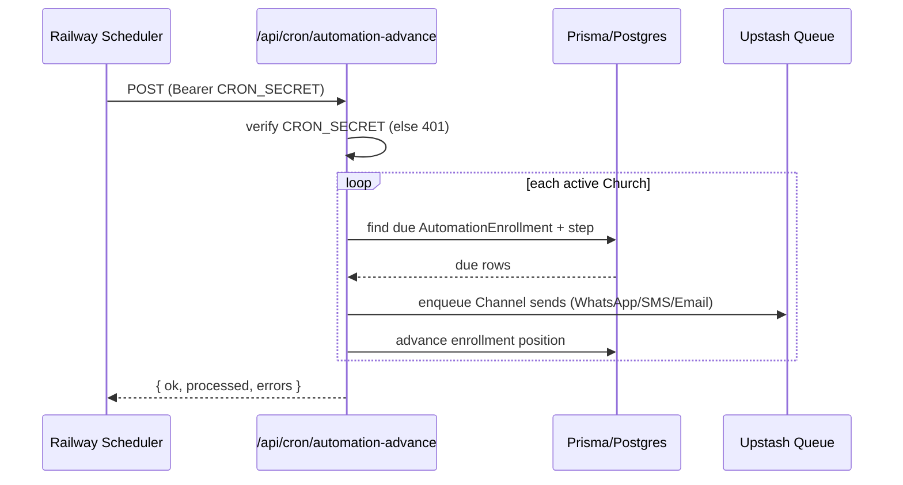

---

## 4.20 Webhooks — `/api/webhooks/*` (public, signature-verified)

No session; each verifies its provider signature/secret and is idempotent on the provider event id. Updates `CommunicationLog.status` (`MessageStatus`) or `Subscription`.

| Method | Path | Provider | Purpose | Verification |
|---|---|---|---|---|
| `GET` | `/api/webhooks/whatsapp` | WhatsApp Cloud API | Webhook verification handshake (`hub.challenge`) | echo `hub.verify_token` |
| `POST` | `/api/webhooks/whatsapp` | WhatsApp Cloud API | Delivery + read receipts + inbound replies | `X-Hub-Signature-256` (app secret) → updates `MessageStatus` (`SENT/DELIVERED/READ/REPLIED/FAILED`); inbound reply opens/extends 24h window & logs `REPLIED` |
| `POST` | `/api/webhooks/sms/termii` | Termii | SMS delivery reports | shared secret / IP allowlist → `DELIVERED/FAILED` |
| `POST` | `/api/webhooks/sms/twilio` | Twilio (fallback) | SMS status callbacks | `X-Twilio-Signature` → `DELIVERED/FAILED` |
| `POST` | `/api/webhooks/email/resend` | Resend | Email delivery/open/bounce events | `svix` signature → `DELIVERED/READ/FAILED` |
| `POST` | `/api/webhooks/paystack` | Paystack | Billing events (`charge.success`, `subscription.*`, `invoice.*`) | `x-paystack-signature` (HMAC-SHA512) → updates `Subscription`/invoices |

```mermaid
flowchart LR
  WA[WhatsApp Cloud API] -->|status/reply| WH[/api/webhooks/whatsapp]
  TM[Termii] --> SW1[/api/webhooks/sms/termii]
  TW[Twilio] --> SW2[/api/webhooks/sms/twilio]
  RS[Resend] --> EW[/api/webhooks/email/resend]
  WH --> CL[(CommunicationLog.status)]
  SW1 --> CL
  SW2 --> CL
  EW --> CL
  PS[Paystack] --> PW[/api/webhooks/paystack] --> SUB[(Subscription)]
```

---

## 4.21 Error codes (canonical)

| HTTP | `error.code` | When |
|---|---|---|
| 401 | `UNAUTHENTICATED` | No/invalid session (or bad `CRON_SECRET` / webhook signature) |
| 403 | `FORBIDDEN` | Role not allowed, or cross-tenant / out-of-assignment access |
| 404 | `NOT_FOUND` | Resource absent within tenant scope |
| 409 | `CONFLICT` | Duplicate (e.g. phone), or delete blocked by dependents |
| 422 | `VALIDATION` | Zod validation failure (`fields` map included) |
| 429 | `RATE_LIMITED` | Upstash limiter tripped (esp. comms/broadcast) |
| 500 | `INTERNAL` | Unhandled; reported to Sentry with request id |
# 5. User Flow Diagrams + 6. UI/UX Wireframes

## 5. User Flow Diagrams

All flows are tenant-scoped: every action carries an implicit `churchId` (and usually `branchId`) derived from the authenticated `User` session. Diagrams below describe the canonical happy paths plus the key branch points a developer must implement.

### 5.1 First-Timer Capture → Auto-Welcome → Follow-Up → Conversion

This is the core acquisition-to-retention loop. A `FirstTimer` is captured at a `Service`, auto-enrolled into the first-timer `AutomationWorkflow`, worked by a `CELL_LEADER` via `FollowUp` records, and promoted to a `Member` on second-service attendance.

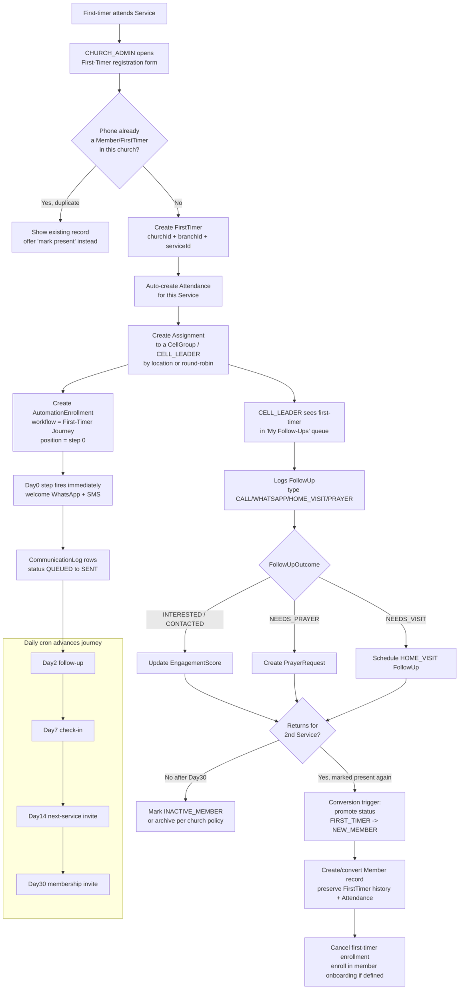

Implementation notes:
- **Duplicate guard** keys on `(churchId, normalizedPhoneE164)`. Always normalize to `+234…` before lookup/insert.
- **Conversion trigger** lives in the `Attendance` create path: if the present person is a `FirstTimer` and a prior `Attendance` exists for a different `Service`, run the promotion transaction (status change, `Member` upsert, history link, enrollment swap, `AuditLog`).
- `EngagementScore` is recomputed on every `FollowUp`, `Attendance`, and inbound `CommunicationLog` reply.

### 5.2 Cell-Leader Daily Follow-Up Loop

`CELL_LEADER` sees only members where an `Assignment` ties them to the person (assigned members + their first-timers). This is the highest-frequency screen and must be fast on a cheap Android phone.

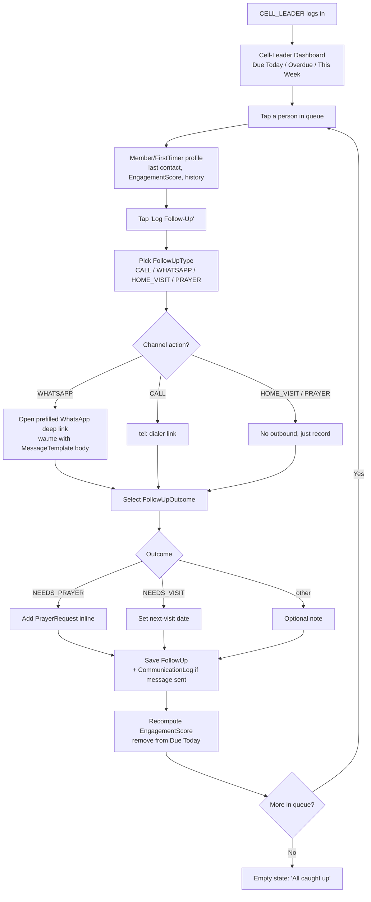

Implementation notes:
- The WhatsApp deep link is a **device-side** send (`wa.me`/`whatsapp://`) so a cell leader uses their own number for personal touch; the resulting `CommunicationLog` is marked `Channel=WHATSAPP, status=SENT` on the leader's confirmation (we cannot observe delivery for device sends).
- Queue buckets are computed from `FollowUp.dueDate` and `AutomationEnrollment` due steps for that leader's people.
- Everything writes optimistically with offline-tolerant retry (low-bandwidth context).

### 5.3 Broadcast Send

`PASTOR` and `CHURCH_ADMIN` compose audience-targeted broadcasts. Outbound platform messages (WhatsApp Cloud API, Termii/Twilio SMS, Resend email) go through the queue with per-recipient `CommunicationLog` rows.

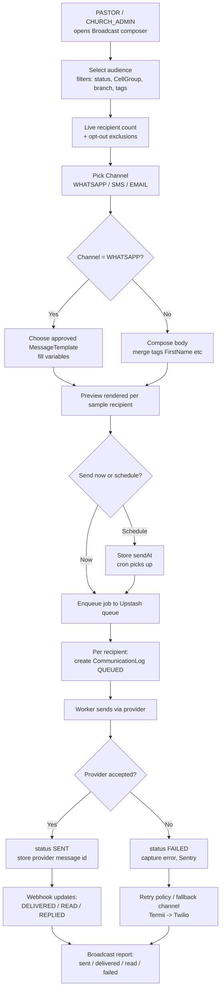

Implementation notes:
- **Opt-out / DND** is enforced at recipient expansion, not at send time.
- Rate-limit per provider via Upstash; WhatsApp respects template + 24h session rules.
- SMS uses **Termii primary, Twilio fallback**; a `FAILED` Termii row can re-enqueue on Twilio (configurable).
- Cost guard: show estimated SMS segments × ₦/segment before confirm (data/cost-conscious).

### 5.4 Attendance Check-In (QR + Manual)

Two entry modes for one `Attendance` write path. QR is for self/usher scan at the door; manual is the admin bulk-mark fallback for low-connectivity rooms.

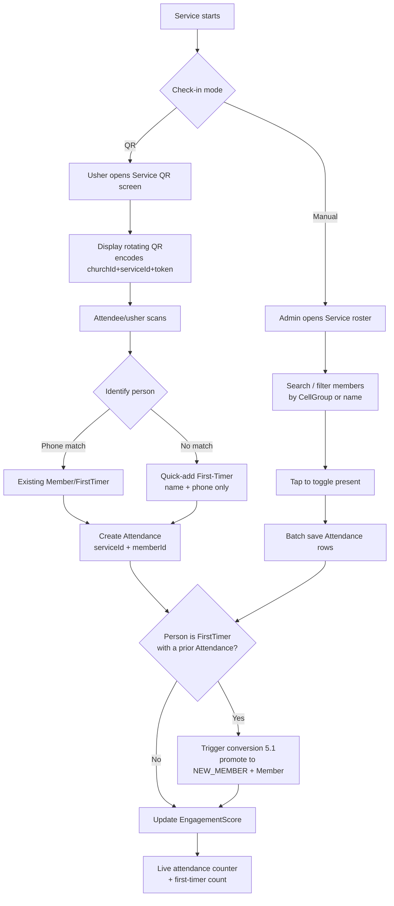

Implementation notes:
- QR token is short-lived and HMAC-signed with `CRON_SECRET`-class server secret; rotation every ~30s prevents screenshot reuse.
- Manual mode must work with **flaky connectivity**: queue toggles locally, batch-flush on save with idempotent `(serviceId, memberId)` upsert.
- Both paths converge on the same conversion check from 5.1.

### 5.5 Birthday Automation

A daily cron job (Railway scheduled → `/api/cron/birthdays` with `CRON_SECRET`) sends birthday/anniversary greetings per church, respecting each church's enabled channels and templates.

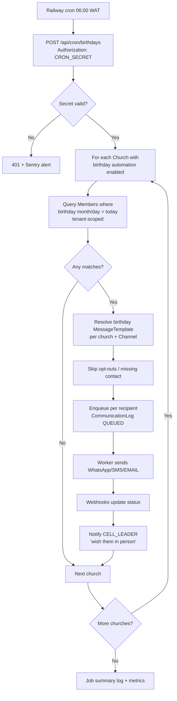

Implementation notes:
- The same job (or a sibling) handles **anniversaries** (membership/wedding) — identical shape, different template + date field.
- Idempotency: a per-day dedupe key `(churchId, memberId, 'birthday', date)` prevents double-send if cron retries.
- Cell-leader nudge is an in-app notification, not a billable message.

---

## 6. UI/UX Wireframes

**Design system & conventions (apply to every screen):**
- **Mobile-first**, single-column at <640px; sidebar collapses to a bottom tab bar / hamburger. Tables become stacked cards (mirrors the SPEEDFI mobile card-list pattern).
- Primary touch targets ≥ 44px. Naira shown as `₦`. Phones rendered as `+234…`.
- Persistent **church/branch context** in the top bar (SUPER_ADMIN can switch church; others are pinned).
- Role-gated nav: each role sees only its permitted items.
- Low-bandwidth: skeleton loaders, optimistic writes, no heavy hero images on data screens, Cloudinary thumbnails (small variants) for photos.

Legend for wireframes: `[ Button ]`, `( ) radio`, `[x] checkbox`, `▾ select`, `____ input`, `«…»` placeholder/dynamic.

### 6.1 Admin Dashboard (PASTOR / CHURCH_ADMIN)

Purpose: at-a-glance health of the church + fast access to the day's work.

```
┌─────────────────────────────────────────────┐
│ ☰  Church Connect      «Grace Chapel ▾»  👤  │
├─────────────────────────────────────────────┤
│  Good morning, Pastor «Tunde»                │
│                                              │
│  ┌──────────┐ ┌──────────┐                   │
│  │ Members  │ │First-Tmrs│   (stat cards,    │
│  │  1,248   │ │  this wk │    2-up mobile)   │
│  │ ▲ 3.2%   │ │    37    │                   │
│  └──────────┘ └──────────┘                   │
│  ┌──────────┐ ┌──────────┐                   │
│  │ Attend.  │ │ Follow-  │                   │
│  │ last svc │ │ ups due  │                   │
│  │   612    │ │   54 ⚠   │                   │
│  └──────────┘ └──────────┘                   │
│                                              │
│  Attendance trend (last 8 services)          │
│  ▁▃▅▆▅▇▆█   [ View reports → ]                │
│                                              │
│  Quick actions                               │
│  [ + First-Timer ] [ Mark attendance ]       │
│  [ Broadcast ]     [ Assign follow-ups ]     │
│                                              │
│  Needs attention                             │
│  • 12 first-timers unassigned    [ Assign ]  │
│  • 8 broadcasts scheduled today  [ View ]    │
│  • 3 cell groups no follow-up 7d [ View ]    │
├─────────────────────────────────────────────┤
│ 🏠 Home  👥 Members  ✅ Attend  💬 Comms  ⋯  │
└─────────────────────────────────────────────┘
```

- **Components:** stat cards (value, delta, deep-link), attendance sparkline, quick-action grid, "needs attention" actionable list.
- **Data:** all counts tenant-scoped; deltas vs prior period. PASTOR sees church-wide; CHURCH_ADMIN may be branch-scoped.
- **Mobile:** stats 2-up, quick actions wrap to 2 columns, bottom tab bar replaces sidebar; "needs attention" is the primary scroll target.

### 6.2 First-Timer Registration Form (CHURCH_ADMIN)

Purpose: capture a first-timer in <30s at the welcome desk; minimal required fields.

```
┌─────────────────────────────────────────────┐
│ ←  New First-Timer            «Grace Chapel» │
├─────────────────────────────────────────────┤
│  Service *                                   │
│  ▾ Sunday 1st Service — 8 Jun (SUNDAY)        │
│                                              │
│  Full name *                                 │
│  __________________________________________  │
│                                              │
│  Phone (WhatsApp) *      🟢 valid +234        │
│  +234 ______________                          │
│   ⚠ Already registered? «link to record»      │
│                                              │
│  Gender   ( ) Male  ( ) Female               │
│  Age band ▾ 18–25                             │
│                                              │
│  ▸ More details (optional)                    │
│    Email ____________   Address ___________   │
│    Invited by _______   How did you hear ▾    │
│                                              │
│  Assign to cell group                        │
│  ▾ Auto (nearest by address)                  │
│                                              │
│  [x] Send welcome message now (Day0)         │
│      Channels: [x] WhatsApp  [x] SMS          │
│                                              │
│        [ Save & add another ]                │
│        [ Save first-timer ]   (primary)      │
└─────────────────────────────────────────────┘
```

- **Components:** required `Service` selector (defaults to today's nearest service), name, E.164 phone with **live duplicate check** + validity badge, collapsible optional section, `CellGroup`/`Assignment` selector (auto round-robin or by address), Day0 welcome toggle with channel checkboxes.
- **Behavior:** on save → create `FirstTimer` + `Attendance` + `Assignment` + `AutomationEnrollment`; if welcome toggle on, fire Day0 `CommunicationLog`. "Save & add another" keeps `Service` selection for queue entry.
- **Mobile:** full-width inputs, sticky primary save button, numeric keypad for phone, no optional fields visible until expanded.

### 6.3 Member Profile

Purpose: 360° view of one person; the hub cell leaders and admins act from.

```
┌─────────────────────────────────────────────┐
│ ←  «Chidi Okafor»                      ⋮     │
├─────────────────────────────────────────────┤
│  (◐)  Chidi Okafor                            │
│       NEW_MEMBER · Cell: Lekki-3              │
│       Engagement ████████░░ 78               │
│  [ 📞 Call ] [ 💬 WhatsApp ] [ ✎ Edit ]       │
│                                              │
│  ┌ Contact ───────────────────────────────┐ │
│  │ +234 803 555 0199   moseg@...           │ │
│  │ 12 Admiralty Way, Lekki                 │ │
│  │ Birthday: 14 Aug   Joined: 11 May 2026  │ │
│  └─────────────────────────────────────────┘ │
│                                              │
│  Tabs:  [Timeline] Follow-ups  Attendance    │
│          Prayer  Messages                     │
│                                              │
│  Timeline                                    │
│  • Today    Promoted FIRST_TIMER→NEW_MEMBER  │
│  • 5 Jun    WhatsApp follow-up · CONTACTED   │
│  • 1 Jun    Present · Sunday 1st Service      │
│  • 25 May   Welcome msg sent (Day0)          │
│                                              │
│        [ + Log follow-up ]  (sticky)         │
└─────────────────────────────────────────────┘
```

- **Components:** avatar (Cloudinary thumb), status badge (`MemberStatus`), `EngagementScore` bar, call/WhatsApp quick actions, contact card, tabbed history (Timeline = merged feed of `FollowUp` + `Attendance` + `CommunicationLog` + `PrayerRequest`), sticky "Log follow-up".
- **Data:** tenant + assignment scoped — a `CELL_LEADER` can only open profiles for their assigned people; PASTOR/ADMIN unrestricted within church.
- **Mobile:** tabs become a horizontal scroll chip row; quick-action buttons fixed under the header; timeline is the default tab.

### 6.4 Cell-Leader Dashboard (CELL_LEADER)

Purpose: the daily work queue — who to contact, sorted by urgency. Built for speed on cheap devices.

```
┌─────────────────────────────────────────────┐
│ ☰  My People            «Grace Chapel»   👤  │
├─────────────────────────────────────────────┤
│  Hi «Blessing» — 14 follow-ups today          │
│                                              │
│  [ Due today (14) ] Overdue (3) · Week (22)  │
│                                              │
│  ── Due today ──────────────────────────────  │
│  ┌─────────────────────────────────────────┐ │
│  │ (◐) Chidi Okafor      FIRST_TIMER        │ │
│  │     Day7 check-in · last: 5 Jun          │ │
│  │     [ 💬 WA ] [ 📞 Call ] [ ✓ Log ]       │ │
│  └─────────────────────────────────────────┘ │
│  ┌─────────────────────────────────────────┐ │
│  │ (◐) Ada Eze           NEW_CONVERT  ⚠     │ │
│  │     Needs prayer · last: 2 Jun           │ │
│  │     [ 💬 WA ] [ 📞 Call ] [ ✓ Log ]       │ │
│  └─────────────────────────────────────────┘ │
│  …                                            │
│                                              │
│  My cell: Lekki-3 · 31 members  [ Roster → ] │
├─────────────────────────────────────────────┤
│ 📋 Queue  👥 Cell  🙏 Prayer  📊 Me          │
└─────────────────────────────────────────────┘
```

- **Components:** segmented bucket filter (Due today / Overdue / This week), person cards with reason (which `AutomationStep`/`FollowUp` triggered it), inline WA/Call/Log actions, cell roster link, prayer tab.
- **Data:** strictly the leader's `Assignment` set; buckets from `FollowUp.dueDate` + due `AutomationEnrollment` steps.
- **Mobile:** this is mobile-native by design — card list, large tap targets, one-tap WhatsApp/dialer deep links, bottom tabs. Cards collapse extra meta on narrow screens.

### 6.5 Follow-Up Logging

Purpose: record a contact attempt in 2–3 taps; optionally trigger prayer/visit.

```
┌─────────────────────────────────────────────┐
│ ←  Log follow-up — «Chidi Okafor»            │
├─────────────────────────────────────────────┤
│  Type *                                      │
│  ( ) Call   (•) WhatsApp                      │
│  ( ) Home visit   ( ) Prayer                  │
│                                              │
│  ┌ WhatsApp ─────────────────────────────┐   │
│  │ Template ▾ Day7 check-in               │   │
│  │ "Hi Chidi, just checking in…"          │   │
│  │ [ Open WhatsApp → ] (prefilled wa.me)  │   │
│  └────────────────────────────────────────┘   │
│                                              │
│  Outcome *                                   │
│  ▾ CONTACTED                                  │
│    (CONTACTED · NOT_CONTACTED · INTERESTED ·  │
│     NEEDS_PRAYER · NEEDS_VISIT)               │
│                                              │
│  ── if NEEDS_PRAYER ──                         │
│  Prayer request                              │
│  ______________________________  [+ Prayer]  │
│                                              │
│  ── if NEEDS_VISIT ──                          │
│  Schedule visit  ▾ Sat 14 Jun                 │
│                                              │
│  Note (optional)                             │
│  __________________________________________  │
│                                              │
│           [ Save follow-up ]  (primary)      │
└─────────────────────────────────────────────┘
```

- **Components:** `FollowUpType` radios; channel-specific block (WhatsApp shows `MessageTemplate` picker + `Open WhatsApp` deep link; Call shows `tel:` link); `FollowUpOutcome` select with **conditional sub-forms** (NEEDS_PRAYER → inline `PrayerRequest`; NEEDS_VISIT → next-date picker); optional note.
- **Behavior:** save creates `FollowUp` (+ `CommunicationLog` if a message was sent, + `PrayerRequest` if applicable), recomputes `EngagementScore`, removes person from "Due today".
- **Mobile:** radios as a 2×2 grid, conditional sections expand inline, sticky save button, returns to queue on success.

### 6.6 Broadcast Composer (PASTOR / CHURCH_ADMIN)

Purpose: send a targeted message across `WHATSAPP`/`SMS`/`EMAIL` with cost + reach visibility.

```
┌─────────────────────────────────────────────┐
│ ←  New broadcast              «Grace Chapel» │
├─────────────────────────────────────────────┤
│  1 · Audience                                │
│  Status   [x]Active [x]New conv [ ]Inactive  │
│  Cell      ▾ All cell groups                  │
│  Branch    ▾ Lekki branch                     │
│  Tags      ▾ +add                             │
│  ─────────────────────────────────────────   │
│  Recipients: 842   (−61 opted out)           │
│                                              │
│  2 · Channel                                 │
│  (•) WhatsApp  ( ) SMS  ( ) Email             │
│                                              │
│  3 · Message                                 │
│  Template ▾ Service reminder (approved)        │
│  ┌────────────────────────────────────────┐  │
│  │ Hi {{FirstName}}, join us this Sunday…  │  │
│  └────────────────────────────────────────┘  │
│  Insert: [FirstName] [Branch] [ServiceDate]   │
│  Preview (as Ada Eze)  [ 👁 ]                  │
│                                              │
│  4 · Send                                    │
│  (•) Send now   ( ) Schedule ▾ ____           │
│  Est. cost: WhatsApp 842 msgs  (~₦ —)         │
│                                              │
│        [ Send broadcast ]  (primary)         │
└─────────────────────────────────────────────┘
```

- **Components:** stepped audience filters with **live recipient count + opt-out exclusion**; `Channel` selector (gates UI: WhatsApp forces approved `MessageTemplate`, SMS shows segment/₦ estimate, Email shows subject + body); merge-tag inserter; per-recipient preview; send-now vs schedule.
- **Behavior:** confirm → expand recipients → enqueue → create one `CommunicationLog` (`QUEUED`) per recipient → worker sends → status transitions via webhooks. Scheduled broadcasts wait for cron.
- **Mobile:** steps stack vertically as collapsible accordions; recipient count and primary send button stay visible (sticky footer); cost estimate shown before the irreversible action.

### 6.7 Attendance / QR Check-In

Two surfaces sharing one write path: the **QR display** (usher-facing) and the **manual roster** (admin fallback).

```
QR DISPLAY (usher / kiosk)        MANUAL ROSTER (admin)
┌───────────────────────────┐    ┌───────────────────────────┐
│ ←  Check-in               │    │ ←  Mark attendance         │
│   Sunday 1st Service      │    │   Sunday 1st Service       │
│   8 Jun · SUNDAY          │    │   8 Jun · 612 marked       │
│                           │    │                            │
│      ███ ▄▀ █ ▀▄ ███      │    │ 🔍 Search name/phone___    │
│      █ ▀  QR  ▀ █         │    │ Filter ▾ Cell: Lekki-3     │
│      ███ ▄▀ █ ▀▄ ███      │    │ ─────────────────────────  │
│                           │    │ [x] Chidi Okafor           │
│  Scan to check in         │    │ [x] Ada Eze                │
│  Rotates every 30s ⟳      │    │ [ ] Sola Adams             │
│                           │    │ [x] Grace Bello            │
│  Checked in: 612          │    │ …                          │
│  First-timers: 37         │    │ ─────────────────────────  │
│                           │    │ Selected: 3   Total: 612   │
│  [ Switch to manual ]     │    │ [ + Quick first-timer ]    │
│                           │    │ [ Save attendance ] (prim) │
└───────────────────────────┘    └───────────────────────────┘
```

- **Components (QR):** rotating signed QR (encodes `churchId`+`serviceId`+token), live counters (total + first-timer), switch-to-manual.
- **Components (manual):** search + `CellGroup` filter, toggle list, selected counter, **quick first-timer add** (name + phone only → creates `FirstTimer` + `Attendance`), batch save.
- **Behavior:** both create idempotent `Attendance(serviceId, memberId)`; conversion check (5.1) runs on each; unknown scans route to the quick first-timer form.
- **Mobile:** QR screen is full-bleed for projection/handing the phone over; manual roster is a tap-to-toggle card list that queues offline and batch-flushes on save.

### 6.8 Reports

Purpose: leadership view of growth, attendance, follow-up performance, and conversion.

```
┌─────────────────────────────────────────────┐
│ ☰  Reports              «Grace Chapel ▾»  ⤓  │
├─────────────────────────────────────────────┤
│  Range ▾ Last 90 days   Branch ▾ All          │
│                                              │
│  ┌ Attendance ──────────────────────────┐    │
│  │  ▁▃▅▆▅▇▆█▇█    Avg 598 · ▲ 6%         │    │
│  │  SUNDAY · MIDWEEK · SPECIAL ·CELL_MTG │    │
│  └───────────────────────────────────────┘    │
│                                              │
│  ┌ First-timer funnel ──────────────────┐    │
│  │  Captured     312                     │    │
│  │  Welcomed     298  (95%)              │    │
│  │  Followed-up  241  (77%)              │    │
│  │  2nd visit    156  (50%)              │    │
│  │  Converted    138  (44%) → Member     │    │
│  └───────────────────────────────────────┘    │
│                                              │
│  ┌ Follow-up performance ───────────────┐    │
│  │ Cell leader   Done  Overdue  Conv.%   │    │
│  │ Blessing       142     3       51%    │    │
│  │ Emeka           98    11       33%    │    │
│  │ …                                     │    │
│  └───────────────────────────────────────┘    │
│                                              │
│  ┌ Comms ───────────────────────────────┐    │
│  │ Sent 4,210 · Delivered 96% · Read 61% │    │
│  │ by Channel: WA / SMS / EMAIL          │    │
│  └───────────────────────────────────────┘    │
│                                              │
│  [ Export CSV ]  [ Export PDF ]              │
└─────────────────────────────────────────────┘
```

- **Components:** global range + branch filter; attendance trend by `ServiceType`; **first-timer conversion funnel** (capture → welcome → follow-up → 2nd visit → `Member`); per-cell-leader follow-up performance table (done / overdue / conversion %); comms deliverability by `Channel` and `MessageStatus`; CSV/PDF export.
- **Data:** PASTOR/SUPER_ADMIN see all branches; CHURCH_ADMIN scoped to permitted branch(es). SUPER_ADMIN additionally gets a cross-church/SaaS roll-up (not shown here).
- **Mobile:** cards stack single-column; tables become horizontally scrollable with a sticky first column (leader name); charts shrink to sparkline + headline metric; export moves to an overflow menu.
# 7. Development Roadmap + 8. MVP Features

## 7. Development Roadmap

### 7.1 Team & Cadence Assumptions

Durations below assume a small team — 2 full-stack engineers (one acting as tech lead), 1 part-time designer/QA, and the founder as product owner. Estimates are in calendar weeks for that team size; a solo builder should roughly multiply by 1.7×. Each phase has explicit **deliverables** and **exit criteria** — the next phase does not start until exit criteria are met (with the deliberate exception that external-approval workstreams run in parallel from Day 1).

The stack is fixed (see system overview): Next.js 14 App Router, Prisma 5, PostgreSQL, NextAuth (credentials + Prisma adapter, RBAC), WhatsApp Cloud API, SMS via Termii (primary) / Twilio (fallback), Resend (email), Anthropic Claude (AI follow-up suggestions), Upstash Redis (rate-limit + queues), Cloudinary (photos), Paystack (SaaS billing), Sentry, deployed on Railway with cron via Railway scheduled jobs hitting protected `/api/cron/*` routes guarded by `CRON_SECRET`.

### 7.2 The Critical Path: External Approvals (start on Day 1)

The single biggest schedule risk is **not code** — it is third-party approvals that have multi-week, partly-unpredictable lead times and that gate the messaging features that are the product's core value. These must be kicked off during Phase 0 and tracked as their own swimlane, because nothing in our control speeds them up once submitted.

```mermaid
gantt
    title External Approval Swimlane (runs parallel to all build phases)
    dateFormat  YYYY-MM-DD
    axisFormat  W%V
    section WhatsApp
    Meta Business verification        :crit, wa1, 2026-01-05, 21d
    WABA + phone number setup         :crit, wa2, after wa1, 7d
    Message template approvals (Day0/2/7/14/30) :crit, wa3, after wa2, 14d
    Tier ramp (1k→10k msgs/day)       :wa4, after wa3, 30d
    section SMS
    Termii account + DND setup        :crit, sms1, 2026-01-05, 7d
    Sender ID registration (NCC)      :crit, sms2, 2026-01-05, 28d
    Twilio fallback provisioning      :sms3, 2026-01-12, 7d
    section Billing
    Paystack business activation      :pay1, 2026-01-05, 10d
    Subscription plans configured     :pay2, after pay1, 3d
```

**Why these dominate the plan:**

- **WhatsApp Cloud API / Meta Business verification** — Meta Business Manager verification can take days to weeks, and is occasionally rejected and must be re-submitted. The WhatsApp Business Account (WABA) and phone number must be provisioned, then **every templated message** in the first-timer cadence (Day0 welcome, Day2 follow-up, Day7 check-in, Day14 next-service invite, Day30 membership invite) must be submitted as a `MessageTemplate` and **individually approved** by Meta. New numbers also start at a low messaging tier (e.g. ~1,000 unique recipients/24h) and ramp only with good quality ratings. **Mitigation:** submit business verification on Day 1; draft and submit all template copy by end of Phase 1 so approvals land before Phase 2 needs them; design `CommunicationLog` to record per-template approval state and `MessageStatus` so the app degrades gracefully (auto-fallback to SMS) when a template is pending or a tier cap is hit.
- **SMS Sender IDs (Nigeria)** — Alphanumeric sender ID registration via Termii is subject to NCC/operator approval and DND (Do-Not-Disturb) routing rules; this can take ~2–4 weeks and unregistered IDs may be silently filtered. **Mitigation:** register the sender ID Day 1; use Termii's pre-approved generic route for internal testing; keep Twilio as a provisioned fallback so a single sender-ID rejection doesn't block all SMS.
- **Paystack activation** — Required before any `Subscription`/`Plan` billing can go live, but billing is Phase 4, so this has the most slack.

> Rule: **No build phase blocks on an approval, but Phase 2 (messaging) cannot exit until WhatsApp templates + SMS sender ID are live.** That is the one hard external dependency on the critical path.

### 7.3 Phase Overview

```mermaid
flowchart LR
    P0["Phase 0\nSetup & Foundations\n~2 wks"] --> P1["Phase 1\nMVP Core\n~5 wks"]
    P1 --> P2["Phase 2\nAutomation + Messaging\n~4 wks"]
    P2 --> P3["Phase 3\nEngagement + AI + Reports\n~3 wks"]
    P3 --> P4["Phase 4\nMulti-Branch, Scale, Billing\n~3 wks"]
    EXT["External Approvals\n(parallel, from Day 1)"] -.gates.-> P2
    EXT -.gates.-> P4
```

| Phase | Theme | Duration | Hard dependency to enter |
|---|---|---|---|
| 0 | Setup & Foundations | ~2 wks | — |
| 1 | MVP Core (people + attendance + manual follow-up) | ~5 wks | Phase 0 exit |
| 2 | Automation + Messaging | ~4 wks | Phase 1 exit **+ WhatsApp templates & SMS sender ID approved** |
| 3 | Engagement + AI + Reports | ~3 wks | Phase 2 exit |
| 4 | Multi-Branch, Scale, Billing | ~3 wks | Phase 3 exit + Paystack active |

Total to feature-complete v1+: **~17 weeks**. Shippable, paying-customer-ready MVP lands at the **end of Phase 1 (~7 weeks in)** for a single-branch church doing manual follow-up; messaging automation (the headline differentiator) lands end of Phase 2.

---

### 7.4 Phase 0 — Setup & Foundations (~2 weeks)

Goal: a deployable skeleton with multi-tenancy, auth, and CI in place so all later work inherits correct tenant scoping and RBAC.

**Deliverables**
- Repo, Railway project (staging + prod environments), PostgreSQL, Upstash Redis, Sentry, Cloudinary provisioned.
- Prisma schema v1 with **all canonical entities and enums** modelled: `Church`, `Branch`, `User`, `Member`, `FirstTimer`, `CellGroup`, `Assignment`, `Service`, `Attendance`, `FollowUp`, `PrayerRequest`, `CommunicationLog`, `MessageTemplate`, `AutomationWorkflow`, `AutomationStep`, `AutomationEnrollment`, `EngagementScore`, `Subscription`, `Plan`, `AuditLog`. Every domain table carries `churchId`; most also carry `branchId`.
- **Tenant-scoping middleware/utility** (e.g. a Prisma client extension or required `withTenant(churchId)` query helper) so no domain query can run without a tenant filter — enforced at the data-access layer, not by convention.
- NextAuth credentials provider + Prisma adapter; `UserRole` RBAC primitives (`SUPER_ADMIN | PASTOR | CHURCH_ADMIN | CELL_LEADER`) with a route/server-action authorization helper.
- `AuditLog` write path wired into a base mutation wrapper.
- `/api/cron/*` route scaffold protected by `CRON_SECRET`; `/api/health`.
- CI (lint, typecheck, Prisma migrate check) + preview deploys on Railway.
- **External approval swimlane kicked off** (WhatsApp business verification, Termii sender ID, Paystack activation submitted).

**Exit criteria**
- A `SUPER_ADMIN` can create a `Church` + `Branch`; a scoped `PASTOR`/`CHURCH_ADMIN` user can log in and is hard-scoped to that church.
- A cross-tenant read attempt is provably blocked (covered by an automated test).
- Staging deploy is green; Sentry receiving events; cron auth rejects requests without `CRON_SECRET`.

**Riskiest item:** getting tenant scoping wrong here is the most expensive mistake in the project — it is load-bearing for every later query and for the security model. Lock it down and test it before building features on top.

---

### 7.5 Phase 1 — MVP Core (~5 weeks)

Goal: a single-branch church can run its full people + attendance + **manual** follow-up loop end to end. This is the first sellable cut.

**Deliverables**
- **People management:** register and edit `Member` records with `MemberStatus` lifecycle (`FIRST_TIMER → NEW_CONVERT → NEW_MEMBER → ACTIVE_MEMBER → INACTIVE_MEMBER`); register `FirstTimer` (the welcome-desk capture form, mobile-first, fast). Nigerian context: phone numbers stored E.164 (`+234…`), photo upload via Cloudinary, low-bandwidth forms.
- **First-timer → member conversion:** when a `FirstTimer` is marked present at a second `Service`, status auto-promotes and a `Member` record is created (or the `FirstTimer` is converted in place), **preserving history**. This logic ships in the MVP because it is the product's core value loop.
- **Services & attendance:** define `Service` records (`ServiceType = SUNDAY | MIDWEEK | SPECIAL | CELL_MEETING`); mark `Attendance` (fast bulk/check-in UI).
- **Cell groups & assignment:** create `CellGroup`; `CELL_LEADER` accounts; `Assignment` of members/first-timers to leaders. RBAC enforced — a `CELL_LEADER` sees **only assigned people**.
- **Manual follow-up:** `FollowUp` records with `FollowUpType (CALL | WHATSAPP | HOME_VISIT | PRAYER)` and `FollowUpOutcome (CONTACTED | NOT_CONTACTED | INTERESTED | NEEDS_PRAYER | NEEDS_VISIT)`; `PrayerRequest` capture.
- **Role-based dashboards:** `PASTOR` (church-wide read, basic counts), `CHURCH_ADMIN` (registration/attendance/comms), `CELL_LEADER` (my-people task list of due follow-ups).
- Manual single-recipient WhatsApp/SMS *only if* a channel is already approved by this point — otherwise follow-ups are logged manually and outbound messaging is deferred to Phase 2. (No automation yet.)

**Exit criteria**
- A church admin registers a first-timer at Sunday service, the same person is marked present the following week, and the system auto-creates/promotes the `Member` with full history intact.
- A cell leader logs in and sees a follow-up task list scoped to assigned people only — and cannot see other leaders' people.
- All four roles have a working dashboard. End-to-end flow validated on a real church's data with the founder.

**Dependencies:** none external (this is why it's the sellable MVP — it delivers value with zero approval gating). Outbound messaging within Phase 1 is best-effort, gated by approvals.

---

### 7.6 Phase 2 — Automation + Messaging (~4 weeks)

Goal: the first-timer journey runs itself. This is the headline differentiator. **Cannot start until WhatsApp templates and the SMS sender ID are approved** (the Phase 0 swimlane must have landed).

**Deliverables**
- **Messaging abstraction** over `Channel (WHATSAPP | SMS | EMAIL)` with provider adapters (WhatsApp Cloud API, Termii→Twilio fallback, Resend), writing every send/receipt to `CommunicationLog` with `MessageStatus (QUEUED | SENT | DELIVERED | READ | REPLIED | FAILED)`. Delivery/read webhooks update status.
- **`MessageTemplate` management** mapped to the Meta-approved templates; per-template approval/state tracking; variable substitution (name, service, branch).
- **Automation engine:** `AutomationWorkflow` with ordered `AutomationStep`s (offset days, channel, template). `AutomationEnrollment` tracks each person's position in a workflow.
- **First-timer cadence preloaded:** Day0 welcome (WhatsApp + SMS), Day2 follow-up, Day7 check-in, Day14 next-service invite, Day30 membership invite.
- **Daily cron** (`/api/cron/*`, `CRON_SECRET`-guarded, Upstash-queued for throughput/rate-limit safety) that advances `AutomationEnrollment`s and dispatches due steps.
- **Broadcasts:** `PASTOR` can send a one-off church-wide or branch-wide broadcast via an approved channel.
- Rate-limiting and **graceful channel fallback** (WhatsApp template pending / tier cap → SMS) so a single approval gap doesn't break the cadence.
- Inbound reply handling → `MessageStatus = REPLIED` surfaced on the member timeline.

**Exit criteria**
- A newly registered first-timer is auto-enrolled and receives the Day0 message on an approved channel; subsequent cron runs deliver Day2/Day7/etc. on schedule, all logged in `CommunicationLog`.
- Delivery and read receipts flow back via webhook and update `MessageStatus`.
- A WhatsApp template rejection or tier cap demonstrably falls back to SMS without manual intervention.
- Pastor broadcast reaches a test cohort and is fully logged.

**Riskiest items:** template approval latency (mitigated by submitting in Phase 1) and WhatsApp 24-hour customer-service-window rules (templated messages required outside the window — already the design). Build the engine against a **mock provider** in parallel with approvals so code is ready the moment templates clear.

---

### 7.7 Phase 3 — Engagement + AI + Reports (~3 weeks)

Goal: turn the data exhaust into insight and reduce leader effort.

**Deliverables**
- **`EngagementScore`** computed per member (recency/frequency of `Attendance`, `FollowUp` responsiveness, message engagement) on a daily cron; at-risk / going-inactive flags surfaced on dashboards and as cell-leader tasks.
- **AI follow-up suggestions (Anthropic Claude):** given a member's history (attendance, follow-ups, prayer requests, last contact), suggest the next best action and draft personalized, culturally appropriate follow-up message copy for the leader to review and send. Suggestions are advisory; nothing auto-sends without the cadence/leader.
- **Reports & analytics:** first-timer conversion funnel, attendance trends per `Service`/`ServiceType`, follow-up completion rates by `CELL_LEADER`, retention/inactivity cohorts. Pastor-level church-wide and (where applicable) branch-level views.
- **Birthday + anniversary daily jobs** that enroll/dispatch greetings via the messaging layer.
- Exportable reports (CSV) for offline/printing.

**Exit criteria**
- Engagement scores recompute nightly and correctly flag a member with declining attendance.
- A leader can request and receive an AI-drafted follow-up message and send it through the existing messaging layer (logged in `CommunicationLog`).
- Pastor dashboard shows a conversion funnel and attendance trend backed by real data; birthday job fires on a seeded test date.

**Dependencies:** Phase 2 messaging layer (AI drafts and greetings dispatch through it). Anthropic key + cost guardrails (cache/limit AI calls — data-cost-conscious).

---

### 7.8 Phase 4 — Multi-Branch, Scale & Billing (~3 weeks)

Goal: support multi-branch churches at scale and turn on SaaS monetization.

**Deliverables**
- **Multi-branch operations hardened:** branch-scoped dashboards, branch-level reporting and broadcasts, cross-branch rollups for `PASTOR`/`SUPER_ADMIN`; verify every list/report respects `branchId` as well as `churchId`.
- **SaaS billing:** `Plan` definitions (Naira ₦ pricing, tiered by branches/members/message volume), `Subscription` lifecycle (trial → active → past-due → cancelled) via **Paystack**; plan-based feature gating and usage limits (e.g. monthly message quota) enforced against `CommunicationLog` counts.
- **`SUPER_ADMIN` platform console:** cross-church overview, subscription status, churn/usage, support impersonation (audited).
- **Scale & reliability:** queue tuning and provider rate-limit handling for large broadcasts, database indexing review for the largest tenants, WhatsApp tier monitoring, backups/restore drill, Sentry alerting + uptime checks.

**Exit criteria**
- A church with ≥2 branches operates with correct branch scoping across dashboards, reports, and broadcasts.
- A church can subscribe to a paid `Plan` via Paystack; downgrade/past-due correctly gates features and quotas; `SUPER_ADMIN` can see and manage subscriptions.
- A 5k+ recipient broadcast completes within rate limits without dropped or duplicated sends; restore drill passes.

**Dependencies:** Paystack activation (Phase 0 swimlane); WhatsApp messaging tier sufficiently ramped for large broadcasts.

---

## 8. MVP Features

### 8.1 MVP Definition

The **MVP = Phase 0 + Phase 1**: a single-branch (or single primary branch) church can register people, run services and attendance, manage cell groups and assignments, and execute **manual** follow-up with full role-based access — including the signature first-timer → member auto-conversion. It is sellable on its own because it digitizes the welcome-desk and follow-up workflow that churches do today on paper, with zero dependence on external messaging approvals.

> **MVP guiding principle:** ship the *people + attendance + conversion + manual follow-up* loop first (no external gating), then layer automated messaging the moment WhatsApp/SMS approvals land. Value is delivered before any approval clears.

### 8.2 In Scope for v1 (ships in the MVP)

| Module | v1 scope | Entities / enums |
|---|---|---|
| Auth & RBAC | Login; 4 roles enforced everywhere; tenant + branch scoping | `User`, `UserRole` |
| Tenancy | Church/branch provisioning by `SUPER_ADMIN` | `Church`, `Branch` |
| Members | Register/edit; full lifecycle; photo; E.164 phones | `Member`, `MemberStatus` |
| First-timers | Fast welcome-desk capture | `FirstTimer` |
| **Conversion** | Auto-promote on 2nd-service attendance, history preserved | `FirstTimer`→`Member`, `MemberStatus` |
| Services | Define services/events | `Service`, `ServiceType` |
| Attendance | Mark/bulk check-in | `Attendance` |
| Cell groups | Create groups, leaders, assignment; leader-scoped visibility | `CellGroup`, `Assignment` |
| Follow-up (manual) | Log follow-ups + outcomes; prayer capture | `FollowUp`, `FollowUpType`, `FollowUpOutcome`, `PrayerRequest` |
| Dashboards | Role-specific home screens + due-task lists | — |
| Audit | All mutations recorded | `AuditLog` |

### 8.3 Deferred (post-MVP, by phase)

| Deferred capability | Lands in | Why deferred |
|---|---|---|
| Automated first-timer cadence (Day0/2/7/14/30) | Phase 2 | Gated by WhatsApp template + SMS sender-ID approvals |
| Multi-channel messaging engine + delivery receipts | Phase 2 | `MessageStatus` lifecycle, webhooks, provider fallback |
| `AutomationWorkflow` / `AutomationStep` / `AutomationEnrollment` engine | Phase 2 | Depends on messaging layer |
| Pastor broadcasts | Phase 2 | Needs approved channel |
| `MessageTemplate` management | Phase 2 | Tied to Meta approval state |
| `EngagementScore` + at-risk flags | Phase 3 | Needs accumulated attendance/follow-up data |
| AI follow-up suggestions (Claude) | Phase 3 | Builds on member history + messaging layer |
| Reports/analytics + funnels + CSV export | Phase 3 | Builds on accumulated data |
| Birthday/anniversary jobs | Phase 3 | Needs messaging layer |
| Branch-level rollups & cross-branch ops | Phase 4 | Scale concern, not MVP-blocking |
| SaaS billing (`Plan`/`Subscription`, Paystack) | Phase 4 | Monetization after value is proven |
| `SUPER_ADMIN` platform console | Phase 4 | Cross-church ops at scale |
| MEMBER self-service portal | Post-MVP (explicitly out) | Not in scope per role definition |

### 8.4 MVP Acceptance (single end-to-end test)

The MVP is "done" when this scenario passes on real church data: a `CHURCH_ADMIN` registers a `FirstTimer` at a Sunday `Service` and assigns them to a `CellGroup`; the `CELL_LEADER` sees only that person, logs a `CALL` `FollowUp` with outcome `INTERESTED` and a `PrayerRequest`; the person is marked present at the next Sunday `Service`, triggering auto-conversion to a `Member` with `MemberStatus` advanced and history preserved; the `PASTOR` sees the new member and follow-up activity church-wide; and no role can read another tenant's — or another leader's — data.
# 9. Scalability Plan

This section describes how Church Connect CRM grows from a single local church on a shared Railway Postgres instance to thousands of churches with tens of millions of `Attendance`, `CommunicationLog`, and `FollowUp` rows — without rewriting the data model. The guiding principle is **defer every cost until a measured threshold forces it**: ship the simplest shared-schema, single-region topology first, instrument it, and adopt each lever below only when the named trigger fires.

We model three reference scales used throughout this section:

| Stage | Churches | Active members | Peak msgs/day | Posture |
|-------|----------|----------------|---------------|---------|
| **S1 — Pilot** | 1–50 | ≤ 25k | ≤ 50k | Single Railway app + single Postgres, no PgBouncer |
| **S2 — Growth** | 50–1,000 | ≤ 500k | ≤ 1M | PgBouncer, read replica, sharded cron, Upstash queue |
| **S3 — Scale** | 1,000–10,000+ | ≤ 10M | ≤ 20M | Partitioned hot tables, multi-region read, possible schema-per-tenant for VIP churches |

The Nigerian context constrains the cost side throughout: most churches are price-sensitive (₦ pricing), members are on mobile/low-bandwidth, and the dominant marginal cost is **outbound messaging** (WhatsApp/SMS provider fees), not compute.

---

## 9.1 Database scaling

`PostgreSQL` is the system of record. All scaling here preserves the shared-schema, `churchId`-scoped model defined in the data design.

### 9.1.1 Indexing strategy

Every tenant-scoped query must hit a composite index that **leads with `churchId`** (and `branchId` where the access path is branch-scoped). Without this the planner degrades to sequential scans the moment a second large tenant exists.

Mandatory composite indexes for the hot paths:

```prisma
// Member roster / dashboard filters
@@index([churchId, branchId, status])          // Member
@@index([churchId, status, createdAt])         // FirstTimer funnel

// Attendance lookups (per service, per member history)
@@index([churchId, serviceId])                 // Attendance
@@index([churchId, memberId, createdAt])       // Attendance (member history)

// Follow-up worklists for CELL_LEADER
@@index([churchId, assignedToId, status])      // FollowUp
@@index([churchId, type, createdAt])           // FollowUp

// Comms ledger + delivery reporting
@@index([churchId, channel, status, createdAt])// CommunicationLog
@@index([churchId, memberId, createdAt])       // CommunicationLog

// Automation engine cron scan (see 9.3)
@@index([status, nextRunAt])                   // AutomationEnrollment
@@index([churchId, workflowId, status])        // AutomationEnrollment
```

Operational rules:

- **Add indexes with `CONCURRENTLY`** in production migrations (Prisma raw migration step) so roster writes are never blocked at S2+.
- Use **partial indexes** for status-skewed columns, e.g. `AutomationEnrollment(nextRunAt) WHERE status = 'ACTIVE'` — the cron only ever scans active enrollments, so a partial index stays small even as completed enrollments accumulate.
- Track `pg_stat_user_indexes` quarterly; drop unused indexes (write amplification is the silent cost at S3).

**Threshold:** the partial/composite index audit becomes a standing task once any single table exceeds **5M rows** or any tenant exceeds **50k members**.

### 9.1.2 Connection pooling / PgBouncer

Next.js serverless-style request handling on Railway opens a connection per concurrent request. Postgres connections are expensive (~10MB each); the default cap (~100) is exhausted well before CPU is.

- **S1:** Prisma's built-in pool is sufficient. Set `connection_limit` conservatively (e.g. 5–10) in the `DATABASE_URL`.
- **S2 (trigger: sustained > 60 active DB connections, or "too many clients" errors):** introduce **PgBouncer in `transaction` pooling mode** as a sidecar/Railway service in front of Postgres. The app connects to PgBouncer; PgBouncer multiplexes hundreds of app connections onto a small backend pool (e.g. 20–40 server connections).
  - Prisma requires `pgbouncer=true` in the connection string (disables prepared-statement caching incompatible with transaction pooling).
  - Keep a **separate direct (non-pooled) connection string** (`DIRECT_URL`) for Prisma Migrate and the cron worker's long transactions.

```mermaid
flowchart LR
  subgraph App[Next.js app instances]
    A1[Instance 1]
    A2[Instance 2]
    A3[Instance N]
  end
  A1 --> PB[PgBouncer<br/>transaction mode]
  A2 --> PB
  A3 --> PB
  PB --> PW[(Postgres<br/>primary — writes)]
  A1 -. read queries .-> RR[(Read replica)]
  A2 -. read queries .-> RR
  PW == streaming replication ==> RR
  Migrate[Prisma Migrate / cron] -- DIRECT_URL --> PW
```

### 9.1.3 Read replicas

Read traffic dominates: pastor/admin dashboards, rosters, attendance reports, delivery analytics. Writes are bursty but smaller (attendance check-in, follow-up logging, comms status callbacks).

- **Trigger:** primary CPU sustained > 60% from read queries, or dashboard p95 > 800ms during Sunday-service write bursts.
- Provision a **streaming read replica**. Route to it via Prisma's read-replica extension (`$replica()`), or a thin data-access wrapper that sends all `findMany`/aggregate/report queries to the replica and all mutations + read-after-write paths to the primary.
- **Hard rule:** the FirstTimer→Member conversion check (marking present at a 2nd service auto-promotes status) and any read-after-write in the same request must use the **primary** — replica lag (typically < 1s, but unbounded under load) would let a first-timer be promoted twice or skip Member creation.
- Cron jobs read from the replica for *selection* (who is due) but write through the primary.

### 9.1.4 Partitioning the hot tables

Two tables grow without bound and are append-heavy: **`Attendance`** (every member × every service) and **`CommunicationLog`** (every message + every status transition). At S3 these dominate table size and vacuum cost.

Strategy: **native PostgreSQL declarative partitioning**.

- **`Attendance` — RANGE partition by month on `createdAt` (service date).** Reporting is almost always windowed ("this quarter", "last 4 Sundays"), so monthly partitions enable partition pruning. Old quarters can be detached and archived to cold storage. Because every query already carries `churchId`, a composite index on `(churchId, serviceId)` *within* each partition keeps tenant scoping fast.
- **`CommunicationLog` — RANGE partition by month on `createdAt`.** This table is effectively write-once + a few status updates (`QUEUED → SENT → DELIVERED → READ`/`FAILED`) within a short window after creation, then read-only. Monthly partitions make the retention policy trivial: drop partitions older than the retention window instead of `DELETE`.

```mermaid
flowchart TD
  CL[CommunicationLog<br/>partitioned by month] --> P1[2026_04]
  CL --> P2[2026_05]
  CL --> P3[2026_06 active]
  P1 -. detach + archive .-> COLD[(Object storage<br/>cold archive)]
```

- **Sub-partition by tenant only for outlier churches.** Default is time-only partitioning with `churchId` as the leading index column. If one mega-church (e.g. > 1M members or > 30% of all rows) skews a partition, **`LIST` sub-partition that church's `churchId`** into its own partition. Do not pre-shard by tenant globally — it explodes partition count (thousands of churches × months) and hurts the planner.
- Automate partition creation with a monthly maintenance cron (`/api/cron/db-maintenance`) that pre-creates next month's partitions and detaches/archives expired ones.

**Triggers:**
- Begin partitioning a table when it exceeds **~50M rows** or autovacuum can no longer keep up (bloat > 20%, or vacuum duration > the inter-write window).
- Introduce per-tenant sub-partitions only when a single tenant exceeds **20–30%** of a table's rows.

### 9.1.5 Retention & archival

- `CommunicationLog`: keep **24 months** hot, archive older partitions to object storage (queryable on demand for disputes). `MessageStatus` history beyond 90 days collapses to a summary row.
- `Attendance`: keep all hot (it is the core analytics asset) but compress old partitions; consider rolling per-member yearly summaries into `EngagementScore` so dashboards don't scan raw history.
- `AuditLog`: append-only, partition by month, retain per compliance need (default 24 months).

---

## 9.2 Message throughput & queueing

Outbound messaging is the highest-volume, most rate-limited, most cost-sensitive subsystem. It must **never** run inline in a request. All sends go through a queue.

### 9.2.1 Queue topology (Upstash)

- A broadcast or automation step **enqueues jobs**, it does not send. Each `CommunicationLog` row is created in `QUEUED` status; a worker drains the queue and transitions it to `SENT`.
- Use **Upstash Redis** for rate-limiting + lightweight queueing at S1–S2 (Upstash QStash for delayed/scheduled delivery). At S3, or if queue depth/ordering needs outgrow Redis lists, graduate the durable broadcast queue to a dedicated broker while keeping Upstash for rate-limit token buckets.
- **One logical queue per `Channel`** (`WHATSAPP`, `SMS`, `EMAIL`) because each provider has different rate limits and failure modes.

```mermaid
flowchart LR
  B[Broadcast / Automation step] -->|enqueue per recipient| Q{Channel queues}
  Q --> QW[WHATSAPP queue]
  Q --> QS[SMS queue]
  Q --> QE[EMAIL queue]
  QW --> RW[Rate limiter<br/>WhatsApp tier]
  QS --> RS[Rate limiter<br/>Termii / Twilio]
  QE --> RE[Rate limiter<br/>Resend]
  RW --> WK[Worker pool]
  RS --> WK
  RE --> WK
  WK -->|provider API| PROV[(Providers)]
  WK -->|update status| CL[(CommunicationLog)]
  PROV -. delivery webhook .-> CB[/status callback/] --> CL
```

### 9.2.2 Provider rate limits & batching

- **WhatsApp Cloud API** enforces per-number messaging tiers (1k → 10k → 100k → unlimited business-initiated/24h) and an ~80 msg/s default cap. The worker must hold a **token-bucket rate limiter (Upstash)** keyed by phone-number-ID and respect the current tier; a broadcast to 50k members is metered out across the day, not blasted.
- **SMS (Termii primary, Twilio fallback):** batch where the provider supports multi-recipient payloads; otherwise pace to the account TPS. Fail over Termii→Twilio on sustained 5xx/timeout, recording the switch in `CommunicationLog`.
- **Resend (email):** batch endpoint, respect monthly/daily caps.
- **Broadcast batching:** chunk recipients (e.g. 500/job), enqueue chunks, and spread WhatsApp/SMS sends across a delivery window. This smooths provider load, lets a broadcast be paused/cancelled mid-flight, and bounds blast-radius of a bad template.
- **Idempotency:** every job carries a deterministic key (`communicationLogId`) so retries never double-send. Workers transition `QUEUED → SENT` in a guarded update (`WHERE status = 'QUEUED'`).

### 9.2.3 Backpressure & DLQ

- Workers respect queue depth; if a provider throttles (429), jobs are re-enqueued with exponential backoff and the channel's rate limiter tightens.
- Permanent failures (invalid number, opt-out, template rejected) go to a **dead-letter queue** and the row is set to `FAILED` with a reason — no infinite retry.

**Triggers:**
- Inline-send is forbidden from S1 (queue from day one — it's cheap).
- Add a dedicated worker service (separate from the web app) when sustained throughput exceeds **~5k msgs/hour** so message bursts don't steal CPU from request handling.
- Graduate off Redis-list queueing to a dedicated broker at **> ~1M msgs/day** sustained or when at-least-once durability/replay becomes a hard requirement.

---

## 9.3 Cron fan-out at scale

The automation engine and daily jobs are the part most likely to become a single multi-hour job that times out and silently skips tenants. The first-timer journey alone (Day0/2/7/14/30 across `WHATSAPP` + `SMS`) means daily enrollment advancement touches a large fraction of `AutomationEnrollment` every day, plus birthday and anniversary jobs.

### 9.3.1 Principles

1. **No unbounded single job.** A cron route does a *bounded* unit of work and returns. Long work is decomposed.
2. **Selection is queue-feeding, not sending.** The daily advance cron *selects* due enrollments and *enqueues* the channel jobs from 9.2 — it never calls providers directly.
3. **Shard by tenant.** Process churches in shards so one giant church (or a stuck tenant) can't block all the others, and so work parallelizes.

### 9.3.2 Sharded tenant processing

> **Naming note:** at S1 the daily advance is the single canonical route `/api/cron/automation-advance` (§4.19, §10.2). The dispatcher + per-shard routes below (`/api/cron/automation-advance/dispatch`, `/api/cron/automation-advance/run`) are the S2+ sharded evolution of that same entrypoint, not a different job.

```mermaid
flowchart TD
  CRON[Railway scheduled cron<br/>daily 05:00 WAT] -->|POST + CRON_SECRET| DISP[/api/cron/automation-advance/dispatch/]
  DISP -->|compute shards| SH{Shard by<br/>churchId hash}
  SH --> S0[/automation-advance/run?shard=0/]
  SH --> S1[/automation-advance/run?shard=1/]
  SH --> SN[/automation-advance/run?shard=N/]
  S0 --> ENQ0[enqueue due steps]
  S1 --> ENQ1[enqueue due steps]
  SN --> ENQN[enqueue due steps]
  ENQ0 --> Q[(Channel queues)]
  ENQ1 --> Q
  ENQN --> Q
```

- The **dispatcher** computes the shard set (`shardCount` scales with church count) and triggers each shard route asynchronously (QStash fan-out, or self-`fetch` with `CRON_SECRET`). Shard = `hash(churchId) % shardCount`.
- Each **shard route** scans only `AutomationEnrollment WHERE status='ACTIVE' AND nextRunAt <= now()` for its shard (the partial index in 9.1.1 keeps this scan tiny), enqueues the channel job for the step's `AutomationStep.channel` + `MessageTemplate`, and advances `nextRunAt`/position. It processes a **bounded page** (e.g. 2,000 enrollments) and, if more remain, re-triggers itself with a cursor.
- **Per-tenant fairness & isolation:** a tenant that errors is recorded and skipped (circuit-breaker), never failing the shard. Daily run summary records processed/enqueued/failed per shard for observability.
- **Idempotent by day:** advancement is keyed on `(enrollmentId, stepOffsetDay)` so a re-run of a shard never double-enrolls or double-sends.

### 9.3.3 Other daily jobs

Birthday, anniversary, `EngagementScore` recompute, and DB-maintenance jobs follow the **same shard-and-enqueue** pattern. `EngagementScore` recompute is the heaviest aggregate — run it incrementally (only members with new `Attendance`/`FollowUp`/`CommunicationLog` since last run) rather than full recompute.

**Triggers:**
- Single-route cron is fine while the daily candidate set fits comfortably in one bounded run (**< ~10k enrollments/day**, S1).
- Adopt the dispatcher + sharding at **S2** (> ~10k daily enrollments or any single job approaching half the platform's cron timeout).
- Increase `shardCount` so each shard's bounded run stays under ~60s; revisit whenever total churches grows 5×.

---

## 9.4 Caching

Read amplification (dashboards refreshed constantly during services) is cheap to absorb with caching, and it directly cuts replica/DB load.

| Layer | What | TTL / invalidation | Adopt at |
|-------|------|--------------------|----------|
| **App in-memory** | Reference data: `Plan`, enum/option lists, `MessageTemplate` per church | Short TTL (minutes); invalidate on template edit | S1 |
| **Upstash Redis** | Per-church dashboard aggregates (attendance trend, funnel counts, queue depth), `EngagementScore` summaries | TTL 5–15 min; invalidate on attendance check-in / conversion | S2 |
| **Computed rollups** | Materialize daily/weekly attendance & funnel rollups into summary tables instead of recomputing from raw `Attendance` | Rebuilt by cron | S2–S3 |
| **HTTP / CDN** | Static assets, member photos (Cloudinary), public church landing pages | Long, content-hashed | S1 |

Cache keys are **always tenant-prefixed** (`church:{churchId}:...`) so isolation is preserved and a single church's invalidation never floods the cache. Never cache cross-tenant query results.

---

## 9.5 Multi-region & CDN

The member-facing surface (low-bandwidth, mobile-first Nigeria) benefits most from edge delivery; the transactional core stays single-region near the database.

- **CDN (from S1):** serve all static assets and Cloudinary-backed photos through a CDN; configure aggressive caching + image transforms (WebP, sized variants) to minimize data cost for members on metered connections.
- **Single write region (S1–S2):** keep the Postgres primary and app in one region (Railway region nearest the bulk of users / providers). Cross-region writes add latency and complexity not justified before S3.
- **Multi-region reads (S3 trigger: meaningful user base outside the primary region, or DR/RTO requirements):** place a **read replica + read-only app tier** in a second region serving dashboards and reports locally; writes still route to the primary region. This gives geographic read latency wins without multi-master complexity.
- **Disaster recovery:** automated daily logical backups + PITR (WAL archiving) from S2; documented restore runbook. A warm standby replica is the DR target at S3.

---

## 9.6 Tenant isolation options

The locked decision is **shared schema + `churchId` scoping**. This section records when (and only when) to deviate.

### Option A — Shared schema, `churchId` discriminator (default, all stages)

- Every domain table carries `churchId` (tenant root) and most carry `branchId`; every query is tenant-scoped via a mandatory access layer that injects `churchId` from the session.
- **Pros:** cheapest to operate, one migration applies everywhere, trivial cross-tenant SUPER_ADMIN analytics, pooling/partitioning all work uniformly. Best fit for thousands of small/mid Nigerian churches.
- **Cons:** isolation is enforced in code, not by the engine — a missing `churchId` filter is a cross-tenant leak. Mitigations: a single tenant-scoped Prisma client/middleware that **refuses** any query on a tenant table without `churchId`, plus **Postgres Row-Level Security** policies keyed on a per-request `app.current_church_id` GUC as defense-in-depth.

### Option B — Schema-per-tenant (selective, S3 only)

- A dedicated Postgres schema (or database) per tenant, same table shapes.
- **Pros:** hard isolation, per-tenant backup/restore/export, noisy-neighbor containment, easier to meet a large church's data-residency/contractual demands.
- **Cons:** migrations must fan out across N schemas (operationally heavy at thousands of tenants), connection/catalog overhead, cross-tenant analytics becomes painful, PgBouncer pool fragmentation.

### Recommendation

```mermaid
flowchart TD
  T{New / existing church} --> Q1{Enterprise isolation,<br/>data-residency, or<br/>> ~1M members?}
  Q1 -- No --> A[Shared schema + churchId<br/>+ RLS]
  Q1 -- Yes --> Q2{Worth bespoke ops?}
  Q2 -- No --> A
  Q2 -- Yes --> B[Dedicated schema/DB<br/>for that tenant only]
```

- **Stay 100% on Option A through S2.** It is the locked default and matches the market.
- At **S3**, offer **Option B only as a premium tier for a handful of outlier churches** that either exceed ~1M members (and would otherwise skew partitions/pools) or have contractual isolation/residency requirements. Keep the *vast majority* on shared schema. The codebase abstracts the tenant→connection mapping so a church can be "promoted" to its own schema without app rewrites.

---

## 9.7 Cost-control levers

Compute scales sub-linearly; **outbound messaging is the dominant marginal cost** and the primary lever.

1. **Channel cost-routing.** Prefer the cheapest effective channel per message intent: WhatsApp template < SMS for most journeys; reserve SMS for members without WhatsApp or for time-critical alerts. Email (Resend) is cheapest for long-form. Encode this preference per `AutomationStep` and per broadcast.
2. **Dedupe & suppress.** Never send to opted-out, invalid, or duplicate numbers; maintain a suppression list checked at enqueue time. A bounced/`FAILED` number is quarantined to stop repeat spend.
3. **Quiet hours & frequency caps.** Per-church send windows and per-member daily caps prevent runaway automation spend and protect sender reputation (which, if degraded, raises cost via lower deliverability tiers).
4. **AI cost discipline.** Anthropic Claude is used for follow-up *suggestions*, not per-message generation. Cache/template suggestions, batch them, and gate AI features by plan tier so cost tracks revenue.
5. **Right-size infra by trigger, not by fear.** PgBouncer, replica, partitioning, dedicated worker, and second region are each added only at their named threshold above — avoid paying S3 infra at S1 volumes.
6. **Storage tiering.** Archive cold `CommunicationLog`/`Attendance` partitions to cheap object storage (9.1.5); compress photos via Cloudinary transforms (also a member data-cost win).
7. **Plan-gated quotas.** `Plan`/`Subscription` carry monthly message + AI quotas; enforce at enqueue so usage maps to billing and overage is explicit. This aligns infra cost to ₦ revenue per church.
8. **Observability on spend.** Track cost-per-church (messages × provider rate) in the SUPER_ADMIN view; alert on anomalous per-tenant spend (a misconfigured automation loop is the classic cost incident).

**Cost-trigger summary:**

| Lever | Adopt when |
|-------|-----------|
| PgBouncer | > 60 sustained DB connections / "too many clients" |
| Read replica | Primary CPU > 60% from reads, or dashboard p95 > 800ms |
| Partition `Attendance`/`CommunicationLog` | Table > ~50M rows or vacuum can't keep up |
| Per-tenant sub-partition | One tenant > 20–30% of a table's rows |
| Dedicated message worker | > ~5k msgs/hour sustained |
| Dedicated queue broker | > ~1M msgs/day or durability/replay required |
| Sharded cron dispatcher | > ~10k daily enrollments / job nears timeout |
| Redis dashboard cache + rollups | S2 onset (50+ churches) |
| Multi-region read tier | Material user base outside primary region / DR RTO |
| Schema-per-tenant (Option B) | Outlier church > ~1M members or contractual isolation |
# 10. Full Source Code Structure

This section is the authoritative map of the repository. It is a single Next.js 14 (App Router) application — no separate backend service — with Prisma 5 talking to PostgreSQL, and all server logic living either in route handlers (`app/api/*`), server actions, or framework-agnostic modules under `lib/`. The structure deliberately mirrors the existing SPEEDFI codebase so module names (`whatsapp.ts`, `sms.ts`, `automation.ts`, `engagement.ts`, `db.ts`, `auth.ts`, `templates.ts`, cron handlers, etc.) are portable between the two products.

Three architectural rules drive the layout:

1. **Tenant-scoping is centralized.** No domain query touches Prisma directly. Everything goes through `lib/tenant.ts` helpers that force `churchId` (and usually `branchId`) into every `where`, so a missing filter is impossible by construction rather than by discipline.
2. **RBAC is declarative.** Permissions live in `lib/rbac/permissions.ts` as a role→capability matrix; route handlers and server actions assert against it via `lib/rbac/guard.ts`. Roles are exactly `SUPER_ADMIN | PASTOR | CHURCH_ADMIN | CELL_LEADER`.
3. **External I/O is adapter-shaped.** Messaging (WhatsApp/SMS/email), AI, billing, storage, and queues each sit behind a single module in `lib/` so providers (Termii↔Twilio, etc.) can be swapped without touching callers.

---

## 10.1 Top-Level Layout

```mermaid
flowchart TD
    Root["church-connect-crm/"]
    Root --> App["app/ — routes, UI, API, server actions"]
    Root --> Comp["components/ — shared React components"]
    Root --> Lib["lib/ — business logic, adapters, tenant + RBAC"]
    Root --> Prisma["prisma/ — schema, migrations, seed"]
    Root --> Emails["emails/ — React Email templates (Resend)"]
    Root --> Scripts["scripts/ — operational CLI scripts"]
    Root --> Types["types/ — shared TS types + module augmentation"]
    Root --> Tests["tests/ — unit + integration + e2e"]
    Root --> Config["config files — next, tailwind, tsconfig, env"]

    App --> Dash["(dashboard) — role-gated app shell"]
    App --> Api["api/ — route handlers"]
    Api --> Cron["api/cron/* — CRON_SECRET-guarded jobs"]
    Api --> Webhooks["api/webhooks/* — WhatsApp/Termii/Paystack callbacks"]
    Lib --> Tenant["tenant.ts — churchId/branchId scoping"]
    Lib --> Rbac["rbac/ — permission matrix + guard"]
    Lib --> Adapters["whatsapp.ts · sms.ts · email.ts · ai.ts · billing.ts"]
    Lib --> Engine["automation.ts · engagement.ts — engines"]
```

---

## 10.2 Annotated Directory Tree

```text
church-connect-crm/
├── app/                                  # Next.js App Router root
│   ├── layout.tsx                        # Root layout: fonts, <html>, Providers, Sentry boundary
│   ├── globals.css                       # Tailwind base + design tokens (mobile-first)
│   ├── providers.tsx                     # Client providers: NextAuth SessionProvider, Toaster, React Query
│   ├── page.tsx                          # Public marketing/landing page (₦ pricing, sign-up CTA)
│   ├── not-found.tsx                     # 404
│   ├── error.tsx                         # Root error boundary (reports to Sentry)
│   │
│   ├── (auth)/                           # Unauthenticated route group (no app shell)
│   │   ├── layout.tsx                    # Minimal centered auth layout
│   │   ├── login/page.tsx                # Credentials sign-in (NextAuth)
│   │   ├── register-church/page.tsx      # Self-serve Church + first PASTOR signup (tenant bootstrap)
│   │   ├── accept-invite/page.tsx        # User accepts emailed invite → sets password, role pre-assigned
│   │   └── forgot-password/page.tsx      # Password reset request/confirm
│   │
│   ├── (dashboard)/                      # Authenticated app shell (RBAC-gated)
│   │   ├── layout.tsx                    # Loads session, resolves Church/Branch context, renders nav by role
│   │   ├── dashboard/page.tsx            # Role-aware home: KPIs (attendance, first-timers, follow-ups due)
│   │   │
│   │   ├── members/                      # Member directory (CHURCH_ADMIN, PASTOR; CELL_LEADER sees assigned only)
│   │   │   ├── page.tsx                  # List + search + status filter (MemberStatus)
│   │   │   ├── new/page.tsx              # Register Member
│   │   │   ├── [memberId]/page.tsx       # Profile: attendance history, follow-ups, EngagementScore
│   │   │   └── [memberId]/edit/page.tsx  # Edit member
│   │   │
│   │   ├── first-timers/                 # FirstTimer intake + conversion funnel
│   │   │   ├── page.tsx                  # First-timer list with automation enrollment status
│   │   │   ├── new/page.tsx              # Capture first-timer (auto-enrolls in welcome AutomationWorkflow)
│   │   │   └── [firstTimerId]/page.tsx   # Detail; "Convert to Member" action (preserves history)
│   │   │
│   │   ├── attendance/                   # Attendance capture
│   │   │   ├── page.tsx                  # Service picker → mark attendance (triggers conversion check)
│   │   │   └── [serviceId]/page.tsx      # Per-Service attendance sheet (bulk check-in, low-bandwidth UI)
│   │   │
│   │   ├── services/                     # Service/event definitions (ServiceType)
│   │   │   ├── page.tsx                  # List services/events
│   │   │   └── new/page.tsx              # Create Service (SUNDAY/MIDWEEK/SPECIAL/CELL_MEETING)
│   │   │
│   │   ├── cell-groups/                  # CellGroup management + Assignment
│   │   │   ├── page.tsx                  # List cell groups, leaders, member counts
│   │   │   ├── [cellGroupId]/page.tsx    # Roster; assign/reassign members (Assignment)
│   │   │   └── new/page.tsx              # Create cell group, set CELL_LEADER
│   │   │
│   │   ├── follow-ups/                   # FollowUp workspace
│   │   │   ├── page.tsx                  # "My follow-ups due" queue (CELL_LEADER scoped to assigned)
│   │   │   └── [followUpId]/page.tsx     # Log outcome (FollowUpType + FollowUpOutcome), AI suggestion panel
│   │   │
│   │   ├── prayer-requests/              # PrayerRequest log
│   │   │   ├── page.tsx                  # Open/answered prayer requests
│   │   │   └── new/page.tsx              # Submit prayer request (links Member/FirstTimer)
│   │   │
│   │   ├── communications/               # Messaging hub
│   │   │   ├── page.tsx                  # CommunicationLog timeline (per-channel, MessageStatus)
│   │   │   ├── broadcast/page.tsx        # Segment + send broadcast (PASTOR/CHURCH_ADMIN)
│   │   │   └── templates/page.tsx        # MessageTemplate CRUD + WhatsApp approval state
│   │   │
│   │   ├── automations/                  # AutomationWorkflow builder + monitoring
│   │   │   ├── page.tsx                  # Workflow list (e.g. first-timer journey, birthday)
│   │   │   ├── [workflowId]/page.tsx     # Ordered AutomationStep editor (offset days, Channel, template)
│   │   │   └── enrollments/page.tsx      # AutomationEnrollment monitor (who's where in a journey)
│   │   │
│   │   ├── reports/                      # Analytics (PASTOR, CHURCH_ADMIN)
│   │   │   ├── page.tsx                  # Attendance trends, conversion rate, engagement distribution
│   │   │   └── engagement/page.tsx       # EngagementScore breakdown + at-risk (INACTIVE_MEMBER) list
│   │   │
│   │   ├── branches/                     # Branch management (PASTOR)
│   │   │   ├── page.tsx                  # List branches under the Church
│   │   │   └── new/page.tsx              # Create branch
│   │   │
│   │   ├── team/                         # User management within a Church
│   │   │   ├── page.tsx                  # List Users + roles
│   │   │   └── invite/page.tsx           # Invite User, assign UserRole + branch
│   │   │
│   │   └── settings/                     # Church-level settings
│   │       ├── church/page.tsx           # Church profile, branding, timezone, default Channel order
│   │       ├── billing/page.tsx          # Subscription/Plan, Paystack portal, usage vs. quota
│   │       └── profile/page.tsx          # Current user profile + password
│   │
│   ├── (super-admin)/                    # SUPER_ADMIN platform console (cross-tenant)
│   │   ├── layout.tsx                    # Platform shell; hard guard: role === SUPER_ADMIN
│   │   ├── overview/page.tsx             # Platform KPIs: churches, MRR, message volume
│   │   ├── churches/page.tsx             # All tenants; impersonate / suspend
│   │   ├── plans/page.tsx                # Plan catalog (₦ tiers, limits) management
│   │   └── audit/page.tsx               # Global AuditLog viewer
│   │
│   └── api/                              # Route handlers (server-only)
│       ├── auth/[...nextauth]/route.ts   # NextAuth handler (credentials + Prisma adapter)
│       │
│       ├── members/route.ts              # GET list / POST create (tenant-scoped, RBAC-guarded)
│       ├── members/[id]/route.ts         # GET/PATCH/DELETE single member
│       ├── first-timers/route.ts         # CRUD + POST /convert (promotion to Member)
│       ├── attendance/route.ts           # POST mark attendance → triggers conversion + engagement recalc
│       ├── services/route.ts             # Service CRUD
│       ├── cell-groups/route.ts          # CellGroup CRUD
│       ├── assignments/route.ts          # Assignment create/reassign
│       ├── follow-ups/route.ts           # FollowUp create/list (scoped to assignee for CELL_LEADER)
│       ├── follow-ups/[id]/route.ts      # PATCH outcome
│       ├── prayer-requests/route.ts      # PrayerRequest CRUD
│       ├── communications/route.ts       # CommunicationLog query
│       ├── communications/send/route.ts  # POST single send (resolves Channel → adapter)
│       ├── communications/broadcast/route.ts # POST segmented broadcast → enqueues jobs
│       ├── templates/route.ts            # MessageTemplate CRUD
│       ├── automations/route.ts          # AutomationWorkflow CRUD
│       ├── automations/[id]/steps/route.ts   # AutomationStep ordering
│       ├── ai/follow-up-suggestion/route.ts  # Claude-backed next-best-action suggestion
│       ├── reports/route.ts              # Aggregated analytics queries
│       ├── billing/checkout/route.ts     # Paystack init for Plan upgrade
│       ├── team/invite/route.ts          # Create User invite (email via Resend)
│       │
│       ├── cron/                         # Scheduled jobs — ALL guarded by CRON_SECRET (see lib/cron-auth.ts)
│       │   ├── automation-advance/route.ts   # Daily: advance every AutomationEnrollment one step
│       │   ├── birthdays/route.ts            # Daily: birthday greeting workflow trigger
│       │   ├── anniversaries/route.ts        # Daily: membership/wedding anniversary trigger
│       │   ├── follow-up-reminders/route.ts  # Daily: nudge CELL_LEADERs about due FollowUps
│       │   ├── engagement-recalc/route.ts    # Nightly: recompute EngagementScore, flag INACTIVE_MEMBER
│       │   ├── inactivity-sweep/route.ts     # Detect lapsed attendance → re-engagement enrollment
│       │   ├── message-retry/route.ts        # Retry FAILED CommunicationLog entries
│       │   ├── broadcast-dispatch/route.ts   # Every 5 min: drain scheduled broadcasts (scheduleAt due)
│       │   └── billing-rollover/route.ts     # Daily: reset Subscription.messagesUsed at period rollover
│       │
│       └── webhooks/                     # Inbound provider callbacks (signature-verified, no session)
│           ├── whatsapp/route.ts         # Delivery receipts + inbound replies → update MessageStatus (READ/REPLIED)
│           ├── termii/route.ts           # SMS DLR → MessageStatus (DELIVERED/FAILED)
│           ├── twilio/route.ts           # Twilio fallback SMS status callback
│           └── paystack/route.ts         # Subscription lifecycle → update Subscription/Plan
│
├── components/                           # Shared React components
│   ├── ui/                               # Primitives (button, input, table, dialog, badge, sheet)
│   ├── layout/                           # AppShell, Sidebar (role-filtered nav), Topbar, MobileNav
│   ├── members/                          # MemberCard, MemberForm, StatusBadge (MemberStatus)
│   ├── first-timers/                     # FirstTimerForm, ConversionButton, JourneyTimeline
│   ├── attendance/                       # AttendanceSheet, BulkCheckIn (low-bandwidth optimized)
│   ├── follow-ups/                       # FollowUpForm, OutcomePicker, AiSuggestionPanel
│   ├── communications/                   # ChannelPicker, MessageStatusBadge, BroadcastComposer
│   ├── automations/                      # WorkflowCanvas, StepEditor, EnrollmentTable
│   ├── charts/                           # AttendanceTrend, EngagementDistribution (recharts)
│   ├── billing/                          # PlanCard, UsageMeter (₦ formatting)
│   └── common/                           # EmptyState, DataTable, ConfirmDialog, PhoneInput (E.164 +234)
│
├── lib/                                  # Framework-agnostic business logic + adapters (the core)
│   ├── db.ts                             # Prisma client singleton (dev hot-reload safe)
│   ├── auth.ts                           # NextAuth config (authOptions), session callbacks inject churchId+role
│   ├── session.ts                        # getServerSession helpers: requireUser(), getTenantContext()
│   │
│   ├── tenant.ts                         # ★ Tenant-scoping core: scopedWhere(ctx), assertSameTenant(),
│   │                                     #   branch filtering, CELL_LEADER "assigned-only" narrowing
│   │
│   ├── rbac/                             # ★ Role-based access control
│   │   ├── permissions.ts                # Role→capability matrix (e.g. PASTOR: broadcast, assign; CELL_LEADER: own follow-ups)
│   │   ├── guard.ts                      # can(user, action, resource) + requirePermission() throwing 403
│   │   └── scopes.ts                     # Resource scope rules feeding tenant.ts (own vs branch vs church)
│   │
│   ├── messaging/                        # Messaging adapters (one provider per file, common interface)
│   │   ├── index.ts                      # send(channel, payload) router → picks adapter, writes CommunicationLog
│   │   ├── whatsapp.ts                   # ★ WhatsApp Cloud API adapter (template + freeform, status mapping)
│   │   ├── sms.ts                        # ★ SMS adapter: Termii primary, Twilio fallback, E.164 normalization
│   │   ├── email.ts                      # Resend adapter (renders emails/ React templates)
│   │   └── dispatch.ts                   # Channel fallback chain (WHATSAPP→SMS→EMAIL) + quota checks
│   │
│   ├── templates.ts                      # ★ MessageTemplate resolution + variable interpolation ({{firstName}}, {{service}})
│   ├── automation.ts                     # ★ Automation engine: enroll(), advanceEnrollment(), step execution
│   ├── engagement.ts                     # ★ EngagementScore computation (attendance recency, follow-ups, replies)
│   ├── conversion.ts                     # FirstTimer→Member promotion logic (2nd-service rule, history preservation)
│   ├── ai.ts                             # Anthropic Claude client: follow-up suggestions, message drafting
│   ├── billing.ts                        # Paystack adapter: checkout, plan limits, Subscription sync
│   ├── storage.ts                        # Cloudinary upload/signing (member/first-timer photos)
│   ├── redis.ts                          # Upstash client: rate-limit buckets + lightweight job queue
│   ├── queue.ts                          # Enqueue/consume helpers (broadcast fan-out, retries)
│   ├── cron-auth.ts                      # ★ Verifies CRON_SECRET bearer on /api/cron/* requests
│   ├── audit.ts                          # writeAuditLog() helper (AuditLog) — who/what/tenant
│   ├── phone.ts                          # E.164 (+234) normalization + Nigerian validation
│   ├── money.ts                          # Naira (₦) formatting + Plan price helpers
│   ├── validators/                       # Zod schemas mirroring canonical entities/enums
│   │   ├── member.ts                     #   Member + MemberStatus
│   │   ├── first-timer.ts                #   FirstTimer
│   │   ├── follow-up.ts                  #   FollowUpType + FollowUpOutcome
│   │   ├── communication.ts              #   Channel + MessageStatus payloads
│   │   ├── automation.ts                 #   AutomationWorkflow/Step
│   │   └── service.ts                    #   ServiceType
│   ├── enums.ts                          # Re-exports Prisma enums as the single source of truth
│   ├── dates.ts                          # Timezone-aware date helpers (church-local Service dates)
│   ├── sentry.ts                         # Sentry init (server + edge)
│   └── http.ts                           # API response/error envelope helpers (consistent JSON shape)
│
├── prisma/                               # Database layer
│   ├── schema.prisma                     # All canonical entities + enums; every domain model has churchId (+branchId)
│   ├── migrations/                       # Versioned SQL migrations
│   └── seed.ts                           # Seed: demo Church, Branches, Plans, default AutomationWorkflow + templates
│
├── emails/                               # React Email templates rendered by lib/messaging/email.ts
│   ├── welcome.tsx                       # First-timer Day0 welcome (email channel)
│   ├── invite.tsx                        # Team User invitation
│   ├── password-reset.tsx                # Reset link
│   └── weekly-digest.tsx                 # Pastor weekly summary
│
├── scripts/                              # Operational CLI (run via tsx)
│   ├── backfill-engagement.ts            # One-off EngagementScore backfill
│   ├── seed-templates.ts                 # Load/refresh default MessageTemplates per Channel
│   └── tenant-export.ts                  # Export a single Church's data (GDPR/offboarding)
│
├── types/
│   ├── next-auth.d.ts                    # Session/JWT augmentation: churchId, branchId, role
│   └── index.ts                          # Shared domain DTOs + TenantContext type
│
├── tests/
│   ├── unit/                             # lib/* pure-logic tests (tenant.ts, rbac, automation, engagement, conversion)
│   ├── integration/                      # API route + Prisma (tenant-isolation assertions)
│   └── e2e/                              # Playwright: signup→first-timer→attendance→conversion flow
│
├── public/                               # Static assets (logo, icons, manifest)
├── .env.example                          # All env keys: DB, NEXTAUTH, WhatsApp, Termii/Twilio, Resend,
│                                         #   ANTHROPIC_API_KEY, UPSTASH, CLOUDINARY, PAYSTACK, SENTRY, CRON_SECRET
├── middleware.ts                         # Edge auth gate: redirect unauthenticated, coarse role routing
├── next.config.mjs                       # Next config (image domains, Sentry wrapper)
├── tailwind.config.ts                    # Tailwind theme + design tokens
├── tsconfig.json                         # Strict TS, path aliases (@/lib, @/components)
└── package.json                          # Scripts: dev, build, prisma, seed, test, lint
```

> **★** marks the load-bearing modules: tenant-scoping (`lib/tenant.ts`), RBAC (`lib/rbac/*`), the messaging adapters (`lib/messaging/whatsapp.ts`, `sms.ts`), the engines (`lib/automation.ts`, `lib/engagement.ts`), cron auth (`lib/cron-auth.ts`), and template resolution (`lib/templates.ts`).

---

## 10.3 Where the Critical Subsystems Live

| Subsystem | Primary location | Supporting files |
|---|---|---|
| **Automation engine** | `lib/automation.ts` (enroll, advance, execute steps) | `app/api/cron/automation-advance/route.ts` (daily driver), `app/api/cron/birthdays`, `.../anniversaries`, `app/(dashboard)/automations/*` (UI), `lib/validators/automation.ts` |
| **Messaging adapters** | `lib/messaging/{whatsapp,sms,email}.ts` | `lib/messaging/dispatch.ts` (fallback chain + quota), `lib/messaging/index.ts` (router → CommunicationLog), `app/api/webhooks/{whatsapp,termii,twilio}/route.ts` (status updates) |
| **RBAC** | `lib/rbac/permissions.ts` (matrix), `lib/rbac/guard.ts` | `lib/rbac/scopes.ts`, `middleware.ts` (coarse gate), `components/layout/Sidebar` (role-filtered nav) |
| **Tenant-scoping** | `lib/tenant.ts` (`scopedWhere`, `assertSameTenant`) | `lib/session.ts` (`getTenantContext`), `lib/auth.ts` (injects churchId/role into session), every `app/api/*` handler |
| **Engagement scoring** | `lib/engagement.ts` | `app/api/cron/engagement-recalc/route.ts`, `app/(dashboard)/reports/engagement/page.tsx` |
| **First-timer → Member conversion** | `lib/conversion.ts` | invoked from `app/api/attendance/route.ts` on 2nd-service presence |
| **Cron security** | `lib/cron-auth.ts` (CRON_SECRET check) | every `app/api/cron/*/route.ts` |
| **AI follow-up suggestions** | `lib/ai.ts` (Anthropic Claude) | `app/api/ai/follow-up-suggestion/route.ts`, `components/follow-ups/AiSuggestionPanel` |
| **Billing** | `lib/billing.ts` (Paystack) | `app/api/billing/checkout/route.ts`, `app/api/webhooks/paystack/route.ts`, `app/(dashboard)/settings/billing/page.tsx` |

---

## 10.4 Request Lifecycle (how the layers compose)

Every authenticated, tenant-scoped mutation follows the same path, so the structure above is consistent rather than ad hoc:

```mermaid
sequenceDiagram
    participant UI as app/(dashboard) page
    participant MW as middleware.ts
    participant Route as app/api/*/route.ts
    participant Guard as lib/rbac/guard.ts
    participant Tenant as lib/tenant.ts
    participant Logic as lib/* (engine/adapter)
    participant DB as lib/db.ts (Prisma)

    UI->>MW: request (cookie session)
    MW->>Route: pass (authenticated, coarse role ok)
    Route->>Guard: requirePermission(user, action)
    Guard-->>Route: ok / throw 403
    Route->>Tenant: scopedWhere(ctx, filter)
    Tenant-->>Route: where { churchId, branchId, ... }
    Route->>Logic: domain operation
    Logic->>DB: Prisma query (already tenant-scoped)
    DB-->>Logic: rows
    Logic-->>Route: result (+ lib/audit.writeAuditLog)
    Route-->>UI: JSON envelope (lib/http.ts)
```

The cron and webhook paths are the two deliberate exceptions to the session-based flow: cron routes authenticate via `lib/cron-auth.ts` (CRON_SECRET bearer) and webhook routes authenticate via provider signature verification — neither has a user session, and both derive `churchId` from the payload before calling the same `lib/tenant.ts` helpers.
# 11. Deployment Guide

This section describes how to deploy Church Connect CRM to production. **Railway is the primary, supported target** — a single Next.js 14 service, a managed PostgreSQL database, and Upstash Redis, with cron driven by Railway scheduled jobs. Shorter notes cover **Vercel** and **DigitalOcean** as alternatives.

The application is a single Next.js 14 (App Router) deployable: it serves the dashboard UI, the NextAuth session layer, all `/api/*` route handlers (including webhooks and `/api/cron/*`), and the Prisma data layer from one process. There is no separate worker tier — background work runs through Upstash-backed queues drained by frequent cron ticks.

---

## 11.1 Provisioning on Railway

### 11.1.1 Create the project and Next.js service

1. Sign in at [railway.app](https://railway.app) and create a **New Project**.
2. Choose **Deploy from GitHub repo** and select the `church-connect-crm` repository. Railway auto-detects Next.js and provisions a Nixpacks build.
3. In the service **Settings → Build**, confirm:
   - **Build command:** `npm run build` (which runs `prisma generate && next build`).
   - **Start command:** `npm run start` (`next start -p $PORT`).
   - **Watch paths:** leave default so every push to `main` triggers a deploy.
4. Set the **Root Directory** if the app is not at repo root (it is at root for this project, so leave blank).

> Railway injects `$PORT` at runtime. Do **not** hard-code a port; `next start -p $PORT` binds correctly.

### 11.1.2 Add the PostgreSQL plugin

1. In the project canvas, click **New → Database → Add PostgreSQL**.
2. Railway creates a managed Postgres instance and exposes connection variables on the plugin (`PGHOST`, `PGPORT`, `DATABASE_URL`, etc.).
3. Reference these from the Next.js service using Railway's variable references so they stay in sync:
   - `DATABASE_URL` → `${{Postgres.DATABASE_URL}}`
   - `DIRECT_URL` → `${{Postgres.DATABASE_URL}}` (Railway Postgres does not pool by default; if you later front it with PgBouncer, point `DATABASE_URL` at the pooler and keep `DIRECT_URL` on the direct 5432 connection for migrations).

### 11.1.3 Add Redis (Upstash)

Use **Upstash Redis** for rate-limiting and the background queues (message retry, broadcast dispatch).

1. Create an Upstash Redis database at [upstash.com](https://upstash.com) (choose a region close to the Railway region, e.g. EU or US to match your Railway deploy region).
2. Copy the **REST URL** and **REST token** from the Upstash console.
3. Add them to the Railway service as `UPSTASH_REDIS_REST_URL` and `UPSTASH_REDIS_REST_TOKEN`.

> The app uses the Upstash **REST** client (`@upstash/redis` / `@upstash/ratelimit`), not a raw TCP Redis connection — this is serverless-friendly and works identically on Railway, Vercel, and DigitalOcean. You may alternatively add Railway's own Redis plugin, but the canonical setup is Upstash REST.

---

## 11.2 Environment Variables

Set all of the following in **Railway → Service → Variables** (and mirror them to any preview/staging environment). Every value should be treated as a secret unless noted as public.

| Variable | Purpose |
| --- | --- |
| `DATABASE_URL` | Primary Postgres connection string used by Prisma Client at runtime (pooled if a pooler is configured). |
| `DIRECT_URL` | Direct, unpooled Postgres connection used by `prisma migrate` for DDL. |
| `NEXTAUTH_URL` | Canonical public base URL of the app (e.g. `https://app.churchconnect.ng`); used by NextAuth for callbacks. |
| `NEXTAUTH_SECRET` | Secret for signing/encrypting NextAuth JWTs and session tokens. |
| `WHATSAPP_PHONE_NUMBER_ID` | Meta WhatsApp Cloud API phone-number ID used as the send-from identity. |
| `WHATSAPP_BUSINESS_ACCOUNT_ID` | WhatsApp Business Account (WABA) ID, used for template management. |
| `WHATSAPP_ACCESS_TOKEN` | Permanent system-user access token for calling the WhatsApp Cloud API. |
| `WHATSAPP_VERIFY_TOKEN` | Shared secret echoed back during webhook verification (`hub.verify_token`). |
| `TERMII_API_KEY` | API key for Termii, the primary SMS provider. |
| `TERMII_SENDER_ID` | Approved Termii alphanumeric sender ID for outbound SMS. |
| `TWILIO_ACCOUNT_SID` | Twilio account SID for the SMS fallback path. |
| `TWILIO_AUTH_TOKEN` | Twilio auth token paired with the SID. |
| `TWILIO_FROM` | Twilio sending number (E.164) used when falling back from Termii. |
| `RESEND_API_KEY` | API key for Resend transactional email. |
| `EMAIL_FROM` | Verified from-address/display name for outbound email (e.g. `Church Connect <no-reply@churchconnect.ng>`). |
| `ANTHROPIC_API_KEY` | API key for Anthropic Claude, used by the AI follow-up engine. |
| `CRON_SECRET` | Shared secret required in the header of every `/api/cron/*` request to authorize scheduled jobs. |
| `PAYSTACK_SECRET_KEY` | Paystack secret key for creating/verifying SaaS subscription charges and validating webhooks. |
| `PAYSTACK_PUBLIC_KEY` | Paystack public key (safe to expose client-side) for the billing checkout widget. |
| `CLOUDINARY_URL` | Cloudinary credential URL (`cloudinary://<api_key>:<api_secret>@<cloud_name>`) for member photo uploads. |
| `SENTRY_DSN` | Sentry Data Source Name for error and performance telemetry. |
| `UPSTASH_REDIS_REST_URL` | Upstash Redis REST endpoint for rate-limiting and queues. |
| `UPSTASH_REDIS_REST_TOKEN` | Bearer token for the Upstash Redis REST endpoint. |

> **Cloudinary alternative:** instead of the single `CLOUDINARY_URL`, you may set the three discrete variables `CLOUDINARY_CLOUD_NAME`, `CLOUDINARY_API_KEY`, and `CLOUDINARY_API_SECRET`. Use one form or the other consistently.

### Generating secrets

```bash
# NEXTAUTH_SECRET and CRON_SECRET — strong random values
openssl rand -base64 32   # NEXTAUTH_SECRET
openssl rand -hex 32      # CRON_SECRET (also fine for NEXTAUTH_SECRET)
```

`WHATSAPP_VERIFY_TOKEN` can be any opaque string you choose — it just has to match what you enter in the Meta webhook configuration.

---

## 11.3 Database: Prisma Migrate & Seed

Prisma migrations run against `DIRECT_URL` (unpooled). The recommended pattern is to run `migrate deploy` as a **release/deploy step** so the schema is current before the new revision starts serving traffic.

### 11.3.1 Apply migrations

Add a deploy command in Railway (**Settings → Deploy → Custom Start/Pre-deploy**), or run manually via the Railway CLI:

```bash
# Apply all committed migrations (idempotent, safe to re-run)
npx prisma migrate deploy
```

Recommended Railway configuration — keep migration separate from boot so a failed migration fails the deploy:

- **Pre-deploy command:** `npx prisma migrate deploy`
- **Start command:** `npm run start`

To run it manually against the production database from your machine:

```bash
railway link            # select the project/environment
railway run npx prisma migrate deploy
```

### 11.3.2 Seed Plan tiers

`prisma/seed.ts` loads the SaaS **Plan** tiers (e.g. Starter / Growth / Scale) and any baseline reference data. Run it **once** after the first successful migration:

```bash
railway run npx prisma db seed
```

This invokes the seed configured in `package.json`:

```jsonc
// package.json
{
  "prisma": {
    "seed": "ts-node --compiler-options {\"module\":\"CommonJS\"} prisma/seed.ts"
  }
}
```

> The seed is written to be **idempotent** (upserts on Plan by a stable key), so re-running it after a redeploy will not duplicate plans. Do not bundle the seed into the per-deploy release step — run it deliberately.

### 11.3.3 First SUPER_ADMIN

After seeding, create the initial `SUPER_ADMIN` user. If the seed does not provision one for your environment, use the admin bootstrap script:

```bash
railway run npx ts-node scripts/create-super-admin.ts -- \
  --email you@churchconnect.ng --name "Platform Owner"
```

The new admin signs in via NextAuth credentials and from there can create the first Church tenant, its Branches, and invite PASTOR / CHURCH_ADMIN / CELL_LEADER users.

---

## 11.4 Cron Jobs on Railway

Background and scheduled work is driven by **Railway scheduled jobs** (cron) that issue authenticated HTTP requests to the app's `/api/cron/*` routes. Each route verifies the request by checking the `CRON_SECRET` carried in a request header.

### 11.4.1 How a cron service calls a route

Each cron entry is a tiny scheduled service that runs a single `curl`. The job must send the `CRON_SECRET` header and target the canonical public URL:

```bash
curl -fsS -X POST \
  -H "x-cron-secret: $CRON_SECRET" \
  "$NEXTAUTH_URL/api/cron/automation-advance"
```

On Railway you can implement these either as **Cron Schedules on a job service** (recommended) or via an external scheduler. For the job-service approach, set the service's **Cron Schedule** field to the cron expression and its start command to the `curl` above (parameterising the route per service). `CRON_SECRET` and `NEXTAUTH_URL` are referenced from the shared environment.

> **Route auth contract:** every handler under `/api/cron/*` rejects with `401` unless the incoming `x-cron-secret` header equals `CRON_SECRET`. The same secret is used by all routes. Keep these routes out of the public sitemap and rate-limit them defensively.

### 11.4.2 Canonical schedule

All times are UTC. Adjust the daily run times to land in the early morning of the dominant timezone for your tenants (Nigeria is **WAT, UTC+1**, so `0 4 * * *` UTC ≈ 5:00 AM WAT). The table below maps each canonical route to a recommended cron expression.

| Cron route (`/api/cron/...`) | Cron expression | Cadence | Purpose |
| --- | --- | --- | --- |
| `automation-advance` | `0 4 * * *` | Daily, early AM | Advance members through automation/follow-up sequences to their next step. |
| `birthdays` | `5 4 * * *` | Daily, early AM | Detect today's member birthdays and enqueue greetings. |
| `anniversaries` | `10 4 * * *` | Daily, early AM | Detect membership/wedding anniversaries and enqueue greetings. |
| `follow-up-reminders` | `15 4 * * *` | Daily, early AM | Notify CELL_LEADER / CHURCH_ADMIN of due follow-up tasks. |
| `inactivity-sweep` | `30 4 * * *` | Daily, early AM | Flag members crossing inactivity thresholds and trigger re-engagement. |
| `engagement-recalc` | `0 2 * * *` | Nightly | Recompute per-member engagement scores from recent activity. |
| `message-retry` | `*/5 * * * *` | Every 5 minutes | Retry failed/queued WhatsApp/SMS/email sends with backoff. |
| `broadcast-dispatch` | `*/2 * * * *` | Every 2 minutes | Drain the broadcast queue, sending batched messages within rate limits. |
| `billing-rollover` | `45 3 * * *` | Daily | Roll subscription periods, settle Paystack renewals, downgrade lapsed tenants. |
| `db-maintenance` | `0 5 * * 0` | Weekly (Sun) | VACUUM/ANALYZE, prune soft-deleted rows, compact logs and old queue records. |

> The daily jobs are deliberately **staggered by 5 minutes** (`:00`, `:05`, `:10`, …) to avoid a thundering herd on the database and outbound providers. `engagement-recalc` runs earlier in the night (02:00) because downstream daily jobs read its scores.

### 11.4.3 Idempotency

Every cron handler is designed to be **idempotent and re-entrant**: jobs claim work via row locks / status transitions and tolerate duplicate ticks (e.g. an overlapping `message-retry`). This makes the schedule safe to run on at-least-once cron infrastructure.

---

## 11.5 WhatsApp Cloud API Setup

Outbound and inbound WhatsApp messaging uses the **Meta WhatsApp Cloud API**.

### 11.5.1 Create the Meta app and WABA

1. In [Meta for Developers](https://developers.facebook.com), create a **Business** app and add the **WhatsApp** product.
2. This creates (or links) a **WhatsApp Business Account (WABA)**. Copy the **WhatsApp Business Account ID** → `WHATSAPP_BUSINESS_ACCOUNT_ID`.
3. Add or register your business **phone number**. Copy its **Phone number ID** → `WHATSAPP_PHONE_NUMBER_ID`. Complete name/display verification for the number.

### 11.5.2 Permanent access token

Test tokens expire in 24 hours; production requires a **permanent System User token**:

1. In **Meta Business Settings → Users → System Users**, create a system user with an **Admin** role.
2. **Assign assets:** grant the system user full control over the app and the WABA.
3. **Generate token** with scopes `whatsapp_business_messaging` and `whatsapp_business_management`. Select **Never** for expiry.
4. Store it as `WHATSAPP_ACCESS_TOKEN`.

### 11.5.3 Webhook configuration

1. In the Meta app → **WhatsApp → Configuration → Webhook**, set:
   - **Callback URL:** `https://<your-domain>/api/webhooks/whatsapp`
   - **Verify token:** the value you put in `WHATSAPP_VERIFY_TOKEN`.
2. Meta sends a `GET` with `hub.mode`, `hub.challenge`, and `hub.verify_token`. The route validates the token and echoes `hub.challenge` to complete verification.
3. **Subscribe** the WABA to the `messages` field (and `message_template_status_update` to receive template approval callbacks).

> The webhook deploy must be live and reachable over HTTPS **before** you click verify, so deploy the app and set `WHATSAPP_VERIFY_TOKEN` first.

### 11.5.4 Message templates

Sessions outside the 24-hour customer-service window require **approved templates**:

1. In **WhatsApp Manager → Message Templates**, submit the templates the app uses (greetings, birthday/anniversary, follow-up nudges, broadcast intros) in each required language.
2. Use named placeholders/variables that match what the send code supplies (e.g. `{{1}}` = member first name).
3. Wait for Meta approval (minutes to ~24 hours). Only **APPROVED** templates can be sent; the app reads template status via `message_template_status_update` and will not dispatch a non-approved template.

---

## 11.6 SMS Sender ID Registration

### 11.6.1 Termii (primary)

1. Create a Termii account and copy the API key → `TERMII_API_KEY`.
2. Register an **alphanumeric Sender ID** (e.g. `ChurchHub`) under **Sender IDs**. Provide the business justification and sample messages Termii requires.
3. For **DND (Do-Not-Disturb)** numbers on Nigerian networks, register the Sender ID through Termii's **DND-route / corporate** approval so transactional messages reach MTN/Airtel/Glo/9mobile subscribers who have DND active. Approval can take several business days.
4. Set the approved Sender ID → `TERMII_SENDER_ID`.

> Until the Sender ID is approved, sends may be rejected or routed through a generic shortcode. Plan the registration ahead of go-live.

### 11.6.2 Twilio (fallback)

1. Create a Twilio account; copy the **Account SID** → `TWILIO_ACCOUNT_SID` and **Auth Token** → `TWILIO_AUTH_TOKEN`.
2. Provision a Twilio phone number capable of SMS to your destination countries and set it (E.164) → `TWILIO_FROM`.
3. Note that Nigerian SMS via international carriers may face delivery/sender-ID constraints; Twilio is the **fallback** used only when Termii fails or is unconfigured.

---

## 11.7 Custom Domains & DNS

### 11.7.1 On Railway

1. In **Service → Settings → Networking → Custom Domain**, add your domain, e.g. `app.churchconnect.ng`.
2. Railway returns a target **CNAME**. In your DNS provider, create:

   | Type | Name | Value |
   | --- | --- | --- |
   | CNAME | `app` | `<your-service>.up.railway.app` (the value Railway shows) |

3. For an **apex/root** domain (`churchconnect.ng`), use your DNS provider's **ALIAS/ANAME flattening** to the Railway target, since apex records cannot be CNAMEs. Otherwise serve the app on a subdomain and redirect the apex.
4. Railway provisions a TLS certificate automatically once DNS resolves.
5. Update `NEXTAUTH_URL` to the **final HTTPS custom domain** and redeploy — NextAuth callbacks and the cron `curl` base URL must use it.

### 11.7.2 Provider records to also configure

- **Resend:** add the SPF, DKIM, and (optional) DMARC records Resend provides for your sending domain so `EMAIL_FROM` authenticates.
- **WhatsApp/Paystack:** no DNS needed, but ensure their **webhook URLs** use the final custom domain.

---

## 11.8 Go-Live Checklist

**Infrastructure**
- [ ] Railway project created; Next.js service, PostgreSQL plugin, and Upstash Redis all provisioned.
- [ ] All environment variables from §11.2 set in the production environment (no test/sandbox keys).
- [ ] `DATABASE_URL` / `DIRECT_URL` reference the production Postgres; pooler (if any) configured correctly.

**Database**
- [ ] `prisma migrate deploy` ran cleanly as a pre-deploy step.
- [ ] `prisma db seed` ran once; Plan tiers present.
- [ ] First `SUPER_ADMIN` created and able to log in.

**Cron**
- [ ] All 10 canonical `/api/cron/*` jobs created with the schedules in §11.4.2.
- [ ] Each job sends the `x-cron-secret` header and targets the custom-domain base URL.
- [ ] A manual `curl` to one route returns `200`; an unauthenticated call returns `401`.

**Messaging**
- [ ] WhatsApp permanent token works; webhook verified; `messages` + template-status subscribed.
- [ ] Required WhatsApp templates submitted and **APPROVED**.
- [ ] Termii Sender ID approved (incl. DND route); Twilio fallback number live.
- [ ] Resend domain verified (SPF/DKIM green); test email delivered from `EMAIL_FROM`.

**Billing & telemetry**
- [ ] Paystack live keys set; subscription webhook URL points at the custom domain and verifies signatures.
- [ ] Sentry receiving events (trigger a test error).
- [ ] Cloudinary upload of a member photo succeeds.

**App & domain**
- [ ] Custom domain resolves over HTTPS; TLS cert issued.
- [ ] `NEXTAUTH_URL` matches the custom domain; login/logout and tenant switching work.
- [ ] RBAC spot-check: SUPER_ADMIN / PASTOR / CHURCH_ADMIN / CELL_LEADER each see only permitted data, scoped by `churchId` / `branchId`.
- [ ] Rate-limiting active (Upstash reachable); a burst of requests is throttled.

---

## 11.9 Alternative Targets

### 11.9.1 Vercel

Vercel suits the Next.js front end well, with two key differences:

- **Database:** Vercel does not host Postgres durably for this workload's needs in the same way; use a managed Postgres (Neon, Supabase, or the same Railway Postgres) and set `DATABASE_URL` (pooled) + `DIRECT_URL` (direct) accordingly. Neon's pooled + direct endpoints map cleanly onto these two variables.
- **Cron:** replace Railway scheduled jobs with **Vercel Cron** in `vercel.json`. Vercel Cron invokes a path on a schedule; protect each `/api/cron/*` route with the same `CRON_SECRET` check (Vercel can attach an `Authorization: Bearer` or you keep the `x-cron-secret` convention via a thin wrapper). Note Vercel Cron's **minimum granularity and plan limits** — sub-5-minute cadences for `broadcast-dispatch`/`message-retry` may require a Pro/Enterprise plan or an external scheduler (e.g. Upstash QStash or GitHub Actions) hitting the same routes.

```jsonc
// vercel.json (excerpt)
{
  "crons": [
    { "path": "/api/cron/automation-advance", "schedule": "0 4 * * *" },
    { "path": "/api/cron/message-retry",      "schedule": "*/5 * * * *" }
    // ...one entry per canonical route from §11.4.2
  ]
}
```

Set `migrate deploy` and `db seed` to run via the Vercel **build/ignored-build step** or manually from the CLI, since Vercel builds are ephemeral. Keep Upstash, WhatsApp, Termii, Resend, Paystack, Sentry, and Cloudinary identical to §11.2.

### 11.9.2 DigitalOcean

Two viable shapes:

- **App Platform:** deploy the repo as a Node service, attach a **DigitalOcean Managed PostgreSQL** database (set `DATABASE_URL` to the pooled connection, `DIRECT_URL` to the direct one), and use App Platform's **scheduled components (jobs)** to run the cron `curl`s on the schedules in §11.4.2. Add the build step `prisma generate && next build` and the run command `next start`.
- **Droplet + Docker:** run the app behind Nginx (TLS via Let's Encrypt), Managed Postgres for the database, Upstash Redis for queues, and **system cron** entries on the Droplet issuing the authenticated `curl`s. Example crontab line:

  ```cron
  */5 * * * * curl -fsS -X POST -H "x-cron-secret: $CRON_SECRET" https://app.churchconnect.ng/api/cron/message-retry
  ```

In all alternatives the environment-variable contract (§11.2), Prisma steps (§11.3), cron schedule (§11.4), and external-provider setup (§11.5–11.6) are unchanged — only the hosting and scheduler mechanics differ.
# 12. Cost Estimate

This section estimates the monthly cost of operating Church Connect CRM, in both **USD** and **Naira (₦)**, for three representative deployment sizes. The dominant cost driver is **messaging** (WhatsApp Cloud API + SMS), not compute — a structural reality of any African church follow-up product where the core value is reaching first-timers across `WHATSAPP`, `SMS`, and `EMAIL`. Infrastructure (Railway service + Postgres + Redis) is comparatively fixed and amortizes well across tenants.

All figures are **estimates for planning and pricing**, not quotes. Rates move; treat the unit costs as the source of truth and recompute totals as volumes change.

---

## 12.1 Assumptions

| Assumption | Value | Notes |
|---|---|---|
| FX rate | **₦1,550 / $1** | Planning rate; revise quarterly. |
| Country | Nigeria (`+234`, E.164) | Pricing follows Nigeria market rates. |
| WhatsApp pricing model | Per-**conversation** (Meta) | Charged per 24h conversation window, by category, not per message. |
| SMS pricing | Termii primary, Twilio fallback | Termii cheaper for NG; Twilio used only on failure. |
| Email | Resend | Generous free tier; paid plan flat. |
| AI | Anthropic Claude (Haiku-class for suggestions) | Used for `FollowUp` suggestions + draft `CommunicationLog` copy, not bulk send. |
| Photos | Cloudinary (`Member` / `FirstTimer` photos) | Free tier covers small/mid churches. |
| Error monitoring | Sentry | One project for whole platform (multi-tenant). |
| Domain | 1 platform domain | Annualized to monthly. |
| Active member ratio | ~70% of roster receives messages monthly | `INACTIVE_MEMBER` filtered out of most automations. |
| First-timer intake | ~3% of roster / month enters first-timer journey | Drives the heavy Day0–Day30 cadence. |

### Per-unit rate card (planning rates)

| Item | Unit | USD | ₦ |
|---|---|---:|---:|
| WhatsApp **Service** conversation (NG) | per 24h conversation | $0.0042 | ₦6.5 |
| WhatsApp **Utility** conversation (NG) | per 24h conversation | $0.0149 | ₦23 |
| WhatsApp **Marketing** conversation (NG) | per 24h conversation | $0.0410 | ₦64 |
| Termii SMS (NG, transactional) | per 160-char unit | ~$0.020 | ₦31 |
| Twilio SMS (NG, fallback) | per segment | ~$0.045 | ₦70 |
| Resend email | per email (after free tier) | ~$0.0004 | ₦0.6 |
| Anthropic Claude (Haiku-class) | per follow-up suggestion (~1.5k tok in / 0.4k out) | ~$0.0018 | ₦2.8 |
| Cloudinary | per stored+served photo | ~$0.0002 | ₦0.3 |

> **WhatsApp category note:** the automation cadence (Day0 welcome, Day7 check-in, Day14 next-service invite, Day30 membership invite) is mostly **Utility/Marketing** template-initiated; ad-hoc replies inside a 24h window ride the cheaper **Service** rate. We model the first-timer journey at Utility rates and routine broadcasts at Marketing rates — the conservative (more expensive) assumption.

---

## 12.2 Fixed infrastructure (platform-wide, shared across all tenants)

These costs do **not** scale per church until you cross capacity tiers; they are shared multi-tenant overhead.

| Component | Tier | USD/mo | ₦/mo |
|---|---|---:|---:|
| Railway — Next.js service (web + cron) | Hobby→Pro as scale grows | $5–$20 | ₦7,750–₦31,000 |
| Railway — PostgreSQL | Managed, 1–8 GB | $5–$20 | ₦7,750–₦31,000 |
| Upstash Redis (rate-limit + queues) | Pay-as-you-go | $0–$10 | ₦0–₦15,500 |
| Resend (email) | Free → Pro | $0–$20 | ₦0–₦31,000 |
| Sentry (1 platform project) | Free → Team | $0–$26 | ₦0–₦40,300 |
| Cloudinary | Free → Plus | $0–$89 | ₦0–₦137,950 |
| Domain (amortized) | ~$15/yr | ~$1.25 | ~₦1,940 |
| **Fixed subtotal (small/mid)** | | **~$16** | **~₦24,800** |
| **Fixed subtotal (platform scale)** | | **~$185** | **~₦286,750** |

Anthropic and all messaging are **usage-based** and modeled per scenario below.

---

## 12.3 Cost composition

```mermaid
pie title Monthly cost composition — Mid church (~2,000 members)
    "WhatsApp conversations" : 52
    "SMS (Termii)" : 27
    "Fixed infra (Railway/DB/Redis)" : 12
    "Anthropic AI" : 5
    "Email / Cloudinary / Sentry / domain" : 4
```

Messaging (WhatsApp + SMS) is ~75–80% of total cost at every scale. **This is the number that determines pricing.**

---

## 12.4 Scenario A — Small church (~300 members)

**Workload assumptions (monthly):**
- ~210 active members reached via routine broadcasts (1 weekly service reminder + occasional announcement ≈ 6 sends/mo).
- ~9 new first-timers enter the Day0→Day30 journey (5 touchpoints each across WhatsApp+SMS).
- AI suggestions generated for `FollowUp` records by `CELL_LEADER` / `CHURCH_ADMIN`: ~120/mo.

| Cost line | Volume | Rate | USD | ₦ |
|---|---:|---:|---:|---:|
| WhatsApp — broadcasts (Marketing) | 210 × 6 = 1,260 | $0.041 | $51.66 | ₦80,073 |
| WhatsApp — first-timer journey (Utility) | 9 × 5 = 45 | $0.0149 | $0.67 | ₦1,039 |
| SMS — first-timer journey (Termii) | 9 × 5 = 45 | $0.020 | $0.90 | ₦1,395 |
| SMS — high-priority reminders | ~200 | $0.020 | $4.00 | ₦6,200 |
| Email (welcome + digests) | ~600 | free tier | $0.00 | ₦0 |
| Anthropic AI suggestions | 120 | $0.0018 | $0.22 | ₦341 |
| Cloudinary photos | within free tier | — | $0.00 | ₦0 |
| **Usage subtotal** | | | **$57.45** | **₦89,048** |
| Fixed infra (shared, attributed) | | | $16.00 | ₦24,800 |
| **Total (standalone small church)** | | | **≈ $73** | **≈ ₦113,800** |

**Main cost driver:** WhatsApp Marketing broadcasts (~71% of usage spend). Pushing routine reminders into the cheaper **Service** window where possible (replies within 24h) materially lowers this.

---

## 12.5 Scenario B — Mid church (~2,000 members)

**Workload assumptions (monthly):**
- ~1,400 active members, ~6 broadcasts/mo across `Branch`es.
- ~60 first-timers/mo through full Day0–Day30 cadence.
- AI suggestions: ~800/mo across cell leaders.
- Photos and email push into modest paid usage.

| Cost line | Volume | Rate | USD | ₦ |
|---|---:|---:|---:|---:|
| WhatsApp — broadcasts (Marketing) | 1,400 × 6 = 8,400 | $0.041 | $344.40 | ₦533,820 |
| WhatsApp — first-timer journey (Utility) | 60 × 5 = 300 | $0.0149 | $4.47 | ₦6,929 |
| SMS — first-timer journey (Termii) | 60 × 5 = 300 | $0.020 | $6.00 | ₦9,300 |
| SMS — reminders / priority | ~1,500 | $0.020 | $30.00 | ₦46,500 |
| Email | ~4,000 | $0.0004 | $1.60 | ₦2,480 |
| Anthropic AI suggestions | 800 | $0.0018 | $1.44 | ₦2,232 |
| Cloudinary | Plus-adjacent | — | $5.00 | ₦7,750 |
| **Usage subtotal** | | | **$392.91** | **₦608,011** |
| Fixed infra (shared, attributed) | | | $25.00 | ₦38,750 |
| **Total (standalone mid church)** | | | **≈ $418** | **≈ ₦647,900** |

**Main cost driver:** WhatsApp broadcasts again (~88% of messaging spend). At this volume, **WhatsApp conversation pricing dominates the P&L** — message-frequency governance and category routing are the primary cost levers.

---

## 12.6 Scenario C — Platform with 100 churches

**Workload assumptions (monthly):**
- Mix: 70 small (~300), 25 mid (~2,000), 5 large (~6,000). Weighted total ≈ 230,000 members on platform.
- Messaging scales linearly with membership; infra scales by tier, not per-tenant.
- Anthropic usage scales with active `CELL_LEADER` count.

| Cost line | USD/mo | ₦/mo |
|---|---:|---:|
| WhatsApp conversations (all categories, blended) | ~$13,800 | ~₦21,390,000 |
| SMS (Termii primary + Twilio fallback ~5%) | ~$2,900 | ~₦4,495,000 |
| Anthropic AI suggestions | ~$190 | ~₦294,500 |
| Email (Resend Pro) | ~$50 | ~₦77,500 |
| Cloudinary (Plus/Advanced) | ~$89 | ~₦137,950 |
| Sentry (Team) | ~$26 | ~₦40,300 |
| Railway service + Postgres (scaled) | ~$60 | ~₦93,000 |
| Upstash Redis | ~$30 | ~₦46,500 |
| Domain (amortized) | ~$1.25 | ~₦1,940 |
| **Platform total** | **≈ $17,150** | **≈ ₦26,580,000** |

**Main cost driver:** WhatsApp (~80%) + SMS (~17%) = **~97% messaging**. Fixed infra is under 1% of platform cost — the business is, financially, a messaging reseller with a CRM attached. Margin discipline lives almost entirely in negotiating WhatsApp/SMS rates (BSP volume tiers) and controlling send frequency.

---

## 12.7 Per-tenant unit economics (pricing input)

The numbers below are **fully-loaded monthly cost to serve**, used to set `Plan` pricing and `Subscription` tiers with healthy margin.

| Tenant profile | Cost to serve (USD) | Cost to serve (₦) | Per-member cost (₦) |
|---|---:|---:|---:|
| Small (~300) | ~$57 (usage) | ~₦89,000 | ~₦297/member |
| Mid (~2,000) | ~$393 (usage) | ~₦608,000 | ~₦304/member |
| Large (~6,000) | ~$1,180 (usage) | ~₦1,830,000 | ~₦305/member |

**Cost-to-serve is roughly linear at ~₦300/active-member/month**, almost entirely messaging. This is the single most important number for pricing.

### Pricing implications

- **Recover messaging as a metered passthrough, not flat-rate.** Bundling unlimited WhatsApp into a flat `Plan` exposes the platform to the linear ~₦300/member cost with no ceiling. Recommended: a base SaaS fee (covers fixed infra + AI + support) **plus** a messaging wallet/credits model billed through Paystack.
- **Suggested base `Plan` tiers** (covering platform value, before messaging passthrough):
  - *Starter* (≤300 members): ~₦15,000–₦25,000/mo — comfortably covers attributed fixed infra (~₦25k shared) only if pooled across many tenants; messaging billed separately.
  - *Growth* (≤2,000 members): ~₦60,000–₦90,000/mo + messaging credits.
  - *Multi-branch / large*: custom, with negotiated messaging rates.
- **AI is cheap (~₦2.8/suggestion).** Claude follow-up suggestions add <2% of cost even at platform scale — safe to include generously in every tier as a differentiator.
- **Gross margin target.** At ~₦300/member cost and metered messaging passthrough, the SaaS layer (infra + AI + email amortized) costs **well under ₦50/member/month** at scale — supporting 80%+ gross margin on the software, with messaging run at a modest markup or true passthrough.

### Levers to reduce cost

1. **WhatsApp category routing** — prefer `Service` (free-form, in-window) over `Marketing` templates wherever the conversation is user-initiated. Largest single lever.
2. **Send-frequency caps per tenant** — guardrails in `AutomationWorkflow` / broadcast tooling so a `PASTOR` cannot 5x the bill with daily blasts.
3. **Channel preference** — default first-timer journey to WhatsApp (cheaper than SMS), fall back to SMS only when no WhatsApp delivery (`MessageStatus = FAILED`).
4. **Suppress `INACTIVE_MEMBER`** from routine broadcasts by default.
5. **Termii over Twilio** — keep Twilio strictly as fallback; Twilio is ~2.25x the per-unit cost.
# 13. Monetization Strategy (SaaS)

Church Connect CRM is a multi-tenant SaaS where the **Church is the billing tenant** (one active `Subscription` per `Church`, enforced by `Subscription.churchId @unique`). Monetization is a **hybrid of recurring subscription + metered messaging credits**, because the two cost drivers of this product behave very differently:

- **Platform/software cost is roughly fixed per tenant** (compute, Postgres rows, storage, AI inference) and is recovered by the **monthly/annual subscription**.
- **Outbound messaging cost is variable and pass-through-heavy** (WhatsApp Cloud API conversation fees, Termii/Twilio SMS segments). This is recovered by **bundled monthly message credits per tier, plus paid top-up credit packs** when a church exceeds its bundle.

This protects gross margin against the single most dangerous failure mode for an African comms product: a church doing a 20,000-recipient SMS broadcast on a flat ₦5,000/month plan and torching the unit economics.

---

## 13.1 Pricing tiers

Four tiers map onto the African church size distribution: a free entry point for cell groups and church plants, two paid tiers for the bulk of organised congregations, and a custom tier for denominations/multi-branch ministries.

> Prices are in Naira (kobo stored as `Plan.priceKobo`). USD equivalents use ₦1,550 ≈ $1 (2026) and are indicative only — billing is **always charged in NGN via Paystack**. All limits map to concrete `Plan` columns: `maxMembers`, `maxBranches`, `maxStaff`, `monthlyMessageQuota`, and the `features` JSON flag array.

| | **Free** | **Starter** | **Growth** | **Pro** |
|---|---|---|---|---|
| **₦ / month** | ₦0 | **₦7,500** (~$5) | **₦20,000** (~$13) | **₦55,000** (~$35) |
| **₦ / year** (2 months free) | ₦0 | **₦75,000** (~$48) | **₦200,000** (~$129) | **₦550,000** (~$355) |
| `maxMembers` | 100 | 1,000 | 5,000 | 25,000 |
| `maxBranches` | 1 | 1 | 3 | 15 |
| `maxStaff` (`User` accounts) | 3 | 8 | 25 | 100 |
| `monthlyMessageQuota` (units¹) | 200 | 2,000 | 7,500 | 25,000 |
| First-timer automation (`AutomationWorkflow`) | Welcome step only | Full Day0→Day30 cadence | Full + custom workflows | Full + unlimited workflows |
| AI follow-up suggestions (Claude) | — | 50 / month | 500 / month | Unlimited (fair-use) |
| Birthday / anniversary jobs | — | ✓ | ✓ | ✓ |
| Reports & engagement scoring | Basic counts | Standard dashboards | Advanced + `EngagementScore` trends | Advanced + CSV/PDF export + scheduled |
| Channels | WhatsApp only | WhatsApp + SMS | WhatsApp + SMS + Email | All channels |
| Roles available | `CHURCH_ADMIN`, `CELL_LEADER` | + `PASTOR` | + `PASTOR` | Full RBAC, SSO-ready |
| Support | Community | Email | Priority email + WhatsApp | Dedicated onboarding + SLA |
| Branding | "Powered by" footer | "Powered by" footer | Removable | White-label option (add-on) |

¹ **1 message unit = 1 WhatsApp utility/marketing conversation OR 1 SMS segment (160 GSM-7 chars) OR 1 email.** Inbound WhatsApp replies and service/template messages within an open 24-hour window do **not** consume units. `CommunicationLog` rows with `Channel` + `MessageStatus` are the source of truth for metering (any status except `FAILED` is billable at send time; `FAILED` is auto-refunded to the period counter).

`SUPER_ADMIN` (platform owner) is never tenant-billed — it is the SaaS operator role and sits outside the `Plan`/`Subscription` model.

---

## 13.2 Hybrid model: subscription + messaging credits

```mermaid
flowchart TD
    A[Church subscribes to Plan] --> B[Subscription.status = TRIALING]
    B -->|14-day trial ends| C{Card charged via Paystack?}
    C -->|Yes| D[status = ACTIVE<br/>monthlyMessageQuota granted]
    C -->|No| E[status = PAST_DUE → EXPIRED<br/>downgrade to Free limits]
    D --> F[Outbound send via WHATSAPP / SMS / EMAIL]
    F --> G[CommunicationLog row created]
    G --> H{messagesUsed < quota + topUpBalance?}
    H -->|Yes| I[Increment Subscription.messagesUsed<br/>dispatch message]
    H -->|No| J[Block send · prompt top-up<br/>or auto-debit credit pack]
    J --> K[Paystack one-time charge → topUpBalance += pack size]
    K --> I
    D -->|cron: period rollover| L[Reset messagesUsed = 0<br/>unused bundle does NOT roll over<br/>purchased top-ups DO roll over]
```

**Why hybrid, not pure-flat or pure-usage:**

- **Pure flat** caps revenue and exposes us to messaging-cost blowouts on broadcasts.
- **Pure usage** is unpredictable for a Nigerian church treasurer budgeting in advance — predictability is a sales feature here. Bundling a generous quota into the subscription gives a predictable base, and only heavy senders pay variable amounts.

**Top-up credit packs** (one-time Paystack charges, never expire while subscription is `ACTIVE`):

| Pack | Units | ₦ Price | ₦ / unit |
|---|---|---|---|
| Small | 1,000 | ₦2,500 | ₦2.50 |
| Medium | 5,000 | ₦10,000 | ₦2.00 |
| Large | 20,000 | ₦32,000 | ₦1.60 |

Top-up packs are deliberately priced **above** our blended messaging cost (see §13.6) so overage is margin-accretive, while in-bundle units are priced near cost as an acquisition subsidy.

---

## 13.3 Billing via Paystack (recurring)

Paystack is the system of record for money movement; our DB mirrors state.

- **Recurring subscriptions** use Paystack Plans (`Plan.paystackPlanCode`) and subscriptions (`Subscription.paystackSubCode`, `paystackCustomerCode`). NGN-denominated, card or bank-transfer mandate.
- **Trial:** 14-day free trial on any paid tier — `Subscription.status = TRIALING`, `trialEndsAt` set, no card required to *start* (card captured before first charge). During trial the church gets **Starter-level limits** regardless of selected tier, to bound trial messaging cost.
- **Annual discount:** yearly interval = **2 months free** (~17% off) via a separate Paystack Plan with `BillingInterval.YEARLY`. Drives cash-up-front and slashes churn.
- **Webhooks** (`charge.success`, `subscription.create`, `invoice.payment_failed`, `subscription.disable`) drive `Subscription.status` transitions and write `Invoice` rows (`amountKobo`, `paystackRef`, `paidAt`, `periodStart/End`).
- **Dunning:** `invoice.payment_failed` → `PAST_DUE`; Paystack retries; after final failure → `EXPIRED` and the church is soft-downgraded to Free limits (data retained, sending throttled). A daily cron also catches missed webhooks by reconciling `currentPeriodEnd`.

```mermaid
sequenceDiagram
    participant C as Church (PASTOR)
    participant App as Church Connect CRM
    participant PS as Paystack
    participant DB as Prisma DB

    C->>App: Select Growth (yearly)
    App->>PS: Initialize transaction (paystackPlanCode)
    PS-->>C: Checkout (card / bank transfer)
    C->>PS: Authorize
    PS-->>App: webhook charge.success + subscription.create
    App->>DB: Subscription{status:ACTIVE, paystackSubCode,<br/>currentPeriodEnd = +12mo, messagesUsed:0}
    App->>DB: Invoice{status:"paid", amountKobo, paystackRef}
    PS-->>App: webhook invoice.payment_failed (renewal)
    App->>DB: Subscription.status = PAST_DUE
```

---

## 13.4 Add-ons

Add-ons attach to a `Subscription` and are billed as recurring Paystack line items or one-time charges; flags live in `Plan.features` (for tier-included) or a per-subscription override.

| Add-on | Price | Notes |
|---|---|---|
| **Extra branch** | ₦5,000 / branch / mo | Beyond `maxBranches`; increments effective branch cap |
| **Extra staff seats** (pack of 5) | ₦3,000 / mo | Beyond `maxStaff` |
| **White-label** (remove branding + custom subdomain) | ₦15,000 / mo | Pro only |
| **Dedicated WhatsApp sender / verified business** | ₦25,000 setup + pass-through | For high-volume tenants wanting their own BSP number |
| **AI suggestion boost** | ₦5,000 / mo | +1,000 Claude suggestions on Starter/Growth |
| **Onboarding + data migration** | ₦50,000 one-time | Import legacy member spreadsheets, train staff |

---

## 13.5 Enforcing tier limits in the Plan/Subscription model

Every tenant-scoped write checks the active `Subscription` → `Plan`. Limits are not hard-coded; they are read from the joined `Plan` row so changing a price/limit is a data edit, not a deploy.

**Enforcement points:**

| Limit | `Plan` column | Enforced at |
|---|---|---|
| Members | `maxMembers` | `Member` / `FirstTimer` create — count `WHERE churchId` |
| Branches | `maxBranches` (+ add-ons) | `Branch` create |
| Staff | `maxStaff` | `User` invite/create |
| Messages | `monthlyMessageQuota` | Before dispatch to WhatsApp/SMS/Email provider |
| Features (automation depth, AI, export, channels) | `features` JSON flags | API route guard + UI gating |

**Messaging-quota guard (the hot path)** — single source of truth is `Subscription.messagesUsed` vs `Plan.monthlyMessageQuota + topUpBalance`:

```ts
// lib/billing/guard.ts — called by every CommunicationLog dispatch
export async function assertCanSend(churchId: string, units: number) {
  const sub = await prisma.subscription.findUnique({
    where: { churchId },
    include: { plan: true },
  });
  if (!sub || !["ACTIVE", "TRIALING"].includes(sub.status)) {
    throw new BillingError("SUBSCRIPTION_INACTIVE");
  }
  const allowance = sub.plan.monthlyMessageQuota + sub.topUpBalance;
  if (sub.messagesUsed + units > allowance) {
    throw new BillingError("QUOTA_EXCEEDED"); // → prompt top-up / auto-debit pack
  }
}

// On successful provider hand-off (atomic):
await prisma.subscription.update({
  where: { churchId },
  data: { messagesUsed: { increment: units } },
});
// On MessageStatus = FAILED webhook → decrement (auto-refund unit).
```

**Feature flags** are checked via a helper that reads `Plan.features` (e.g. `["sms","email","custom_workflows","report_export","ai_suggestions"]`):

```ts
function planHas(sub: SubscriptionWithPlan, flag: string) {
  return (sub.plan.features as string[]).includes(flag);
}
```

**Period rollover & downgrade:**

- A daily cron (`/api/cron/billing-rollover`, `CRON_SECRET`-protected) resets `messagesUsed = 0` when `now > currentPeriodEnd`, sets the new period window, but **does not reset `topUpBalance`** (purchased credits persist).
- On `EXPIRED`, the guard falls back to Free `Plan` limits without deleting data — churches can re-subscribe and resume. All transitions write an `AuditLog` row (`AuditAction` extended for billing) for the `SUPER_ADMIN` console.

> **Schema reference:** `Subscription.topUpBalance Int @default(0)` (defined in §2) backs the credit-pack mechanic above and mirrors the `messagesUsed` counter — it persists across period rollover while `messagesUsed` resets.

---

## 13.6 Unit economics & price justification

**Per-tenant fixed cost** (allocated, blended across the fleet, monthly):

| Item | ~₦ / church / mo |
|---|---|
| Compute + Postgres + Redis (Railway, amortised) | ₦600 |
| Cloudinary (member photos) | ₦150 |
| Sentry / logging / misc | ₦100 |
| AI inference (Claude, at tier suggestion caps) | ₦150–₦1,200 |
| **Fixed cost floor (excl. messaging)** | **≈ ₦1,000–₦2,500** |

**Per-message variable cost (blended pass-through, 2026 estimates):**

- WhatsApp utility conversation: ~₦5–₦8
- SMS segment (Termii NGN routes): ~₦3–₦4
- Email (Resend): ~₦0.2

Blended internal cost ≈ **₦4 / unit**. In-bundle units are subsidised at ~₦1–₦2.50 effective (acquisition), and **top-ups are sold at ₦1.60–₦2.50** — wait, that is below raw WhatsApp cost, so the bundle is deliberately **WhatsApp-throttled by tier** and SMS/email-weighted; heavy WhatsApp senders are steered to the **dedicated-sender add-on** (pass-through) so we are never long WhatsApp-conversation risk on bundled credits.

**Tier margin check (steady-state, monthly):**

| Tier | Revenue | Fixed cost | Messaging cost @ full quota | Gross margin |
|---|---|---|---|---|
| Starter ₦7,500 | ₦7,500 | ~₦1,200 | ~₦3,000 (2,000 u, SMS-weighted) | **~₦3,300 (44%)** |
| Growth ₦20,000 | ₦20,000 | ~₦1,800 | ~₦9,000 (7,500 u) | **~₦9,200 (46%)** |
| Pro ₦55,000 | ₦55,000 | ~₦3,000 | ~₦24,000 (25,000 u) | **~₦28,000 (51%)** |

Margins assume worst-case **full quota consumption** every month; real churches average 30–60% utilisation, pushing blended gross margin toward **65–75%**. Free tier is a controlled loss-leader: 200 units × ~₦4 = ₦800 max messaging exposure + ~₦1,000 fixed ≈ **₦1,800/mo CAC subsidy per active free church**, justified by viral "Powered by" footer reach and a healthy free→Starter conversion target of 8–12%.

**Paystack fees** (1.5% + ₦100, capped ₦2,000) are absorbed into the above (≈₦200–₦900/charge); annual billing materially reduces per-naira fee drag — another reason to push annual.

---

## 13.7 Go-to-market across Africa

```mermaid
flowchart LR
    A[Free tier + viral footer] --> B[Self-serve signup<br/>NGN Paystack]
    B --> C[14-day Starter trial]
    C --> D[Convert to paid]
    D --> E[Expand: branches, members,<br/>top-ups, add-ons]
    E --> F[Denominational / network deal<br/>Pro + custom]
    F --> A
```

**Phase 1 — Nigeria (beachhead):** Land mid-size urban congregations (200–2,000 members) and church plants. Channels: pastor/leadership WhatsApp networks, denominational HQs, Bible-school partnerships, and **church-tech ambassadors** (commission on referred subscriptions). Mobile-first, low-bandwidth onboarding; sign up and import members from a phone. NGN pricing removes FX friction that kills global SaaS adoption locally.

**Phase 2 — Anglophone Africa (Ghana, Kenya, Uganda):** Add local Paystack/Flutterwave currencies and SMS routes per country; keep WhatsApp Cloud API (continent-wide). Localise message templates (`MessageTemplate`) per region.

**Phase 3 — Networks & denominations:** Pro + custom contracts where HQ subscribes and provisions branches as `Branch` rows under one `Church`, or one `Church` per assembly with consolidated `SUPER_ADMIN`-style reporting (network add-on).

**Positioning:** not "another database" — the wedge is **automated first-timer follow-up** (the Day0→Day30 `AutomationWorkflow`). The pitch is retention of souls, quantified: "fewer first-timers slip through the cracks." This is the demo that sells.

---

## 13.8 Retention & expansion

- **Activation = automation live.** A church that has the first-timer `AutomationWorkflow` running and one full Sunday of `Attendance` logged retains dramatically better. Onboarding is engineered to reach this in week one.
- **Stickiness via data gravity:** member history, `FollowUp` logs, `EngagementScore` trends, and `CommunicationLog` accumulate — switching cost rises monthly.
- **Soft, non-punitive limits:** hitting `maxMembers` or `monthlyMessageQuota` shows a friendly upgrade/top-up prompt, never data loss — converts limits into expansion revenue, not churn.
- **Expansion revenue (net-revenue-retention engine):** top-up packs, extra branches/seats, AI boost, white-label. A growing church naturally climbs Starter → Growth → Pro.
- **Annual lock-in:** 2-months-free annual plans cut monthly churn and improve cash flow; renewal reminders fire 30/7/1 days before `currentPeriodEnd`.
- **Win-back:** `EXPIRED` churches keep data (read-only at Free limits); re-subscribe restores full access instantly — a powerful reactivation hook.
- **Health signals for `SUPER_ADMIN`:** declining `CommunicationLog` volume, no logins by `PASTOR`/`CHURCH_ADMIN`, or stalled `AutomationEnrollment` advancement flag at-risk tenants for proactive outreach.


---

*End of document — Church Connect CRM System Design v1.0*
