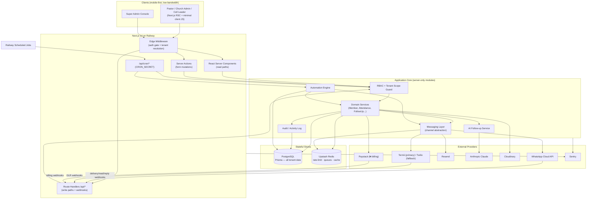
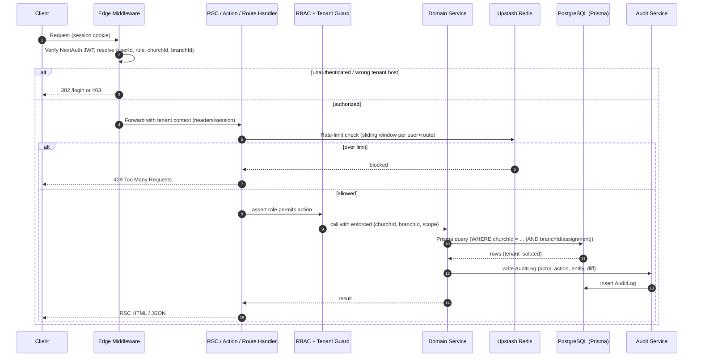
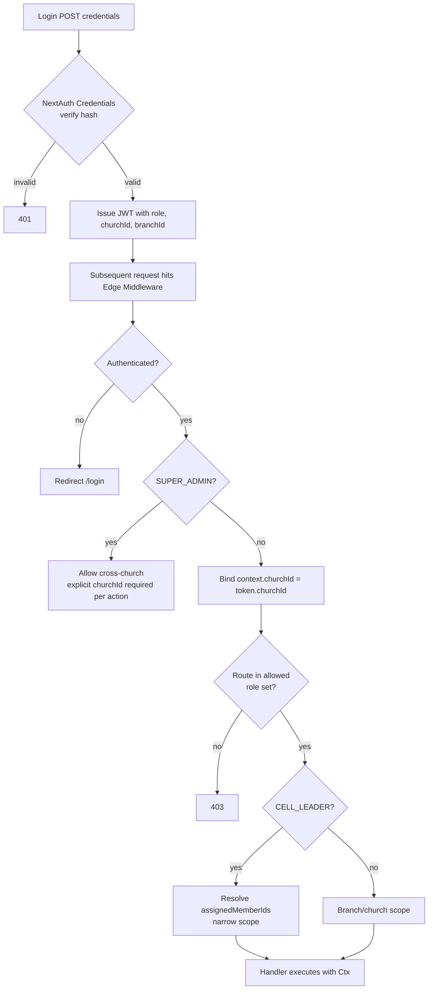
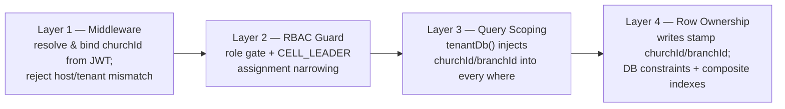
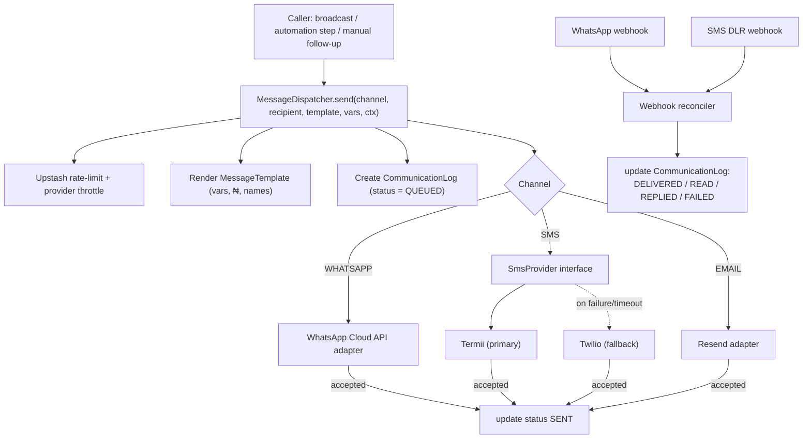
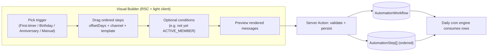
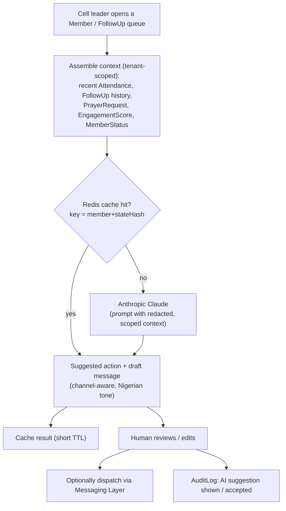
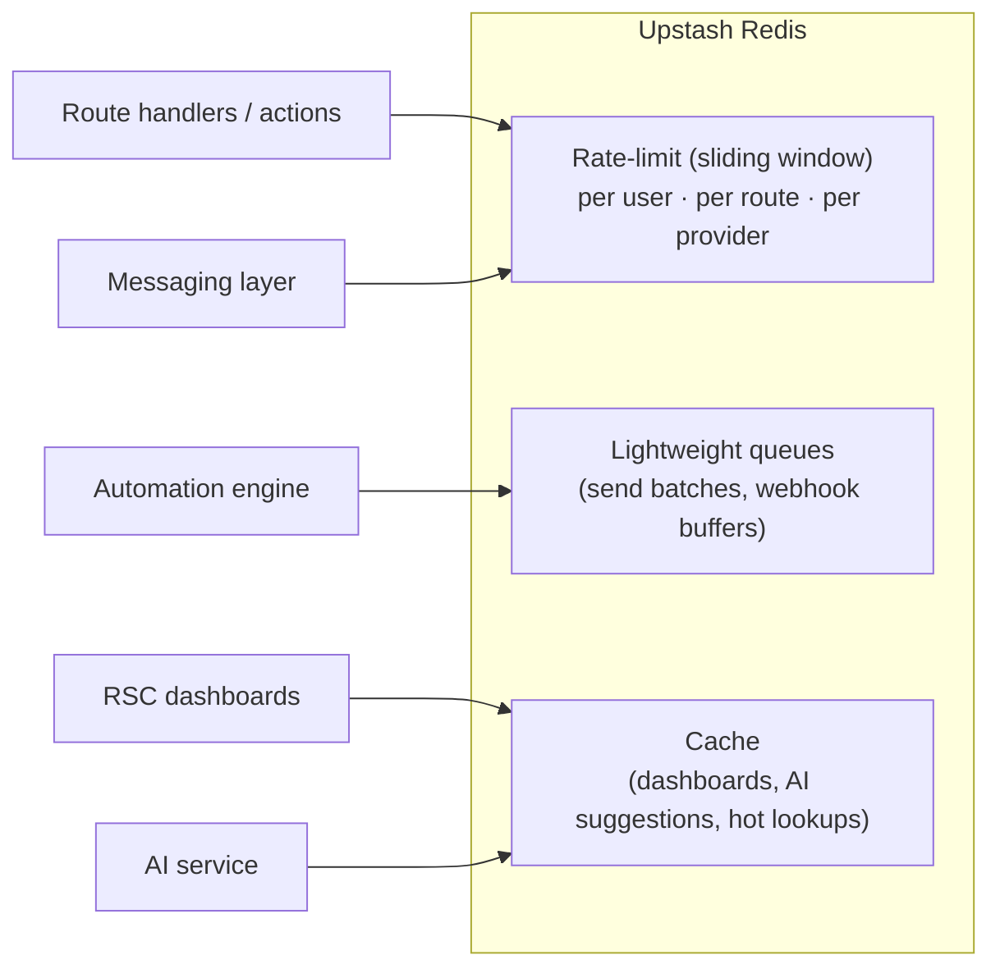
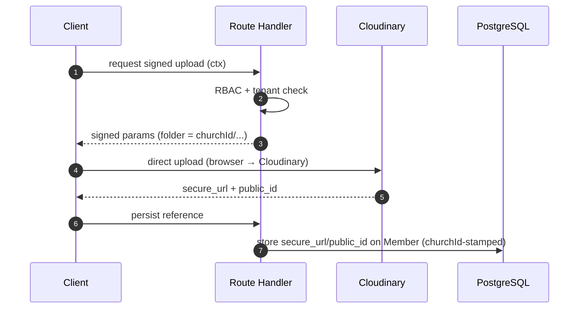
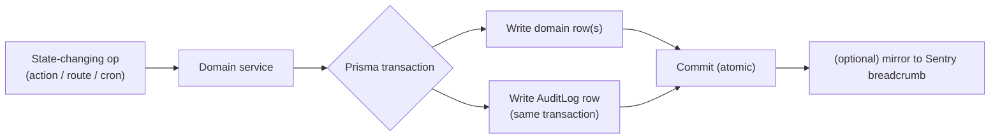

# 1. System Architecture

Church Connect CRM is a single, vertically-integrated **Next.js 14 (App Router)** application backed by **PostgreSQL via Prisma 5**, deployed on **Railway**. Every domain capability — member management, attendance, follow-ups, multi-channel messaging, automation, AI suggestions, and SaaS billing — lives behind one deployable surface. This section defines the component topology, the request lifecycle, how authentication and multi-tenancy are enforced at every layer, and the internal subsystems (messaging, automation/cron, AI, caching, media, observability, audit).

---

## 1.1 High-Level Component Diagram



---

## 1.2 Why a Single Next.js App (Not a Separate Backend)

The stack is **locked** to one Next.js 14 app rather than a split SPA + standalone API service. The rationale:

| Concern | Single Next.js app | Separate frontend + backend |
| --- | --- | --- |
| **Operational cost** | One Railway service, one deploy, one log stream — critical for a lean Nigerian-first SaaS. | 2+ services, cross-service auth, CORS, duplicated deploy pipeline. |
| **Type safety** | Shared TypeScript types from Prisma flow end-to-end; Server Actions remove the hand-written client/server contract. | Requires a generated API client / tRPC bridge to stay in sync. |
| **Tenant enforcement** | One middleware + one Prisma layer means a *single* place to guarantee `churchId` scoping. | Tenant rules must be re-implemented and re-audited in two codebases. |
| **Latency / data cost** | RSC streams server-rendered HTML; less client JS over expensive mobile data. | SPA ships large JS bundles + extra round-trips. |
| **Portability** | Mirrors the existing SPEEDFI codebase patterns, so engineers move freely between products. | Divergent architecture, higher onboarding cost. |

App Router maps cleanly onto our read/write split:

- **React Server Components (RSC)** handle read paths — dashboards, member lists, follow-up queues — querying Prisma directly on the server with tenant scope already applied. No client-side data fetching for the common case.
- **Server Actions** handle form mutations (register a `FirstTimer`, log `Attendance`, file a `FollowUp`).
- **Route Handlers (`/api/*`)** handle anything that must be a real HTTP endpoint: provider **webhooks** (WhatsApp, Termii/Twilio, Paystack), **cron** entrypoints, file-signing, and any third-party integration callback.

---

## 1.3 Request Lifecycle



Key invariant: **no domain service is ever called without a resolved tenant context.** Services accept a typed `Ctx { userId, role, churchId, branchId, assignedMemberIds? }` and every Prisma call derives its `where` clause from `Ctx`. There is no code path that queries a domain table without `churchId`.

---

## 1.4 Authentication & RBAC (NextAuth Credentials)

Authentication uses **NextAuth with the Credentials provider + Prisma adapter**, issuing a JWT session. The JWT carries the minimal identity needed to scope every downstream call.

### 1.4.1 Session token claims

```jsonc
{
  "sub": "user_…",
  "role": "PASTOR",          // UserRole enum
  "churchId": "church_…",    // tenant root — always present except SUPER_ADMIN
  "branchId": "branch_…",    // default/home branch; null = church-wide
  "name": "…",
  "email": "…"
}
```

### 1.4.2 Role matrix

| Capability | SUPER_ADMIN | PASTOR | CHURCH_ADMIN | CELL_LEADER |
| --- | --- | --- | --- | --- |
| Cross-church access | ✅ | — | — | — |
| Church-wide read | — | ✅ | ✅ (own church) | — |
| Register Member / FirstTimer | — | ✅ | ✅ | — |
| Attendance entry | — | ✅ | ✅ | ✅ (own cell) |
| Broadcast comms | — | ✅ | ✅ | — |
| Assign members to cell leaders | — | ✅ | ✅ | — |
| FollowUp / PrayerRequest / visit & call reports | — | ✅ | ✅ | ✅ (assigned only) |
| Manage Plan / Subscription / SaaS config | ✅ | — | — | — |

`CELL_LEADER` is the tightest scope: limited not just to a `churchId`/`branchId` but to the **set of `Member`s assigned to them** via `Assignment`. The guard resolves `assignedMemberIds` for cell leaders and intersects every query with it.

### 1.4.3 Auth + tenant flow



Middleware runs on the **Edge** for the auth gate and tenant resolution; fine-grained, data-dependent checks (e.g. "is this member actually assigned to this leader?") run in the Node runtime inside the guard, because they require a DB lookup.

---

## 1.5 Multi-Tenancy & Multi-Branch Enforcement (Defense in Depth)

Tenancy is enforced at **four independent layers** so that a bug in any one layer does not leak data across churches.



**Layer 1 — Middleware.** `churchId` comes only from the verified JWT, never from a client-supplied body/param. A request that targets a resource in another church is rejected before reaching a handler.

**Layer 2 — RBAC guard.** Confirms the role may perform the action, and for `CELL_LEADER` narrows scope to `assignedMemberIds`.

**Layer 3 — Query scoping (the workhorse).** All reads go through a **tenant-bound Prisma client** so the `churchId` filter cannot be forgotten:

```ts
// src/lib/db/tenant.ts
export function tenantDb(ctx: Ctx) {
  return prisma.$extends({
    query: {
      $allModels: {
        async $allOperations({ model, operation, args, query }) {
          if (TENANT_SCOPED_MODELS.has(model)) {
            if (operation.startsWith("find") || operation === "count" ||
                operation.startsWith("update") || operation.startsWith("delete")) {
              args.where = { ...args.where, churchId: ctx.churchId };
              if (ctx.branchScoped) args.where.branchId = ctx.branchId;
            }
            if (operation === "create") {
              args.data = { ...args.data, churchId: ctx.churchId };
            }
          }
          return query(args);
        },
      },
    },
  });
}
```

This guarantees every `Member`, `FirstTimer`, `Attendance`, `FollowUp`, `PrayerRequest`, `CommunicationLog`, etc. query is filtered by `churchId` automatically. Branch scoping is applied where the entity is branch-owned and the actor is not church-wide.

**Layer 4 — Row ownership & DB constraints.** Every domain table physically stores `churchId` (and `branchId` where applicable). Composite indexes (`@@index([churchId, branchId, status])`, `@@unique([churchId, …natural key])`) make tenant-scoped queries fast and prevent cross-tenant uniqueness collisions. Foreign keys are validated to belong to the same `churchId` on write (e.g. a `FollowUp.memberId` must reference a `Member` in the same church).

**Church → Branch hierarchy.** `Church` is the tenant root; a `Church` has many `Branch`es. A `PASTOR`/`CHURCH_ADMIN` may operate church-wide (all branches) or be pinned to a branch; a `CELL_LEADER` is always branch- and assignment-scoped. Reports and dashboards aggregate per branch and roll up to church level.

---

## 1.6 Messaging Layer (WhatsApp + SMS + Email)

A single **channel-abstraction** module fronts all outbound communication. Callers (broadcasts, automation steps, manual follow-ups) request a send by `Channel`; the layer selects the provider, renders the `MessageTemplate`, enforces rate limits, persists a `CommunicationLog`, and reconciles delivery via webhooks.



- **`MessageStatus` lifecycle:** `QUEUED → SENT → DELIVERED → READ → REPLIED`, with `FAILED` reachable from any pre-delivery state. Every transition updates the `CommunicationLog` row (one row per send, tenant-stamped).
- **Provider abstraction:** SMS is fronted by an `SmsProvider` interface with **Termii as primary and Twilio as fallback** — on send failure or timeout the dispatcher retries via the alternate provider and records which provider was used.
- **WhatsApp Cloud API:** template (HSM) messages for proactive sends within policy; free-form replies only inside the 24-hour customer-service window opened by an inbound message. Inbound replies flip `CommunicationLog` to `REPLIED` and can trigger automation.
- **Resend:** transactional + bulk email; bounces/complaints feed back into the reconciler.
- **Webhooks** (`/api/webhooks/whatsapp`, `/api/webhooks/sms`) are signature-verified Route Handlers; they are the only ingress that reconciles delivery state.
- **Data-cost awareness:** message bodies are kept lean; WhatsApp is preferred for rich content, SMS reserved for short critical notices, matching low-bandwidth Nigerian context.

---

## 1.7 Automation / Cron Engine

The automation engine drives the **first-timer journey** and recurring jobs (birthdays, anniversaries). It is a **data-driven workflow runner**: workflows and steps are rows, not code.

### 1.7.1 Data model

- **`AutomationWorkflow`** — a named, tenant-scoped journey (e.g. "First-Timer 30-Day Journey"), with a trigger (`FIRST_TIMER_REGISTERED`, `BIRTHDAY`, `ANNIVERSARY`, manual).
- **`AutomationStep`** — ordered steps belonging to a workflow: `{ order, offsetDays, channel, templateId, createsFollowUp?, followUpType? }`.
- **`AutomationEnrollment`** — one row per person enrolled, tracking `currentStep`, `nextRunAt`, `status`, and the person reference (nullable `memberId` or `firstTimerId`, exactly one set).

### 1.7.2 Default first-timer cadence

| Offset | Step | Channel(s) | Template |
| --- | --- | --- | --- |
| Day 0 | Welcome | WhatsApp + SMS | Welcome |
| Day 2 | Follow-up | WhatsApp | Day-2 check |
| Day 7 | Check-in | WhatsApp | Week-1 check-in |
| Day 14 | Next-service invite | WhatsApp + SMS | Invite |
| Day 30 | Membership invite | WhatsApp | Membership |

### 1.7.3 Daily cron execution

```mermaid
sequenceDiagram
    autonumber
    participant RC as Railway Scheduled Job
    participant EP as /api/cron/automation-advance
    participant E as Automation Engine
    participant DB as PostgreSQL
    participant M as Messaging Layer

    RC->>EP: POST (Authorization: CRON_SECRET)
    EP->>EP: verify CRON_SECRET (else 401)
    EP->>E: run due enrollments
    E->>DB: SELECT enrollments WHERE nextRunAt <= now AND status = ACTIVE
    loop each due enrollment (tenant-scoped, batched)
        E->>DB: load current AutomationStep
        E->>E: evaluate step condition
        alt condition passes
            E->>M: send(step.channel, person, step.template)
            M-->>E: CommunicationLog id
        end
        E->>DB: advance currentStep; set next nextRunAt
        alt no more steps
            E->>DB: enrollment.status = COMPLETED
        end
        E->>DB: write AuditLog (automation advance)
    end
    EP-->>RC: 200 {processed, sent, completed}
```

- **Triggers:** registering a `FirstTimer` creates an `AutomationEnrollment`; the **first-timer → member conversion** rule (marked present at a 2nd `Service` of type `SUNDAY`/`MIDWEEK`) promotes `MemberStatus` and may complete or switch the enrollment.
- **Idempotency:** each step send is keyed by `(enrollmentId, currentStep)` so a re-run never double-sends. `nextRunAt` advances only after a successful dispatch (or a recorded skip).
- **Separate cron entrypoints:** `/api/cron/automation-advance` (enrollment advance), `/api/cron/birthdays`, `/api/cron/anniversaries`, `/api/cron/engagement-recalc` (recompute `EngagementScore`). All guarded by `CRON_SECRET`. The full cron route catalog is enumerated in §4.19 and the file map in §10.2.
- **Resilience:** processing is batched and chunked; a failed send marks `CommunicationLog` `FAILED` and leaves the enrollment retryable rather than blocking the batch.

### 1.7.4 Low-Code Automation Builder

Non-developers (a `PASTOR` or `CHURCH_ADMIN`) compose workflows visually; the builder writes `AutomationWorkflow` + ordered `AutomationStep` rows. No deploy is required to change a journey.



- The builder only exposes **safe, validated primitives**: choose from existing `MessageTemplate`s, pick `Channel`, set `offsetDays`, add whitelisted conditions on `MemberStatus`/attendance. It never lets a user inject code.
- Templates support variable interpolation (member first name, branch, next service date, ₦ amounts) with strict allow-listing.
- Edits version the workflow; **in-flight `AutomationEnrollment`s continue on the version they started**, so changing a journey never corrupts people mid-cadence.

---

## 1.8 AI Follow-up Suggestion Service (Claude)

The AI service produces **draft follow-up suggestions** for cell leaders and admins — never auto-sent. It is read-augmented and tenant-isolated.



- **Inputs are strictly tenant-scoped** and PII-minimised before leaving the system — only the data needed to suggest a next step (no cross-church data ever enters a prompt).
- **Outputs:** a recommended `FollowUpType` (CALL / WHATSAPP / HOME_VISIT / PRAYER), priority, and a draft message body the human can edit.
- **Human-in-the-loop:** suggestions are advisory; sending always routes through the messaging layer with normal rate-limits and logging.
- **Cost/latency control:** identical member-state requests are cached in Upstash (short TTL); engagement recompute is batched in cron rather than per-request.

---

## 1.9 Caching & Rate-Limiting (Upstash Redis)



- **Rate-limiting:** sliding-window limiters protect auth, write endpoints, broadcast sends, and webhook ingress; provider-specific throttles respect WhatsApp/Termii/Twilio quotas. Over-limit returns `429`.
- **Queues:** outbound message batches and webhook bursts are buffered so a spike (e.g. a Sunday broadcast to thousands) is drained at provider-safe rates.
- **Caching:** expensive aggregates (branch dashboards, `EngagementScore` rollups) and AI suggestions are cached with short, tenant-namespaced keys (`{churchId}:…`) so cache entries are never shared across tenants.

---

## 1.10 File & Media (Cloudinary)

Member/first-timer photos and any uploaded media go to **Cloudinary**, never the app server's disk.



- Uploads are **signed server-side**; assets are foldered per `churchId` for isolation and easy lifecycle management.
- Direct browser→Cloudinary upload keeps large payloads off the Next.js server and serves transformed, bandwidth-optimised images (small thumbnails for mobile) back to clients.

---

## 1.11 Observability (Sentry)

- **Error + performance monitoring** is wired into both the Edge/middleware and Node runtimes and around all external calls (providers, Claude, Paystack).
- Every captured event is tagged with `churchId`, `branchId`, `role`, and `route` so issues can be triaged per tenant without exposing PII.
- Webhook handlers, cron jobs, and the messaging layer report failures with provider + correlation IDs, enabling end-to-end tracing of a single message from dispatch to delivery webhook.

---

## 1.12 Activity Log / Audit Trail

Every state-changing action writes an **`AuditLog`** row. This is the system of record for "who did what, to whom, when" — essential for multi-user churches and SaaS accountability.

### 1.12.1 `AuditLog` shape

| Field | Meaning |
| --- | --- |
| `id` | PK |
| `churchId` | tenant root (nullable only for platform-level `SUPER_ADMIN` actions) |
| `userId` | who performed the action (null for system/cron) |
| `action` | `AuditAction` enum: `CREATE`, `UPDATE`, `DELETE`, `LOGIN`, `LOGOUT`, `EXPORT`, `ASSIGN`, `BROADCAST`, `PROMOTE` |
| `entity` | e.g. `Member`, `FirstTimer`, `FollowUp`, `CommunicationLog` |
| `entityId` | affected row |
| `description` | human-readable summary (e.g. "Promoted FIRST_TIMER → NEW_MEMBER") |
| `metadata` | JSON diff / before-after snapshot, including user-agent (PII-minimised) |
| `ipAddress` | request origin |
| `createdAt` | timestamp |

> The `branchId` and `actorRole` fields are intentionally **not** stored on `AuditLog`; branch and acting-role context are captured in `metadata` when relevant. The canonical column set is defined by the `AuditLog` model in the Prisma schema (§2).

### 1.12.2 How it is captured



- Audit writes happen **inside the same Prisma transaction** as the mutation, so a successful change always has a corresponding audit record and a rollback discards both.
- System actors (cron/automation) are recorded with `userId = null` and a `"system"` marker in `metadata` so automated changes (e.g. a `PROMOTE` action via conversion, an automation advance recorded as `UPDATE`) are still attributable.
- Audit logs are **read-only** to all roles below `SUPER_ADMIN`; a `PASTOR`/`CHURCH_ADMIN` can view their own church's trail, scoped by `churchId` like every other table.

---

## 1.13 Architecture Summary

| Layer | Technology | Tenant enforcement |
| --- | --- | --- |
| Edge gate | Next.js Middleware + NextAuth JWT | resolve & bind `churchId`/`branchId` |
| Authorization | RBAC guard | role matrix + `CELL_LEADER` assignment narrowing |
| Read paths | React Server Components | `tenantDb()` scoped Prisma |
| Write paths | Server Actions + `/api/*` | scoped Prisma + audit-in-transaction |
| Messaging | WhatsApp Cloud API · Termii/Twilio · Resend | `CommunicationLog` stamped `churchId` |
| Automation | Workflow engine + Railway cron (`CRON_SECRET`) | enrollments + steps tenant-scoped |
| AI | Anthropic Claude | PII-minimised, per-tenant context only |
| Cache / limits / queues | Upstash Redis | tenant-namespaced keys |
| Media | Cloudinary | per-`churchId` folders, signed uploads |
| Observability | Sentry | events tagged with tenant context |
| Audit | `AuditLog` | written atomically with every mutation |

The result is a single, portable Next.js application where **multi-tenancy and multi-branch isolation are enforced redundantly at the middleware, authorization, query, and row layers**, while messaging, automation, and AI are cleanly factored subsystems that all share the same tenant-scoped core.
