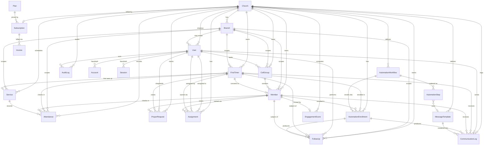

# 2. Database Schema (Prisma) + 3. ER Diagram

## 2.1 Overview

The data model is a **single PostgreSQL database, single Prisma schema**, multi-tenant by row. The tenant root is **`Church`**: every domain table carries `churchId`, and most operational tables additionally carry `branchId` to scope data to a specific congregation/campus. All application queries MUST filter by `churchId` (and where relevant `branchId`) — there is no shared-schema escape hatch except for the `SUPER_ADMIN` platform role and the billing tables.

Conventions used throughout:

- **IDs**: `cuid()` string primary keys (URL-safe, collision-resistant, portable — mirrors SPEEDFI).
- **Timestamps**: every table has `createdAt @default(now())` and `updatedAt @updatedAt`.
- **Soft delete**: high-value people/records (`Member`, `FirstTimer`, `User`, `CellGroup`) use a nullable `deletedAt`; hard deletes are reserved for logs and join records.
- **Phone numbers**: stored E.164 (`+234...`).
- **Money**: stored in **kobo** (`Int`) to avoid float drift; ₦ amounts are `amount / 100`.
- **Tenant compound indexes**: every frequently-queried table is indexed on `[churchId, ...]` (and `[churchId, branchId, ...]`) so the tenant filter is always index-backed.

---

## 2.2 `schema.prisma`

```prisma
// ─────────────────────────────────────────────────────────────
// Church Connect CRM — Prisma schema
// PostgreSQL · Prisma 5 · multi-tenant (tenant root = Church)
// ─────────────────────────────────────────────────────────────

generator client {
  provider        = "prisma-client-js"
  previewFeatures = ["fullTextSearch"]
}

datasource db {
  provider = "postgresql"
  url      = env("DATABASE_URL")
}

// ═══════════════════════════════════════════════════════════════
// ENUMS
// ═══════════════════════════════════════════════════════════════

enum UserRole {
  SUPER_ADMIN
  PASTOR
  CHURCH_ADMIN
  CELL_LEADER
}

enum MemberStatus {
  FIRST_TIMER
  NEW_CONVERT
  NEW_MEMBER
  ACTIVE_MEMBER
  INACTIVE_MEMBER
}

enum Gender {
  MALE
  FEMALE
}

enum MaritalStatus {
  SINGLE
  MARRIED
  DIVORCED
  WIDOWED
}

enum FollowUpType {
  CALL
  WHATSAPP
  HOME_VISIT
  PRAYER
}

enum FollowUpStatus {
  PENDING
  IN_PROGRESS
  COMPLETED
  CANCELLED
}

enum FollowUpOutcome {
  CONTACTED
  NOT_CONTACTED
  INTERESTED
  NEEDS_PRAYER
  NEEDS_VISIT
}

enum PrayerStatus {
  OPEN
  PRAYING
  ANSWERED
  CLOSED
}

enum Channel {
  WHATSAPP
  SMS
  EMAIL
}

enum MessageStatus {
  QUEUED
  SENT
  DELIVERED
  READ
  REPLIED
  FAILED
}

enum MessageDirection {
  OUTBOUND
  INBOUND
}

enum ServiceType {
  SUNDAY
  MIDWEEK
  SPECIAL
  CELL_MEETING
}

enum AttendanceMethod {
  MANUAL
  QR
  SELF_CHECKIN
  BULK
}

enum EnrollmentStatus {
  ACTIVE
  COMPLETED
  CANCELLED
  PAUSED
}

enum WorkflowTrigger {
  FIRST_TIMER_REGISTERED
  NEW_CONVERT
  MEMBER_INACTIVE
  BIRTHDAY
  ANNIVERSARY
  MANUAL
}

enum SubscriptionStatus {
  TRIALING
  ACTIVE
  PAST_DUE
  CANCELLED
  EXPIRED
}

enum BillingInterval {
  MONTHLY
  YEARLY
}

enum AuditAction {
  CREATE
  UPDATE
  DELETE
  LOGIN
  LOGOUT
  EXPORT
  ASSIGN
  BROADCAST
  PROMOTE
}

// ═══════════════════════════════════════════════════════════════
// TENANT ROOT + ORG STRUCTURE
// ═══════════════════════════════════════════════════════════════

model Church {
  id          String   @id @default(cuid())
  name        String
  slug        String   @unique // tenant subdomain / URL key
  email       String?
  phone       String?  // E.164
  address     String?
  city        String?
  state       String?
  country     String   @default("Nigeria")
  timezone    String   @default("Africa/Lagos")
  logoUrl     String?
  currency    String   @default("NGN")
  // tenant-level messaging credentials (encrypted at app layer)
  waPhoneId   String?  // WhatsApp Cloud API phone number id
  senderId    String?  // SMS sender id (Termii)
  settings    Json     @default("{}")
  isActive    Boolean  @default(true)

  createdAt   DateTime @default(now())
  updatedAt   DateTime @updatedAt
  deletedAt   DateTime?

  branches            Branch[]
  users               User[]
  members             Member[]
  firstTimers         FirstTimer[]
  cellGroups          CellGroup[]
  services            Service[]
  attendances         Attendance[]
  followUps           FollowUp[]
  prayerRequests      PrayerRequest[]
  assignments         Assignment[]
  communicationLogs   CommunicationLog[]
  messageTemplates    MessageTemplate[]
  workflows           AutomationWorkflow[]
  enrollments         AutomationEnrollment[]
  engagementScores    EngagementScore[]
  subscription        Subscription?
  auditLogs           AuditLog[]

  @@index([slug])
  @@index([isActive])
}

model Branch {
  id        String   @id @default(cuid())
  churchId  String
  name      String
  address   String?
  city      String?
  state     String?
  phone     String?
  isMain    Boolean  @default(false)
  isActive  Boolean  @default(true)

  createdAt DateTime @default(now())
  updatedAt DateTime @updatedAt
  deletedAt DateTime?

  church            Church   @relation(fields: [churchId], references: [id], onDelete: Cascade)
  users             User[]
  members           Member[]
  firstTimers       FirstTimer[]
  cellGroups        CellGroup[]
  services          Service[]
  attendances       Attendance[]
  followUps         FollowUp[]
  prayerRequests    PrayerRequest[]
  communicationLogs CommunicationLog[]

  @@unique([churchId, name])
  @@index([churchId])
  @@index([churchId, isActive])
}

// ═══════════════════════════════════════════════════════════════
// AUTH / STAFF (NextAuth credentials + Prisma adapter)
// ═══════════════════════════════════════════════════════════════

model User {
  id             String    @id @default(cuid())
  churchId       String?   // null only for SUPER_ADMIN (platform owner)
  branchId       String?   // optional scoping for CHURCH_ADMIN / CELL_LEADER
  name           String
  email          String
  phone          String?
  passwordHash   String
  role           UserRole  @default(CHURCH_ADMIN)
  avatarUrl      String?
  emailVerified  DateTime?
  isActive       Boolean   @default(true)
  lastLoginAt    DateTime?

  createdAt      DateTime  @default(now())
  updatedAt      DateTime  @updatedAt
  deletedAt      DateTime?

  church           Church?   @relation(fields: [churchId], references: [id], onDelete: Cascade)
  branch           Branch?   @relation(fields: [branchId], references: [id], onDelete: SetNull)

  // NextAuth
  accounts         Account[]
  sessions         Session[]

  // relations as actor
  ledCellGroups    CellGroup[]            @relation("CellLeader")
  assignmentsMade  Assignment[]           @relation("AssignedBy")
  assignmentsOwned Assignment[]           @relation("AssignedTo")
  followUps        FollowUp[]             @relation("FollowUpAssignee")
  prayerRequests   PrayerRequest[]        @relation("PrayerAssignee")
  communications   CommunicationLog[]     @relation("CommSender")
  auditLogs        AuditLog[]

  @@unique([email])
  @@index([churchId])
  @@index([churchId, role])
  @@index([churchId, branchId])
}

// NextAuth adapter tables
model Account {
  id                String  @id @default(cuid())
  userId            String
  type              String
  provider          String
  providerAccountId String
  refresh_token     String? @db.Text
  access_token      String? @db.Text
  expires_at        Int?
  token_type        String?
  scope             String?
  id_token          String? @db.Text
  session_state     String?

  user User @relation(fields: [userId], references: [id], onDelete: Cascade)

  @@unique([provider, providerAccountId])
  @@index([userId])
}

model Session {
  id           String   @id @default(cuid())
  sessionToken String   @unique
  userId       String
  expires      DateTime

  user User @relation(fields: [userId], references: [id], onDelete: Cascade)

  @@index([userId])
}

model VerificationToken {
  identifier String
  token      String   @unique
  expires    DateTime

  @@unique([identifier, token])
}

// ═══════════════════════════════════════════════════════════════
// PEOPLE
// ═══════════════════════════════════════════════════════════════

model Member {
  id             String        @id @default(cuid())
  churchId       String
  branchId       String?
  cellGroupId    String?
  firstName      String
  lastName       String
  phone          String        // E.164
  email          String?
  gender         Gender?
  dateOfBirth    DateTime?
  maritalStatus  MaritalStatus?
  weddingDate    DateTime?     // for anniversary automation
  address        String?
  city           String?
  occupation     String?
  photoUrl       String?
  status         MemberStatus  @default(NEW_MEMBER)
  joinedAt       DateTime      @default(now())
  membershipDate DateTime?     // formal membership confirmation
  notes          String?       @db.Text
  // provenance: if this Member was converted from a FirstTimer
  convertedFromFirstTimerId String? @unique
  isActive       Boolean       @default(true)

  createdAt      DateTime      @default(now())
  updatedAt      DateTime      @updatedAt
  deletedAt      DateTime?

  church            Church             @relation(fields: [churchId], references: [id], onDelete: Cascade)
  branch            Branch?            @relation(fields: [branchId], references: [id], onDelete: SetNull)
  cellGroup         CellGroup?         @relation(fields: [cellGroupId], references: [id], onDelete: SetNull)
  convertedFrom     FirstTimer?        @relation("FirstTimerToMember", fields: [convertedFromFirstTimerId], references: [id])

  attendances       Attendance[]
  followUps         FollowUp[]
  prayerRequests    PrayerRequest[]
  assignments       Assignment[]
  communicationLogs CommunicationLog[]
  enrollments       AutomationEnrollment[]
  engagementScore   EngagementScore?

  @@unique([churchId, phone])
  @@index([churchId])
  @@index([churchId, branchId])
  @@index([churchId, status])
  @@index([churchId, cellGroupId])
  @@index([churchId, dateOfBirth])
}

model FirstTimer {
  id              String       @id @default(cuid())
  churchId        String
  branchId        String?
  firstName       String
  lastName        String
  phone           String       // E.164
  email           String?
  gender          Gender?
  dateOfBirth     DateTime?
  address         String?
  howHeard        String?      // referral / channel
  invitedByName   String?
  prayerRequest   String?      @db.Text
  wantsVisit      Boolean      @default(false)
  firstServiceId  String?      // the service they were first registered at
  visitCount      Int          @default(1)
  status          MemberStatus @default(FIRST_TIMER)
  isConverted     Boolean      @default(false)
  convertedAt     DateTime?

  createdAt       DateTime     @default(now())
  updatedAt       DateTime     @updatedAt
  deletedAt       DateTime?

  church            Church             @relation(fields: [churchId], references: [id], onDelete: Cascade)
  branch            Branch?            @relation(fields: [branchId], references: [id], onDelete: SetNull)
  firstService      Service?           @relation("FirstTimerFirstService", fields: [firstServiceId], references: [id], onDelete: SetNull)

  attendances       Attendance[]
  followUps         FollowUp[]
  prayerRequests    PrayerRequest[]
  assignments       Assignment[]
  communicationLogs CommunicationLog[]
  enrollments       AutomationEnrollment[]
  convertedMember   Member?            @relation("FirstTimerToMember")

  @@unique([churchId, phone])
  @@index([churchId])
  @@index([churchId, branchId])
  @@index([churchId, status])
  @@index([churchId, isConverted])
}

model CellGroup {
  id            String   @id @default(cuid())
  churchId      String
  branchId      String?
  leaderId      String?  // User with CELL_LEADER role
  name          String
  description   String?
  meetingDay    String?  // e.g. "Tuesday"
  meetingTime   String?
  location      String?
  isActive      Boolean  @default(true)

  createdAt     DateTime @default(now())
  updatedAt     DateTime @updatedAt
  deletedAt     DateTime?

  church        Church   @relation(fields: [churchId], references: [id], onDelete: Cascade)
  branch        Branch?  @relation(fields: [branchId], references: [id], onDelete: SetNull)
  leader        User?    @relation("CellLeader", fields: [leaderId], references: [id], onDelete: SetNull)
  members       Member[]

  @@unique([churchId, name])
  @@index([churchId])
  @@index([churchId, branchId])
  @@index([churchId, leaderId])
}

// ═══════════════════════════════════════════════════════════════
// ASSIGNMENTS (cell leader ↔ person ownership for follow-up)
// ═══════════════════════════════════════════════════════════════

model Assignment {
  id            String     @id @default(cuid())
  churchId      String
  assignedToId  String     // User (CELL_LEADER usually)
  assignedById  String     // User who made the assignment
  memberId      String?
  firstTimerId  String?
  reason        String?
  isActive      Boolean    @default(true)

  createdAt     DateTime   @default(now())
  updatedAt     DateTime   @updatedAt

  church        Church      @relation(fields: [churchId], references: [id], onDelete: Cascade)
  assignedTo    User        @relation("AssignedTo", fields: [assignedToId], references: [id], onDelete: Cascade)
  assignedBy    User        @relation("AssignedBy", fields: [assignedById], references: [id], onDelete: Cascade)
  member        Member?     @relation(fields: [memberId], references: [id], onDelete: Cascade)
  firstTimer    FirstTimer? @relation(fields: [firstTimerId], references: [id], onDelete: Cascade)

  @@index([churchId])
  @@index([churchId, assignedToId])
  @@index([memberId])
  @@index([firstTimerId])
}

// ═══════════════════════════════════════════════════════════════
// SERVICES + ATTENDANCE
// ═══════════════════════════════════════════════════════════════

model Service {
  id             String      @id @default(cuid())
  churchId       String
  branchId       String?
  name           String      // "Sunday First Service"
  type           ServiceType @default(SUNDAY)
  date           DateTime
  startTime      String?
  theme          String?
  preacher       String?
  totalAttendees Int         @default(0) // denormalized cache
  totalFirstTimers Int       @default(0)
  totalOffering  Int         @default(0) // kobo, optional
  notes          String?     @db.Text

  createdAt      DateTime    @default(now())
  updatedAt      DateTime    @updatedAt

  church           Church       @relation(fields: [churchId], references: [id], onDelete: Cascade)
  branch           Branch?      @relation(fields: [branchId], references: [id], onDelete: SetNull)
  attendances      Attendance[]
  firstTimersHere  FirstTimer[] @relation("FirstTimerFirstService")

  @@index([churchId])
  @@index([churchId, branchId])
  @@index([churchId, date])
  @@index([churchId, type])
}

model Attendance {
  id            String           @id @default(cuid())
  churchId      String
  branchId      String?
  serviceId     String
  memberId      String?
  firstTimerId  String?
  present       Boolean          @default(true)
  method        AttendanceMethod @default(MANUAL)
  checkedInAt   DateTime         @default(now())

  createdAt     DateTime         @default(now())

  church        Church      @relation(fields: [churchId], references: [id], onDelete: Cascade)
  branch        Branch?     @relation(fields: [branchId], references: [id], onDelete: SetNull)
  service       Service     @relation(fields: [serviceId], references: [id], onDelete: Cascade)
  member        Member?     @relation(fields: [memberId], references: [id], onDelete: Cascade)
  firstTimer    FirstTimer? @relation(fields: [firstTimerId], references: [id], onDelete: Cascade)

  // a person can only be marked once per service
  @@unique([serviceId, memberId])
  @@unique([serviceId, firstTimerId])
  @@index([churchId])
  @@index([churchId, serviceId])
  @@index([memberId])
  @@index([firstTimerId])
}

// ═══════════════════════════════════════════════════════════════
// FOLLOW-UP + PRAYER
// ═══════════════════════════════════════════════════════════════

model FollowUp {
  id            String           @id @default(cuid())
  churchId      String
  branchId      String?
  assignedToId  String           // User performing the follow-up
  memberId      String?
  firstTimerId  String?
  type          FollowUpType
  status        FollowUpStatus   @default(PENDING)
  outcome       FollowUpOutcome?
  dueDate       DateTime?
  completedAt   DateTime?
  notes         String?          @db.Text
  // optional link to the automation step that generated this task
  enrollmentId  String?

  createdAt     DateTime         @default(now())
  updatedAt     DateTime         @updatedAt

  church        Church      @relation(fields: [churchId], references: [id], onDelete: Cascade)
  branch        Branch?     @relation(fields: [branchId], references: [id], onDelete: SetNull)
  assignedTo    User        @relation("FollowUpAssignee", fields: [assignedToId], references: [id], onDelete: Cascade)
  member        Member?     @relation(fields: [memberId], references: [id], onDelete: Cascade)
  firstTimer    FirstTimer? @relation(fields: [firstTimerId], references: [id], onDelete: Cascade)
  enrollment    AutomationEnrollment? @relation(fields: [enrollmentId], references: [id], onDelete: SetNull)

  @@index([churchId])
  @@index([churchId, assignedToId, status])
  @@index([churchId, dueDate])
  @@index([memberId])
  @@index([firstTimerId])
}

model PrayerRequest {
  id            String       @id @default(cuid())
  churchId      String
  branchId      String?
  assignedToId  String?      // User shepherding the request
  memberId      String?
  firstTimerId  String?
  requesterName String?      // free-text if not a tracked person
  request       String       @db.Text
  status        PrayerStatus @default(OPEN)
  isConfidential Boolean     @default(false)
  answeredAt    DateTime?
  answerNote    String?      @db.Text

  createdAt     DateTime     @default(now())
  updatedAt     DateTime     @updatedAt

  church        Church      @relation(fields: [churchId], references: [id], onDelete: Cascade)
  branch        Branch?     @relation(fields: [branchId], references: [id], onDelete: SetNull)
  assignedTo    User?       @relation("PrayerAssignee", fields: [assignedToId], references: [id], onDelete: SetNull)
  member        Member?     @relation(fields: [memberId], references: [id], onDelete: Cascade)
  firstTimer    FirstTimer? @relation(fields: [firstTimerId], references: [id], onDelete: Cascade)

  @@index([churchId])
  @@index([churchId, status])
  @@index([memberId])
  @@index([firstTimerId])
}

// ═══════════════════════════════════════════════════════════════
// COMMUNICATIONS + TEMPLATES
// ═══════════════════════════════════════════════════════════════

model MessageTemplate {
  id          String      @id @default(cuid())
  churchId    String
  name        String
  channel     Channel
  subject     String?     // email only
  body        String      @db.Text // supports {{firstName}} etc.
  category    String?     // welcome / followup / birthday / invite
  isActive    Boolean     @default(true)
  // WhatsApp approved template name, if channel == WHATSAPP
  waTemplateName String?

  createdAt   DateTime    @default(now())
  updatedAt   DateTime    @updatedAt

  church      Church               @relation(fields: [churchId], references: [id], onDelete: Cascade)
  steps       AutomationStep[]
  communications CommunicationLog[]

  @@unique([churchId, name])
  @@index([churchId])
  @@index([churchId, channel])
}

model CommunicationLog {
  id            String           @id @default(cuid())
  churchId      String
  branchId      String?
  senderId      String?          // User who triggered (null = system/automation)
  memberId      String?
  firstTimerId  String?
  templateId    String?
  enrollmentId  String?          // if produced by an automation step
  channel       Channel
  direction     MessageDirection @default(OUTBOUND)
  toAddress     String           // phone (E.164) or email
  subject       String?
  body          String           @db.Text
  status        MessageStatus    @default(QUEUED)
  providerMessageId String?      // Termii / Twilio / WhatsApp / Resend id
  errorMessage  String?
  costKobo      Int?             // metered SMS/WhatsApp cost
  sentAt        DateTime?
  deliveredAt   DateTime?
  readAt        DateTime?
  repliedAt     DateTime?

  createdAt     DateTime         @default(now())
  updatedAt     DateTime         @updatedAt

  church        Church           @relation(fields: [churchId], references: [id], onDelete: Cascade)
  branch        Branch?          @relation(fields: [branchId], references: [id], onDelete: SetNull)
  sender        User?            @relation("CommSender", fields: [senderId], references: [id], onDelete: SetNull)
  member        Member?          @relation(fields: [memberId], references: [id], onDelete: SetNull)
  firstTimer    FirstTimer?      @relation(fields: [firstTimerId], references: [id], onDelete: SetNull)
  template      MessageTemplate? @relation(fields: [templateId], references: [id], onDelete: SetNull)
  enrollment    AutomationEnrollment? @relation(fields: [enrollmentId], references: [id], onDelete: SetNull)

  @@index([churchId])
  @@index([churchId, channel, status])
  @@index([churchId, createdAt])
  @@index([providerMessageId])
  @@index([memberId])
  @@index([firstTimerId])
}

// ═══════════════════════════════════════════════════════════════
// AUTOMATION ENGINE (first-timer journey, birthdays, anniversaries)
// ═══════════════════════════════════════════════════════════════

model AutomationWorkflow {
  id          String          @id @default(cuid())
  churchId    String
  name        String
  description String?
  trigger     WorkflowTrigger @default(FIRST_TIMER_REGISTERED)
  isActive    Boolean         @default(true)

  createdAt   DateTime        @default(now())
  updatedAt   DateTime        @updatedAt

  church      Church                 @relation(fields: [churchId], references: [id], onDelete: Cascade)
  steps       AutomationStep[]
  enrollments AutomationEnrollment[]

  @@unique([churchId, name])
  @@index([churchId])
  @@index([churchId, trigger, isActive])
}

model AutomationStep {
  id            String   @id @default(cuid())
  workflowId    String
  order         Int      // execution order within workflow
  offsetDays    Int      // days after enrollment/trigger (Day0, Day2, Day7, Day14, Day30)
  channel       Channel
  templateId    String?
  // if the step creates a human task instead of a message
  createsFollowUp Boolean @default(false)
  followUpType  FollowUpType?

  createdAt     DateTime @default(now())
  updatedAt     DateTime @updatedAt

  workflow      AutomationWorkflow @relation(fields: [workflowId], references: [id], onDelete: Cascade)
  template      MessageTemplate?   @relation(fields: [templateId], references: [id], onDelete: SetNull)

  @@unique([workflowId, order])
  @@index([workflowId])
}

model AutomationEnrollment {
  id            String           @id @default(cuid())
  churchId      String
  workflowId    String
  memberId      String?
  firstTimerId  String?
  currentStep   Int              @default(0) // index of next step to run
  status        EnrollmentStatus @default(ACTIVE)
  enrolledAt    DateTime         @default(now())
  nextRunAt     DateTime?        // cron picks up enrollments where nextRunAt <= now
  completedAt   DateTime?

  createdAt     DateTime         @default(now())
  updatedAt     DateTime         @updatedAt

  church        Church             @relation(fields: [churchId], references: [id], onDelete: Cascade)
  workflow      AutomationWorkflow @relation(fields: [workflowId], references: [id], onDelete: Cascade)
  member        Member?            @relation(fields: [memberId], references: [id], onDelete: Cascade)
  firstTimer    FirstTimer?        @relation(fields: [firstTimerId], references: [id], onDelete: Cascade)

  communications CommunicationLog[]
  followUps      FollowUp[]

  @@index([churchId])
  @@index([status, nextRunAt]) // cron hot path
  @@index([churchId, workflowId])
  @@index([memberId])
  @@index([firstTimerId])
}

// ═══════════════════════════════════════════════════════════════
// ENGAGEMENT
// ═══════════════════════════════════════════════════════════════

model EngagementScore {
  id              String   @id @default(cuid())
  churchId        String
  memberId        String   @unique
  score           Int      @default(0) // 0-100 composite
  attendanceRate  Float    @default(0) // last-N-services ratio
  lastAttendedAt  DateTime?
  followUpCount   Int      @default(0)
  trend           String?  // "up" | "down" | "flat"
  computedAt      DateTime @default(now())

  createdAt       DateTime @default(now())
  updatedAt       DateTime @updatedAt

  church          Church   @relation(fields: [churchId], references: [id], onDelete: Cascade)
  member          Member   @relation(fields: [memberId], references: [id], onDelete: Cascade)

  @@index([churchId])
  @@index([churchId, score])
}

// ═══════════════════════════════════════════════════════════════
// SAAS BILLING
// ═══════════════════════════════════════════════════════════════

model Plan {
  id               String          @id @default(cuid())
  name             String          @unique // Starter / Growth / Enterprise
  slug             String          @unique
  description      String?
  priceKobo        Int             // ₦ in kobo
  interval         BillingInterval @default(MONTHLY)
  paystackPlanCode String?         // Paystack plan code
  maxBranches      Int             @default(1)
  maxMembers       Int             @default(500)
  maxStaff         Int             @default(5)
  monthlyMessageQuota Int          @default(1000)
  features         Json            @default("[]")
  isActive         Boolean         @default(true)

  createdAt        DateTime        @default(now())
  updatedAt        DateTime        @updatedAt

  subscriptions    Subscription[]

  @@index([isActive])
}

model Subscription {
  id                   String             @id @default(cuid())
  churchId             String             @unique // one active subscription per church
  planId               String
  status               SubscriptionStatus @default(TRIALING)
  paystackCustomerCode String?
  paystackSubCode      String?
  trialEndsAt          DateTime?
  currentPeriodStart   DateTime           @default(now())
  currentPeriodEnd     DateTime?
  cancelAtPeriodEnd    Boolean            @default(false)
  cancelledAt          DateTime?
  // usage counters reset each period
  messagesUsed         Int                @default(0)
  // purchased message credit packs — persist across period rollover (see §13.2)
  topUpBalance         Int                @default(0)

  createdAt            DateTime           @default(now())
  updatedAt            DateTime           @updatedAt

  church               Church             @relation(fields: [churchId], references: [id], onDelete: Cascade)
  plan                 Plan               @relation(fields: [planId], references: [id])
  invoices             Invoice[]

  @@index([planId])
  @@index([status])
}

model Invoice {
  id               String   @id @default(cuid())
  subscriptionId   String
  amountKobo       Int
  status           String   // paid / pending / failed
  paystackRef      String?  @unique
  periodStart      DateTime?
  periodEnd        DateTime?
  paidAt           DateTime?

  createdAt        DateTime @default(now())
  updatedAt        DateTime @updatedAt

  subscription     Subscription @relation(fields: [subscriptionId], references: [id], onDelete: Cascade)

  @@index([subscriptionId])
}

// ═══════════════════════════════════════════════════════════════
// AUDIT
// ═══════════════════════════════════════════════════════════════

model AuditLog {
  id          String      @id @default(cuid())
  churchId    String?     // null for platform-level SUPER_ADMIN actions
  userId      String?
  action      AuditAction
  entity      String      // "Member", "FollowUp", ...
  entityId    String?
  description String?
  metadata    Json?       // before/after diff, IP, user-agent
  ipAddress   String?

  createdAt   DateTime    @default(now())

  church      Church?     @relation(fields: [churchId], references: [id], onDelete: Cascade)
  user        User?       @relation(fields: [userId], references: [id], onDelete: SetNull)

  @@index([churchId])
  @@index([churchId, entity, entityId])
  @@index([churchId, createdAt])
  @@index([userId])
}
```

---

## 2.3 Key Index Strategy

| Concern | Index | Why |
|---|---|---|
| Tenant isolation | `[churchId]` on every domain table | Every query is tenant-scoped; ensures the mandatory filter is index-backed. |
| Branch scoping | `[churchId, branchId]` | Multi-campus churches filter member/attendance/comms by branch. |
| Member lookups | `[churchId, status]`, `[churchId, cellGroupId]` | Dashboards segment by status; cell leaders pull their group. |
| Duplicate prevention | `@@unique([churchId, phone])` on `Member` & `FirstTimer` | Phone is the natural key in the Nigerian context; blocks double-registration per tenant. |
| Attendance idempotency | `@@unique([serviceId, memberId])` / `[serviceId, firstTimerId]` | One check-in per person per service. |
| Cron hot path | `[status, nextRunAt]` on `AutomationEnrollment` | The daily cron scans `status = ACTIVE AND nextRunAt <= now()` — this is the single most performance-critical query. |
| Birthday/anniversary jobs | `[churchId, dateOfBirth]` on `Member` | Daily jobs match month/day for birthday automation; `weddingDate` is filtered in-query. |
| Follow-up worklist | `[churchId, assignedToId, status]`, `[churchId, dueDate]` | Cell-leader "my pending follow-ups" and overdue scans. |
| Message delivery webhooks | `[providerMessageId]` on `CommunicationLog` | Status callbacks (DELIVERED/READ/REPLIED) look up by provider id. |
| Billing | `Subscription.churchId @unique`, `[status]` | One subscription per church; dunning cron scans `PAST_DUE`. |
| Audit | `[churchId, entity, entityId]`, `[churchId, createdAt]` | Per-record history and chronological audit trail. |

## 2.4 Cascade Behavior

- **`Church` is the root**: deleting a `Church` cascades to every tenant-owned table (`onDelete: Cascade`). This is the clean tenant-offboarding path; in practice tenants are **soft-deleted** via `deletedAt` / `isActive = false` and physical deletion is an admin-only operation.
- **`Branch` deletion** sets `branchId = null` (`SetNull`) on people/services rather than deleting them — closing a campus must never destroy member history. Branch-scoped join records inherit deletion through `Church` only.
- **People → dependent records**: deleting a `Member` or `FirstTimer` cascades their `Attendance`, `FollowUp`, `Assignment`, and `AutomationEnrollment` rows (these have no meaning without the person), but `CommunicationLog` and `PrayerRequest` use `SetNull` for the person FK so the **delivery/prayer ledger is preserved** for compliance and analytics.
- **`User` deletion**: actor references (`assignedBy`, `sender`, prayer/follow-up assignees) use `SetNull` so historical records survive staff turnover; the user's own `Assignment` *ownership* rows cascade since an unassigned follow-up queue is meaningless.
- **Automation**: deleting a `Workflow` cascades its `AutomationStep`s and `AutomationEnrollment`s; deleting an `Enrollment` sets `enrollmentId = null` on generated `CommunicationLog`/`FollowUp` (keep the artifacts, drop the link).
- **Billing**: deleting a `Subscription` cascades its `Invoice`s; `Plan` deletion is blocked while subscriptions reference it (default restrict — no `onDelete` override on `Subscription.plan`).
- **FirstTimer → Member conversion** is non-destructive: the `FirstTimer` row is retained (`isConverted = true`, `convertedAt` set) and linked to the new `Member` via `Member.convertedFromFirstTimerId` (1:1), preserving the full pre-membership history.

---

## 3. ER Diagram



### Relationship notes

- **Polymorphic person reference**: `Attendance`, `FollowUp`, `PrayerRequest`, `Assignment`, `CommunicationLog`, and `AutomationEnrollment` each carry **both** a nullable `memberId` and a nullable `firstTimerId` (application invariant: exactly one is set). This keeps the first-timer journey trackable before conversion without a separate person-supertype table, and conversion simply re-points new records to `memberId`.
- **First-timer first-service link** (`FirstTimer.firstServiceId → Service`) records where a guest was first seen, enabling the "second-service present → auto-promote" rule defined in the automation cadence.
- **Engagement** is 1:1 with `Member` (`EngagementScore.memberId @unique`), recomputed by a daily job from attendance and follow-up history.
- **Billing** is 1:1 `Church ↔ Subscription`, many `Subscription ↔ Invoice`, and `Plan` is a global (non-tenant) catalog shared across all churches.
- `Account`, `Session`, and `VerificationToken` are the standard NextAuth Prisma-adapter tables and are intentionally tenant-agnostic (tenancy is resolved through `User.churchId`).
