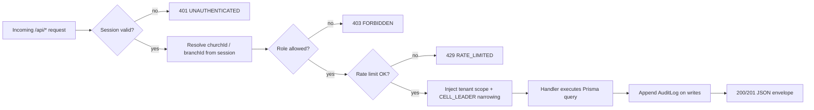
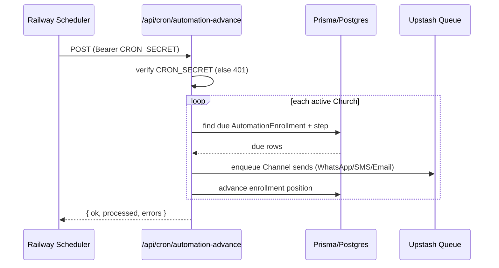

# 4. API Endpoints

This section defines the complete REST API surface of Church Connect CRM, implemented as **Next.js 14 App Router route handlers** under `/app/api/**/route.ts`. Endpoints are grouped by module. Every endpoint returns JSON and follows a uniform envelope, error model, and tenant/auth guard described first, then enumerated module by module.

---

## 4.1 Conventions

### 4.1.1 Standard auth & tenant guard (applies to all `/api/*` except `auth`, `cron`, `webhooks`)

Every domain endpoint is wrapped by a single shared guard, `withTenant(handler, { roles })`, which runs before the handler body:

1. **Authenticate** — resolve the NextAuth session (credentials + Prisma adapter). No session → `401 UNAUTHENTICATED`.
2. **Resolve tenant** — read `churchId` (and active `branchId`, if scoped) from the session. The `churchId` is **never** trusted from the request body or query for write scoping; it is always taken from the session. A `SUPER_ADMIN` may pass an explicit `?churchId=` to operate cross-church.
3. **Authorize role** — if the caller's `UserRole` is not in the endpoint's allowed set → `403 FORBIDDEN`.
4. **Row-level scope** — every Prisma query injects `where: { churchId }` (and `branchId` where applicable). `CELL_LEADER` is further narrowed to rows reachable through their `Assignment`s (only their assigned `Member`/`FirstTimer`).
5. **Audit** — mutating requests append an `AuditLog` row (`userId`, `churchId`, `action`, `entity`, `entityId`, `metadata`).
6. **Rate limit** — Upstash Redis sliding-window limiter keyed by `userId`+route (stricter limits on comms/broadcast routes).



### 4.1.2 Response envelope

```jsonc
// Success
{ "ok": true, "data": { /* resource or list */ }, "meta": { "page": 1, "pageSize": 20, "total": 134 } }
// Error
{ "ok": false, "error": { "code": "VALIDATION", "message": "phone must be E.164", "fields": { "phone": "invalid" } } }
```

### 4.1.3 Cross-cutting rules

- **Validation**: every body/query parsed with Zod; failure → `422 VALIDATION`.
- **Pagination**: list endpoints accept `?page`, `?pageSize` (max 100), `?q` (search), `?sort`. Cursor pagination on high-volume `Attendance`/`CommunicationLog`.
- **Phones**: stored and returned in **E.164** (`+234...`). Money in **kobo** integers, rendered as Naira (₦).
- **Idempotency**: comms-send and billing-webhook routes honour an `Idempotency-Key` header.
- **Status codes**: `200` read/update, `201` create, `204` delete, `401/403/404/409/422/429/500`.

---

## 4.2 Auth — `/api/auth`

NextAuth core lives at `/api/auth/[...nextauth]`; the routes below are app-level helpers around it. These bypass the tenant guard (no session yet) but are rate-limited.

| Method | Path | Roles | Purpose | Shape |
|---|---|---|---|---|
| `GET/POST` | `/api/auth/[...nextauth]` | public | NextAuth handler (credentials sign-in, session, csrf, signout) | NextAuth standard |
| `POST` | `/api/auth/register-church` | public | Self-serve church + first `PASTOR` user signup (creates `Church`, default `Branch`, trial `Subscription`) | req `{ churchName, country, pastorName, email, phone, password }` → `{ churchId, userId }` |
| `POST` | `/api/auth/invite` | SUPER_ADMIN, PASTOR, CHURCH_ADMIN | Invite a staff user (emails a token) | req `{ email, role, branchId? }` → `{ inviteId }` |
| `POST` | `/api/auth/accept-invite` | public (token) | Accept invite, set password, create `User` | req `{ token, name, password }` → `{ userId }` |
| `POST` | `/api/auth/forgot-password` | public | Send reset email (Resend) | req `{ email }` → `204` |
| `POST` | `/api/auth/reset-password` | public (token) | Set new password | req `{ token, password }` → `204` |
| `GET` | `/api/auth/me` | any authed | Current user + church + role + active branch | → `{ user, church, branch, role }` |

---

## 4.3 Churches — `/api/churches`

Tenant root. Non-super-admins operate only on their own church (`:id` must equal session `churchId`).

| Method | Path | Roles | Purpose | Shape |
|---|---|---|---|---|
| `GET` | `/api/churches` | SUPER_ADMIN | List all churches (platform admin) | `?q&page` → `Church[]` |
| `POST` | `/api/churches` | SUPER_ADMIN | Create a church manually | req `{ name, country, timezone, plan }` → `Church` |
| `GET` | `/api/churches/:id` | SUPER_ADMIN, PASTOR, CHURCH_ADMIN | Church profile + counts (branches, members, firstTimers) | → `Church & { stats }` |
| `PATCH` | `/api/churches/:id` | SUPER_ADMIN, PASTOR | Update church profile/branding/settings | req `Partial<Church>` → `Church` |
| `DELETE` | `/api/churches/:id` | SUPER_ADMIN | Soft-delete / suspend a church | `204` |
| `GET` | `/api/churches/:id/settings` | PASTOR, CHURCH_ADMIN | Comms sender IDs, default channels, locale | → `{ settings }` |
| `PATCH` | `/api/churches/:id/settings` | PASTOR | Update messaging defaults & quiet hours | req `{ smsSenderId, whatsappPhoneId, quietHours }` → `{ settings }` |

---

## 4.4 Branches — `/api/branches`

| Method | Path | Roles | Purpose | Shape |
|---|---|---|---|---|
| `GET` | `/api/branches` | PASTOR, CHURCH_ADMIN, CELL_LEADER | List branches in church | → `Branch[]` |
| `POST` | `/api/branches` | PASTOR | Create branch | req `{ name, address, city, state, timezone }` → `Branch` |
| `GET` | `/api/branches/:id` | PASTOR, CHURCH_ADMIN | Branch detail + member/leader counts | → `Branch & { stats }` |
| `PATCH` | `/api/branches/:id` | PASTOR, CHURCH_ADMIN | Update branch | req `Partial<Branch>` → `Branch` |
| `DELETE` | `/api/branches/:id` | PASTOR | Remove branch (blocked if it has members) | `204` / `409` |

---

## 4.5 Members — `/api/members`

`CELL_LEADER` sees only members reachable via their `Assignment`s.

| Method | Path | Roles | Purpose | Shape |
|---|---|---|---|---|
| `GET` | `/api/members` | all (scoped) | List/search members | `?q&status&branchId&cellGroupId&page` → `Member[]` |
| `POST` | `/api/members` | PASTOR, CHURCH_ADMIN | Register a member directly | req `{ fullName, phone, email?, gender?, dob?, address?, status?, branchId }` → `Member` |
| `GET` | `/api/members/:id` | all (scoped) | Member 360: profile, attendance, follow-ups, prayer, engagement | → `Member & { timeline }` |
| `PATCH` | `/api/members/:id` | PASTOR, CHURCH_ADMIN, CELL_LEADER (assigned) | Update member / change `MemberStatus` | req `Partial<Member>` → `Member` |
| `DELETE` | `/api/members/:id` | PASTOR, CHURCH_ADMIN | Soft-delete member | `204` |
| `GET` | `/api/members/:id/engagement` | PASTOR, CHURCH_ADMIN, CELL_LEADER (assigned) | Latest `EngagementScore` + trend | → `{ score, band, history[] }` |
| `POST` | `/api/members/import` | PASTOR, CHURCH_ADMIN | Bulk CSV import (validates E.164, dedupes by phone) | multipart `file` → `{ created, skipped, errors[] }` |
| `GET` | `/api/members/export` | PASTOR, CHURCH_ADMIN | CSV export of filtered set | `?status&branchId` → `text/csv` |

`MemberStatus` transitions accepted: `FIRST_TIMER → NEW_CONVERT → NEW_MEMBER → ACTIVE_MEMBER → INACTIVE_MEMBER` (and reactivation back to `ACTIVE_MEMBER`).

---

## 4.6 First-Timers — `/api/first-timers`

| Method | Path | Roles | Purpose | Shape |
|---|---|---|---|---|
| `GET` | `/api/first-timers` | all (scoped) | List first-timers (default: not yet converted) | `?q&serviceId&converted&page` → `FirstTimer[]` |
| `POST` | `/api/first-timers` | PASTOR, CHURCH_ADMIN | Capture a first-timer (auto-enrolls Day0 automation) | req `{ fullName, phone, email?, gender?, howHeard?, serviceId, branchId, prayerRequest? }` → `FirstTimer` |
| `GET` | `/api/first-timers/:id` | all (scoped) | First-timer detail + journey position | → `FirstTimer & { enrollment, followUps }` |
| `PATCH` | `/api/first-timers/:id` | PASTOR, CHURCH_ADMIN, CELL_LEADER (assigned) | Update details | req `Partial<FirstTimer>` → `FirstTimer` |
| `POST` | `/api/first-timers/:id/convert` | PASTOR, CHURCH_ADMIN | Manually convert to `Member` (preserves history) | req `{ status? }` → `{ memberId }` |
| `POST` | `/api/first-timers/:id/assign` | PASTOR, CHURCH_ADMIN | Assign to a `CELL_LEADER` for follow-up | req `{ userId }` → `Assignment` |

> **Auto-promotion**: marking a first-timer present at a *second* `Service` (via the attendance endpoint) auto-promotes status and creates/converts a `Member` record — see §4.7.

---

## 4.7 Attendance — `/api/attendance`

| Method | Path | Roles | Purpose | Shape |
|---|---|---|---|---|
| `GET` | `/api/attendance` | PASTOR, CHURCH_ADMIN, CELL_LEADER (scoped) | List attendance rows | `?serviceId&branchId&memberId&from&to` (cursor) → `Attendance[]` |
| `POST` | `/api/attendance/checkin` | PASTOR, CHURCH_ADMIN, CELL_LEADER | Check in one member/first-timer (triggers conversion logic) | req `{ serviceId, memberId? , firstTimerId? }` → `Attendance & { promoted?: boolean, memberId? }` |
| `POST` | `/api/attendance/bulk` | PASTOR, CHURCH_ADMIN | Batch check-in (roll-call) | req `{ serviceId, presentMemberIds[], presentFirstTimerIds[] }` → `{ recorded, promoted[] }` |
| `DELETE` | `/api/attendance/:id` | PASTOR, CHURCH_ADMIN | Undo a check-in | `204` |
| `GET` | `/api/attendance/summary` | PASTOR, CHURCH_ADMIN | Counts by `ServiceType`/branch/date | `?from&to&branchId` → `{ totals, byService[] }` |

---

## 4.8 Services / Events — `/api/services`

`Service` = service/event definition (`ServiceType = SUNDAY | MIDWEEK | SPECIAL | CELL_MEETING`).

| Method | Path | Roles | Purpose | Shape |
|---|---|---|---|---|
| `GET` | `/api/services` | all (scoped) | List services/events | `?type&branchId&from&to` → `Service[]` |
| `POST` | `/api/services` | PASTOR, CHURCH_ADMIN | Create a service/event | req `{ name, type, startsAt, branchId, recurring? }` → `Service` |
| `GET` | `/api/services/:id` | all (scoped) | Service detail + attendance count | → `Service & { attendanceCount }` |
| `PATCH` | `/api/services/:id` | PASTOR, CHURCH_ADMIN | Update service | req `Partial<Service>` → `Service` |
| `DELETE` | `/api/services/:id` | PASTOR, CHURCH_ADMIN | Delete service (blocked if attendance exists) | `204` / `409` |

---

## 4.9 Cell Groups — `/api/cell-groups`

| Method | Path | Roles | Purpose | Shape |
|---|---|---|---|---|
| `GET` | `/api/cell-groups` | all (scoped) | List cell groups (CELL_LEADER sees own) | `?branchId&q` → `CellGroup[]` |
| `POST` | `/api/cell-groups` | PASTOR, CHURCH_ADMIN | Create cell group | req `{ name, branchId, leaderUserId?, meetingDay? }` → `CellGroup` |
| `GET` | `/api/cell-groups/:id` | PASTOR, CHURCH_ADMIN, CELL_LEADER (own) | Cell detail + member roster | → `CellGroup & { members[] }` |
| `PATCH` | `/api/cell-groups/:id` | PASTOR, CHURCH_ADMIN | Update / reassign leader | req `Partial<CellGroup>` → `CellGroup` |
| `DELETE` | `/api/cell-groups/:id` | PASTOR, CHURCH_ADMIN | Delete cell group | `204` |
| `POST` | `/api/cell-groups/:id/members` | PASTOR, CHURCH_ADMIN, CELL_LEADER (own) | Add member(s) to cell | req `{ memberIds[] }` → `{ added }` |
| `DELETE` | `/api/cell-groups/:id/members/:memberId` | PASTOR, CHURCH_ADMIN, CELL_LEADER (own) | Remove member from cell | `204` |

---

## 4.10 Assignments — `/api/assignments`

`Assignment` links a `CELL_LEADER` (`User`) to a `Member`/`FirstTimer` for follow-up.

| Method | Path | Roles | Purpose | Shape |
|---|---|---|---|---|
| `GET` | `/api/assignments` | PASTOR, CHURCH_ADMIN, CELL_LEADER (own) | List assignments | `?userId&status&page` → `Assignment[]` |
| `POST` | `/api/assignments` | PASTOR, CHURCH_ADMIN | Assign person(s) to a leader | req `{ userId, memberIds?[], firstTimerIds?[] }` → `Assignment[]` |
| `PATCH` | `/api/assignments/:id` | PASTOR, CHURCH_ADMIN | Reassign / close | req `{ userId?, status? }` → `Assignment` |
| `DELETE` | `/api/assignments/:id` | PASTOR, CHURCH_ADMIN | Remove assignment | `204` |
| `GET` | `/api/assignments/mine` | CELL_LEADER | My assigned people + due follow-ups | → `{ assignments[], dueCount }` |

---

## 4.11 Follow-Ups — `/api/follow-ups`

`FollowUpType = CALL | WHATSAPP | HOME_VISIT | PRAYER`; `FollowUpOutcome = CONTACTED | NOT_CONTACTED | INTERESTED | NEEDS_PRAYER | NEEDS_VISIT`.

| Method | Path | Roles | Purpose | Shape |
|---|---|---|---|---|
| `GET` | `/api/follow-ups` | all (scoped) | List follow-ups (CELL_LEADER: own assignments) | `?memberId&firstTimerId&type&outcome&from&to` → `FollowUp[]` |
| `POST` | `/api/follow-ups` | PASTOR, CHURCH_ADMIN, CELL_LEADER (assigned) | Log a follow-up (call/visit/whatsapp/prayer report) | req `{ memberId?, firstTimerId?, type, outcome, notes?, nextActionAt? }` → `FollowUp` |
| `GET` | `/api/follow-ups/:id` | all (scoped) | Follow-up detail | → `FollowUp` |
| `PATCH` | `/api/follow-ups/:id` | PASTOR, CHURCH_ADMIN, CELL_LEADER (author) | Edit outcome/notes | req `Partial<FollowUp>` → `FollowUp` |
| `DELETE` | `/api/follow-ups/:id` | PASTOR, CHURCH_ADMIN | Delete | `204` |
| `GET` | `/api/follow-ups/due` | PASTOR, CHURCH_ADMIN, CELL_LEADER | Overdue / due-today queue | `?assignee` → `FollowUp[]` |
| `POST` | `/api/follow-ups/suggest` | PASTOR, CHURCH_ADMIN, CELL_LEADER | AI (Claude) suggested next-step message/script for a person | req `{ memberId? , firstTimerId?, type }` → `{ suggestion, draftMessage }` |

---

## 4.12 Prayer Requests — `/api/prayer-requests`

| Method | Path | Roles | Purpose | Shape |
|---|---|---|---|---|
| `GET` | `/api/prayer-requests` | all (scoped) | List prayer requests | `?status&memberId&firstTimerId&page` → `PrayerRequest[]` |
| `POST` | `/api/prayer-requests` | PASTOR, CHURCH_ADMIN, CELL_LEADER (assigned) | Log a prayer request | req `{ memberId?, firstTimerId?, text, isConfidential? }` → `PrayerRequest` |
| `GET` | `/api/prayer-requests/:id` | all (scoped) | Detail | → `PrayerRequest` |
| `PATCH` | `/api/prayer-requests/:id` | PASTOR, CHURCH_ADMIN, CELL_LEADER (author) | Update / mark answered | req `{ status?, answerNote? }` → `PrayerRequest` |
| `DELETE` | `/api/prayer-requests/:id` | PASTOR, CHURCH_ADMIN | Delete | `204` |

---

## 4.13 Communications & Broadcasts — `/api/communications`

Sends are queued via Upstash, dispatched through WhatsApp Cloud API / SMS (Termii→Twilio) / Resend, and tracked in `CommunicationLog` (`Channel`, `MessageStatus`). Stricter rate-limits apply; quiet-hours and per-channel consent enforced.

| Method | Path | Roles | Purpose | Shape |
|---|---|---|---|---|
| `GET` | `/api/communications` | PASTOR, CHURCH_ADMIN | List communication log | `?channel&status&memberId&from&to` (cursor) → `CommunicationLog[]` |
| `GET` | `/api/communications/:id` | PASTOR, CHURCH_ADMIN | Single message + delivery status timeline | → `CommunicationLog` |
| `POST` | `/api/communications/send` | PASTOR, CHURCH_ADMIN, CELL_LEADER (assigned) | Send a one-off message to one person | req `{ memberId?, firstTimerId?, channel, templateId?, body?, variables? }` → `{ logId, status }` |
| `POST` | `/api/communications/broadcast` | PASTOR, CHURCH_ADMIN | Queue a broadcast to a filtered audience | req `{ channel, templateId?, body?, audience: { status?, branchId?, cellGroupId?, tags? }, scheduleAt? }` → `{ broadcastId, recipientCount }` |
| `GET` | `/api/communications/broadcast/:id` | PASTOR, CHURCH_ADMIN | Broadcast progress (sent/delivered/failed) | → `{ broadcast, stats }` |
| `POST` | `/api/communications/broadcast/:id/cancel` | PASTOR, CHURCH_ADMIN | Cancel a scheduled broadcast | `→ { cancelled }` |
| `POST` | `/api/communications/preview` | PASTOR, CHURCH_ADMIN | Render template with sample variables (no send) | req `{ templateId, variables }` → `{ rendered }` |

---

## 4.14 Message Templates — `/api/templates`

| Method | Path | Roles | Purpose | Shape |
|---|---|---|---|---|
| `GET` | `/api/templates` | PASTOR, CHURCH_ADMIN, CELL_LEADER | List templates | `?channel&q` → `MessageTemplate[]` |
| `POST` | `/api/templates` | PASTOR, CHURCH_ADMIN | Create template (with `{{variables}}`) | req `{ name, channel, body, variables[], waTemplateName? }` → `MessageTemplate` |
| `GET` | `/api/templates/:id` | PASTOR, CHURCH_ADMIN, CELL_LEADER | Template detail | → `MessageTemplate` |
| `PATCH` | `/api/templates/:id` | PASTOR, CHURCH_ADMIN | Update template | req `Partial<MessageTemplate>` → `MessageTemplate` |
| `DELETE` | `/api/templates/:id` | PASTOR, CHURCH_ADMIN | Delete template | `204` |

---

## 4.15 Automation — `/api/automation`

`AutomationWorkflow` → ordered `AutomationStep[]` (offset days, `Channel`, template); `AutomationEnrollment` tracks each person's position; advanced daily by cron (§4.19). Default first-timer journey: Day0 welcome (WhatsApp+SMS), Day2 follow-up, Day7 check-in, Day14 next-service invite, Day30 membership invite.

| Method | Path | Roles | Purpose | Shape |
|---|---|---|---|---|
| `GET` | `/api/automation/workflows` | PASTOR, CHURCH_ADMIN | List workflows | `?active` → `AutomationWorkflow[]` |
| `POST` | `/api/automation/workflows` | PASTOR, CHURCH_ADMIN | Create workflow | req `{ name, trigger, isActive, steps: AutomationStep[] }` → `AutomationWorkflow` |
| `GET` | `/api/automation/workflows/:id` | PASTOR, CHURCH_ADMIN | Workflow + steps + enrollment stats | → `AutomationWorkflow & { steps[], stats }` |
| `PATCH` | `/api/automation/workflows/:id` | PASTOR, CHURCH_ADMIN | Update workflow / toggle active | req `Partial<AutomationWorkflow>` → `AutomationWorkflow` |
| `DELETE` | `/api/automation/workflows/:id` | PASTOR, CHURCH_ADMIN | Delete workflow | `204` |
| `PUT` | `/api/automation/workflows/:id/steps` | PASTOR, CHURCH_ADMIN | Replace/reorder steps | req `{ steps: { offsetDays, channel, templateId, order }[] }` → `AutomationStep[]` |
| `GET` | `/api/automation/enrollments` | PASTOR, CHURCH_ADMIN | List enrollments | `?workflowId&status&memberId&firstTimerId` → `AutomationEnrollment[]` |
| `POST` | `/api/automation/enrollments` | PASTOR, CHURCH_ADMIN | Manually enroll a person | req `{ workflowId, memberId?, firstTimerId? }` → `AutomationEnrollment` |
| `POST` | `/api/automation/enrollments/:id/cancel` | PASTOR, CHURCH_ADMIN | Stop an enrollment | `→ { cancelled }` |

---

## 4.16 Reports — `/api/reports`

| Method | Path | Roles | Purpose | Shape |
|---|---|---|---|---|
| `GET` | `/api/reports/attendance` | PASTOR, CHURCH_ADMIN | Attendance trends by service/branch/date | `?from&to&branchId&type` → `{ series[], totals }` |
| `GET` | `/api/reports/growth` | PASTOR, CHURCH_ADMIN | First-timers, conversions, net membership over time | `?from&to&branchId` → `{ firstTimers, conversions, retentionRate }` |
| `GET` | `/api/reports/follow-ups` | PASTOR, CHURCH_ADMIN | Follow-up activity by leader / outcome | `?from&to&userId` → `{ byLeader[], byOutcome[] }` |
| `GET` | `/api/reports/engagement` | PASTOR, CHURCH_ADMIN | Engagement distribution & at-risk (inactive) members | `?branchId` → `{ bands, atRisk[] }` |
| `GET` | `/api/reports/communications` | PASTOR, CHURCH_ADMIN | Delivery rates by `Channel`/`MessageStatus` | `?from&to&channel` → `{ byChannel[], byStatus[] }` |
| `GET` | `/api/reports/cell-groups` | PASTOR, CHURCH_ADMIN | Cell health (size, attendance, follow-up coverage) | `?branchId` → `{ cells[] }` |

---

## 4.17 Dashboard — `/api/dashboard`

Role-aware aggregate for the home screen; one call, mobile/low-bandwidth optimized.

| Method | Path | Roles | Purpose | Shape |
|---|---|---|---|---|
| `GET` | `/api/dashboard` | all (role-scoped) | KPI cards + queues for the current role | → see below |
| `GET` | `/api/dashboard/super-admin` | SUPER_ADMIN | Platform overview (churches, MRR, active subs) | → `{ churches, mrr, activeChurches, signups[] }` |

```jsonc
// GET /api/dashboard (PASTOR / CHURCH_ADMIN)
{ "kpis": { "members": 1240, "firstTimersThisMonth": 38, "attendanceLastService": 612,
            "conversionRate": 0.34, "messagesSent7d": 980 },
  "queues": { "dueFollowUps": 17, "unassignedFirstTimers": 4, "pendingPrayer": 9 },
  "trends": { "attendance": [/* sparkline */], "growth": [/* sparkline */] } }
// GET /api/dashboard (CELL_LEADER) — narrowed to assignments
{ "kpis": { "myMembers": 22, "dueFollowUps": 5, "pendingPrayer": 2 },
  "queues": { "dueToday": [/* assigned people */] } }
```

---

## 4.18 Billing — `/api/billing`

SaaS subscriptions via Paystack. `Subscription` references a `Plan` (Naira pricing).

| Method | Path | Roles | Purpose | Shape |
|---|---|---|---|---|
| `GET` | `/api/billing/plans` | PASTOR, CHURCH_ADMIN, SUPER_ADMIN | List available `Plan`s (₦ pricing) | → `Plan[]` |
| `GET` | `/api/billing/subscription` | PASTOR, CHURCH_ADMIN | Current church subscription + status | → `Subscription & { plan }` |
| `POST` | `/api/billing/checkout` | PASTOR | Start/upgrade subscription (Paystack init) | req `{ planId, interval }` → `{ authorizationUrl, reference }` |
| `POST` | `/api/billing/verify` | PASTOR | Verify a Paystack reference post-redirect | req `{ reference }` → `Subscription` |
| `POST` | `/api/billing/cancel` | PASTOR | Cancel at period end | `→ { cancelAt }` |
| `GET` | `/api/billing/invoices` | PASTOR, CHURCH_ADMIN | List past invoices/charges | `?page` → `Invoice[]` |
| `GET` | `/api/billing/plans/admin` | SUPER_ADMIN | Manage platform plans | → `Plan[]` |
| `POST` | `/api/billing/plans/admin` | SUPER_ADMIN | Create/update a `Plan` | req `Partial<Plan>` → `Plan` |

---

## 4.19 Cron — `/api/cron/*` (protected)

Invoked by **Railway scheduled jobs**. Bypass the session guard; instead require header `Authorization: Bearer ${CRON_SECRET}` (constant-time compare) → else `401`. Each job iterates **all active churches** (tenant loop) and is idempotent (safe to retry). All return `{ ok, processed, errors }`.

| Method | Path | Schedule (suggested) | Purpose |
|---|---|---|---|
| `POST` | `/api/cron/automation-advance` | daily ~05:00 WAT | Advance `AutomationEnrollment`s: find steps whose `offsetDays` are due, queue `Channel` sends, move position. |
| `POST` | `/api/cron/birthdays` | daily ~06:00 WAT | Send birthday messages to members with `dateOfBirth` = today (per church template). |
| `POST` | `/api/cron/anniversaries` | daily ~06:00 WAT | Send membership/wedding anniversary greetings. |
| `POST` | `/api/cron/follow-up-reminders` | daily | Nudge `CELL_LEADER`s about due/overdue `FollowUp`s (in-app notification, not a billable message). |
| `POST` | `/api/cron/engagement-recalc` | nightly | Recompute `EngagementScore` per member (attendance recency/frequency, follow-up, comms response). |
| `POST` | `/api/cron/inactivity-sweep` | daily | Flag members with no attendance in N weeks → `INACTIVE_MEMBER`, surface to dashboard / notify assigned `CELL_LEADER`. |
| `POST` | `/api/cron/message-retry` | hourly | Retry `FAILED` `CommunicationLog` entries (provider fallback / transient errors). |
| `POST` | `/api/cron/broadcast-dispatch` | every 5 min | Drain queued/scheduled broadcasts whose `scheduleAt` has arrived, respecting quiet hours & rate caps. |
| `POST` | `/api/cron/billing-rollover` | daily | Reset `Subscription.messagesUsed` at period rollover; reconcile `currentPeriodEnd` / dunning (see §13.5). |
| `POST` | `/api/cron/db-maintenance` | monthly | (S3) Pre-create next month's table partitions; detach/archive expired partitions (see §9.1.4). |



---

## 4.20 Webhooks — `/api/webhooks/*` (public, signature-verified)

No session; each verifies its provider signature/secret and is idempotent on the provider event id. Updates `CommunicationLog.status` (`MessageStatus`) or `Subscription`.

| Method | Path | Provider | Purpose | Verification |
|---|---|---|---|---|
| `GET` | `/api/webhooks/whatsapp` | WhatsApp Cloud API | Webhook verification handshake (`hub.challenge`) | echo `hub.verify_token` |
| `POST` | `/api/webhooks/whatsapp` | WhatsApp Cloud API | Delivery + read receipts + inbound replies | `X-Hub-Signature-256` (app secret) → updates `MessageStatus` (`SENT/DELIVERED/READ/REPLIED/FAILED`); inbound reply opens/extends 24h window & logs `REPLIED` |
| `POST` | `/api/webhooks/sms/termii` | Termii | SMS delivery reports | shared secret / IP allowlist → `DELIVERED/FAILED` |
| `POST` | `/api/webhooks/sms/twilio` | Twilio (fallback) | SMS status callbacks | `X-Twilio-Signature` → `DELIVERED/FAILED` |
| `POST` | `/api/webhooks/email/resend` | Resend | Email delivery/open/bounce events | `svix` signature → `DELIVERED/READ/FAILED` |
| `POST` | `/api/webhooks/paystack` | Paystack | Billing events (`charge.success`, `subscription.*`, `invoice.*`) | `x-paystack-signature` (HMAC-SHA512) → updates `Subscription`/invoices |

```mermaid
flowchart LR
  WA[WhatsApp Cloud API] -->|status/reply| WH[/api/webhooks/whatsapp]
  TM[Termii] --> SW1[/api/webhooks/sms/termii]
  TW[Twilio] --> SW2[/api/webhooks/sms/twilio]
  RS[Resend] --> EW[/api/webhooks/email/resend]
  WH --> CL[(CommunicationLog.status)]
  SW1 --> CL
  SW2 --> CL
  EW --> CL
  PS[Paystack] --> PW[/api/webhooks/paystack] --> SUB[(Subscription)]
```

---

## 4.21 Error codes (canonical)

| HTTP | `error.code` | When |
|---|---|---|
| 401 | `UNAUTHENTICATED` | No/invalid session (or bad `CRON_SECRET` / webhook signature) |
| 403 | `FORBIDDEN` | Role not allowed, or cross-tenant / out-of-assignment access |
| 404 | `NOT_FOUND` | Resource absent within tenant scope |
| 409 | `CONFLICT` | Duplicate (e.g. phone), or delete blocked by dependents |
| 422 | `VALIDATION` | Zod validation failure (`fields` map included) |
| 429 | `RATE_LIMITED` | Upstash limiter tripped (esp. comms/broadcast) |
| 500 | `INTERNAL` | Unhandled; reported to Sentry with request id |
