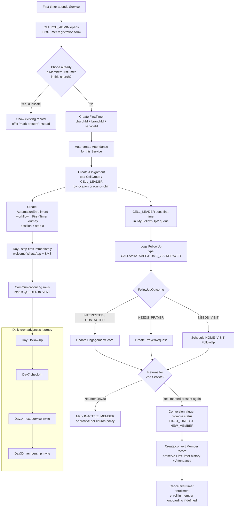
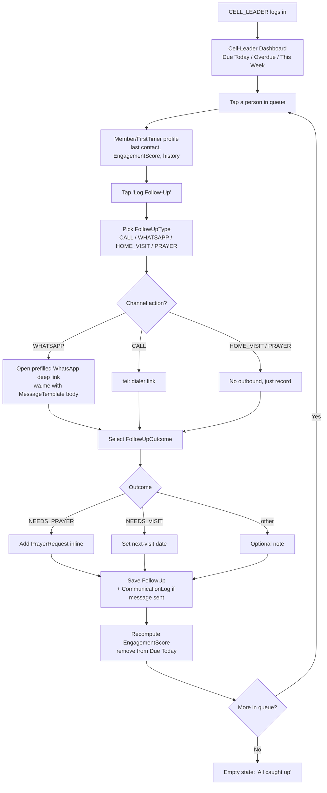
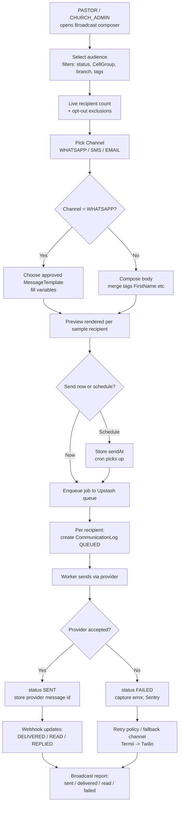
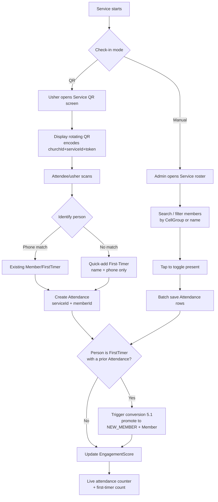
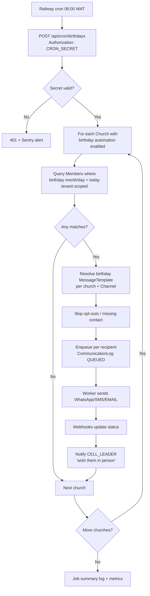

# 5. User Flow Diagrams + 6. UI/UX Wireframes

## 5. User Flow Diagrams

All flows are tenant-scoped: every action carries an implicit `churchId` (and usually `branchId`) derived from the authenticated `User` session. Diagrams below describe the canonical happy paths plus the key branch points a developer must implement.

### 5.1 First-Timer Capture → Auto-Welcome → Follow-Up → Conversion

This is the core acquisition-to-retention loop. A `FirstTimer` is captured at a `Service`, auto-enrolled into the first-timer `AutomationWorkflow`, worked by a `CELL_LEADER` via `FollowUp` records, and promoted to a `Member` on second-service attendance.



Implementation notes:
- **Duplicate guard** keys on `(churchId, normalizedPhoneE164)`. Always normalize to `+234…` before lookup/insert.
- **Conversion trigger** lives in the `Attendance` create path: if the present person is a `FirstTimer` and a prior `Attendance` exists for a different `Service`, run the promotion transaction (status change, `Member` upsert, history link, enrollment swap, `AuditLog`).
- `EngagementScore` is recomputed on every `FollowUp`, `Attendance`, and inbound `CommunicationLog` reply.

### 5.2 Cell-Leader Daily Follow-Up Loop

`CELL_LEADER` sees only members where an `Assignment` ties them to the person (assigned members + their first-timers). This is the highest-frequency screen and must be fast on a cheap Android phone.



Implementation notes:
- The WhatsApp deep link is a **device-side** send (`wa.me`/`whatsapp://`) so a cell leader uses their own number for personal touch; the resulting `CommunicationLog` is marked `Channel=WHATSAPP, status=SENT` on the leader's confirmation (we cannot observe delivery for device sends).
- Queue buckets are computed from `FollowUp.dueDate` and `AutomationEnrollment` due steps for that leader's people.
- Everything writes optimistically with offline-tolerant retry (low-bandwidth context).

### 5.3 Broadcast Send

`PASTOR` and `CHURCH_ADMIN` compose audience-targeted broadcasts. Outbound platform messages (WhatsApp Cloud API, Termii/Twilio SMS, Resend email) go through the queue with per-recipient `CommunicationLog` rows.



Implementation notes:
- **Opt-out / DND** is enforced at recipient expansion, not at send time.
- Rate-limit per provider via Upstash; WhatsApp respects template + 24h session rules.
- SMS uses **Termii primary, Twilio fallback**; a `FAILED` Termii row can re-enqueue on Twilio (configurable).
- Cost guard: show estimated SMS segments × ₦/segment before confirm (data/cost-conscious).

### 5.4 Attendance Check-In (QR + Manual)

Two entry modes for one `Attendance` write path. QR is for self/usher scan at the door; manual is the admin bulk-mark fallback for low-connectivity rooms.



Implementation notes:
- QR token is short-lived and HMAC-signed with `CRON_SECRET`-class server secret; rotation every ~30s prevents screenshot reuse.
- Manual mode must work with **flaky connectivity**: queue toggles locally, batch-flush on save with idempotent `(serviceId, memberId)` upsert.
- Both paths converge on the same conversion check from 5.1.

### 5.5 Birthday Automation

A daily cron job (Railway scheduled → `/api/cron/birthdays` with `CRON_SECRET`) sends birthday/anniversary greetings per church, respecting each church's enabled channels and templates.



Implementation notes:
- The same job (or a sibling) handles **anniversaries** (membership/wedding) — identical shape, different template + date field.
- Idempotency: a per-day dedupe key `(churchId, memberId, 'birthday', date)` prevents double-send if cron retries.
- Cell-leader nudge is an in-app notification, not a billable message.

---

## 6. UI/UX Wireframes

**Design system & conventions (apply to every screen):**
- **Mobile-first**, single-column at <640px; sidebar collapses to a bottom tab bar / hamburger. Tables become stacked cards (mirrors the SPEEDFI mobile card-list pattern).
- Primary touch targets ≥ 44px. Naira shown as `₦`. Phones rendered as `+234…`.
- Persistent **church/branch context** in the top bar (SUPER_ADMIN can switch church; others are pinned).
- Role-gated nav: each role sees only its permitted items.
- Low-bandwidth: skeleton loaders, optimistic writes, no heavy hero images on data screens, Cloudinary thumbnails (small variants) for photos.

Legend for wireframes: `[ Button ]`, `( ) radio`, `[x] checkbox`, `▾ select`, `____ input`, `«…»` placeholder/dynamic.

### 6.1 Admin Dashboard (PASTOR / CHURCH_ADMIN)

Purpose: at-a-glance health of the church + fast access to the day's work.

```
┌─────────────────────────────────────────────┐
│ ☰  Church Connect      «Grace Chapel ▾»  👤  │
├─────────────────────────────────────────────┤
│  Good morning, Pastor «Tunde»                │
│                                              │
│  ┌──────────┐ ┌──────────┐                   │
│  │ Members  │ │First-Tmrs│   (stat cards,    │
│  │  1,248   │ │  this wk │    2-up mobile)   │
│  │ ▲ 3.2%   │ │    37    │                   │
│  └──────────┘ └──────────┘                   │
│  ┌──────────┐ ┌──────────┐                   │
│  │ Attend.  │ │ Follow-  │                   │
│  │ last svc │ │ ups due  │                   │
│  │   612    │ │   54 ⚠   │                   │
│  └──────────┘ └──────────┘                   │
│                                              │
│  Attendance trend (last 8 services)          │
│  ▁▃▅▆▅▇▆█   [ View reports → ]                │
│                                              │
│  Quick actions                               │
│  [ + First-Timer ] [ Mark attendance ]       │
│  [ Broadcast ]     [ Assign follow-ups ]     │
│                                              │
│  Needs attention                             │
│  • 12 first-timers unassigned    [ Assign ]  │
│  • 8 broadcasts scheduled today  [ View ]    │
│  • 3 cell groups no follow-up 7d [ View ]    │
├─────────────────────────────────────────────┤
│ 🏠 Home  👥 Members  ✅ Attend  💬 Comms  ⋯  │
└─────────────────────────────────────────────┘
```

- **Components:** stat cards (value, delta, deep-link), attendance sparkline, quick-action grid, "needs attention" actionable list.
- **Data:** all counts tenant-scoped; deltas vs prior period. PASTOR sees church-wide; CHURCH_ADMIN may be branch-scoped.
- **Mobile:** stats 2-up, quick actions wrap to 2 columns, bottom tab bar replaces sidebar; "needs attention" is the primary scroll target.

### 6.2 First-Timer Registration Form (CHURCH_ADMIN)

Purpose: capture a first-timer in <30s at the welcome desk; minimal required fields.

```
┌─────────────────────────────────────────────┐
│ ←  New First-Timer            «Grace Chapel» │
├─────────────────────────────────────────────┤
│  Service *                                   │
│  ▾ Sunday 1st Service — 8 Jun (SUNDAY)        │
│                                              │
│  Full name *                                 │
│  __________________________________________  │
│                                              │
│  Phone (WhatsApp) *      🟢 valid +234        │
│  +234 ______________                          │
│   ⚠ Already registered? «link to record»      │
│                                              │
│  Gender   ( ) Male  ( ) Female               │
│  Age band ▾ 18–25                             │
│                                              │
│  ▸ More details (optional)                    │
│    Email ____________   Address ___________   │
│    Invited by _______   How did you hear ▾    │
│                                              │
│  Assign to cell group                        │
│  ▾ Auto (nearest by address)                  │
│                                              │
│  [x] Send welcome message now (Day0)         │
│      Channels: [x] WhatsApp  [x] SMS          │
│                                              │
│        [ Save & add another ]                │
│        [ Save first-timer ]   (primary)      │
└─────────────────────────────────────────────┘
```

- **Components:** required `Service` selector (defaults to today's nearest service), name, E.164 phone with **live duplicate check** + validity badge, collapsible optional section, `CellGroup`/`Assignment` selector (auto round-robin or by address), Day0 welcome toggle with channel checkboxes.
- **Behavior:** on save → create `FirstTimer` + `Attendance` + `Assignment` + `AutomationEnrollment`; if welcome toggle on, fire Day0 `CommunicationLog`. "Save & add another" keeps `Service` selection for queue entry.
- **Mobile:** full-width inputs, sticky primary save button, numeric keypad for phone, no optional fields visible until expanded.

### 6.3 Member Profile

Purpose: 360° view of one person; the hub cell leaders and admins act from.

```
┌─────────────────────────────────────────────┐
│ ←  «Chidi Okafor»                      ⋮     │
├─────────────────────────────────────────────┤
│  (◐)  Chidi Okafor                            │
│       NEW_MEMBER · Cell: Lekki-3              │
│       Engagement ████████░░ 78               │
│  [ 📞 Call ] [ 💬 WhatsApp ] [ ✎ Edit ]       │
│                                              │
│  ┌ Contact ───────────────────────────────┐ │
│  │ +234 803 555 0199   moseg@...           │ │
│  │ 12 Admiralty Way, Lekki                 │ │
│  │ Birthday: 14 Aug   Joined: 11 May 2026  │ │
│  └─────────────────────────────────────────┘ │
│                                              │
│  Tabs:  [Timeline] Follow-ups  Attendance    │
│          Prayer  Messages                     │
│                                              │
│  Timeline                                    │
│  • Today    Promoted FIRST_TIMER→NEW_MEMBER  │
│  • 5 Jun    WhatsApp follow-up · CONTACTED   │
│  • 1 Jun    Present · Sunday 1st Service      │
│  • 25 May   Welcome msg sent (Day0)          │
│                                              │
│        [ + Log follow-up ]  (sticky)         │
└─────────────────────────────────────────────┘
```

- **Components:** avatar (Cloudinary thumb), status badge (`MemberStatus`), `EngagementScore` bar, call/WhatsApp quick actions, contact card, tabbed history (Timeline = merged feed of `FollowUp` + `Attendance` + `CommunicationLog` + `PrayerRequest`), sticky "Log follow-up".
- **Data:** tenant + assignment scoped — a `CELL_LEADER` can only open profiles for their assigned people; PASTOR/ADMIN unrestricted within church.
- **Mobile:** tabs become a horizontal scroll chip row; quick-action buttons fixed under the header; timeline is the default tab.

### 6.4 Cell-Leader Dashboard (CELL_LEADER)

Purpose: the daily work queue — who to contact, sorted by urgency. Built for speed on cheap devices.

```
┌─────────────────────────────────────────────┐
│ ☰  My People            «Grace Chapel»   👤  │
├─────────────────────────────────────────────┤
│  Hi «Blessing» — 14 follow-ups today          │
│                                              │
│  [ Due today (14) ] Overdue (3) · Week (22)  │
│                                              │
│  ── Due today ──────────────────────────────  │
│  ┌─────────────────────────────────────────┐ │
│  │ (◐) Chidi Okafor      FIRST_TIMER        │ │
│  │     Day7 check-in · last: 5 Jun          │ │
│  │     [ 💬 WA ] [ 📞 Call ] [ ✓ Log ]       │ │
│  └─────────────────────────────────────────┘ │
│  ┌─────────────────────────────────────────┐ │
│  │ (◐) Ada Eze           NEW_CONVERT  ⚠     │ │
│  │     Needs prayer · last: 2 Jun           │ │
│  │     [ 💬 WA ] [ 📞 Call ] [ ✓ Log ]       │ │
│  └─────────────────────────────────────────┘ │
│  …                                            │
│                                              │
│  My cell: Lekki-3 · 31 members  [ Roster → ] │
├─────────────────────────────────────────────┤
│ 📋 Queue  👥 Cell  🙏 Prayer  📊 Me          │
└─────────────────────────────────────────────┘
```

- **Components:** segmented bucket filter (Due today / Overdue / This week), person cards with reason (which `AutomationStep`/`FollowUp` triggered it), inline WA/Call/Log actions, cell roster link, prayer tab.
- **Data:** strictly the leader's `Assignment` set; buckets from `FollowUp.dueDate` + due `AutomationEnrollment` steps.
- **Mobile:** this is mobile-native by design — card list, large tap targets, one-tap WhatsApp/dialer deep links, bottom tabs. Cards collapse extra meta on narrow screens.

### 6.5 Follow-Up Logging

Purpose: record a contact attempt in 2–3 taps; optionally trigger prayer/visit.

```
┌─────────────────────────────────────────────┐
│ ←  Log follow-up — «Chidi Okafor»            │
├─────────────────────────────────────────────┤
│  Type *                                      │
│  ( ) Call   (•) WhatsApp                      │
│  ( ) Home visit   ( ) Prayer                  │
│                                              │
│  ┌ WhatsApp ─────────────────────────────┐   │
│  │ Template ▾ Day7 check-in               │   │
│  │ "Hi Chidi, just checking in…"          │   │
│  │ [ Open WhatsApp → ] (prefilled wa.me)  │   │
│  └────────────────────────────────────────┘   │
│                                              │
│  Outcome *                                   │
│  ▾ CONTACTED                                  │
│    (CONTACTED · NOT_CONTACTED · INTERESTED ·  │
│     NEEDS_PRAYER · NEEDS_VISIT)               │
│                                              │
│  ── if NEEDS_PRAYER ──                         │
│  Prayer request                              │
│  ______________________________  [+ Prayer]  │
│                                              │
│  ── if NEEDS_VISIT ──                          │
│  Schedule visit  ▾ Sat 14 Jun                 │
│                                              │
│  Note (optional)                             │
│  __________________________________________  │
│                                              │
│           [ Save follow-up ]  (primary)      │
└─────────────────────────────────────────────┘
```

- **Components:** `FollowUpType` radios; channel-specific block (WhatsApp shows `MessageTemplate` picker + `Open WhatsApp` deep link; Call shows `tel:` link); `FollowUpOutcome` select with **conditional sub-forms** (NEEDS_PRAYER → inline `PrayerRequest`; NEEDS_VISIT → next-date picker); optional note.
- **Behavior:** save creates `FollowUp` (+ `CommunicationLog` if a message was sent, + `PrayerRequest` if applicable), recomputes `EngagementScore`, removes person from "Due today".
- **Mobile:** radios as a 2×2 grid, conditional sections expand inline, sticky save button, returns to queue on success.

### 6.6 Broadcast Composer (PASTOR / CHURCH_ADMIN)

Purpose: send a targeted message across `WHATSAPP`/`SMS`/`EMAIL` with cost + reach visibility.

```
┌─────────────────────────────────────────────┐
│ ←  New broadcast              «Grace Chapel» │
├─────────────────────────────────────────────┤
│  1 · Audience                                │
│  Status   [x]Active [x]New conv [ ]Inactive  │
│  Cell      ▾ All cell groups                  │
│  Branch    ▾ Lekki branch                     │
│  Tags      ▾ +add                             │
│  ─────────────────────────────────────────   │
│  Recipients: 842   (−61 opted out)           │
│                                              │
│  2 · Channel                                 │
│  (•) WhatsApp  ( ) SMS  ( ) Email             │
│                                              │
│  3 · Message                                 │
│  Template ▾ Service reminder (approved)        │
│  ┌────────────────────────────────────────┐  │
│  │ Hi {{FirstName}}, join us this Sunday…  │  │
│  └────────────────────────────────────────┘  │
│  Insert: [FirstName] [Branch] [ServiceDate]   │
│  Preview (as Ada Eze)  [ 👁 ]                  │
│                                              │
│  4 · Send                                    │
│  (•) Send now   ( ) Schedule ▾ ____           │
│  Est. cost: WhatsApp 842 msgs  (~₦ —)         │
│                                              │
│        [ Send broadcast ]  (primary)         │
└─────────────────────────────────────────────┘
```

- **Components:** stepped audience filters with **live recipient count + opt-out exclusion**; `Channel` selector (gates UI: WhatsApp forces approved `MessageTemplate`, SMS shows segment/₦ estimate, Email shows subject + body); merge-tag inserter; per-recipient preview; send-now vs schedule.
- **Behavior:** confirm → expand recipients → enqueue → create one `CommunicationLog` (`QUEUED`) per recipient → worker sends → status transitions via webhooks. Scheduled broadcasts wait for cron.
- **Mobile:** steps stack vertically as collapsible accordions; recipient count and primary send button stay visible (sticky footer); cost estimate shown before the irreversible action.

### 6.7 Attendance / QR Check-In

Two surfaces sharing one write path: the **QR display** (usher-facing) and the **manual roster** (admin fallback).

```
QR DISPLAY (usher / kiosk)        MANUAL ROSTER (admin)
┌───────────────────────────┐    ┌───────────────────────────┐
│ ←  Check-in               │    │ ←  Mark attendance         │
│   Sunday 1st Service      │    │   Sunday 1st Service       │
│   8 Jun · SUNDAY          │    │   8 Jun · 612 marked       │
│                           │    │                            │
│      ███ ▄▀ █ ▀▄ ███      │    │ 🔍 Search name/phone___    │
│      █ ▀  QR  ▀ █         │    │ Filter ▾ Cell: Lekki-3     │
│      ███ ▄▀ █ ▀▄ ███      │    │ ─────────────────────────  │
│                           │    │ [x] Chidi Okafor           │
│  Scan to check in         │    │ [x] Ada Eze                │
│  Rotates every 30s ⟳      │    │ [ ] Sola Adams             │
│                           │    │ [x] Grace Bello            │
│  Checked in: 612          │    │ …                          │
│  First-timers: 37         │    │ ─────────────────────────  │
│                           │    │ Selected: 3   Total: 612   │
│  [ Switch to manual ]     │    │ [ + Quick first-timer ]    │
│                           │    │ [ Save attendance ] (prim) │
└───────────────────────────┘    └───────────────────────────┘
```

- **Components (QR):** rotating signed QR (encodes `churchId`+`serviceId`+token), live counters (total + first-timer), switch-to-manual.
- **Components (manual):** search + `CellGroup` filter, toggle list, selected counter, **quick first-timer add** (name + phone only → creates `FirstTimer` + `Attendance`), batch save.
- **Behavior:** both create idempotent `Attendance(serviceId, memberId)`; conversion check (5.1) runs on each; unknown scans route to the quick first-timer form.
- **Mobile:** QR screen is full-bleed for projection/handing the phone over; manual roster is a tap-to-toggle card list that queues offline and batch-flushes on save.

### 6.8 Reports

Purpose: leadership view of growth, attendance, follow-up performance, and conversion.

```
┌─────────────────────────────────────────────┐
│ ☰  Reports              «Grace Chapel ▾»  ⤓  │
├─────────────────────────────────────────────┤
│  Range ▾ Last 90 days   Branch ▾ All          │
│                                              │
│  ┌ Attendance ──────────────────────────┐    │
│  │  ▁▃▅▆▅▇▆█▇█    Avg 598 · ▲ 6%         │    │
│  │  SUNDAY · MIDWEEK · SPECIAL ·CELL_MTG │    │
│  └───────────────────────────────────────┘    │
│                                              │
│  ┌ First-timer funnel ──────────────────┐    │
│  │  Captured     312                     │    │
│  │  Welcomed     298  (95%)              │    │
│  │  Followed-up  241  (77%)              │    │
│  │  2nd visit    156  (50%)              │    │
│  │  Converted    138  (44%) → Member     │    │
│  └───────────────────────────────────────┘    │
│                                              │
│  ┌ Follow-up performance ───────────────┐    │
│  │ Cell leader   Done  Overdue  Conv.%   │    │
│  │ Blessing       142     3       51%    │    │
│  │ Emeka           98    11       33%    │    │
│  │ …                                     │    │
│  └───────────────────────────────────────┘    │
│                                              │
│  ┌ Comms ───────────────────────────────┐    │
│  │ Sent 4,210 · Delivered 96% · Read 61% │    │
│  │ by Channel: WA / SMS / EMAIL          │    │
│  └───────────────────────────────────────┘    │
│                                              │
│  [ Export CSV ]  [ Export PDF ]              │
└─────────────────────────────────────────────┘
```

- **Components:** global range + branch filter; attendance trend by `ServiceType`; **first-timer conversion funnel** (capture → welcome → follow-up → 2nd visit → `Member`); per-cell-leader follow-up performance table (done / overdue / conversion %); comms deliverability by `Channel` and `MessageStatus`; CSV/PDF export.
- **Data:** PASTOR/SUPER_ADMIN see all branches; CHURCH_ADMIN scoped to permitted branch(es). SUPER_ADMIN additionally gets a cross-church/SaaS roll-up (not shown here).
- **Mobile:** cards stack single-column; tables become horizontally scrollable with a sticky first column (leader name); charts shrink to sparkline + headline metric; export moves to an overflow menu.
