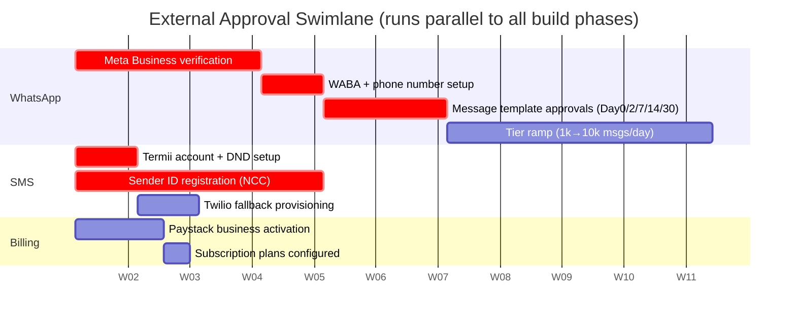
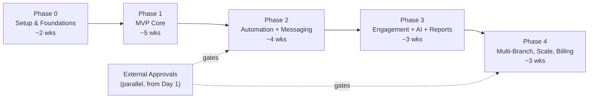

# 7. Development Roadmap + 8. MVP Features

## 7. Development Roadmap

### 7.1 Team & Cadence Assumptions

Durations below assume a small team — 2 full-stack engineers (one acting as tech lead), 1 part-time designer/QA, and the founder as product owner. Estimates are in calendar weeks for that team size; a solo builder should roughly multiply by 1.7×. Each phase has explicit **deliverables** and **exit criteria** — the next phase does not start until exit criteria are met (with the deliberate exception that external-approval workstreams run in parallel from Day 1).

The stack is fixed (see system overview): Next.js 14 App Router, Prisma 5, PostgreSQL, NextAuth (credentials + Prisma adapter, RBAC), WhatsApp Cloud API, SMS via Termii (primary) / Twilio (fallback), Resend (email), Anthropic Claude (AI follow-up suggestions), Upstash Redis (rate-limit + queues), Cloudinary (photos), Paystack (SaaS billing), Sentry, deployed on Railway with cron via Railway scheduled jobs hitting protected `/api/cron/*` routes guarded by `CRON_SECRET`.

### 7.2 The Critical Path: External Approvals (start on Day 1)

The single biggest schedule risk is **not code** — it is third-party approvals that have multi-week, partly-unpredictable lead times and that gate the messaging features that are the product's core value. These must be kicked off during Phase 0 and tracked as their own swimlane, because nothing in our control speeds them up once submitted.

**Why these dominate the plan:**

- **WhatsApp Cloud API / Meta Business verification** — Meta Business Manager verification can take days to weeks, and is occasionally rejected and must be re-submitted. The WhatsApp Business Account (WABA) and phone number must be provisioned, then **every templated message** in the first-timer cadence (Day0 welcome, Day2 follow-up, Day7 check-in, Day14 next-service invite, Day30 membership invite) must be submitted as a `MessageTemplate` and **individually approved** by Meta. New numbers also start at a low messaging tier (e.g. ~1,000 unique recipients/24h) and ramp only with good quality ratings. **Mitigation:** submit business verification on Day 1; draft and submit all template copy by end of Phase 1 so approvals land before Phase 2 needs them; design `CommunicationLog` to record per-template approval state and `MessageStatus` so the app degrades gracefully (auto-fallback to SMS) when a template is pending or a tier cap is hit.
- **SMS Sender IDs (Nigeria)** — Alphanumeric sender ID registration via Termii is subject to NCC/operator approval and DND (Do-Not-Disturb) routing rules; this can take ~2–4 weeks and unregistered IDs may be silently filtered. **Mitigation:** register the sender ID Day 1; use Termii's pre-approved generic route for internal testing; keep Twilio as a provisioned fallback so a single sender-ID rejection doesn't block all SMS.
- **Paystack activation** — Required before any `Subscription`/`Plan` billing can go live, but billing is Phase 4, so this has the most slack.

> Rule: **No build phase blocks on an approval, but Phase 2 (messaging) cannot exit until WhatsApp templates + SMS sender ID are live.** That is the one hard external dependency on the critical path.

### 7.3 Phase Overview

| Phase | Theme | Duration | Hard dependency to enter |
|---|---|---|---|
| 0 | Setup & Foundations | ~2 wks | — |
| 1 | MVP Core (people + attendance + manual follow-up) | ~5 wks | Phase 0 exit |
| 2 | Automation + Messaging | ~4 wks | Phase 1 exit **+ WhatsApp templates & SMS sender ID approved** |
| 3 | Engagement + AI + Reports | ~3 wks | Phase 2 exit |
| 4 | Multi-Branch, Scale, Billing | ~3 wks | Phase 3 exit + Paystack active |

Total to feature-complete v1+: **~17 weeks**. Shippable, paying-customer-ready MVP lands at the **end of Phase 1 (~7 weeks in)** for a single-branch church doing manual follow-up; messaging automation (the headline differentiator) lands end of Phase 2.

---

### 7.4 Phase 0 — Setup & Foundations (~2 weeks)

Goal: a deployable skeleton with multi-tenancy, auth, and CI in place so all later work inherits correct tenant scoping and RBAC.

**Deliverables**
- Repo, Railway project (staging + prod environments), PostgreSQL, Upstash Redis, Sentry, Cloudinary provisioned.
- Prisma schema v1 with **all canonical entities and enums** modelled: `Church`, `Branch`, `User`, `Member`, `FirstTimer`, `CellGroup`, `Assignment`, `Service`, `Attendance`, `FollowUp`, `PrayerRequest`, `CommunicationLog`, `MessageTemplate`, `AutomationWorkflow`, `AutomationStep`, `AutomationEnrollment`, `EngagementScore`, `Subscription`, `Plan`, `AuditLog`. Every domain table carries `churchId`; most also carry `branchId`.
- **Tenant-scoping middleware/utility** (e.g. a Prisma client extension or required `withTenant(churchId)` query helper) so no domain query can run without a tenant filter — enforced at the data-access layer, not by convention.
- NextAuth credentials provider + Prisma adapter; `UserRole` RBAC primitives (`SUPER_ADMIN | PASTOR | CHURCH_ADMIN | CELL_LEADER`) with a route/server-action authorization helper.
- `AuditLog` write path wired into a base mutation wrapper.
- `/api/cron/*` route scaffold protected by `CRON_SECRET`; `/api/health`.
- CI (lint, typecheck, Prisma migrate check) + preview deploys on Railway.
- **External approval swimlane kicked off** (WhatsApp business verification, Termii sender ID, Paystack activation submitted).

**Exit criteria**
- A `SUPER_ADMIN` can create a `Church` + `Branch`; a scoped `PASTOR`/`CHURCH_ADMIN` user can log in and is hard-scoped to that church.
- A cross-tenant read attempt is provably blocked (covered by an automated test).
- Staging deploy is green; Sentry receiving events; cron auth rejects requests without `CRON_SECRET`.

**Riskiest item:** getting tenant scoping wrong here is the most expensive mistake in the project — it is load-bearing for every later query and for the security model. Lock it down and test it before building features on top.

---

### 7.5 Phase 1 — MVP Core (~5 weeks)

Goal: a single-branch church can run its full people + attendance + **manual** follow-up loop end to end. This is the first sellable cut.

**Deliverables**
- **People management:** register and edit `Member` records with `MemberStatus` lifecycle (`FIRST_TIMER → NEW_CONVERT → NEW_MEMBER → ACTIVE_MEMBER → INACTIVE_MEMBER`); register `FirstTimer` (the welcome-desk capture form, mobile-first, fast). Nigerian context: phone numbers stored E.164 (`+234…`), photo upload via Cloudinary, low-bandwidth forms.
- **First-timer → member conversion:** when a `FirstTimer` is marked present at a second `Service`, status auto-promotes and a `Member` record is created (or the `FirstTimer` is converted in place), **preserving history**. This logic ships in the MVP because it is the product's core value loop.
- **Services & attendance:** define `Service` records (`ServiceType = SUNDAY | MIDWEEK | SPECIAL | CELL_MEETING`); mark `Attendance` (fast bulk/check-in UI).
- **Cell groups & assignment:** create `CellGroup`; `CELL_LEADER` accounts; `Assignment` of members/first-timers to leaders. RBAC enforced — a `CELL_LEADER` sees **only assigned people**.
- **Manual follow-up:** `FollowUp` records with `FollowUpType (CALL | WHATSAPP | HOME_VISIT | PRAYER)` and `FollowUpOutcome (CONTACTED | NOT_CONTACTED | INTERESTED | NEEDS_PRAYER | NEEDS_VISIT)`; `PrayerRequest` capture.
- **Role-based dashboards:** `PASTOR` (church-wide read, basic counts), `CHURCH_ADMIN` (registration/attendance/comms), `CELL_LEADER` (my-people task list of due follow-ups).
- Manual single-recipient WhatsApp/SMS *only if* a channel is already approved by this point — otherwise follow-ups are logged manually and outbound messaging is deferred to Phase 2. (No automation yet.)

**Exit criteria**
- A church admin registers a first-timer at Sunday service, the same person is marked present the following week, and the system auto-creates/promotes the `Member` with full history intact.
- A cell leader logs in and sees a follow-up task list scoped to assigned people only — and cannot see other leaders' people.
- All four roles have a working dashboard. End-to-end flow validated on a real church's data with the founder.

**Dependencies:** none external (this is why it's the sellable MVP — it delivers value with zero approval gating). Outbound messaging within Phase 1 is best-effort, gated by approvals.

---

### 7.6 Phase 2 — Automation + Messaging (~4 weeks)

Goal: the first-timer journey runs itself. This is the headline differentiator. **Cannot start until WhatsApp templates and the SMS sender ID are approved** (the Phase 0 swimlane must have landed).

**Deliverables**
- **Messaging abstraction** over `Channel (WHATSAPP | SMS | EMAIL)` with provider adapters (WhatsApp Cloud API, Termii→Twilio fallback, Resend), writing every send/receipt to `CommunicationLog` with `MessageStatus (QUEUED | SENT | DELIVERED | READ | REPLIED | FAILED)`. Delivery/read webhooks update status.
- **`MessageTemplate` management** mapped to the Meta-approved templates; per-template approval/state tracking; variable substitution (name, service, branch).
- **Automation engine:** `AutomationWorkflow` with ordered `AutomationStep`s (offset days, channel, template). `AutomationEnrollment` tracks each person's position in a workflow.
- **First-timer cadence preloaded:** Day0 welcome (WhatsApp + SMS), Day2 follow-up, Day7 check-in, Day14 next-service invite, Day30 membership invite.
- **Daily cron** (`/api/cron/*`, `CRON_SECRET`-guarded, Upstash-queued for throughput/rate-limit safety) that advances `AutomationEnrollment`s and dispatches due steps.
- **Broadcasts:** `PASTOR` can send a one-off church-wide or branch-wide broadcast via an approved channel.
- Rate-limiting and **graceful channel fallback** (WhatsApp template pending / tier cap → SMS) so a single approval gap doesn't break the cadence.
- Inbound reply handling → `MessageStatus = REPLIED` surfaced on the member timeline.

**Exit criteria**
- A newly registered first-timer is auto-enrolled and receives the Day0 message on an approved channel; subsequent cron runs deliver Day2/Day7/etc. on schedule, all logged in `CommunicationLog`.
- Delivery and read receipts flow back via webhook and update `MessageStatus`.
- A WhatsApp template rejection or tier cap demonstrably falls back to SMS without manual intervention.
- Pastor broadcast reaches a test cohort and is fully logged.

**Riskiest items:** template approval latency (mitigated by submitting in Phase 1) and WhatsApp 24-hour customer-service-window rules (templated messages required outside the window — already the design). Build the engine against a **mock provider** in parallel with approvals so code is ready the moment templates clear.

---

### 7.7 Phase 3 — Engagement + AI + Reports (~3 weeks)

Goal: turn the data exhaust into insight and reduce leader effort.

**Deliverables**
- **`EngagementScore`** computed per member (recency/frequency of `Attendance`, `FollowUp` responsiveness, message engagement) on a daily cron; at-risk / going-inactive flags surfaced on dashboards and as cell-leader tasks.
- **AI follow-up suggestions (Anthropic Claude):** given a member's history (attendance, follow-ups, prayer requests, last contact), suggest the next best action and draft personalized, culturally appropriate follow-up message copy for the leader to review and send. Suggestions are advisory; nothing auto-sends without the cadence/leader.
- **Reports & analytics:** first-timer conversion funnel, attendance trends per `Service`/`ServiceType`, follow-up completion rates by `CELL_LEADER`, retention/inactivity cohorts. Pastor-level church-wide and (where applicable) branch-level views.
- **Birthday + anniversary daily jobs** that enroll/dispatch greetings via the messaging layer.
- Exportable reports (CSV) for offline/printing.

**Exit criteria**
- Engagement scores recompute nightly and correctly flag a member with declining attendance.
- A leader can request and receive an AI-drafted follow-up message and send it through the existing messaging layer (logged in `CommunicationLog`).
- Pastor dashboard shows a conversion funnel and attendance trend backed by real data; birthday job fires on a seeded test date.

**Dependencies:** Phase 2 messaging layer (AI drafts and greetings dispatch through it). Anthropic key + cost guardrails (cache/limit AI calls — data-cost-conscious).

---

### 7.8 Phase 4 — Multi-Branch, Scale & Billing (~3 weeks)

Goal: support multi-branch churches at scale and turn on SaaS monetization.

**Deliverables**
- **Multi-branch operations hardened:** branch-scoped dashboards, branch-level reporting and broadcasts, cross-branch rollups for `PASTOR`/`SUPER_ADMIN`; verify every list/report respects `branchId` as well as `churchId`.
- **SaaS billing:** `Plan` definitions (Naira ₦ pricing, tiered by branches/members/message volume), `Subscription` lifecycle (trial → active → past-due → cancelled) via **Paystack**; plan-based feature gating and usage limits (e.g. monthly message quota) enforced against `CommunicationLog` counts.
- **`SUPER_ADMIN` platform console:** cross-church overview, subscription status, churn/usage, support impersonation (audited).
- **Scale & reliability:** queue tuning and provider rate-limit handling for large broadcasts, database indexing review for the largest tenants, WhatsApp tier monitoring, backups/restore drill, Sentry alerting + uptime checks.

**Exit criteria**
- A church with ≥2 branches operates with correct branch scoping across dashboards, reports, and broadcasts.
- A church can subscribe to a paid `Plan` via Paystack; downgrade/past-due correctly gates features and quotas; `SUPER_ADMIN` can see and manage subscriptions.
- A 5k+ recipient broadcast completes within rate limits without dropped or duplicated sends; restore drill passes.

**Dependencies:** Paystack activation (Phase 0 swimlane); WhatsApp messaging tier sufficiently ramped for large broadcasts.

---

## 8. MVP Features

### 8.1 MVP Definition

The **MVP = Phase 0 + Phase 1**: a single-branch (or single primary branch) church can register people, run services and attendance, manage cell groups and assignments, and execute **manual** follow-up with full role-based access — including the signature first-timer → member auto-conversion. It is sellable on its own because it digitizes the welcome-desk and follow-up workflow that churches do today on paper, with zero dependence on external messaging approvals.

> **MVP guiding principle:** ship the *people + attendance + conversion + manual follow-up* loop first (no external gating), then layer automated messaging the moment WhatsApp/SMS approvals land. Value is delivered before any approval clears.

### 8.2 In Scope for v1 (ships in the MVP)

| Module | v1 scope | Entities / enums |
|---|---|---|
| Auth & RBAC | Login; 4 roles enforced everywhere; tenant + branch scoping | `User`, `UserRole` |
| Tenancy | Church/branch provisioning by `SUPER_ADMIN` | `Church`, `Branch` |
| Members | Register/edit; full lifecycle; photo; E.164 phones | `Member`, `MemberStatus` |
| First-timers | Fast welcome-desk capture | `FirstTimer` |
| **Conversion** | Auto-promote on 2nd-service attendance, history preserved | `FirstTimer`→`Member`, `MemberStatus` |
| Services | Define services/events | `Service`, `ServiceType` |
| Attendance | Mark/bulk check-in | `Attendance` |
| Cell groups | Create groups, leaders, assignment; leader-scoped visibility | `CellGroup`, `Assignment` |
| Follow-up (manual) | Log follow-ups + outcomes; prayer capture | `FollowUp`, `FollowUpType`, `FollowUpOutcome`, `PrayerRequest` |
| Dashboards | Role-specific home screens + due-task lists | — |
| Audit | All mutations recorded | `AuditLog` |

### 8.3 Deferred (post-MVP, by phase)

| Deferred capability | Lands in | Why deferred |
|---|---|---|
| Automated first-timer cadence (Day0/2/7/14/30) | Phase 2 | Gated by WhatsApp template + SMS sender-ID approvals |
| Multi-channel messaging engine + delivery receipts | Phase 2 | `MessageStatus` lifecycle, webhooks, provider fallback |
| `AutomationWorkflow` / `AutomationStep` / `AutomationEnrollment` engine | Phase 2 | Depends on messaging layer |
| Pastor broadcasts | Phase 2 | Needs approved channel |
| `MessageTemplate` management | Phase 2 | Tied to Meta approval state |
| `EngagementScore` + at-risk flags | Phase 3 | Needs accumulated attendance/follow-up data |
| AI follow-up suggestions (Claude) | Phase 3 | Builds on member history + messaging layer |
| Reports/analytics + funnels + CSV export | Phase 3 | Builds on accumulated data |
| Birthday/anniversary jobs | Phase 3 | Needs messaging layer |
| Branch-level rollups & cross-branch ops | Phase 4 | Scale concern, not MVP-blocking |
| SaaS billing (`Plan`/`Subscription`, Paystack) | Phase 4 | Monetization after value is proven |
| `SUPER_ADMIN` platform console | Phase 4 | Cross-church ops at scale |
| MEMBER self-service portal | Post-MVP (explicitly out) | Not in scope per role definition |

### 8.4 MVP Acceptance (single end-to-end test)

The MVP is "done" when this scenario passes on real church data: a `CHURCH_ADMIN` registers a `FirstTimer` at a Sunday `Service` and assigns them to a `CellGroup`; the `CELL_LEADER` sees only that person, logs a `CALL` `FollowUp` with outcome `INTERESTED` and a `PrayerRequest`; the person is marked present at the next Sunday `Service`, triggering auto-conversion to a `Member` with `MemberStatus` advanced and history preserved; the `PASTOR` sees the new member and follow-up activity church-wide; and no role can read another tenant's — or another leader's — data.
