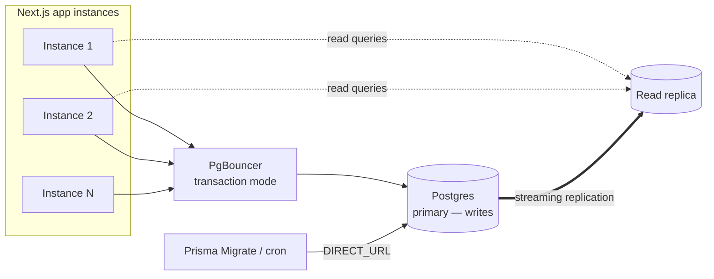
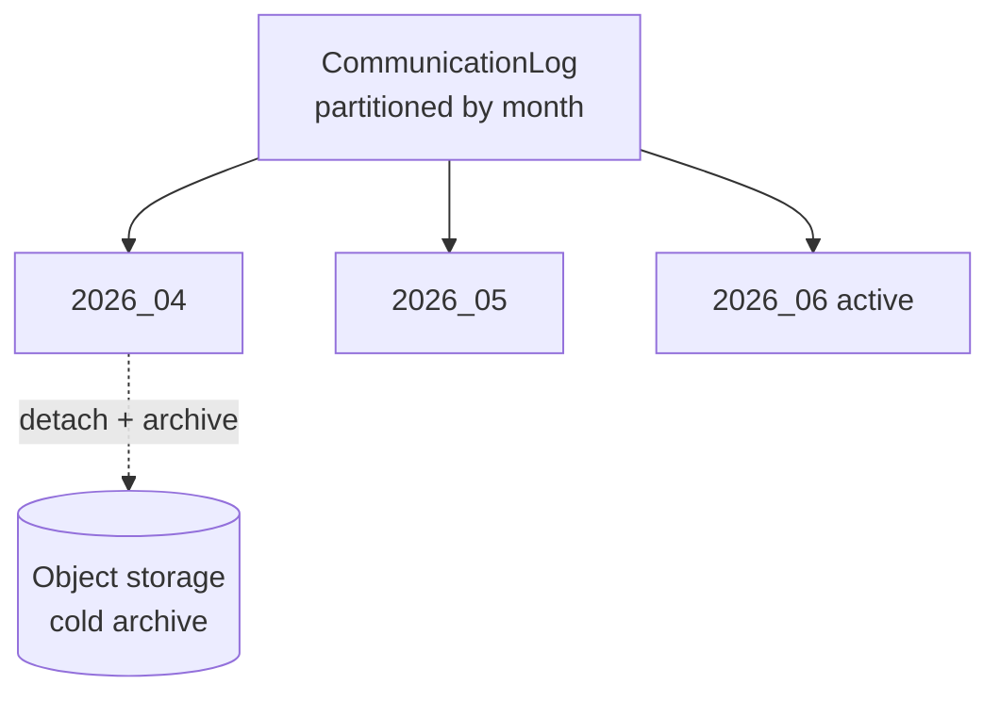
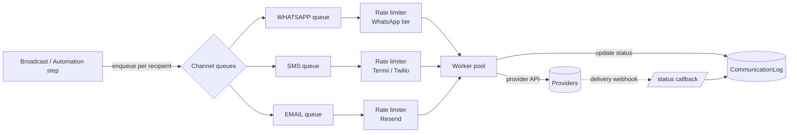
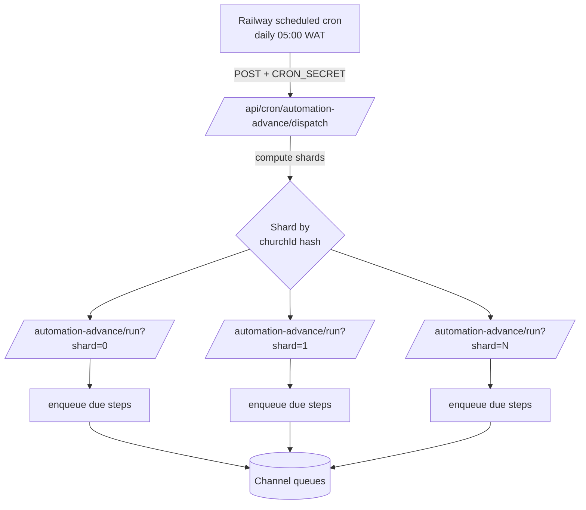
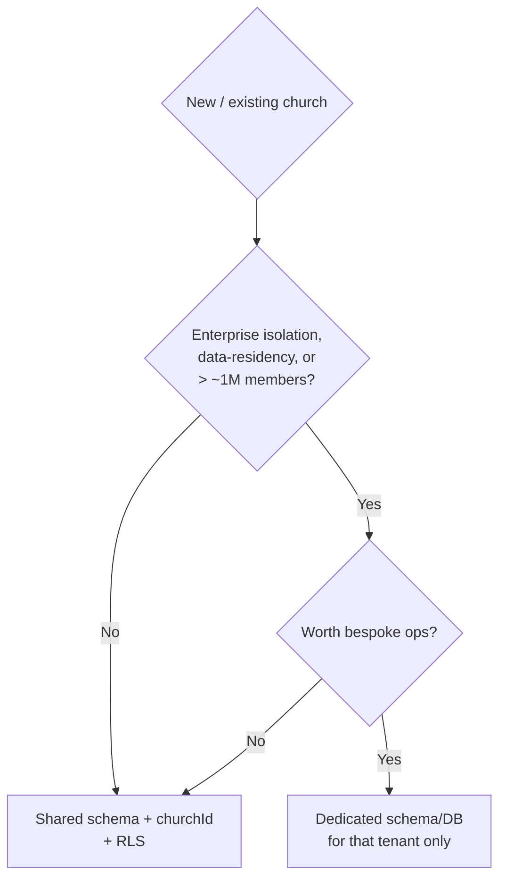

# 9. Scalability Plan

This section describes how Church Connect CRM grows from a single local church on a shared Railway Postgres instance to thousands of churches with tens of millions of `Attendance`, `CommunicationLog`, and `FollowUp` rows — without rewriting the data model. The guiding principle is **defer every cost until a measured threshold forces it**: ship the simplest shared-schema, single-region topology first, instrument it, and adopt each lever below only when the named trigger fires.

We model three reference scales used throughout this section:

| Stage | Churches | Active members | Peak msgs/day | Posture |
|-------|----------|----------------|---------------|---------|
| **S1 — Pilot** | 1–50 | ≤ 25k | ≤ 50k | Single Railway app + single Postgres, no PgBouncer |
| **S2 — Growth** | 50–1,000 | ≤ 500k | ≤ 1M | PgBouncer, read replica, sharded cron, Upstash queue |
| **S3 — Scale** | 1,000–10,000+ | ≤ 10M | ≤ 20M | Partitioned hot tables, multi-region read, possible schema-per-tenant for VIP churches |

The Nigerian context constrains the cost side throughout: most churches are price-sensitive (₦ pricing), members are on mobile/low-bandwidth, and the dominant marginal cost is **outbound messaging** (WhatsApp/SMS provider fees), not compute.

---

## 9.1 Database scaling

`PostgreSQL` is the system of record. All scaling here preserves the shared-schema, `churchId`-scoped model defined in the data design.

### 9.1.1 Indexing strategy

Every tenant-scoped query must hit a composite index that **leads with `churchId`** (and `branchId` where the access path is branch-scoped). Without this the planner degrades to sequential scans the moment a second large tenant exists.

Mandatory composite indexes for the hot paths:

```prisma
// Member roster / dashboard filters
@@index([churchId, branchId, status])          // Member
@@index([churchId, status, createdAt])         // FirstTimer funnel

// Attendance lookups (per service, per member history)
@@index([churchId, serviceId])                 // Attendance
@@index([churchId, memberId, createdAt])       // Attendance (member history)

// Follow-up worklists for CELL_LEADER
@@index([churchId, assignedToId, status])      // FollowUp
@@index([churchId, type, createdAt])           // FollowUp

// Comms ledger + delivery reporting
@@index([churchId, channel, status, createdAt])// CommunicationLog
@@index([churchId, memberId, createdAt])       // CommunicationLog

// Automation engine cron scan (see 9.3)
@@index([status, nextRunAt])                   // AutomationEnrollment
@@index([churchId, workflowId, status])        // AutomationEnrollment
```

Operational rules:

- **Add indexes with `CONCURRENTLY`** in production migrations (Prisma raw migration step) so roster writes are never blocked at S2+.
- Use **partial indexes** for status-skewed columns, e.g. `AutomationEnrollment(nextRunAt) WHERE status = 'ACTIVE'` — the cron only ever scans active enrollments, so a partial index stays small even as completed enrollments accumulate.
- Track `pg_stat_user_indexes` quarterly; drop unused indexes (write amplification is the silent cost at S3).

**Threshold:** the partial/composite index audit becomes a standing task once any single table exceeds **5M rows** or any tenant exceeds **50k members**.

### 9.1.2 Connection pooling / PgBouncer

Next.js serverless-style request handling on Railway opens a connection per concurrent request. Postgres connections are expensive (~10MB each); the default cap (~100) is exhausted well before CPU is.

- **S1:** Prisma's built-in pool is sufficient. Set `connection_limit` conservatively (e.g. 5–10) in the `DATABASE_URL`.
- **S2 (trigger: sustained > 60 active DB connections, or "too many clients" errors):** introduce **PgBouncer in `transaction` pooling mode** as a sidecar/Railway service in front of Postgres. The app connects to PgBouncer; PgBouncer multiplexes hundreds of app connections onto a small backend pool (e.g. 20–40 server connections).
  - Prisma requires `pgbouncer=true` in the connection string (disables prepared-statement caching incompatible with transaction pooling).
  - Keep a **separate direct (non-pooled) connection string** (`DIRECT_URL`) for Prisma Migrate and the cron worker's long transactions.



### 9.1.3 Read replicas

Read traffic dominates: pastor/admin dashboards, rosters, attendance reports, delivery analytics. Writes are bursty but smaller (attendance check-in, follow-up logging, comms status callbacks).

- **Trigger:** primary CPU sustained > 60% from read queries, or dashboard p95 > 800ms during Sunday-service write bursts.
- Provision a **streaming read replica**. Route to it via Prisma's read-replica extension (`$replica()`), or a thin data-access wrapper that sends all `findMany`/aggregate/report queries to the replica and all mutations + read-after-write paths to the primary.
- **Hard rule:** the FirstTimer→Member conversion check (marking present at a 2nd service auto-promotes status) and any read-after-write in the same request must use the **primary** — replica lag (typically < 1s, but unbounded under load) would let a first-timer be promoted twice or skip Member creation.
- Cron jobs read from the replica for *selection* (who is due) but write through the primary.

### 9.1.4 Partitioning the hot tables

Two tables grow without bound and are append-heavy: **`Attendance`** (every member × every service) and **`CommunicationLog`** (every message + every status transition). At S3 these dominate table size and vacuum cost.

Strategy: **native PostgreSQL declarative partitioning**.

- **`Attendance` — RANGE partition by month on `createdAt` (service date).** Reporting is almost always windowed ("this quarter", "last 4 Sundays"), so monthly partitions enable partition pruning. Old quarters can be detached and archived to cold storage. Because every query already carries `churchId`, a composite index on `(churchId, serviceId)` *within* each partition keeps tenant scoping fast.
- **`CommunicationLog` — RANGE partition by month on `createdAt`.** This table is effectively write-once + a few status updates (`QUEUED → SENT → DELIVERED → READ`/`FAILED`) within a short window after creation, then read-only. Monthly partitions make the retention policy trivial: drop partitions older than the retention window instead of `DELETE`.



- **Sub-partition by tenant only for outlier churches.** Default is time-only partitioning with `churchId` as the leading index column. If one mega-church (e.g. > 1M members or > 30% of all rows) skews a partition, **`LIST` sub-partition that church's `churchId`** into its own partition. Do not pre-shard by tenant globally — it explodes partition count (thousands of churches × months) and hurts the planner.
- Automate partition creation with a monthly maintenance cron (`/api/cron/db-maintenance`) that pre-creates next month's partitions and detaches/archives expired ones.

**Triggers:**
- Begin partitioning a table when it exceeds **~50M rows** or autovacuum can no longer keep up (bloat > 20%, or vacuum duration > the inter-write window).
- Introduce per-tenant sub-partitions only when a single tenant exceeds **20–30%** of a table's rows.

### 9.1.5 Retention & archival

- `CommunicationLog`: keep **24 months** hot, archive older partitions to object storage (queryable on demand for disputes). `MessageStatus` history beyond 90 days collapses to a summary row.
- `Attendance`: keep all hot (it is the core analytics asset) but compress old partitions; consider rolling per-member yearly summaries into `EngagementScore` so dashboards don't scan raw history.
- `AuditLog`: append-only, partition by month, retain per compliance need (default 24 months).

---

## 9.2 Message throughput & queueing

Outbound messaging is the highest-volume, most rate-limited, most cost-sensitive subsystem. It must **never** run inline in a request. All sends go through a queue.

### 9.2.1 Queue topology (Upstash)

- A broadcast or automation step **enqueues jobs**, it does not send. Each `CommunicationLog` row is created in `QUEUED` status; a worker drains the queue and transitions it to `SENT`.
- Use **Upstash Redis** for rate-limiting + lightweight queueing at S1–S2 (Upstash QStash for delayed/scheduled delivery). At S3, or if queue depth/ordering needs outgrow Redis lists, graduate the durable broadcast queue to a dedicated broker while keeping Upstash for rate-limit token buckets.
- **One logical queue per `Channel`** (`WHATSAPP`, `SMS`, `EMAIL`) because each provider has different rate limits and failure modes.



### 9.2.2 Provider rate limits & batching

- **WhatsApp Cloud API** enforces per-number messaging tiers (1k → 10k → 100k → unlimited business-initiated/24h) and an ~80 msg/s default cap. The worker must hold a **token-bucket rate limiter (Upstash)** keyed by phone-number-ID and respect the current tier; a broadcast to 50k members is metered out across the day, not blasted.
- **SMS (Termii primary, Twilio fallback):** batch where the provider supports multi-recipient payloads; otherwise pace to the account TPS. Fail over Termii→Twilio on sustained 5xx/timeout, recording the switch in `CommunicationLog`.
- **Resend (email):** batch endpoint, respect monthly/daily caps.
- **Broadcast batching:** chunk recipients (e.g. 500/job), enqueue chunks, and spread WhatsApp/SMS sends across a delivery window. This smooths provider load, lets a broadcast be paused/cancelled mid-flight, and bounds blast-radius of a bad template.
- **Idempotency:** every job carries a deterministic key (`communicationLogId`) so retries never double-send. Workers transition `QUEUED → SENT` in a guarded update (`WHERE status = 'QUEUED'`).

### 9.2.3 Backpressure & DLQ

- Workers respect queue depth; if a provider throttles (429), jobs are re-enqueued with exponential backoff and the channel's rate limiter tightens.
- Permanent failures (invalid number, opt-out, template rejected) go to a **dead-letter queue** and the row is set to `FAILED` with a reason — no infinite retry.

**Triggers:**
- Inline-send is forbidden from S1 (queue from day one — it's cheap).
- Add a dedicated worker service (separate from the web app) when sustained throughput exceeds **~5k msgs/hour** so message bursts don't steal CPU from request handling.
- Graduate off Redis-list queueing to a dedicated broker at **> ~1M msgs/day** sustained or when at-least-once durability/replay becomes a hard requirement.

---

## 9.3 Cron fan-out at scale

The automation engine and daily jobs are the part most likely to become a single multi-hour job that times out and silently skips tenants. The first-timer journey alone (Day0/2/7/14/30 across `WHATSAPP` + `SMS`) means daily enrollment advancement touches a large fraction of `AutomationEnrollment` every day, plus birthday and anniversary jobs.

### 9.3.1 Principles

1. **No unbounded single job.** A cron route does a *bounded* unit of work and returns. Long work is decomposed.
2. **Selection is queue-feeding, not sending.** The daily advance cron *selects* due enrollments and *enqueues* the channel jobs from 9.2 — it never calls providers directly.
3. **Shard by tenant.** Process churches in shards so one giant church (or a stuck tenant) can't block all the others, and so work parallelizes.

### 9.3.2 Sharded tenant processing

> **Naming note:** at S1 the daily advance is the single canonical route `/api/cron/automation-advance` (§4.19, §10.2). The dispatcher + per-shard routes below (`/api/cron/automation-advance/dispatch`, `/api/cron/automation-advance/run`) are the S2+ sharded evolution of that same entrypoint, not a different job.



- The **dispatcher** computes the shard set (`shardCount` scales with church count) and triggers each shard route asynchronously (QStash fan-out, or self-`fetch` with `CRON_SECRET`). Shard = `hash(churchId) % shardCount`.
- Each **shard route** scans only `AutomationEnrollment WHERE status='ACTIVE' AND nextRunAt <= now()` for its shard (the partial index in 9.1.1 keeps this scan tiny), enqueues the channel job for the step's `AutomationStep.channel` + `MessageTemplate`, and advances `nextRunAt`/position. It processes a **bounded page** (e.g. 2,000 enrollments) and, if more remain, re-triggers itself with a cursor.
- **Per-tenant fairness & isolation:** a tenant that errors is recorded and skipped (circuit-breaker), never failing the shard. Daily run summary records processed/enqueued/failed per shard for observability.
- **Idempotent by day:** advancement is keyed on `(enrollmentId, stepOffsetDay)` so a re-run of a shard never double-enrolls or double-sends.

### 9.3.3 Other daily jobs

Birthday, anniversary, `EngagementScore` recompute, and DB-maintenance jobs follow the **same shard-and-enqueue** pattern. `EngagementScore` recompute is the heaviest aggregate — run it incrementally (only members with new `Attendance`/`FollowUp`/`CommunicationLog` since last run) rather than full recompute.

**Triggers:**
- Single-route cron is fine while the daily candidate set fits comfortably in one bounded run (**< ~10k enrollments/day**, S1).
- Adopt the dispatcher + sharding at **S2** (> ~10k daily enrollments or any single job approaching half the platform's cron timeout).
- Increase `shardCount` so each shard's bounded run stays under ~60s; revisit whenever total churches grows 5×.

---

## 9.4 Caching

Read amplification (dashboards refreshed constantly during services) is cheap to absorb with caching, and it directly cuts replica/DB load.

| Layer | What | TTL / invalidation | Adopt at |
|-------|------|--------------------|----------|
| **App in-memory** | Reference data: `Plan`, enum/option lists, `MessageTemplate` per church | Short TTL (minutes); invalidate on template edit | S1 |
| **Upstash Redis** | Per-church dashboard aggregates (attendance trend, funnel counts, queue depth), `EngagementScore` summaries | TTL 5–15 min; invalidate on attendance check-in / conversion | S2 |
| **Computed rollups** | Materialize daily/weekly attendance & funnel rollups into summary tables instead of recomputing from raw `Attendance` | Rebuilt by cron | S2–S3 |
| **HTTP / CDN** | Static assets, member photos (Cloudinary), public church landing pages | Long, content-hashed | S1 |

Cache keys are **always tenant-prefixed** (`church:{churchId}:...`) so isolation is preserved and a single church's invalidation never floods the cache. Never cache cross-tenant query results.

---

## 9.5 Multi-region & CDN

The member-facing surface (low-bandwidth, mobile-first Nigeria) benefits most from edge delivery; the transactional core stays single-region near the database.

- **CDN (from S1):** serve all static assets and Cloudinary-backed photos through a CDN; configure aggressive caching + image transforms (WebP, sized variants) to minimize data cost for members on metered connections.
- **Single write region (S1–S2):** keep the Postgres primary and app in one region (Railway region nearest the bulk of users / providers). Cross-region writes add latency and complexity not justified before S3.
- **Multi-region reads (S3 trigger: meaningful user base outside the primary region, or DR/RTO requirements):** place a **read replica + read-only app tier** in a second region serving dashboards and reports locally; writes still route to the primary region. This gives geographic read latency wins without multi-master complexity.
- **Disaster recovery:** automated daily logical backups + PITR (WAL archiving) from S2; documented restore runbook. A warm standby replica is the DR target at S3.

---

## 9.6 Tenant isolation options

The locked decision is **shared schema + `churchId` scoping**. This section records when (and only when) to deviate.

### Option A — Shared schema, `churchId` discriminator (default, all stages)

- Every domain table carries `churchId` (tenant root) and most carry `branchId`; every query is tenant-scoped via a mandatory access layer that injects `churchId` from the session.
- **Pros:** cheapest to operate, one migration applies everywhere, trivial cross-tenant SUPER_ADMIN analytics, pooling/partitioning all work uniformly. Best fit for thousands of small/mid Nigerian churches.
- **Cons:** isolation is enforced in code, not by the engine — a missing `churchId` filter is a cross-tenant leak. Mitigations: a single tenant-scoped Prisma client/middleware that **refuses** any query on a tenant table without `churchId`, plus **Postgres Row-Level Security** policies keyed on a per-request `app.current_church_id` GUC as defense-in-depth.

### Option B — Schema-per-tenant (selective, S3 only)

- A dedicated Postgres schema (or database) per tenant, same table shapes.
- **Pros:** hard isolation, per-tenant backup/restore/export, noisy-neighbor containment, easier to meet a large church's data-residency/contractual demands.
- **Cons:** migrations must fan out across N schemas (operationally heavy at thousands of tenants), connection/catalog overhead, cross-tenant analytics becomes painful, PgBouncer pool fragmentation.

### Recommendation



- **Stay 100% on Option A through S2.** It is the locked default and matches the market.
- At **S3**, offer **Option B only as a premium tier for a handful of outlier churches** that either exceed ~1M members (and would otherwise skew partitions/pools) or have contractual isolation/residency requirements. Keep the *vast majority* on shared schema. The codebase abstracts the tenant→connection mapping so a church can be "promoted" to its own schema without app rewrites.

---

## 9.7 Cost-control levers

Compute scales sub-linearly; **outbound messaging is the dominant marginal cost** and the primary lever.

1. **Channel cost-routing.** Prefer the cheapest effective channel per message intent: WhatsApp template < SMS for most journeys; reserve SMS for members without WhatsApp or for time-critical alerts. Email (Resend) is cheapest for long-form. Encode this preference per `AutomationStep` and per broadcast.
2. **Dedupe & suppress.** Never send to opted-out, invalid, or duplicate numbers; maintain a suppression list checked at enqueue time. A bounced/`FAILED` number is quarantined to stop repeat spend.
3. **Quiet hours & frequency caps.** Per-church send windows and per-member daily caps prevent runaway automation spend and protect sender reputation (which, if degraded, raises cost via lower deliverability tiers).
4. **AI cost discipline.** Anthropic Claude is used for follow-up *suggestions*, not per-message generation. Cache/template suggestions, batch them, and gate AI features by plan tier so cost tracks revenue.
5. **Right-size infra by trigger, not by fear.** PgBouncer, replica, partitioning, dedicated worker, and second region are each added only at their named threshold above — avoid paying S3 infra at S1 volumes.
6. **Storage tiering.** Archive cold `CommunicationLog`/`Attendance` partitions to cheap object storage (9.1.5); compress photos via Cloudinary transforms (also a member data-cost win).
7. **Plan-gated quotas.** `Plan`/`Subscription` carry monthly message + AI quotas; enforce at enqueue so usage maps to billing and overage is explicit. This aligns infra cost to ₦ revenue per church.
8. **Observability on spend.** Track cost-per-church (messages × provider rate) in the SUPER_ADMIN view; alert on anomalous per-tenant spend (a misconfigured automation loop is the classic cost incident).

**Cost-trigger summary:**

| Lever | Adopt when |
|-------|-----------|
| PgBouncer | > 60 sustained DB connections / "too many clients" |
| Read replica | Primary CPU > 60% from reads, or dashboard p95 > 800ms |
| Partition `Attendance`/`CommunicationLog` | Table > ~50M rows or vacuum can't keep up |
| Per-tenant sub-partition | One tenant > 20–30% of a table's rows |
| Dedicated message worker | > ~5k msgs/hour sustained |
| Dedicated queue broker | > ~1M msgs/day or durability/replay required |
| Sharded cron dispatcher | > ~10k daily enrollments / job nears timeout |
| Redis dashboard cache + rollups | S2 onset (50+ churches) |
| Multi-region read tier | Material user base outside primary region / DR RTO |
| Schema-per-tenant (Option B) | Outlier church > ~1M members or contractual isolation |
