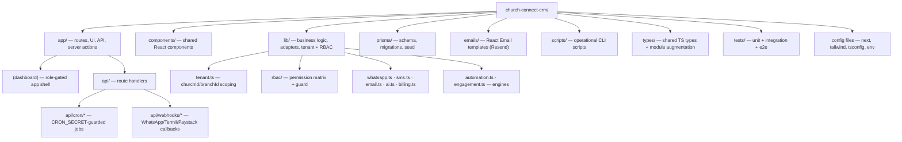
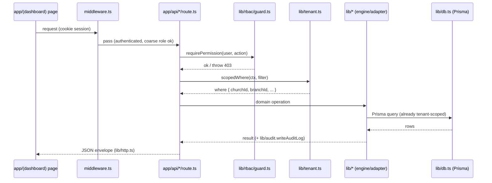

# 10. Full Source Code Structure

This section is the authoritative map of the repository. It is a single Next.js 14 (App Router) application — no separate backend service — with Prisma 5 talking to PostgreSQL, and all server logic living either in route handlers (`app/api/*`), server actions, or framework-agnostic modules under `lib/`. The structure deliberately mirrors the existing SPEEDFI codebase so module names (`whatsapp.ts`, `sms.ts`, `automation.ts`, `engagement.ts`, `db.ts`, `auth.ts`, `templates.ts`, cron handlers, etc.) are portable between the two products.

Three architectural rules drive the layout:

1. **Tenant-scoping is centralized.** No domain query touches Prisma directly. Everything goes through `lib/tenant.ts` helpers that force `churchId` (and usually `branchId`) into every `where`, so a missing filter is impossible by construction rather than by discipline.
2. **RBAC is declarative.** Permissions live in `lib/rbac/permissions.ts` as a role→capability matrix; route handlers and server actions assert against it via `lib/rbac/guard.ts`. Roles are exactly `SUPER_ADMIN | PASTOR | CHURCH_ADMIN | CELL_LEADER`.
3. **External I/O is adapter-shaped.** Messaging (WhatsApp/SMS/email), AI, billing, storage, and queues each sit behind a single module in `lib/` so providers (Termii↔Twilio, etc.) can be swapped without touching callers.

---

## 10.1 Top-Level Layout



---

## 10.2 Annotated Directory Tree

```text
church-connect-crm/
├── app/                                  # Next.js App Router root
│   ├── layout.tsx                        # Root layout: fonts, <html>, Providers, Sentry boundary
│   ├── globals.css                       # Tailwind base + design tokens (mobile-first)
│   ├── providers.tsx                     # Client providers: NextAuth SessionProvider, Toaster, React Query
│   ├── page.tsx                          # Public marketing/landing page (₦ pricing, sign-up CTA)
│   ├── not-found.tsx                     # 404
│   ├── error.tsx                         # Root error boundary (reports to Sentry)
│   │
│   ├── (auth)/                           # Unauthenticated route group (no app shell)
│   │   ├── layout.tsx                    # Minimal centered auth layout
│   │   ├── login/page.tsx                # Credentials sign-in (NextAuth)
│   │   ├── register-church/page.tsx      # Self-serve Church + first PASTOR signup (tenant bootstrap)
│   │   ├── accept-invite/page.tsx        # User accepts emailed invite → sets password, role pre-assigned
│   │   └── forgot-password/page.tsx      # Password reset request/confirm
│   │
│   ├── (dashboard)/                      # Authenticated app shell (RBAC-gated)
│   │   ├── layout.tsx                    # Loads session, resolves Church/Branch context, renders nav by role
│   │   ├── dashboard/page.tsx            # Role-aware home: KPIs (attendance, first-timers, follow-ups due)
│   │   │
│   │   ├── members/                      # Member directory (CHURCH_ADMIN, PASTOR; CELL_LEADER sees assigned only)
│   │   │   ├── page.tsx                  # List + search + status filter (MemberStatus)
│   │   │   ├── new/page.tsx              # Register Member
│   │   │   ├── [memberId]/page.tsx       # Profile: attendance history, follow-ups, EngagementScore
│   │   │   └── [memberId]/edit/page.tsx  # Edit member
│   │   │
│   │   ├── first-timers/                 # FirstTimer intake + conversion funnel
│   │   │   ├── page.tsx                  # First-timer list with automation enrollment status
│   │   │   ├── new/page.tsx              # Capture first-timer (auto-enrolls in welcome AutomationWorkflow)
│   │   │   └── [firstTimerId]/page.tsx   # Detail; "Convert to Member" action (preserves history)
│   │   │
│   │   ├── attendance/                   # Attendance capture
│   │   │   ├── page.tsx                  # Service picker → mark attendance (triggers conversion check)
│   │   │   └── [serviceId]/page.tsx      # Per-Service attendance sheet (bulk check-in, low-bandwidth UI)
│   │   │
│   │   ├── services/                     # Service/event definitions (ServiceType)
│   │   │   ├── page.tsx                  # List services/events
│   │   │   └── new/page.tsx              # Create Service (SUNDAY/MIDWEEK/SPECIAL/CELL_MEETING)
│   │   │
│   │   ├── cell-groups/                  # CellGroup management + Assignment
│   │   │   ├── page.tsx                  # List cell groups, leaders, member counts
│   │   │   ├── [cellGroupId]/page.tsx    # Roster; assign/reassign members (Assignment)
│   │   │   └── new/page.tsx              # Create cell group, set CELL_LEADER
│   │   │
│   │   ├── follow-ups/                   # FollowUp workspace
│   │   │   ├── page.tsx                  # "My follow-ups due" queue (CELL_LEADER scoped to assigned)
│   │   │   └── [followUpId]/page.tsx     # Log outcome (FollowUpType + FollowUpOutcome), AI suggestion panel
│   │   │
│   │   ├── prayer-requests/              # PrayerRequest log
│   │   │   ├── page.tsx                  # Open/answered prayer requests
│   │   │   └── new/page.tsx              # Submit prayer request (links Member/FirstTimer)
│   │   │
│   │   ├── communications/               # Messaging hub
│   │   │   ├── page.tsx                  # CommunicationLog timeline (per-channel, MessageStatus)
│   │   │   ├── broadcast/page.tsx        # Segment + send broadcast (PASTOR/CHURCH_ADMIN)
│   │   │   └── templates/page.tsx        # MessageTemplate CRUD + WhatsApp approval state
│   │   │
│   │   ├── automations/                  # AutomationWorkflow builder + monitoring
│   │   │   ├── page.tsx                  # Workflow list (e.g. first-timer journey, birthday)
│   │   │   ├── [workflowId]/page.tsx     # Ordered AutomationStep editor (offset days, Channel, template)
│   │   │   └── enrollments/page.tsx      # AutomationEnrollment monitor (who's where in a journey)
│   │   │
│   │   ├── reports/                      # Analytics (PASTOR, CHURCH_ADMIN)
│   │   │   ├── page.tsx                  # Attendance trends, conversion rate, engagement distribution
│   │   │   └── engagement/page.tsx       # EngagementScore breakdown + at-risk (INACTIVE_MEMBER) list
│   │   │
│   │   ├── branches/                     # Branch management (PASTOR)
│   │   │   ├── page.tsx                  # List branches under the Church
│   │   │   └── new/page.tsx              # Create branch
│   │   │
│   │   ├── team/                         # User management within a Church
│   │   │   ├── page.tsx                  # List Users + roles
│   │   │   └── invite/page.tsx           # Invite User, assign UserRole + branch
│   │   │
│   │   └── settings/                     # Church-level settings
│   │       ├── church/page.tsx           # Church profile, branding, timezone, default Channel order
│   │       ├── billing/page.tsx          # Subscription/Plan, Paystack portal, usage vs. quota
│   │       └── profile/page.tsx          # Current user profile + password
│   │
│   ├── (super-admin)/                    # SUPER_ADMIN platform console (cross-tenant)
│   │   ├── layout.tsx                    # Platform shell; hard guard: role === SUPER_ADMIN
│   │   ├── overview/page.tsx             # Platform KPIs: churches, MRR, message volume
│   │   ├── churches/page.tsx             # All tenants; impersonate / suspend
│   │   ├── plans/page.tsx                # Plan catalog (₦ tiers, limits) management
│   │   └── audit/page.tsx               # Global AuditLog viewer
│   │
│   └── api/                              # Route handlers (server-only)
│       ├── auth/[...nextauth]/route.ts   # NextAuth handler (credentials + Prisma adapter)
│       │
│       ├── members/route.ts              # GET list / POST create (tenant-scoped, RBAC-guarded)
│       ├── members/[id]/route.ts         # GET/PATCH/DELETE single member
│       ├── first-timers/route.ts         # CRUD + POST /convert (promotion to Member)
│       ├── attendance/route.ts           # POST mark attendance → triggers conversion + engagement recalc
│       ├── services/route.ts             # Service CRUD
│       ├── cell-groups/route.ts          # CellGroup CRUD
│       ├── assignments/route.ts          # Assignment create/reassign
│       ├── follow-ups/route.ts           # FollowUp create/list (scoped to assignee for CELL_LEADER)
│       ├── follow-ups/[id]/route.ts      # PATCH outcome
│       ├── prayer-requests/route.ts      # PrayerRequest CRUD
│       ├── communications/route.ts       # CommunicationLog query
│       ├── communications/send/route.ts  # POST single send (resolves Channel → adapter)
│       ├── communications/broadcast/route.ts # POST segmented broadcast → enqueues jobs
│       ├── templates/route.ts            # MessageTemplate CRUD
│       ├── automations/route.ts          # AutomationWorkflow CRUD
│       ├── automations/[id]/steps/route.ts   # AutomationStep ordering
│       ├── ai/follow-up-suggestion/route.ts  # Claude-backed next-best-action suggestion
│       ├── reports/route.ts              # Aggregated analytics queries
│       ├── billing/checkout/route.ts     # Paystack init for Plan upgrade
│       ├── team/invite/route.ts          # Create User invite (email via Resend)
│       │
│       ├── cron/                         # Scheduled jobs — ALL guarded by CRON_SECRET (see lib/cron-auth.ts)
│       │   ├── automation-advance/route.ts   # Daily: advance every AutomationEnrollment one step
│       │   ├── birthdays/route.ts            # Daily: birthday greeting workflow trigger
│       │   ├── anniversaries/route.ts        # Daily: membership/wedding anniversary trigger
│       │   ├── follow-up-reminders/route.ts  # Daily: nudge CELL_LEADERs about due FollowUps
│       │   ├── engagement-recalc/route.ts    # Nightly: recompute EngagementScore, flag INACTIVE_MEMBER
│       │   ├── inactivity-sweep/route.ts     # Detect lapsed attendance → re-engagement enrollment
│       │   ├── message-retry/route.ts        # Retry FAILED CommunicationLog entries
│       │   ├── broadcast-dispatch/route.ts   # Every 5 min: drain scheduled broadcasts (scheduleAt due)
│       │   └── billing-rollover/route.ts     # Daily: reset Subscription.messagesUsed at period rollover
│       │
│       └── webhooks/                     # Inbound provider callbacks (signature-verified, no session)
│           ├── whatsapp/route.ts         # Delivery receipts + inbound replies → update MessageStatus (READ/REPLIED)
│           ├── termii/route.ts           # SMS DLR → MessageStatus (DELIVERED/FAILED)
│           ├── twilio/route.ts           # Twilio fallback SMS status callback
│           └── paystack/route.ts         # Subscription lifecycle → update Subscription/Plan
│
├── components/                           # Shared React components
│   ├── ui/                               # Primitives (button, input, table, dialog, badge, sheet)
│   ├── layout/                           # AppShell, Sidebar (role-filtered nav), Topbar, MobileNav
│   ├── members/                          # MemberCard, MemberForm, StatusBadge (MemberStatus)
│   ├── first-timers/                     # FirstTimerForm, ConversionButton, JourneyTimeline
│   ├── attendance/                       # AttendanceSheet, BulkCheckIn (low-bandwidth optimized)
│   ├── follow-ups/                       # FollowUpForm, OutcomePicker, AiSuggestionPanel
│   ├── communications/                   # ChannelPicker, MessageStatusBadge, BroadcastComposer
│   ├── automations/                      # WorkflowCanvas, StepEditor, EnrollmentTable
│   ├── charts/                           # AttendanceTrend, EngagementDistribution (recharts)
│   ├── billing/                          # PlanCard, UsageMeter (₦ formatting)
│   └── common/                           # EmptyState, DataTable, ConfirmDialog, PhoneInput (E.164 +234)
│
├── lib/                                  # Framework-agnostic business logic + adapters (the core)
│   ├── db.ts                             # Prisma client singleton (dev hot-reload safe)
│   ├── auth.ts                           # NextAuth config (authOptions), session callbacks inject churchId+role
│   ├── session.ts                        # getServerSession helpers: requireUser(), getTenantContext()
│   │
│   ├── tenant.ts                         # ★ Tenant-scoping core: scopedWhere(ctx), assertSameTenant(),
│   │                                     #   branch filtering, CELL_LEADER "assigned-only" narrowing
│   │
│   ├── rbac/                             # ★ Role-based access control
│   │   ├── permissions.ts                # Role→capability matrix (e.g. PASTOR: broadcast, assign; CELL_LEADER: own follow-ups)
│   │   ├── guard.ts                      # can(user, action, resource) + requirePermission() throwing 403
│   │   └── scopes.ts                     # Resource scope rules feeding tenant.ts (own vs branch vs church)
│   │
│   ├── messaging/                        # Messaging adapters (one provider per file, common interface)
│   │   ├── index.ts                      # send(channel, payload) router → picks adapter, writes CommunicationLog
│   │   ├── whatsapp.ts                   # ★ WhatsApp Cloud API adapter (template + freeform, status mapping)
│   │   ├── sms.ts                        # ★ SMS adapter: Termii primary, Twilio fallback, E.164 normalization
│   │   ├── email.ts                      # Resend adapter (renders emails/ React templates)
│   │   └── dispatch.ts                   # Channel fallback chain (WHATSAPP→SMS→EMAIL) + quota checks
│   │
│   ├── templates.ts                      # ★ MessageTemplate resolution + variable interpolation ({{firstName}}, {{service}})
│   ├── automation.ts                     # ★ Automation engine: enroll(), advanceEnrollment(), step execution
│   ├── engagement.ts                     # ★ EngagementScore computation (attendance recency, follow-ups, replies)
│   ├── conversion.ts                     # FirstTimer→Member promotion logic (2nd-service rule, history preservation)
│   ├── ai.ts                             # Anthropic Claude client: follow-up suggestions, message drafting
│   ├── billing.ts                        # Paystack adapter: checkout, plan limits, Subscription sync
│   ├── storage.ts                        # Cloudinary upload/signing (member/first-timer photos)
│   ├── redis.ts                          # Upstash client: rate-limit buckets + lightweight job queue
│   ├── queue.ts                          # Enqueue/consume helpers (broadcast fan-out, retries)
│   ├── cron-auth.ts                      # ★ Verifies CRON_SECRET bearer on /api/cron/* requests
│   ├── audit.ts                          # writeAuditLog() helper (AuditLog) — who/what/tenant
│   ├── phone.ts                          # E.164 (+234) normalization + Nigerian validation
│   ├── money.ts                          # Naira (₦) formatting + Plan price helpers
│   ├── validators/                       # Zod schemas mirroring canonical entities/enums
│   │   ├── member.ts                     #   Member + MemberStatus
│   │   ├── first-timer.ts                #   FirstTimer
│   │   ├── follow-up.ts                  #   FollowUpType + FollowUpOutcome
│   │   ├── communication.ts              #   Channel + MessageStatus payloads
│   │   ├── automation.ts                 #   AutomationWorkflow/Step
│   │   └── service.ts                    #   ServiceType
│   ├── enums.ts                          # Re-exports Prisma enums as the single source of truth
│   ├── dates.ts                          # Timezone-aware date helpers (church-local Service dates)
│   ├── sentry.ts                         # Sentry init (server + edge)
│   └── http.ts                           # API response/error envelope helpers (consistent JSON shape)
│
├── prisma/                               # Database layer
│   ├── schema.prisma                     # All canonical entities + enums; every domain model has churchId (+branchId)
│   ├── migrations/                       # Versioned SQL migrations
│   └── seed.ts                           # Seed: demo Church, Branches, Plans, default AutomationWorkflow + templates
│
├── emails/                               # React Email templates rendered by lib/messaging/email.ts
│   ├── welcome.tsx                       # First-timer Day0 welcome (email channel)
│   ├── invite.tsx                        # Team User invitation
│   ├── password-reset.tsx                # Reset link
│   └── weekly-digest.tsx                 # Pastor weekly summary
│
├── scripts/                              # Operational CLI (run via tsx)
│   ├── backfill-engagement.ts            # One-off EngagementScore backfill
│   ├── seed-templates.ts                 # Load/refresh default MessageTemplates per Channel
│   └── tenant-export.ts                  # Export a single Church's data (GDPR/offboarding)
│
├── types/
│   ├── next-auth.d.ts                    # Session/JWT augmentation: churchId, branchId, role
│   └── index.ts                          # Shared domain DTOs + TenantContext type
│
├── tests/
│   ├── unit/                             # lib/* pure-logic tests (tenant.ts, rbac, automation, engagement, conversion)
│   ├── integration/                      # API route + Prisma (tenant-isolation assertions)
│   └── e2e/                              # Playwright: signup→first-timer→attendance→conversion flow
│
├── public/                               # Static assets (logo, icons, manifest)
├── .env.example                          # All env keys: DB, NEXTAUTH, WhatsApp, Termii/Twilio, Resend,
│                                         #   ANTHROPIC_API_KEY, UPSTASH, CLOUDINARY, PAYSTACK, SENTRY, CRON_SECRET
├── middleware.ts                         # Edge auth gate: redirect unauthenticated, coarse role routing
├── next.config.mjs                       # Next config (image domains, Sentry wrapper)
├── tailwind.config.ts                    # Tailwind theme + design tokens
├── tsconfig.json                         # Strict TS, path aliases (@/lib, @/components)
└── package.json                          # Scripts: dev, build, prisma, seed, test, lint
```

> **★** marks the load-bearing modules: tenant-scoping (`lib/tenant.ts`), RBAC (`lib/rbac/*`), the messaging adapters (`lib/messaging/whatsapp.ts`, `sms.ts`), the engines (`lib/automation.ts`, `lib/engagement.ts`), cron auth (`lib/cron-auth.ts`), and template resolution (`lib/templates.ts`).

---

## 10.3 Where the Critical Subsystems Live

| Subsystem | Primary location | Supporting files |
|---|---|---|
| **Automation engine** | `lib/automation.ts` (enroll, advance, execute steps) | `app/api/cron/automation-advance/route.ts` (daily driver), `app/api/cron/birthdays`, `.../anniversaries`, `app/(dashboard)/automations/*` (UI), `lib/validators/automation.ts` |
| **Messaging adapters** | `lib/messaging/{whatsapp,sms,email}.ts` | `lib/messaging/dispatch.ts` (fallback chain + quota), `lib/messaging/index.ts` (router → CommunicationLog), `app/api/webhooks/{whatsapp,termii,twilio}/route.ts` (status updates) |
| **RBAC** | `lib/rbac/permissions.ts` (matrix), `lib/rbac/guard.ts` | `lib/rbac/scopes.ts`, `middleware.ts` (coarse gate), `components/layout/Sidebar` (role-filtered nav) |
| **Tenant-scoping** | `lib/tenant.ts` (`scopedWhere`, `assertSameTenant`) | `lib/session.ts` (`getTenantContext`), `lib/auth.ts` (injects churchId/role into session), every `app/api/*` handler |
| **Engagement scoring** | `lib/engagement.ts` | `app/api/cron/engagement-recalc/route.ts`, `app/(dashboard)/reports/engagement/page.tsx` |
| **First-timer → Member conversion** | `lib/conversion.ts` | invoked from `app/api/attendance/route.ts` on 2nd-service presence |
| **Cron security** | `lib/cron-auth.ts` (CRON_SECRET check) | every `app/api/cron/*/route.ts` |
| **AI follow-up suggestions** | `lib/ai.ts` (Anthropic Claude) | `app/api/ai/follow-up-suggestion/route.ts`, `components/follow-ups/AiSuggestionPanel` |
| **Billing** | `lib/billing.ts` (Paystack) | `app/api/billing/checkout/route.ts`, `app/api/webhooks/paystack/route.ts`, `app/(dashboard)/settings/billing/page.tsx` |

---

## 10.4 Request Lifecycle (how the layers compose)

Every authenticated, tenant-scoped mutation follows the same path, so the structure above is consistent rather than ad hoc:



The cron and webhook paths are the two deliberate exceptions to the session-based flow: cron routes authenticate via `lib/cron-auth.ts` (CRON_SECRET bearer) and webhook routes authenticate via provider signature verification — neither has a user session, and both derive `churchId` from the payload before calling the same `lib/tenant.ts` helpers.
