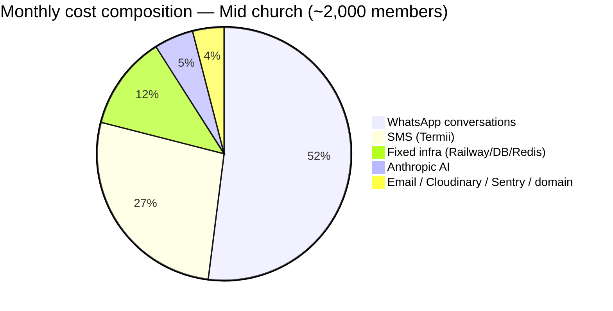

# 12. Cost Estimate

This section estimates the monthly cost of operating Church Connect CRM, in both **USD** and **Naira (₦)**, for three representative deployment sizes. The dominant cost driver is **messaging** (WhatsApp Cloud API + SMS), not compute — a structural reality of any African church follow-up product where the core value is reaching first-timers across `WHATSAPP`, `SMS`, and `EMAIL`. Infrastructure (Railway service + Postgres + Redis) is comparatively fixed and amortizes well across tenants.

All figures are **estimates for planning and pricing**, not quotes. Rates move; treat the unit costs as the source of truth and recompute totals as volumes change.

---

## 12.1 Assumptions

| Assumption | Value | Notes |
|---|---|---|
| FX rate | **₦1,550 / $1** | Planning rate; revise quarterly. |
| Country | Nigeria (`+234`, E.164) | Pricing follows Nigeria market rates. |
| WhatsApp pricing model | Per-**conversation** (Meta) | Charged per 24h conversation window, by category, not per message. |
| SMS pricing | Termii primary, Twilio fallback | Termii cheaper for NG; Twilio used only on failure. |
| Email | Resend | Generous free tier; paid plan flat. |
| AI | Anthropic Claude (Haiku-class for suggestions) | Used for `FollowUp` suggestions + draft `CommunicationLog` copy, not bulk send. |
| Photos | Cloudinary (`Member` / `FirstTimer` photos) | Free tier covers small/mid churches. |
| Error monitoring | Sentry | One project for whole platform (multi-tenant). |
| Domain | 1 platform domain | Annualized to monthly. |
| Active member ratio | ~70% of roster receives messages monthly | `INACTIVE_MEMBER` filtered out of most automations. |
| First-timer intake | ~3% of roster / month enters first-timer journey | Drives the heavy Day0–Day30 cadence. |

### Per-unit rate card (planning rates)

| Item | Unit | USD | ₦ |
|---|---|---:|---:|
| WhatsApp **Service** conversation (NG) | per 24h conversation | $0.0042 | ₦6.5 |
| WhatsApp **Utility** conversation (NG) | per 24h conversation | $0.0149 | ₦23 |
| WhatsApp **Marketing** conversation (NG) | per 24h conversation | $0.0410 | ₦64 |
| Termii SMS (NG, transactional) | per 160-char unit | ~$0.020 | ₦31 |
| Twilio SMS (NG, fallback) | per segment | ~$0.045 | ₦70 |
| Resend email | per email (after free tier) | ~$0.0004 | ₦0.6 |
| Anthropic Claude (Haiku-class) | per follow-up suggestion (~1.5k tok in / 0.4k out) | ~$0.0018 | ₦2.8 |
| Cloudinary | per stored+served photo | ~$0.0002 | ₦0.3 |

> **WhatsApp category note:** the automation cadence (Day0 welcome, Day7 check-in, Day14 next-service invite, Day30 membership invite) is mostly **Utility/Marketing** template-initiated; ad-hoc replies inside a 24h window ride the cheaper **Service** rate. We model the first-timer journey at Utility rates and routine broadcasts at Marketing rates — the conservative (more expensive) assumption.

---

## 12.2 Fixed infrastructure (platform-wide, shared across all tenants)

These costs do **not** scale per church until you cross capacity tiers; they are shared multi-tenant overhead.

| Component | Tier | USD/mo | ₦/mo |
|---|---|---:|---:|
| Railway — Next.js service (web + cron) | Hobby→Pro as scale grows | $5–$20 | ₦7,750–₦31,000 |
| Railway — PostgreSQL | Managed, 1–8 GB | $5–$20 | ₦7,750–₦31,000 |
| Upstash Redis (rate-limit + queues) | Pay-as-you-go | $0–$10 | ₦0–₦15,500 |
| Resend (email) | Free → Pro | $0–$20 | ₦0–₦31,000 |
| Sentry (1 platform project) | Free → Team | $0–$26 | ₦0–₦40,300 |
| Cloudinary | Free → Plus | $0–$89 | ₦0–₦137,950 |
| Domain (amortized) | ~$15/yr | ~$1.25 | ~₦1,940 |
| **Fixed subtotal (small/mid)** | | **~$16** | **~₦24,800** |
| **Fixed subtotal (platform scale)** | | **~$185** | **~₦286,750** |

Anthropic and all messaging are **usage-based** and modeled per scenario below.

---

## 12.3 Cost composition

Messaging (WhatsApp + SMS) is ~75–80% of total cost at every scale. **This is the number that determines pricing.**

---

## 12.4 Scenario A — Small church (~300 members)

**Workload assumptions (monthly):**
- ~210 active members reached via routine broadcasts (1 weekly service reminder + occasional announcement ≈ 6 sends/mo).
- ~9 new first-timers enter the Day0→Day30 journey (5 touchpoints each across WhatsApp+SMS).
- AI suggestions generated for `FollowUp` records by `CELL_LEADER` / `CHURCH_ADMIN`: ~120/mo.

| Cost line | Volume | Rate | USD | ₦ |
|---|---:|---:|---:|---:|
| WhatsApp — broadcasts (Marketing) | 210 × 6 = 1,260 | $0.041 | $51.66 | ₦80,073 |
| WhatsApp — first-timer journey (Utility) | 9 × 5 = 45 | $0.0149 | $0.67 | ₦1,039 |
| SMS — first-timer journey (Termii) | 9 × 5 = 45 | $0.020 | $0.90 | ₦1,395 |
| SMS — high-priority reminders | ~200 | $0.020 | $4.00 | ₦6,200 |
| Email (welcome + digests) | ~600 | free tier | $0.00 | ₦0 |
| Anthropic AI suggestions | 120 | $0.0018 | $0.22 | ₦341 |
| Cloudinary photos | within free tier | — | $0.00 | ₦0 |
| **Usage subtotal** | | | **$57.45** | **₦89,048** |
| Fixed infra (shared, attributed) | | | $16.00 | ₦24,800 |
| **Total (standalone small church)** | | | **≈ $73** | **≈ ₦113,800** |

**Main cost driver:** WhatsApp Marketing broadcasts (~71% of usage spend). Pushing routine reminders into the cheaper **Service** window where possible (replies within 24h) materially lowers this.

---

## 12.5 Scenario B — Mid church (~2,000 members)

**Workload assumptions (monthly):**
- ~1,400 active members, ~6 broadcasts/mo across `Branch`es.
- ~60 first-timers/mo through full Day0–Day30 cadence.
- AI suggestions: ~800/mo across cell leaders.
- Photos and email push into modest paid usage.

| Cost line | Volume | Rate | USD | ₦ |
|---|---:|---:|---:|---:|
| WhatsApp — broadcasts (Marketing) | 1,400 × 6 = 8,400 | $0.041 | $344.40 | ₦533,820 |
| WhatsApp — first-timer journey (Utility) | 60 × 5 = 300 | $0.0149 | $4.47 | ₦6,929 |
| SMS — first-timer journey (Termii) | 60 × 5 = 300 | $0.020 | $6.00 | ₦9,300 |
| SMS — reminders / priority | ~1,500 | $0.020 | $30.00 | ₦46,500 |
| Email | ~4,000 | $0.0004 | $1.60 | ₦2,480 |
| Anthropic AI suggestions | 800 | $0.0018 | $1.44 | ₦2,232 |
| Cloudinary | Plus-adjacent | — | $5.00 | ₦7,750 |
| **Usage subtotal** | | | **$392.91** | **₦608,011** |
| Fixed infra (shared, attributed) | | | $25.00 | ₦38,750 |
| **Total (standalone mid church)** | | | **≈ $418** | **≈ ₦647,900** |

**Main cost driver:** WhatsApp broadcasts again (~88% of messaging spend). At this volume, **WhatsApp conversation pricing dominates the P&L** — message-frequency governance and category routing are the primary cost levers.

---

## 12.6 Scenario C — Platform with 100 churches

**Workload assumptions (monthly):**
- Mix: 70 small (~300), 25 mid (~2,000), 5 large (~6,000). Weighted total ≈ 230,000 members on platform.
- Messaging scales linearly with membership; infra scales by tier, not per-tenant.
- Anthropic usage scales with active `CELL_LEADER` count.

| Cost line | USD/mo | ₦/mo |
|---|---:|---:|
| WhatsApp conversations (all categories, blended) | ~$13,800 | ~₦21,390,000 |
| SMS (Termii primary + Twilio fallback ~5%) | ~$2,900 | ~₦4,495,000 |
| Anthropic AI suggestions | ~$190 | ~₦294,500 |
| Email (Resend Pro) | ~$50 | ~₦77,500 |
| Cloudinary (Plus/Advanced) | ~$89 | ~₦137,950 |
| Sentry (Team) | ~$26 | ~₦40,300 |
| Railway service + Postgres (scaled) | ~$60 | ~₦93,000 |
| Upstash Redis | ~$30 | ~₦46,500 |
| Domain (amortized) | ~$1.25 | ~₦1,940 |
| **Platform total** | **≈ $17,150** | **≈ ₦26,580,000** |

**Main cost driver:** WhatsApp (~80%) + SMS (~17%) = **~97% messaging**. Fixed infra is under 1% of platform cost — the business is, financially, a messaging reseller with a CRM attached. Margin discipline lives almost entirely in negotiating WhatsApp/SMS rates (BSP volume tiers) and controlling send frequency.

---

## 12.7 Per-tenant unit economics (pricing input)

The numbers below are **fully-loaded monthly cost to serve**, used to set `Plan` pricing and `Subscription` tiers with healthy margin.

| Tenant profile | Cost to serve (USD) | Cost to serve (₦) | Per-member cost (₦) |
|---|---:|---:|---:|
| Small (~300) | ~$57 (usage) | ~₦89,000 | ~₦297/member |
| Mid (~2,000) | ~$393 (usage) | ~₦608,000 | ~₦304/member |
| Large (~6,000) | ~$1,180 (usage) | ~₦1,830,000 | ~₦305/member |

**Cost-to-serve is roughly linear at ~₦300/active-member/month**, almost entirely messaging. This is the single most important number for pricing.

### Pricing implications

- **Recover messaging as a metered passthrough, not flat-rate.** Bundling unlimited WhatsApp into a flat `Plan` exposes the platform to the linear ~₦300/member cost with no ceiling. Recommended: a base SaaS fee (covers fixed infra + AI + support) **plus** a messaging wallet/credits model billed through Paystack.
- **Suggested base `Plan` tiers** (covering platform value, before messaging passthrough):
  - *Starter* (≤300 members): ~₦15,000–₦25,000/mo — comfortably covers attributed fixed infra (~₦25k shared) only if pooled across many tenants; messaging billed separately.
  - *Growth* (≤2,000 members): ~₦60,000–₦90,000/mo + messaging credits.
  - *Multi-branch / large*: custom, with negotiated messaging rates.
- **AI is cheap (~₦2.8/suggestion).** Claude follow-up suggestions add <2% of cost even at platform scale — safe to include generously in every tier as a differentiator.
- **Gross margin target.** At ~₦300/member cost and metered messaging passthrough, the SaaS layer (infra + AI + email amortized) costs **well under ₦50/member/month** at scale — supporting 80%+ gross margin on the software, with messaging run at a modest markup or true passthrough.

### Levers to reduce cost

1. **WhatsApp category routing** — prefer `Service` (free-form, in-window) over `Marketing` templates wherever the conversation is user-initiated. Largest single lever.
2. **Send-frequency caps per tenant** — guardrails in `AutomationWorkflow` / broadcast tooling so a `PASTOR` cannot 5x the bill with daily blasts.
3. **Channel preference** — default first-timer journey to WhatsApp (cheaper than SMS), fall back to SMS only when no WhatsApp delivery (`MessageStatus = FAILED`).
4. **Suppress `INACTIVE_MEMBER`** from routine broadcasts by default.
5. **Termii over Twilio** — keep Twilio strictly as fallback; Twilio is ~2.25x the per-unit cost.
