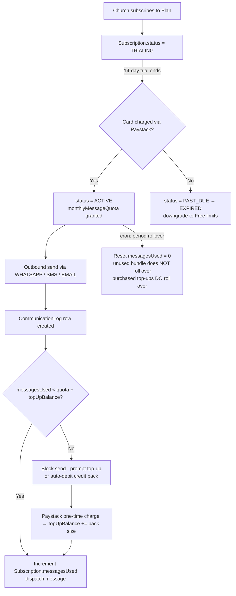
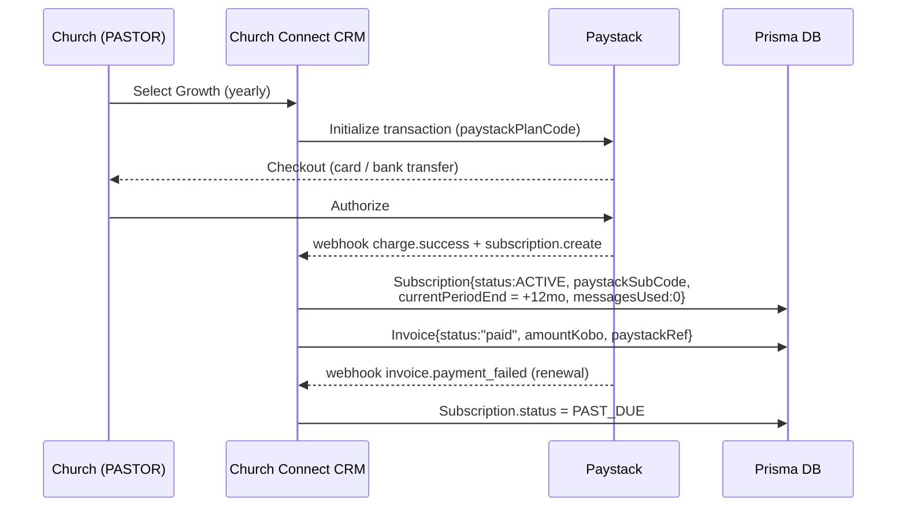
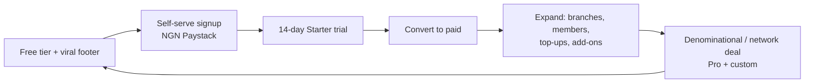

# 13. Monetization Strategy (SaaS)

Church Connect CRM is a multi-tenant SaaS where the **Church is the billing tenant** (one active `Subscription` per `Church`, enforced by `Subscription.churchId @unique`). Monetization is a **hybrid of recurring subscription + metered messaging credits**, because the two cost drivers of this product behave very differently:

- **Platform/software cost is roughly fixed per tenant** (compute, Postgres rows, storage, AI inference) and is recovered by the **monthly/annual subscription**.
- **Outbound messaging cost is variable and pass-through-heavy** (WhatsApp Cloud API conversation fees, Termii/Twilio SMS segments). This is recovered by **bundled monthly message credits per tier, plus paid top-up credit packs** when a church exceeds its bundle.

This protects gross margin against the single most dangerous failure mode for an African comms product: a church doing a 20,000-recipient SMS broadcast on a flat ₦5,000/month plan and torching the unit economics.

---

## 13.1 Pricing tiers

Four tiers map onto the African church size distribution: a free entry point for cell groups and church plants, two paid tiers for the bulk of organised congregations, and a custom tier for denominations/multi-branch ministries.

> Prices are in Naira (kobo stored as `Plan.priceKobo`). USD equivalents use ₦1,550 ≈ $1 (2026) and are indicative only — billing is **always charged in NGN via Paystack**. All limits map to concrete `Plan` columns: `maxMembers`, `maxBranches`, `maxStaff`, `monthlyMessageQuota`, and the `features` JSON flag array.

| | **Free** | **Starter** | **Growth** | **Pro** |
|---|---|---|---|---|
| **₦ / month** | ₦0 | **₦7,500** (~$5) | **₦20,000** (~$13) | **₦55,000** (~$35) |
| **₦ / year** (2 months free) | ₦0 | **₦75,000** (~$48) | **₦200,000** (~$129) | **₦550,000** (~$355) |
| `maxMembers` | 100 | 1,000 | 5,000 | 25,000 |
| `maxBranches` | 1 | 1 | 3 | 15 |
| `maxStaff` (`User` accounts) | 3 | 8 | 25 | 100 |
| `monthlyMessageQuota` (units¹) | 200 | 2,000 | 7,500 | 25,000 |
| First-timer automation (`AutomationWorkflow`) | Welcome step only | Full Day0→Day30 cadence | Full + custom workflows | Full + unlimited workflows |
| AI follow-up suggestions (Claude) | — | 50 / month | 500 / month | Unlimited (fair-use) |
| Birthday / anniversary jobs | — | ✓ | ✓ | ✓ |
| Reports & engagement scoring | Basic counts | Standard dashboards | Advanced + `EngagementScore` trends | Advanced + CSV/PDF export + scheduled |
| Channels | WhatsApp only | WhatsApp + SMS | WhatsApp + SMS + Email | All channels |
| Roles available | `CHURCH_ADMIN`, `CELL_LEADER` | + `PASTOR` | + `PASTOR` | Full RBAC, SSO-ready |
| Support | Community | Email | Priority email + WhatsApp | Dedicated onboarding + SLA |
| Branding | "Powered by" footer | "Powered by" footer | Removable | White-label option (add-on) |

¹ **1 message unit = 1 WhatsApp utility/marketing conversation OR 1 SMS segment (160 GSM-7 chars) OR 1 email.** Inbound WhatsApp replies and service/template messages within an open 24-hour window do **not** consume units. `CommunicationLog` rows with `Channel` + `MessageStatus` are the source of truth for metering (any status except `FAILED` is billable at send time; `FAILED` is auto-refunded to the period counter).

`SUPER_ADMIN` (platform owner) is never tenant-billed — it is the SaaS operator role and sits outside the `Plan`/`Subscription` model.

---

## 13.2 Hybrid model: subscription + messaging credits



**Why hybrid, not pure-flat or pure-usage:**

- **Pure flat** caps revenue and exposes us to messaging-cost blowouts on broadcasts.
- **Pure usage** is unpredictable for a Nigerian church treasurer budgeting in advance — predictability is a sales feature here. Bundling a generous quota into the subscription gives a predictable base, and only heavy senders pay variable amounts.

**Top-up credit packs** (one-time Paystack charges, never expire while subscription is `ACTIVE`):

| Pack | Units | ₦ Price | ₦ / unit |
|---|---|---|---|
| Small | 1,000 | ₦2,500 | ₦2.50 |
| Medium | 5,000 | ₦10,000 | ₦2.00 |
| Large | 20,000 | ₦32,000 | ₦1.60 |

Top-up packs are deliberately priced **above** our blended messaging cost (see §13.6) so overage is margin-accretive, while in-bundle units are priced near cost as an acquisition subsidy.

---

## 13.3 Billing via Paystack (recurring)

Paystack is the system of record for money movement; our DB mirrors state.

- **Recurring subscriptions** use Paystack Plans (`Plan.paystackPlanCode`) and subscriptions (`Subscription.paystackSubCode`, `paystackCustomerCode`). NGN-denominated, card or bank-transfer mandate.
- **Trial:** 14-day free trial on any paid tier — `Subscription.status = TRIALING`, `trialEndsAt` set, no card required to *start* (card captured before first charge). During trial the church gets **Starter-level limits** regardless of selected tier, to bound trial messaging cost.
- **Annual discount:** yearly interval = **2 months free** (~17% off) via a separate Paystack Plan with `BillingInterval.YEARLY`. Drives cash-up-front and slashes churn.
- **Webhooks** (`charge.success`, `subscription.create`, `invoice.payment_failed`, `subscription.disable`) drive `Subscription.status` transitions and write `Invoice` rows (`amountKobo`, `paystackRef`, `paidAt`, `periodStart/End`).
- **Dunning:** `invoice.payment_failed` → `PAST_DUE`; Paystack retries; after final failure → `EXPIRED` and the church is soft-downgraded to Free limits (data retained, sending throttled). A daily cron also catches missed webhooks by reconciling `currentPeriodEnd`.



---

## 13.4 Add-ons

Add-ons attach to a `Subscription` and are billed as recurring Paystack line items or one-time charges; flags live in `Plan.features` (for tier-included) or a per-subscription override.

| Add-on | Price | Notes |
|---|---|---|
| **Extra branch** | ₦5,000 / branch / mo | Beyond `maxBranches`; increments effective branch cap |
| **Extra staff seats** (pack of 5) | ₦3,000 / mo | Beyond `maxStaff` |
| **White-label** (remove branding + custom subdomain) | ₦15,000 / mo | Pro only |
| **Dedicated WhatsApp sender / verified business** | ₦25,000 setup + pass-through | For high-volume tenants wanting their own BSP number |
| **AI suggestion boost** | ₦5,000 / mo | +1,000 Claude suggestions on Starter/Growth |
| **Onboarding + data migration** | ₦50,000 one-time | Import legacy member spreadsheets, train staff |

---

## 13.5 Enforcing tier limits in the Plan/Subscription model

Every tenant-scoped write checks the active `Subscription` → `Plan`. Limits are not hard-coded; they are read from the joined `Plan` row so changing a price/limit is a data edit, not a deploy.

**Enforcement points:**

| Limit | `Plan` column | Enforced at |
|---|---|---|
| Members | `maxMembers` | `Member` / `FirstTimer` create — count `WHERE churchId` |
| Branches | `maxBranches` (+ add-ons) | `Branch` create |
| Staff | `maxStaff` | `User` invite/create |
| Messages | `monthlyMessageQuota` | Before dispatch to WhatsApp/SMS/Email provider |
| Features (automation depth, AI, export, channels) | `features` JSON flags | API route guard + UI gating |

**Messaging-quota guard (the hot path)** — single source of truth is `Subscription.messagesUsed` vs `Plan.monthlyMessageQuota + topUpBalance`:

```ts
// lib/billing/guard.ts — called by every CommunicationLog dispatch
export async function assertCanSend(churchId: string, units: number) {
  const sub = await prisma.subscription.findUnique({
    where: { churchId },
    include: { plan: true },
  });
  if (!sub || !["ACTIVE", "TRIALING"].includes(sub.status)) {
    throw new BillingError("SUBSCRIPTION_INACTIVE");
  }
  const allowance = sub.plan.monthlyMessageQuota + sub.topUpBalance;
  if (sub.messagesUsed + units > allowance) {
    throw new BillingError("QUOTA_EXCEEDED"); // → prompt top-up / auto-debit pack
  }
}

// On successful provider hand-off (atomic):
await prisma.subscription.update({
  where: { churchId },
  data: { messagesUsed: { increment: units } },
});
// On MessageStatus = FAILED webhook → decrement (auto-refund unit).
```

**Feature flags** are checked via a helper that reads `Plan.features` (e.g. `["sms","email","custom_workflows","report_export","ai_suggestions"]`):

```ts
function planHas(sub: SubscriptionWithPlan, flag: string) {
  return (sub.plan.features as string[]).includes(flag);
}
```

**Period rollover & downgrade:**

- A daily cron (`/api/cron/billing-rollover`, `CRON_SECRET`-protected) resets `messagesUsed = 0` when `now > currentPeriodEnd`, sets the new period window, but **does not reset `topUpBalance`** (purchased credits persist).
- On `EXPIRED`, the guard falls back to Free `Plan` limits without deleting data — churches can re-subscribe and resume. All transitions write an `AuditLog` row (`AuditAction` extended for billing) for the `SUPER_ADMIN` console.

> **Schema reference:** `Subscription.topUpBalance Int @default(0)` (defined in §2) backs the credit-pack mechanic above and mirrors the `messagesUsed` counter — it persists across period rollover while `messagesUsed` resets.

---

## 13.6 Unit economics & price justification

**Per-tenant fixed cost** (allocated, blended across the fleet, monthly):

| Item | ~₦ / church / mo |
|---|---|
| Compute + Postgres + Redis (Railway, amortised) | ₦600 |
| Cloudinary (member photos) | ₦150 |
| Sentry / logging / misc | ₦100 |
| AI inference (Claude, at tier suggestion caps) | ₦150–₦1,200 |
| **Fixed cost floor (excl. messaging)** | **≈ ₦1,000–₦2,500** |

**Per-message variable cost (blended pass-through, 2026 estimates):**

- WhatsApp utility conversation: ~₦5–₦8
- SMS segment (Termii NGN routes): ~₦3–₦4
- Email (Resend): ~₦0.2

Blended internal cost ≈ **₦4 / unit**. In-bundle units are subsidised at ~₦1–₦2.50 effective (acquisition), and **top-ups are sold at ₦1.60–₦2.50** — wait, that is below raw WhatsApp cost, so the bundle is deliberately **WhatsApp-throttled by tier** and SMS/email-weighted; heavy WhatsApp senders are steered to the **dedicated-sender add-on** (pass-through) so we are never long WhatsApp-conversation risk on bundled credits.

**Tier margin check (steady-state, monthly):**

| Tier | Revenue | Fixed cost | Messaging cost @ full quota | Gross margin |
|---|---|---|---|---|
| Starter ₦7,500 | ₦7,500 | ~₦1,200 | ~₦3,000 (2,000 u, SMS-weighted) | **~₦3,300 (44%)** |
| Growth ₦20,000 | ₦20,000 | ~₦1,800 | ~₦9,000 (7,500 u) | **~₦9,200 (46%)** |
| Pro ₦55,000 | ₦55,000 | ~₦3,000 | ~₦24,000 (25,000 u) | **~₦28,000 (51%)** |

Margins assume worst-case **full quota consumption** every month; real churches average 30–60% utilisation, pushing blended gross margin toward **65–75%**. Free tier is a controlled loss-leader: 200 units × ~₦4 = ₦800 max messaging exposure + ~₦1,000 fixed ≈ **₦1,800/mo CAC subsidy per active free church**, justified by viral "Powered by" footer reach and a healthy free→Starter conversion target of 8–12%.

**Paystack fees** (1.5% + ₦100, capped ₦2,000) are absorbed into the above (≈₦200–₦900/charge); annual billing materially reduces per-naira fee drag — another reason to push annual.

---

## 13.7 Go-to-market across Africa



**Phase 1 — Nigeria (beachhead):** Land mid-size urban congregations (200–2,000 members) and church plants. Channels: pastor/leadership WhatsApp networks, denominational HQs, Bible-school partnerships, and **church-tech ambassadors** (commission on referred subscriptions). Mobile-first, low-bandwidth onboarding; sign up and import members from a phone. NGN pricing removes FX friction that kills global SaaS adoption locally.

**Phase 2 — Anglophone Africa (Ghana, Kenya, Uganda):** Add local Paystack/Flutterwave currencies and SMS routes per country; keep WhatsApp Cloud API (continent-wide). Localise message templates (`MessageTemplate`) per region.

**Phase 3 — Networks & denominations:** Pro + custom contracts where HQ subscribes and provisions branches as `Branch` rows under one `Church`, or one `Church` per assembly with consolidated `SUPER_ADMIN`-style reporting (network add-on).

**Positioning:** not "another database" — the wedge is **automated first-timer follow-up** (the Day0→Day30 `AutomationWorkflow`). The pitch is retention of souls, quantified: "fewer first-timers slip through the cracks." This is the demo that sells.

---

## 13.8 Retention & expansion

- **Activation = automation live.** A church that has the first-timer `AutomationWorkflow` running and one full Sunday of `Attendance` logged retains dramatically better. Onboarding is engineered to reach this in week one.
- **Stickiness via data gravity:** member history, `FollowUp` logs, `EngagementScore` trends, and `CommunicationLog` accumulate — switching cost rises monthly.
- **Soft, non-punitive limits:** hitting `maxMembers` or `monthlyMessageQuota` shows a friendly upgrade/top-up prompt, never data loss — converts limits into expansion revenue, not churn.
- **Expansion revenue (net-revenue-retention engine):** top-up packs, extra branches/seats, AI boost, white-label. A growing church naturally climbs Starter → Growth → Pro.
- **Annual lock-in:** 2-months-free annual plans cut monthly churn and improve cash flow; renewal reminders fire 30/7/1 days before `currentPeriodEnd`.
- **Win-back:** `EXPIRED` churches keep data (read-only at Free limits); re-subscribe restores full access instantly — a powerful reactivation hook.
- **Health signals for `SUPER_ADMIN`:** declining `CommunicationLog` volume, no logins by `PASTOR`/`CHURCH_ADMIN`, or stalled `AutomationEnrollment` advancement flag at-risk tenants for proactive outreach.
